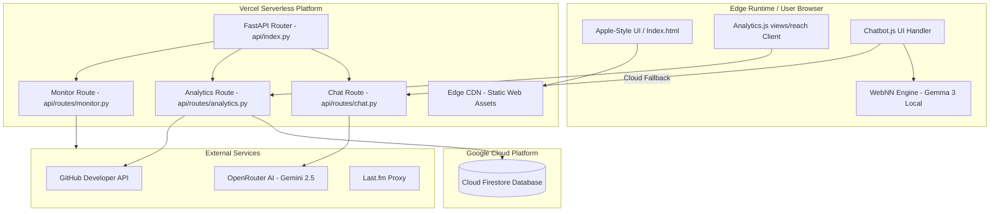

# 🚀 Mangesh Raut | AI-First Full-Stack Engineering Showcase

Production-grade portfolio, AI assistant, travel atlas, and system monitor platform powering [mangeshraut.pro](https://mangeshraut.pro).

<p align="center">
  <a href="https://mangeshraut.pro"></a>
  <a href="https://mangeshraut.pro/monitor"></a>
  <a href="https://mangeshraut712.github.io/mangeshrautarchive"></a>
  <a href="https://github.com/mangeshraut712/mangeshrautarchive/actions"></a>
  <a href="LICENSE"></a>
</p>

---

## 📖 Welcome to the Future of the Web (May 2026 Edition)

This is not a static resume page. It is a full-stack portfolio system built to showcase **production-level engineering habits**: a polished Apple-inspired responsive frontend, a high-performance **FastAPI** backend, modular integrations, telemetry, and automated regression testing.

In **May 2026**, the web has transitioned from static layouts to **Agentic Web Applications**. This repository features:

- **Hybrid AI Execution:** Instant, offline-capable browser intelligence via **WebNN** + **Gemma 3**, with a serverless cloud fallback to **Gemini 2.5 Flash / Pro** via OpenRouter.
- **WebMCP Agentic Actions:** Native browser capability integration using the W3C `navigator.modelContext.registerTool` protocol, exposing 9 core interactive tools (e.g., section navigation, resume download, contact overlay, theme toggles) to agentic orchestrators.
- **Premium Agentic UX Feedback:** High-fidelity visual micro-animations, glassmorphic `.action-message` rendering, and pulsing action badges (`ACTION EXECUTED`) that provide tactile, real-time visual feedback when local tools are executed by the AI.
- **Authoritative Engagement Telemetry:** A simple, direct, real-time visitor reach counter built on **Cloud Firestore** and cross-checked with **Vercel Analytics**.
- **Operational Visibility:** A live operations dashboard at `/monitor` showing endpoint latencies, third-party provider checks, event logging, and hosting surface status.
- **Rigorous Quality Gates:** Lighthouse scores gated in CI/CD (Desktop **99**, Mobile **92**), unit tests, playbooks, and E2E regression suites (including chatbot WebMCP action suites).

---

## 🕹️ Interactive Sandbox (Click to Expand)

Explore the system operations directly from this README by interacting with the panels below:

### 💬 Talk to AssistMe AI (Simulated Chatbot Session)

Select a prompt below to see how the AssistMe AI agent responds using Mangesh's profile details:

<details>
<summary><b>❓ Prompt: "Who is Mangesh Raut?"</b></summary>
<br>
<blockquote>
🤖 <b>AssistMe</b> <a href="https://mangeshraut.pro"><sup>[google/gemini-2.5-flash]</sup></a>:
<br><br>
<b>Mangesh Raut</b> is an AI-First Software Engineer based in Philadelphia, PA, specializing in building high-scale backend microservices, cloud platforms, and machine learning pipelines. He holds a <b>Master of Science in Computer Science</b> from Drexel University (GPA 3.76) and has over 6 years of software engineering experience.
<br><br>
Currently, he is a Software Engineer at <b>Customized Energy Solutions</b>, where he designs cloud pipelines and has delivered 40% React dashboard latency gains.
<br><br>
Would you like to explore his technical stack or review his recent machine learning publications?
</blockquote>
</details>

<details>
<summary><b>🛠️ Prompt: "What is the 2026 Hybrid AI Stack used here?"</b></summary>
<br>
<blockquote>
🤖 <b>AssistMe</b> <a href="https://mangeshraut.pro"><sup>[google/gemini-2.5-pro]</sup></a>:
<br><br>
This website showcases the <b>Agentic Web</b> paradigm:
<ol>
  <li><b>Edge Inference:</b> Browser-side execution of <b>Gemma 3</b> via the W3C <b>WebNN</b> API for ultra-low latency, offline-ready conversation helper tools.</li>
  <li><b>Cloud Inference:</b> <b>Gemini 2.5 Flash & Pro</b> via OpenRouter, utilizing adaptive temperature and structured memory managers.</li>
  <li><b>FastAPI Backend:</b> Serves JSON streaming endpoints, processes integration proxies, and manages Firestore database transactions.</li>
</ol>
Would you like to look at the project's repository structure or setup guidelines?
</blockquote>
</details>

<details>
<summary><b>📫 Prompt: "How can I contact Mangesh or download his resume?"</b></summary>
<br>
<blockquote>
🤖 <b>AssistMe</b> <a href="https://mangeshraut.pro"><sup>[Direct Action]</sup></a>:
<br><br>
📬 You can connect with Mangesh via the following channels:
<ul>
  <li><b>Email:</b> <a href="mailto:mbr63@drexel.edu">mbr63@drexel.edu</a> / <a href="mailto:mbr63drexel@gmail.com">mbr63drexel@gmail.com</a></li>
  <li><b>LinkedIn:</b> <a href="https://linkedin.com/in/mangeshraut71298" target="_blank">linkedin.com/in/mangeshraut71298</a></li>
  <li><b>GitHub:</b> <a href="https://github.com/mangeshraut712" target="_blank">github.com/mangeshraut712</a></li>
</ul>
📄 Or directly download his resume here: <a href="https://mangeshraut.pro/assets/files/Mangesh_Raut_Resume.pdf" target="_blank">Mangesh_Raut_Resume.pdf</a>.
</blockquote>
</details>

---

### 💻 System Monitor API Simulator (Mock CLI Output)

Simulate querying the portfolio's active backend routers using standard cURL commands:

<details>
<summary><b>📡 <code>curl -i https://mangeshraut.pro/api/health</code></b></summary>
<pre><code>HTTP/2 200 OK
content-type: application/json
cache-control: no-cache

{
"status": "healthy",
"version": "2.1.0",
"environment": "production",
"timestamp": 1779340800000,
"services": {
"firestore": "connected",
"openrouter": "online",
"lastfm": "online"
}
}</code></pre>

</details>

<details>
<summary><b>📊 <code>curl -i https://mangeshraut.pro/api/analytics/reach</code></b></summary>
<pre><code>HTTP/2 200 OK
content-type: application/json
cache-control: public, max-age=300

{
"success": true,
"visitor_reach": 1584,
"data_sources": {
"firestore_views": 1562,
"github_stars": 16,
"github_forks": 6
},
"timestamp": "2026-05-20T05:38:00Z"
}</code></pre>

</details>

---

## 🛠️ The 2026 Tech Stack

| Layer              | Technologies                                  | Role in System                                                                          |
| :----------------- | :-------------------------------------------- | :-------------------------------------------------------------------------------------- |
| **Client Core**    | HTML5, Vanilla CSS3, ES Modules, Canvas       | Responsive layout, modern variables, fluid animations without heavy framework overhead. |
| **Client AI**      | **WebNN API**, Gemma 3                        | Running client-side neural nets on browser hardware for instant local interactions.     |
| **Serverless API** | **FastAPI**, Pydantic, HTTPX, Uvicorn         | High-performance Python backend routes running as Vercel Serverless Functions.          |
| **Cloud AI**       | **Gemini 2.5 Pro / Flash**                    | OpenRouter cloud completions for complex reasoning and portfolio exploration.           |
| **Telemetry**      | **Cloud Firestore**                           | Real-time visitor counts, counter tracking, and performance persistence.                |
| **Testing**        | Playwright, Vitest, axe-core, Lighthouse      | End-to-end integration tests, accessibility gates, and performance budgets.             |
| **Hosting**        | Vercel (Prod), GitHub Pages (Static Fallback) | Dual-surface deployment architecture ensuring maximum availability.                     |

---

## 📐 Architecture & Data Flow

This application is built with a hybrid edge/cloud architecture designed for maximum performance, offline capability, and fail-safe operation:



### Key Design Decisions

1. **Dual-Surface Deploy:** Frontend assets are statically built to `dist/`. The main domain routes through Vercel CDN. In case of main server outages, GitHub Pages serves as a static fallback and proxies API queries back to `mangeshraut.pro/api` securely.
2. **Visitor Counter simple logic:** Instead of fake random calculations, `api/routes/analytics.py` maintains an incremental counter inside Cloud Firestore, adding GitHub repo stars and forks to form the **Portfolio Reach** metric. No local storage hover tooltips or complex charts are used.
3. **Protected Server Secrets:** API keys for OpenRouter and Google Cloud credentials never touch the browser. The FastAPI server handles authorization, rate-limiting, and payload sanitization.

---

## 🚦 Production Guardrails & Quality Gates

The codebase enforces strict quality checks through automated GitHub Actions workflows:

```text
mangeshrautarchive/
├── .github/workflows/
│   └── deploy.yml          # Deploys to Vercel, syncs GitHub Pages, runs quality gates
```

Every commit must pass the following pipeline before deployment:

- **Security Posture Check:** `scripts/security-check.js` scans all files to ensure no API keys or GCP credentials are leaked.
- **Performance Budgets:** Lighthouse CI ensures mobile index score is above **90** (LCP optimized via critical font-preloading and lazy-image tags) and desktop is above **95**.
- **API Routing Tests:** Playwright E2E tests (`tests/config/vercel-routing.spec.js`) verify that FastAPI is routing requests correctly.
- **Post-Deployment Verification:** Deployed routes like `/api/monitor/status` and `/api/analytics/reach` are verified after Vercel completes the build.

---

## ⚡ Quick Start

### Prerequisites

- Node.js `>=20`
- Python `>=3.10`
- Google Cloud Project (with Firestore enabled in Native Mode)

### Development Setup

1.  **Clone the Repository:**

    ```bash
    git clone https://github.com/mangeshraut712/mangeshrautarchive.git
    cd mangeshrautarchive
    ```

2.  **Install Node Dependencies:**

    ```bash
    npm install --no-audit --no-fund
    ```

3.  **Setup Python Virtual Environment & Dependencies:**

    ```bash
    python -m venv venv
    source venv/bin/activate
    pip install -r requirements.txt
    ```

4.  **Configure Environment:**
    Create a `.env` file based on `.env.example`:

    ```bash
    cp .env.example .env
    ```

    Add your `OPENROUTER_API_KEY`, Firestore credentials, and optional keys (`GITHUB_PAT`, `LASTFM_API_KEY`).

5.  **Run Development Server:**

    ```bash
    npm run dev
    ```

    - **Frontend UI:** `http://127.0.0.1:4000`
    - **FastAPI Backend:** `http://127.0.0.1:8001`
    - **OpenAPI docs:** `http://127.0.0.1:8001/docs`

---

## 🧪 Development Commands

| Command                        | Action                                                                     |
| :----------------------------- | :------------------------------------------------------------------------- |
| `npm run dev`                  | Spins up local frontend (with API proxy) and FastAPI backend concurrently. |
| `npm run build`                | Bundles static assets to `dist/` and writes public client configs.         |
| `npm run lint`                 | Lints and formats JavaScript & CSS modules.                                |
| `npm run test`                 | Runs backend python tests and frontend Vitest unit tests.                  |
| `npm run test:e2e:chrome`      | Runs Playwright Chromium E2E user-flow checks.                             |
| `npm run qa:lighthouse:mobile` | Compares mobile Lighthouse performance against the 90+ threshold.          |
| `npm run qa:prod-ready`        | Executes full pre-flight check (build, lint, test, security).              |

---

## 📄 License & Contact

Distributed under the MIT License. See [LICENSE](LICENSE) for more information.

- **Portfolio:** [mangeshraut.pro](https://mangeshraut.pro)
- **LinkedIn:** [in/mangeshraut71298](https://linkedin.com/in/mangeshraut71298)
- **GitHub:** [github.com/mangeshraut712](https://github.com/mangeshraut712)
- **Email:** [mbr63@drexel.edu](mailto:mbr63@drexel.edu) / [mbr63drexel@gmail.com](mailto:mbr63drexel@gmail.com)
