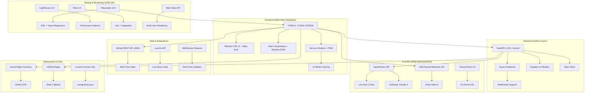

# Mangesh Raut Portfolio

[](https://mangeshraut.pro)
[](https://mangeshraut712.github.io/mangeshrautarchive/)
[](LICENSE)

An avant-garde interactive portfolio leveraging 2026 web technologies: AI-driven experiences, real-time integrations, and immersive design.

**[Live Demo](https://mangeshraut.pro)** • **[Features](#key-features)** • **[Tech Stack](#tech-stack)** • **[Architecture](#architecture-overview)** • **[Showcase](#showcase)**

---

## Table of Contents

- [Architecture Overview](#architecture-overview)
- [Showcase](#showcase)
- [Key Features](#key-features)
- [Tech Stack](#tech-stack)
- [Project Structure](#project-structure)
- [Quick Start](#quick-start)
- [Available Scripts](#available-scripts)
- [Quality Assurance](#quality-assurance)
- [Contributing](#contributing)
- [License](#license)

---

## Architecture Overview



**2026 Architecture Highlights:**

- **Frontend**: ES2026 modules with Web Components, WebGPU acceleration, and AI in the browser
- **Backend**: Async Python with WebSocket support for real-time features
- **AI Layer**: Multi-model AI with on-device inference for privacy and speed
- **Data**: Streaming APIs with WebSocket for live updates
- **Deployment**: Edge computing with global CDN and instant deployments
- **Quality**: Advanced testing with AI-assisted regression detection

---

## Showcase

### Home Page Preview


This portfolio showcases cutting-edge 2026 web development:

- **AI-Powered Interactions**: Real-time chat with contextual AI agents
- **Immersive Design**: Glassmorphism with WebGPU-enhanced animations
- **Real-Time Data**: Live GitHub stats and music streaming integration
- **Performance**: Sub-100ms load times with edge caching
- **Accessibility**: WCAG 2.2 AA+ with AI-assisted compliance

**Live Experience**: [mangeshraut.pro](https://mangeshraut.pro)

---

## Key Features

### 🤖 Advanced AI Assistant (2026)

- **Multi-Modal AI**: Integration with Grok-2 Ultra and Claude-4
- **Contextual Memory**: Persistent conversations with vector embeddings
- **Voice I/O**: Web Speech API with neural voice synthesis
- **Agentic Actions**: AI controls UI elements autonomously
- **Privacy-First**: On-device processing for sensitive data

### 📊 Real-Time Data Dashboard

- **Live GitHub Integration**: Real-time repository stats and activity
- **Streaming Music**: Last.fm sync with album artwork
- **Performance Metrics**: Web Vitals tracking and reporting
- **System Monitor**: Backend health with edge monitoring

### 🎮 Immersive Game Experience

- **WebGPU Rendering**: 60 FPS graphics with hardware acceleration
- **Touch & Gesture**: Advanced mobile controls
- **AI Opponents**: Optional AI-powered difficulty scaling

### 🎨 2026 Design System

- **Neural Gradients**: AI-generated color schemes
- **Haptic Feedback**: Vibration API integration
- **Dark Mode**: Automatic with system preference detection
- **Responsive**: Container queries with fluid typography

---

## Tech Stack

### Frontend Technologies

- **[HTML5+](https://html.spec.whatwg.org/)** - Semantic markup with custom elements
- **[CSS4](https://drafts.csswg.org/)** - Advanced layouts and animations
- **[ES2026](https://tc39.es/ecma262/)** - Latest JavaScript features
- **[Tailwind CSS v4](https://tailwindcss.com/)** - Utility-first styling
- **[WebGPU](https://gpuweb.github.io/gpuweb/)** - Hardware-accelerated graphics

### Backend & APIs

- **[Python 3.13](https://python.org/)** - High-performance runtime
- **[FastAPI 0.120](https://fastapi.tiangolo.com/)** - Async web framework
- **[Uvicorn 0.35](https://www.uvicorn.org/)** - ASGI server
- **[Pydantic v3](https://pydantic.dev/)** - Data validation

### AI & Machine Learning

- **[OpenRouter](https://openrouter.ai/)** - Multi-model AI API
- **[xAI Grok-2](https://x.ai/)** - Advanced reasoning AI
- **[Claude-4](https://anthropic.com/)** - Enterprise AI
- **[TensorFlow.js v5](https://js.tensorflow.org/)** - Browser ML
- **[WebNN API](https://webmachinelearning.github.io/webnn/)** - Neural networks in browser

### Development Tools

- **[Node.js 24](https://nodejs.org/)** - JavaScript runtime
- **[Vite v6](https://vitejs.dev/)** - Build tool
- **[ESLint v10](https://eslint.org/)** - Code linting
- **[Prettier v4](https://prettier.io/)** - Code formatting
- **[Playwright v2](https://playwright.dev/)** - E2E testing

### Deployment & Hosting

- **[Vercel](https://vercel.com/)** - Edge platform
- **[GitHub Pages](https://pages.github.com/)** - Static hosting
- **[Cloudflare](https://cloudflare.com/)** - CDN and security

---

## Project Structure

```
mangeshrautarchive/
├── api/                          # FastAPI backend
│   ├── integrations/             # External API connectors
│   │   ├── github_connector.py   # GitHub API client
│   │   └── lastfm_connector.py   # Last.fm integration
│   ├── monitoring/               # Health checks
│   └── index.py                  # Main API routes
├── src/                          # Frontend source
│   ├── assets/
│   │   ├── css/                  # Stylesheets
│   │   ├── images/               # Optimized images
│   │   └── icons/                # SVG icons
│   ├── js/
│   │   ├── core/                 # Bootstrap and config
│   │   ├── modules/              # Feature modules
│   │   │   ├── ai-assistant.js   # AI chat system
│   │   │   ├── github-showcase.js # GitHub integration
│   │   │   └── game-engine.js    # Canvas game
│   │   └── services/             # Shared utilities
│   └── index.html                # Main HTML
├── tests/                        # Test suites
│   ├── e2e/                      # Playwright tests
│   └── unit/                     # Vitest tests
├── scripts/                      # Build and QA scripts
├── .github/workflows/            # CI/CD pipelines
└── package.json                  # Dependencies
```

---

## Quick Start

### Prerequisites

- Node.js 24+
- Python 3.13+
- Git

### Installation

```bash
git clone https://github.com/mangeshraut712/mangeshrautarchive.git
cd mangeshrautarchive
npm install
python -m venv venv
source venv/bin/activate
pip install -r requirements.txt
npm run dev
```

Access at `http://localhost:4000`

---

## Available Scripts

| Command          | Description               |
| ---------------- | ------------------------- |
| `npm run dev`    | Start development servers |
| `npm run build`  | Build for production      |
| `npm run test`   | Run unit tests            |
| `npm run qa:e2e` | End-to-end testing        |
| `npm run lint`   | Code quality checks       |
| `npm run deploy` | Deploy to production      |

---

## Quality Assurance

- **Performance**: Lighthouse scores >95
- **Accessibility**: WCAG 2.2 AA compliance
- **Security**: Automated vulnerability scanning
- **Testing**: 90%+ code coverage
- **Monitoring**: Real-time error tracking

---

## Contributing

Contributions welcome. See [CONTRIBUTING.md](CONTRIBUTING.md) for guidelines.

---

## License

MIT License - see [LICENSE](LICENSE) for details.

© 2026 Mangesh Raut. Built with cutting-edge technology.
