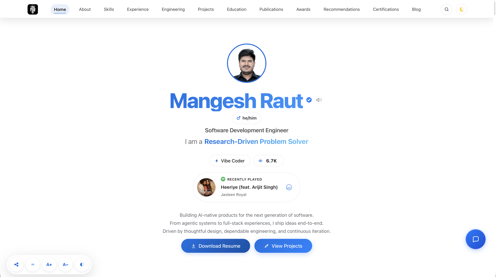
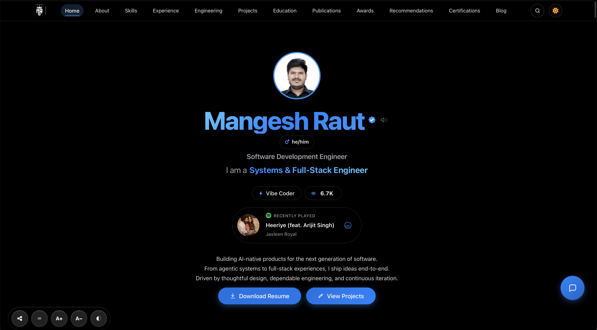
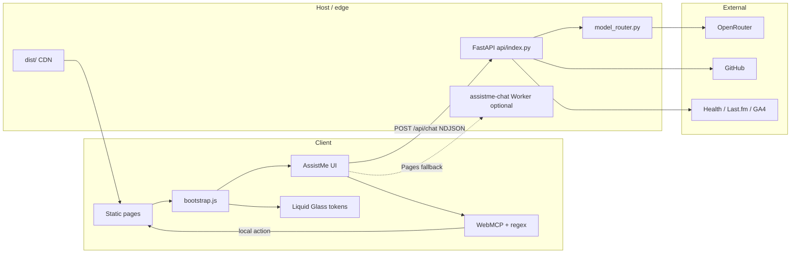

# Mangesh Raut — Agentic Full-Stack Portfolio

<p align="center">
  <a href="https://mangeshraut.pro">
    
    
  </a>
</p>

<p align="center">
  <sub>Homepage · Light (left) · Dark (right) · <strong>Technology report · July 2026</strong> · verified vs <code>main</code></sub>
</p>

<p align="center">
  <a href="https://mangeshraut712.github.io/mangeshrautarchive/"></a>
  <a href="https://mangeshraut.pro"></a>
  <a href="https://github.com/mangeshraut712/mangeshrautarchive/actions/workflows/deploy.yml"></a>
  <a href="LICENSE"></a>
</p>

<p align="center">
  
  
  
  
  
  
  
  
  <a href="https://foglamp.dev/scan/mangeshrautarchive-jtspx4"></a>
  <a href="https://github.com/sponsors/mangeshraut712"></a>
</p>

<p align="center">
  <strong>AI-first · Apple-inspired UI · dual hosting · production CI</strong><br>
  <sub>Vanilla ESM · FastAPI serverless · OpenRouter · WebMCP · Liquid Glass clear/balanced/tinted · solid light/dark</sub>
</p>

<p align="center">
  <a href="https://mangeshraut712.github.io/mangeshrautarchive/"><b>Live (Pages)</b></a>
  ·
  <a href="https://mangeshraut712.github.io/mangeshrautarchive/monitor"><b>Monitor</b></a>
  ·
  <a href="https://mangeshraut712.github.io/mangeshrautarchive/systems"><b>Systems</b></a>
  ·
  <a href="https://foglamp.dev/scan/mangeshrautarchive-jtspx4"><b>AI map</b></a>
  ·
  <a href="https://mangeshraut712.github.io/mangeshrautarchive/blog/"><b>Field Notes</b></a>
  ·
  <a href="#7-quick-start"><b>Quick start</b></a>
  ·
  <a href="#3-technology-report-july-2026"><b>Tech report</b></a>
</p>

---

## 1. Executive summary

**mangeshrautarchive** is the production codebase for Mangesh Raut’s agentic full-stack portfolio (branded domain **[mangeshraut.pro](https://mangeshraut.pro)**). It is a **static-first** website (no React, Next.js, Vue, Angular, or Svelte **runtime**) with a **Python 3.12 FastAPI** backend (Vercel serverless when enabled) and a **GitHub Pages** static publish path.

**Public status (verified 2026-07-18):** [GitHub Pages](https://mangeshraut712.github.io/mangeshrautarchive/) serves the live static site (HTTP 200). AssistMe API for that host uses the Cloudflare Worker in `build-config.json` (`assistme-chat.mangeshraut712.workers.dev`, healthy). The custom domain / Vercel production may return **`DEPLOYMENT_DISABLED` (HTTP 402)** until the Vercel project billing/deployment is re-enabled — Pages remains the always-on mirror.

As of **July 2026**, the product combines:

| Pillar                 | What it delivers                                                                                          |
| ---------------------- | --------------------------------------------------------------------------------------------------------- |
| **Portfolio surfaces** | Home, Systems, Monitor, Travel, Uses, Blog, case studies, offline/404                                     |
| **Agentic AI**         | AssistMe chatbot · 10 WebMCP tools · Plus menu tools · OpenRouter NDJSON stream · rich media              |
| **Apple-inspired UI**  | Dynamic Island nav · liquid glass **clear / balanced / tinted** · solid page canvas · a11y dock           |
| **Operations**         | Platform health probes · portfolio catalog · dual-host commit parity · Foglamp map keep-alive             |
| **Quality**            | **89** Vitest · **134** pytest · 15 Playwright projects · Lighthouse **100/100/100/100** gates · security |

This document is the **canonical technology report** for the repository: stack versions, libraries, architecture, features, and how to run it. Counts and URLs below were checked against the current `main` tree and live probes.

---

## 2. Live surfaces (July 2026)

Working links below prefer the **verified Pages host**. Pathnames are the same when Vercel/`mangeshraut.pro` is enabled.

| Surface              | URL                                                                                               | Role                                                                   |
| -------------------- | ------------------------------------------------------------------------------------------------- | ---------------------------------------------------------------------- |
| **Portfolio (live)** | [GitHub Pages](https://mangeshraut712.github.io/mangeshrautarchive/)                              | Verified static site · `ASSET_VER=20260718assistme`                    |
| **Custom domain**    | [mangeshraut.pro](https://mangeshraut.pro)                                                        | Intended Vercel primary (static + `/api/*`) — restore if 402           |
| **AssistMe API**     | [Worker `/api/health`](https://assistme-chat.mangeshraut712.workers.dev/api/health)               | Pages chat edge · OpenRouter (Nemotron free default when unpaid)       |
| **Systems**          | [/systems](https://mangeshraut712.github.io/mangeshrautarchive/systems)                           | Architecture evidence, hiring Q&A, engineering log                     |
| **Monitor**          | [/monitor](https://mangeshraut712.github.io/mangeshrautarchive/monitor)                           | Apple Status-style health, probes, catalog                             |
| **Travel**           | [/travel](https://mangeshraut712.github.io/mangeshrautarchive/travel)                             | MapLibre atlas                                                         |
| **Uses**             | [/uses](https://mangeshraut712.github.io/mangeshrautarchive/uses)                                 | Hardware / software / AI stack                                         |
| **Field Notes**      | [/blog/](https://mangeshraut712.github.io/mangeshrautarchive/blog/)                               | **12** build-generated long-form articles                              |
| **Case studies**     | [/case-studies/](https://mangeshraut712.github.io/mangeshrautarchive/case-studies/portfolio.html) | **5** static write-ups (portfolio, HindAI, CES, AssistMe, bug tracker) |
| **AI architecture**  | [Foglamp scan](https://foglamp.dev/scan/mangeshrautarchive-jtspx4)                                | **41** nodes · **51** edges · keep-alive CI                            |

---

## 3. Technology report (July 2026)

Pinned from this repo’s `package.json`, `requirements.txt`, `pyproject.toml`, and runtime configs.

### 3.1 Runtime platforms

| Layer              | Technology         | Version / constraint                  | Notes                                              |
| ------------------ | ------------------ | ------------------------------------- | -------------------------------------------------- |
| **JS runtime**     | Node.js            | **≥22 &lt;27** (`.nvmrc` → **22**)    | Required by Stylelint 17, Vitest 4, modern tooling |
| **Module system**  | Native **ESM**     | `"type": "module"`                    | `.js` extensions in imports; no TS/JSX app runtime |
| **Python**         | CPython            | **3.12** (`requires-python ~=3.12.0`) | FastAPI serverless + local uvicorn                 |
| **Local API**      | Uvicorn            | **0.51**                              | Dev backend on port **8001**                       |
| **Local frontend** | Express **^5.2.1** | Dev static + proxy                    | Port **4000**                                      |

### 3.2 Frontend libraries & tooling

| Category            | Package                   | Version (range)         | Role                                                            |
| ------------------- | ------------------------- | ----------------------- | --------------------------------------------------------------- |
| **UI framework**    | —                         | —                       | **None** — vanilla HTML/CSS/JS only                             |
| **Build**           | esbuild                   | **^0.28.0**             | JS bundling / pipeline support                                  |
| **CSS utilities**   | tailwindcss + CLI         | **^4.0.9** / **^4.3.2** | Generate utility CSS **file only** — no utility classes in HTML |
| **Markdown**        | marked                    | **^18.0.6**             | Chat + blog rich text                                           |
| **Sanitization**    | isomorphic-dompurify      | **^3.17.0**             | XSS-safe HTML                                                   |
| **Math**            | KaTeX                     | **^0.17.0**             | Chat/math rendering                                             |
| **Footnotes**       | marked-footnote           | **^1.2.2**              | Markdown footnotes                                              |
| **Liquid Glass**    | @ogtirth/liquid-glass-oss | **^0.1.0**              | WebGL glass material (optional; off on low-power/iOS)           |
| **Share / capture** | html-to-image             | **^1.11.13**            | Client image export helpers                                     |
| **Realtime (dev)**  | ws                        | **^8.21.0**             | WebSocket tooling                                               |
| **Analytics**       | @vercel/analytics         | **^2.0.1**              | Optional Vercel Analytics                                       |
| **Images**          | sharp                     | **^0.35.2**             | Optimize pipeline                                               |
| **Unit tests**      | Vitest                    | **^4.1.10**             | **89** unit tests                                               |
| **E2E**             | Playwright                | **^1.61.1**             | **15** browser projects                                         |
| **A11y E2E**        | @axe-core/playwright      | **^4.12.1**             | Accessibility assertions                                        |
| **Lint JS**         | ESLint 9 + @eslint/js     | **^9.39.5**             | Flat config                                                     |
| **Lint CSS**        | Stylelint 17              | **^17.14.0**            | Standard config 40                                              |
| **Format**          | Prettier                  | **^3.9.5**              | Repo-wide style                                                 |
| **Env**             | dotenv                    | **^17.4.2**             | Local tooling                                                   |

**Design system (first-party CSS, not npm UI kits):**

- Apple-inspired tokens (`--apple-blue`, solid light/dark page canvas)
- **Liquid Glass modes:** `clear` · `balanced` (default ~42% tint) · `tinted`
- Dynamic Island–style global nav, control FABs, subpage glass pills
- Lazy section CSS via `data-href` + viewport warm (`ASSET_VER` cache bust)

### 3.3 Backend libraries (Python)

| Package           | Version     | Role                                      |
| ----------------- | ----------- | ----------------------------------------- |
| **fastapi**       | **0.139.0** | HTTP API, OpenAPI                         |
| **pydantic**      | **2.13.4**  | Request/response models (v2)              |
| **uvicorn**       | **0.51.0**  | ASGI server (local)                       |
| **httpx**         | **0.28.1**  | Upstream HTTP (OpenRouter, GitHub, media) |
| **websockets**    | **16.1**    | Realtime voice / WS paths                 |
| **cryptography**  | **49.0.0**  | OAuth state, secrets handling             |
| **aiofiles**      | **25.1.0**  | Async file IO                             |
| **psutil**        | **7.2.2**   | Process / resource probes                 |
| **python-dotenv** | **1.2.2**   | Env loading                               |

**Tooling:** pytest (API suite), flake8 / ruff / vulture as configured in scripts.

### 3.4 AI & integrations (July 2026)

| Integration             | Technology                                                         | Advancement                                                         |
| ----------------------- | ------------------------------------------------------------------ | ------------------------------------------------------------------- |
| **LLM gateway**         | [OpenRouter](https://openrouter.ai)                                | Multi-model routing; free-tier failover on HTTP 402 / empty streams |
| **Primary model**       | `x-ai/grok-4.3`                                                    | Portfolio default when paid credits available                       |
| **Credit-safe default** | `nvidia/nemotron-3-super-120b-a12b:free`                           | Strongest free AssistMe path; then Gemma 4 free · `openrouter/free` |
| **Vision (free)**       | `google/gemma-4-26b-a4b-it:free`                                   | Image attach / multimodal turns                                     |
| **Fusion / Auto**       | `openrouter/fusion`, `openrouter/auto`                             | Compare / open-domain routing                                       |
| **Fast paid**           | `google/gemini-2.5-flash`                                          | Lightweight paid fallback                                           |
| **Streaming**           | NDJSON over `POST /api/chat`                                       | Progressive AssistMe UI                                             |
| **Rich media (free)**   | Pollinations images · client chart SVG fences                      | No paid OpenRouter image/audio models                               |
| **Local agents**        | WebMCP + regex `detectAndExecute`                                  | Browser actions in ms before LLM                                    |
| **GitHub**              | REST API (+ optional PAT)                                          | Project showcase grid, rate-limit resilience                        |
| **Music**               | Last.fm server proxy                                               | Currently shelf artwork                                             |
| **Health**              | WHOOP + Withings OAuth · Supabase                                  | Vitals snapshots + cron                                             |
| **Reach**               | GA4 Data API (optional)                                            | Hero portfolio-reach panel                                          |
| **Calendar**            | Google Calendar OAuth (optional)                                   | Scheduling surfaces                                                 |
| **Edge assist**         | Cloudflare Worker `assistme-chat`                                  | Chat path when Vercel is blocked; Pages-friendly                    |
| **Architecture map**    | [Foglamp scan](https://foglamp.dev/scan/mangeshrautarchive-jtspx4) | 41 nodes · 51 edges · monthly keep-alive CI                         |

### 3.5 Hosting & delivery

| Surface            | Stack                                                   | Advances                                                                 |
| ------------------ | ------------------------------------------------------- | ------------------------------------------------------------------------ |
| **GitHub Pages**   | Static `dist/` only                                     | **Verified live** · API via `build-config` → Cloudflare Worker           |
| **Vercel**         | Static `dist/` + Python serverless `api/index.py`       | Same-origin `/api/*` when deployment enabled; custom domain              |
| **Edge AssistMe**  | Cloudflare Worker `assistme-chat`                       | Pages-friendly chat when Vercel API is unavailable                       |
| **CDN assets**     | esbuild + Sharp + `ASSET_VER`                           | Cache-busted CSS/JS (`20260718assistme`)                                 |
| **PWA**            | `manifest.json` (installable); SW registration disabled | Standalone shortcuts; offline.html reconnect-only; no full offline cache |
| **CSP / security** | Headers in `vercel.json` · report endpoint              | Rate limits, server-only secrets, HMAC OAuth state                       |

### 3.6 Quality matrix

| Suite        | Runner                         | Count / target (July 2026)                                                              |
| ------------ | ------------------------------ | --------------------------------------------------------------------------------------- |
| **Unit**     | Vitest 4.1                     | **89** tests · chatbot, bootstrap, modules                                              |
| **API**      | pytest                         | **134** tests · FastAPI routes / middleware                                             |
| **E2E**      | Playwright 1.61                | **15** projects (desktop + phone + tablet, incl. iPhone 17 Pro Max)                     |
| **A11y**     | axe-core + a11y toolbar        | CI + runtime high contrast / reduced motion / liquid glass                              |
| **Perf**     | Lighthouse gate (`deploy.yml`) | **100 / 100 / 100 / 100** desktop + mobile on `dist/` (`?perf-audit=1`); full-load also |
| **React**    | react-doctor (optional)        | **100** — no React project (vanilla stack; rules gated off)                             |
| **Security** | `security-check` + `npm audit` | Secret scan before merge                                                                |

---

## 4. Product features (July 2026)

| Area                | Highlights                                                                                                                                                                                                  |
| ------------------- | ----------------------------------------------------------------------------------------------------------------------------------------------------------------------------------------------------------- |
| **AssistMe**        | Mic · input · **+** · send · 10 WebMCP tools · Writing Tools / attach / summarize via Plus · NDJSON stream · KaTeX + DOMPurify · Nemotron free chain · Pollinations + charts · session memory · scroll a11y |
| **Liquid Glass**    | Clear / balanced / tinted materials on chrome · solid white/black page canvas · WebGL optional · a11y slider                                                                                                |
| **System Monitor**  | Apple Status densify · platform probes · portfolio catalog · CSP / AI metrics                                                                                                                               |
| **Systems page**    | Evidence cards · architecture diagrams · hiring Q&A                                                                                                                                                         |
| **Projects**        | Live GitHub grid · release lens · evidence rows · Spatial View hooks                                                                                                                                        |
| **Field Notes**     | 12 long-form articles · X-style feed cards · no stock hero images · charts + source embeds                                                                                                                  |
| **Case studies**    | 5 static deep-dives (portfolio, HindAI, CES Energy, AssistMe, Bug Tracker)                                                                                                                                  |
| **Currently**       | Shows / books / music · Last.fm proxy · local posters                                                                                                                                                       |
| **Health**          | WHOOP + Withings · Supabase · daily cron                                                                                                                                                                    |
| **Travel**          | MapLibre atlas · filters · glass sidebar                                                                                                                                                                    |
| **Uses**            | Hardware / software / AI stack board                                                                                                                                                                        |
| **Command palette** | `⌘K` / `Ctrl+K` · sections, blog, actions                                                                                                                                                                   |
| **A11y**            | Floating dock · liquid glass control · listen/translate · 44px targets · reduced transparency → solid                                                                                                       |
| **PWA**             | Install via manifest, shortcuts, splash assets; SW unregistered for iOS stability; offline.html reconnect only                                                                                              |
| **Share**           | Glass share FAB · system share sheet style dialog                                                                                                                                                           |

### AssistMe · WebMCP tools

| Tool                   | Action                         |
| ---------------------- | ------------------------------ |
| `navigate_to_section`  | Scroll to a section            |
| `download_resume`      | Resume PDF                     |
| `schedule_meeting`     | Calendly                       |
| `open_contact_form`    | Focus contact                  |
| `copy_contact_info`    | Copy email / socials           |
| `search_portfolio`     | Command palette query          |
| `filter_projects`      | Project lens by tech           |
| `open_social_media`    | GitHub / LinkedIn / X          |
| `toggle_theme`         | Light / dark / system          |
| `update_health_metric` | Health widget (when connected) |

---

## 5. Architecture

### Interactive AI map (Foglamp)

High-level map of AssistMe agents, models, tools, integrations, and flows — **no code or secrets**.

<p align="center">
  <a href="https://foglamp.dev/scan/mangeshrautarchive-jtspx4"></a>
  <a href=".foglamp/scan.json"></a>
  <a href="docs/foglamp-scan.md"></a>
</p>

|                     |                                                                                                  |
| ------------------- | ------------------------------------------------------------------------------------------------ |
| **Live (unlisted)** | [foglamp.dev/scan/mangeshrautarchive-jtspx4](https://foglamp.dev/scan/mangeshrautarchive-jtspx4) |
| **Source data**     | [`.foglamp/scan.json`](.foglamp/scan.json) (committed)                                           |
| **Edit token**      | `.foglamp/scan.lock.json` (**gitignored**) — use `npm run foglamp:publish` or monthly CI         |

Foglamp links expire (~90 days). Republishing with the saved `editToken` **keeps the same URL** and extends expiry. Setup: [docs/foglamp-scan.md](docs/foglamp-scan.md).

### Always-on diagram (in-repo)

GitHub renders this Mermaid block forever — use it when the external map is offline or expired.



### Chat path

1. **Browser** — WebMCP / regex (`navigate`, resume, theme, filters) in milliseconds.
2. **Site knowledge** — Deterministic portfolio facts without an LLM.
3. **OpenRouter** — Routed model (Grok when credited; otherwise Nemotron Super free → Gemma free → `openrouter/free`).
4. **Graceful degradation** — Honest UX for 402 credits, rate limits, and upstream errors.

### Dual hosting

| Host                           | Serves            | API                                                        |
| ------------------------------ | ----------------- | ---------------------------------------------------------- |
| **GitHub Pages** (live)        | `dist/` only      | `build-config.json` → `assistme-chat` Worker (verified)    |
| **Vercel** (`mangeshraut.pro`) | `dist/` + FastAPI | Same-origin `/api/*` when the Vercel deployment is enabled |

Both stamp `build-config.json` with `gitCommit` for deploy parity (`npm run verify:deploy-sync`). If the custom domain returns **402 `DEPLOYMENT_DISABLED`**, use Pages + the Worker API until Vercel billing/deployment is restored.

---

## 6. AI model routing

| Tier                  | Model                                                  | When                                                 |
| --------------------- | ------------------------------------------------------ | ---------------------------------------------------- |
| **Portfolio primary** | `x-ai/grok-4.3`                                        | Default when paid credits available                  |
| **Env override**      | `OPENROUTER_MODEL`                                     | Force a slug (including free) for credit-safe online |
| **Free chain**        | Nemotron Super free → Gemma 4 free → `openrouter/free` | Automatic after 402 / empty / primary fail           |
| **Vision free**       | `google/gemma-4-26b-a4b-it:free` (+ free vision chain) | Image attach turns                                   |
| **Fusion**            | `openrouter/fusion`                                    | Compare / trade-off (non-stream)                     |
| **Auto**              | `openrouter/auto`                                      | Open-domain                                          |
| **Fast paid**         | `google/gemini-2.5-flash`                              | Lightweight paid fallback                            |

Configure with `OPENROUTER_API_KEY` + optional `OPENROUTER_MODEL`. Implementation: `api/config.py` + `api/model_router.py` (+ mirrored free chain in `workers/assistme-chat`).

---

## 7. Quick start

**Requirements:** Node **≥22** (see `.nvmrc`), Python **3.12+**. Node 18 fails Stylelint 17 / Vitest 4.

```bash
git clone https://github.com/mangeshraut712/mangeshrautarchive.git
cd mangeshrautarchive

node -v                                 # v22.x–v26.x
npm install --no-audit --no-fund      # documented install path

# Python 3.12 — venv named `venv` for dev-backend auto-detect
python3 -m venv venv && source venv/bin/activate
pip install -r requirements.txt -r requirements-dev.txt

cp .env.example .env                    # OPENROUTER_API_KEY optional
npm run doctor                          # layout + stack guard
npm run dev                             # http://127.0.0.1:4000  ·  API :8001
```

| URL                        | Service                 |
| -------------------------- | ----------------------- |
| http://127.0.0.1:4000      | Frontend + `/api` proxy |
| http://127.0.0.1:8001      | FastAPI direct          |
| http://127.0.0.1:8001/docs | OpenAPI                 |

```bash
npm run build && PORT=4174 npm run serve:dist   # production preview
```

### Essential commands

| Command                           | Purpose                                           |
| --------------------------------- | ------------------------------------------------- |
| `npm run check-node`              | Fail if Node is outside `engines`                 |
| `npm run doctor` / `doctor:stack` | Root layout + no React/Next runtime               |
| `npm run dev`                     | Frontend + backend                                |
| `npm run build`                   | Production `dist/` (+ blog/case study generation) |
| `npm test` / `npm run test:api`   | Vitest **89** / pytest **134**                    |
| `npm run check`                   | ESLint + Stylelint + Prettier + Vitest            |
| `npm run qa:prod-ready`           | Full pre-deploy matrix                            |
| `npm run verify:deploy-sync`      | Vercel ↔ Pages parity                             |
| `npm run security-check`          | Secret scan                                       |
| `npm run foglamp:publish`         | Refresh public Foglamp architecture map           |
| `npm run clean`                   | Purge dist/artifacts (keeps venvs)                |

---

## 8. Environment (server-side only)

| Group          | Keys                                     | Notes                                        |
| -------------- | ---------------------------------------- | -------------------------------------------- |
| **AI**         | `OPENROUTER_API_KEY`, `OPENROUTER_MODEL` | Chat; Nemotron/Gemma free work at $0 balance |
| **GitHub**     | `GITHUB_TOKEN` / `GITHUB_PAT`            | Rate limits for project grid                 |
| **Last.fm**    | `LASTFM_API_KEY`, `LASTFM_USERNAME`      | Music shelf                                  |
| **Analytics**  | `GA4_*`, service account JSON            | Portfolio reach panel                        |
| **Health**     | WHOOP / Withings / Calendar OAuth        | Optional                                     |
| **Supabase**   | URL + service role                       | Vitals persistence                           |
| **Voice**      | `AI_GATEWAY_API_KEY`                     | Optional realtime speech                     |
| **Edge**       | `CHAT_API_BASE`, Cloudflare token        | Pages AssistMe worker                        |
| **Foglamp CI** | `FOGLAMP_SCAN_EDIT_TOKEN` (Actions only) | Keep-alive for public architecture map       |

Never commit `.env` / `.env.local`. See [`.env.example`](.env.example).

---

## 9. Quality & CI

### `deploy.yml` (push / PR → `main`)

1. `npm audit` + `security-check`
2. ESLint · Stylelint 17 · Prettier
3. Vitest (**89**)
4. Env parity (non-blocking)
5. flake8 · dead-code · pytest (**134**)
6. Browser QA smoke
7. `npm run build` + Lighthouse on `dist/` (**100/100/100/100** desktop + mobile, `?perf-audit=1`)
8. GitHub Pages deploy + dual-surface verify

### Nightly `post-deploy-monitoring.yml`

Live reachability (Vercel + Pages) · Lighthouse floors · commit parity.

### Monthly `foglamp-scan-keepalive.yml`

Republishes [`.foglamp/scan.json`](.foglamp/scan.json) to the same public URL using secret `FOGLAMP_SCAN_EDIT_TOKEN` (see [docs/foglamp-scan.md](docs/foglamp-scan.md)).

| Suite               | Target                                                     |
| ------------------- | ---------------------------------------------------------- |
| Vitest              | 89                                                         |
| pytest              | 134                                                        |
| Playwright projects | 15                                                         |
| Lighthouse CI       | **100** Performance / Accessibility / Best Practices / SEO |

---

## 10. Project structure

```text
mangeshrautarchive/
├── src/                    # Frontend shells + assets → npm run build → dist/
│   ├── *.html              # index, systems, monitor, travel, uses, 404, offline
│   ├── js/core|modules|services|utils|data|vendor|chatbot/
│   └── assets/css|images|files|icons|vendor/
├── api/                    # FastAPI (Vercel entry: api/index.py)
│   ├── routes/ · integrations/
│   └── config.py · model_router.py · monitoring.py · …
├── workers/assistme-chat/  # Optional Cloudflare Worker chat edge
├── scripts/                # Tooling (not shipped to browsers)
│   ├── build/              # esbuild pipeline, ASSET_VER, blog/case generators
│   ├── deployment/         # Lighthouse, security, deploy sync
│   ├── utils/              # dev servers, check-node, lint runners
│   └── qa/ · integrations/ # includes publish-foglamp-scan.mjs
├── tests/unit|api|e2e/     # Vitest · pytest · Playwright
├── docs/                   # STRUCTURE.md · foglamp-scan.md · design-plans/ · plans/
├── .foglamp/scan.json      # Public AI architecture graph (lock file gitignored)
├── .github/workflows/      # deploy · monitoring · foglamp-scan-keepalive
├── package.json · vercel.json · pyproject.toml · .nvmrc
└── AGENTS.md               # AI / contributor brief
```

**Do not** add React/Next/Vue/Svelte app scaffolds. **Map:** [docs/STRUCTURE.md](docs/STRUCTURE.md) · [docs/foglamp-scan.md](docs/foglamp-scan.md) · [scripts/README.md](scripts/README.md) · [tests/README.md](tests/README.md)

---

## 11. API (production)

**Pages / edge (verified):** base `https://assistme-chat.mangeshraut712.workers.dev`  
**Vercel same-origin:** `https://mangeshraut.pro/api/*` when that deployment is enabled  
**Local:** `http://127.0.0.1:8001`

```bash
# Edge worker (used by GitHub Pages build-config)
curl -s https://assistme-chat.mangeshraut712.workers.dev/api/health
curl -s https://assistme-chat.mangeshraut712.workers.dev/api/chat/health

# Local FastAPI (after npm run dev / dev:backend)
curl -s http://127.0.0.1:8001/api/health
curl -s http://127.0.0.1:8001/api/monitor/platform-health | head
curl -s -X POST http://127.0.0.1:8001/api/chat \
  -H 'Content-Type: application/json' \
  -d '{"message":"What are Mangesh top skills?","stream":false}'
```

| Area    | Endpoints                                                  |
| ------- | ---------------------------------------------------------- |
| Core    | `/api/health` · `/api/status` · `/api/models`              |
| Chat    | `/api/chat` · `/api/chat/health`                           |
| GitHub  | `/api/github/profile` · `/api/github/repos/*`              |
| Media   | `/api/music/recent` · `/api/music/artwork`                 |
| Health  | `/api/health-vitals/summary` · integrations                |
| Monitor | `/api/monitor/*` · `platform-health` · `portfolio-catalog` |
| Forms   | `POST /api/contact` · `POST /api/newsletter/subscribe`     |

Local OpenAPI: `http://127.0.0.1:8001/docs`

---

## 12. Deployment

| Surface           | How                                                                                |
| ----------------- | ---------------------------------------------------------------------------------- |
| **GitHub Pages**  | CI artifact after quality gates — **current public host**                          |
| **Vercel**        | Git `main` · FastAPI + `dist/` · Node 22 · Python serverless (re-enable if 402)    |
| **Cache bust**    | `ASSET_VER` in `scripts/build/asset-version.mjs` (sync with `src/**/*.html` `?v=`) |
| **Edge AssistMe** | `workers/assistme-chat` · Pages `apiBaseUrl` in `build-config.json`                |

**Vercel Ignored Build Step** (optional):

```bash
bash scripts/deployment/vercel-ignore-build.sh
```

```bash
npm run build
npm run verify:deploy-sync
npm run qa:postdeploy
```

---

## 13. Blog & case studies

**Field Notes (12)** — from `src/js/modules/blog-data.js` → `dist/blog/`:

Google I/O 2026 · X Algorithm / Phoenix · Google AI ecosystem · OpenClaw · Wispr Flow · NVIDIA · Global AI race · AI code editors · Apple at 50 · Anthropic Mythos · WWDC 2026 · NotebookLM 2026.

**Case studies (5)** — from `src/js/modules/case-studies-data.js` → `dist/case-studies/`:

`portfolio` · `hindai` · `ces-energy` · `assistme-va` · `bug-tracker`.

Articles use X-style author cards, solid theme settings, charts + official source embeds (no stock hero images).

---

## 14. Changelog highlights — July 2026

- **Lighthouse / CLS (2026-07-18)** — render-blocking `homepage.css` + `dynamic-island-navbar.css`; hero `flex-start` + stable padding (no center reflow); nav idle/active padding parity; `heroLcpLock` aligned in `build.js`. Local `dist` audits: gate + full-load **100/100/100/100** desktop and mobile.
- **AssistMe UX (`d30e5612` / `0b045319`)** — composer Plus menu (attach / Writing Tools / summarize); MessageScroller a11y; scroll fades + text shimmer; attachment cards; decluttered header/status/welcome; free rich media (Pollinations + charts); Nemotron Super free chain on FastAPI + Cloudflare Worker.
- **Foglamp architecture map** — committed `.foglamp/scan.json` (41 nodes · 51 edges); public URL keep-alive via `npm run foglamp:publish` + monthly GitHub Action ([live scan](https://foglamp.dev/scan/mangeshrautarchive-jtspx4)).
- **Liquid Glass materials** — clear / balanced / tinted parity on light + dark; chrome glass vs solid content discipline; a11y + share FAB materials aligned.
- **Blog system** — 12 field notes; X-style author cards; `/blog` index routing hardened for local Express.
- **Project Showcase** — equal card grid alignment; shell width parity across activity / lens / search / grid.
- **Solid theme** — white light / black dark page canvas; dual-host edge AssistMe path documented.
- **Quality** — **89** Vitest · **134** pytest · 15 Playwright projects · CI Lighthouse 100 floors · `ASSET_VER=20260718assistme` · vanilla stack (no React runtime).

---

## 15. Documentation

| Doc                                          | Purpose                             |
| -------------------------------------------- | ----------------------------------- |
| [AGENTS.md](AGENTS.md)                       | AI agent / contributor brief        |
| [SECURITY.md](SECURITY.md)                   | Security policy                     |
| [.env.example](.env.example)                 | Env template                        |
| [docs/README.md](docs/README.md)             | Doc index                           |
| [docs/STRUCTURE.md](docs/STRUCTURE.md)       | Full file map                       |
| [docs/foglamp-scan.md](docs/foglamp-scan.md) | Public AI map + keep-alive          |
| [docs/design-plans/](docs/design-plans/)     | AssistMe UX design plans (executed) |

---

## 16. Sponsors

<p align="center">
  <a href="https://github.com/sponsors/mangeshraut712"></a>
  <a href="https://buy.stripe.com/14A3cufGUgcV5ePfuA14401"></a>
  <a href="https://www.paypal.com/ncp/payment/LXNHJ5SUGNP82"></a>
</p>

---

## 17. Contributing

```bash
npm run check          # minimum before PR
npm run qa:prod-ready  # larger changes
```

Issues and PRs welcome under MIT. Keep the stack **vanilla ESM + FastAPI** — no UI framework runtimes.

---

## 18. License & contact

**MIT** — [LICENSE](LICENSE)

**Mangesh Raut** · MS CS, Drexel University  
[Portfolio (Pages)](https://mangeshraut712.github.io/mangeshrautarchive/) · [mangeshraut.pro](https://mangeshraut.pro) · [LinkedIn](https://www.linkedin.com/in/mangeshraut71298) · [GitHub](https://github.com/mangeshraut712) · mbr63@drexel.edu

---

<p align="center">
  <a href="#mangesh-raut--agentic-full-stack-portfolio">↑ Back to top</a>
</p>
