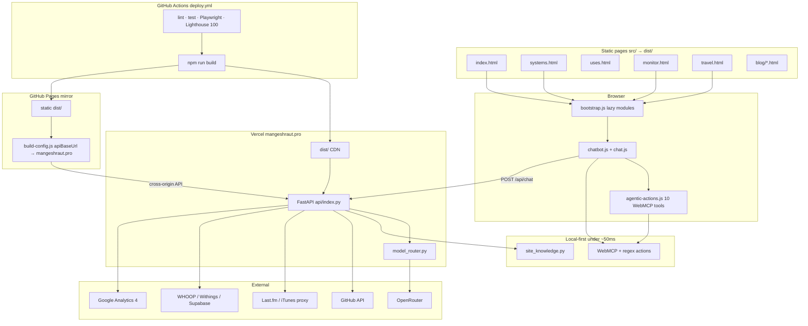
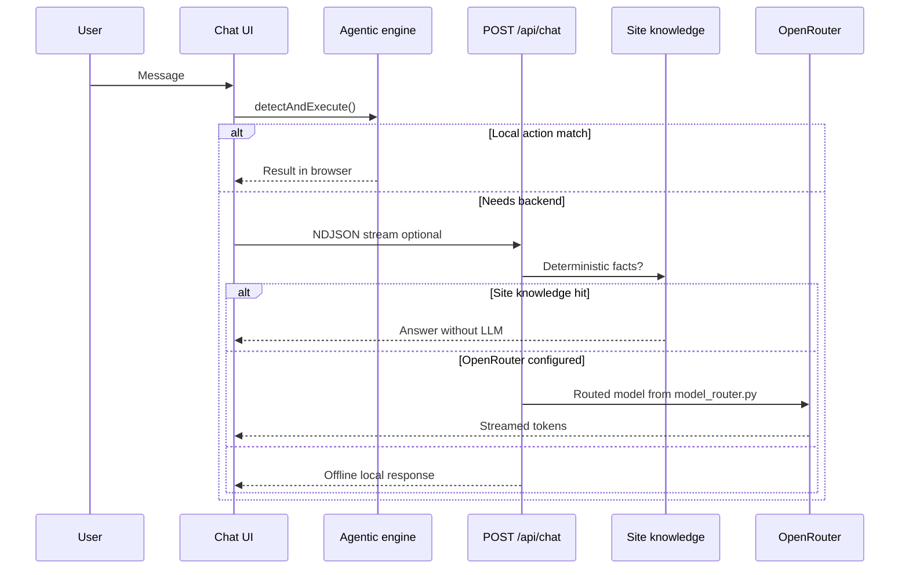

# Mangesh Raut — Agentic Full-Stack Portfolio

<p align="center">
  <a href="https://mangeshraut.pro">
    
    
  </a>
</p>
<p align="center"><sub>Homepage · Light mode (left) · Dark mode (right) · June 2026</sub></p>

<p align="center">
  <a href="https://mangeshraut.pro"></a>
  <a href="https://mangeshraut712.github.io/mangeshrautarchive/"></a>
  <a href="https://github.com/mangeshraut712/mangeshrautarchive/actions/workflows/deploy.yml"></a>
  <a href="LICENSE"></a>
  <a href="https://nodejs.org/"></a>
</p>

<p align="center">
  <strong>Production AI-first portfolio with local-first agentic actions, dual hosting, and a full CI quality matrix.</strong><br>
  <sub>Vanilla ES modules · FastAPI on Vercel · WWDC26 liquid glass · WebMCP · OpenRouter</sub>
</p>

<p align="center">
  <a href="https://mangeshraut.pro"><strong>Live site</strong></a>
  &nbsp;·&nbsp;
  <a href="https://mangeshraut.pro/monitor"><strong>Monitor</strong></a>
  &nbsp;·&nbsp;
  <a href="https://mangeshraut.pro/systems"><strong>Engineering</strong></a>
  &nbsp;·&nbsp;
  <a href="#-architecture"><strong>Architecture</strong></a>
  &nbsp;·&nbsp;
  <a href="#-local-development"><strong>Quick start</strong></a>
</p>

---

## Table of contents

- [Overview](#overview)
- [Live surfaces](#live-surfaces)
- [What is shipped](#what-is-shipped)
- [Tech stack](#tech-stack)
- [Architecture](#architecture)
- [AssistMe & WebMCP tools](#assistme--webmcp-tools)
- [Quality assurance & CI](#quality-assurance--ci)
- [Project structure](#project-structure)
- [API reference](#api-reference)
- [Local development](#local-development)
- [Deployment & CI/CD](#deployment--cicd)
- [Documentation](#documentation)
- [Changelog highlights](#changelog-highlights)
- [Contributing](#contributing)
- [License & contact](#license--contact)

---

## Overview

This repository powers [mangeshraut.pro](https://mangeshraut.pro) — a static-first portfolio with a **FastAPI** backend on Vercel, not a React/Next.js app. The runtime is **vanilla ES modules**, **Tailwind CSS v4**, and a custom **esbuild** build pipeline.

**AssistMe** is the on-site AI assistant. It runs **deterministic actions in the browser first** (navigation, resume download, theme toggle, project filters) via regex + **WebMCP** (`navigator.modelContext`). Only when local logic cannot answer does the client call **`POST /api/chat`** with **NDJSON streaming** through **OpenRouter** (`model_router.py`).

The same `dist/` output is deployed to **Vercel** (primary + API) and **GitHub Pages** (static mirror with `apiBaseUrl` pointing at production).

---

## Live surfaces

| Surface                  | URL                                                                                                 | What you get                                                  |
| ------------------------ | --------------------------------------------------------------------------------------------------- | ------------------------------------------------------------- |
| **Portfolio**            | [mangeshraut.pro](https://mangeshraut.pro)                                                          | AssistMe, projects, blog, health widget, PWA                  |
| **GitHub Pages mirror**  | [mangeshraut712.github.io/mangeshrautarchive](https://mangeshraut712.github.io/mangeshrautarchive/) | Same static build; API calls go to `mangeshraut.pro`          |
| **Engineering evidence** | [mangeshraut.pro/systems](https://mangeshraut.pro/systems)                                          | CI-verified benchmarks, architecture tabs, live monitor hooks |
| **System monitor**       | [mangeshraut.pro/monitor](https://mangeshraut.pro/monitor)                                          | Public ops dashboard, integration status, probes              |
| **Travel atlas**         | [mangeshraut.pro/travel](https://mangeshraut.pro/travel)                                            | MapLibre map of visited places + narratives                   |
| **Uses / stack**         | [mangeshraut.pro/uses](https://mangeshraut.pro/uses)                                                | Current tooling and vibe-stack snapshot                       |
| **Blog**                 | [mangeshraut.pro/blog](https://mangeshraut.pro/blog)                                                | 12 generated technical articles (2026 topics)                 |

---

## What is shipped

| Area                | Implementation                                                                                        |
| ------------------- | ----------------------------------------------------------------------------------------------------- |
| **Agentic runtime** | `agentic-actions.js` — 10 WebMCP tools + regex fast-path in `chat.js` before any LLM call             |
| **AI chat**         | `api/routes/chat.py` — site knowledge, local fallback, OpenRouter Fusion / Auto / Grok-first routing  |
| **Design system**   | WWDC26 liquid glass (`wwdc26-liquid-glass.css`), solid light/dark surfaces, Apple-premium card system |
| **Projects**        | `github-projects.js` — proxy + multi-origin fallback chain, XR detail modal                           |
| **Media shelf**     | Last.fm now-playing via `/api/music/recent` + iTunes artwork proxy `/api/music/artwork`               |
| **Health**          | WHOOP + Withings OAuth, Supabase daily snapshots, `/api/health-vitals/summary` widget                 |
| **Analytics**       | GA4 reach panel + `@vercel/analytics` (production only)                                               |
| **Accessibility**   | Toolbar (font scale, contrast, reduced motion, glass tint), axe-core CI gate                          |
| **Build**           | `scripts/build/build.js` — esbuild, Sharp, hero-critical CSS bundle, blog/case-study generators       |
| **Testing**         | 15 Playwright projects, 70 pytest API tests, Lighthouse **100/100** CI gate on `dist/`                |

---

## Tech stack

Versions below match `package.json` / `requirements.txt` in this repo.

| Layer                   | Technologies                                                                                             |
| ----------------------- | -------------------------------------------------------------------------------------------------------- |
| **Frontend**            | Vanilla ES modules, Tailwind CSS **4.0.9** (`@tailwindcss/cli` **4.3.1**), no production React framework |
| **Agentic**             | WebMCP `navigator.modelContext`, AssistMe action handler, NDJSON chat UI                                 |
| **AI backend**          | OpenRouter via `model_router.py` (Grok portfolio tier, Fusion compare, Auto general, Gemini fast-path)   |
| **API**                 | FastAPI **0.136.1**, Pydantic **2.13.4**, Uvicorn **0.47.0**, httpx **0.28.1**                           |
| **Data & integrations** | GitHub REST, Last.fm, Google Analytics 4, Firestore reach, Supabase health vitals, WHOOP, Withings       |
| **Build**               | esbuild **0.28.0**, Sharp **0.35.2**, custom Node pipeline                                               |
| **Analytics (client)**  | `@vercel/analytics` **2.0.1**                                                                            |
| **Markdown**            | `marked` **18.0.5**, `isomorphic-dompurify`, KaTeX (chat/blog)                                           |
| **Testing**             | Playwright **1.58.2**, Vitest **4.1.6**, `@axe-core/playwright` **4.11.1**, Lighthouse CI                |
| **Lint / format**       | ESLint **9.21.0**, Stylelint **16.26.1**, Prettier **3.8.4**, flake8 (Python)                            |
| **Static analysis**     | React Doctor **0.5.8** (dependency graph via `src/js/entry.js`; informational in CI)                     |
| **Hosting**             | Vercel (API + CDN) + GitHub Pages (static mirror)                                                        |
| **Runtimes**            | Node **22.x**, Python **3.12**                                                                           |

---

## Architecture

### System map



### Chat request flow



**Design principles:** local-first actions · dual surface (Vercel + GitHub Pages) · secrets only in server env · every `main` push runs the full quality gate before deploy.

---

## AssistMe & WebMCP tools

Ten tools are registered when `navigator.modelContext` is available (`agentic-actions.js`):

| Tool                   | Action                                                       |
| ---------------------- | ------------------------------------------------------------ |
| `navigate_to_section`  | Scroll to a portfolio section                                |
| `download_resume`      | Download resume PDF                                          |
| `schedule_meeting`     | Open Calendly popup                                          |
| `open_contact_form`    | Focus contact form                                           |
| `copy_contact_info`    | Copy email / social links                                    |
| `search_portfolio`     | Open global search with query                                |
| `filter_projects`      | Filter GitHub showcase by technology                         |
| `open_social_media`    | Open GitHub, LinkedIn, or X                                  |
| `toggle_theme`         | Switch light / dark / system                                 |
| `update_health_metric` | Update WHOOP/Withings widget metric (connected integrations) |

Natural-language commands in AssistMe use the same handlers via regex detection in `chat.js` before any network call.

---

## Quality assurance & CI

### GitHub Actions (`deploy.yml` on every push/PR to `main`)

1. `npm audit --audit-level=high` + `npm run security-check`
2. ESLint + Stylelint
3. Vitest (29 unit tests)
4. React Doctor (`doctor:full`, non-blocking)
5. Python flake8 + dead-code scan + **70** API tests (pytest)
6. Playwright smoke + axe-core (`qa:browser:ci`)
7. Lighthouse desktop + mobile on `dist/` (`qa:lighthouse:ci`)
8. Build → GitHub Pages deploy → live commit verification

Nightly **[post-deploy-monitoring.yml](.github/workflows/post-deploy-monitoring.yml)** checks production reachability and Lighthouse on Vercel.

### Thresholds (June 2026)

| Gate                                          | Target                                                                                     |
| --------------------------------------------- | ------------------------------------------------------------------------------------------ |
| **Lighthouse CI** (`dist/`, desktop + mobile) | **100** Performance · **100** Accessibility · **100** Best Practices · **100** SEO         |
| **axe-core** (homepage)                       | Zero critical / serious violations                                                         |
| **Playwright**                                | 15 named browser projects (Chrome, Safari, Firefox, Edge, Pixel, iPhone, iPad, responsive) |
| **Vitest**                                    | 29 tests across 4 files                                                                    |
| **pytest**                                    | 70 API tests                                                                               |

### Useful commands

| Command                             | Purpose                                                 |
| ----------------------------------- | ------------------------------------------------------- |
| `npm run check`                     | ESLint + Stylelint + Prettier check + Vitest + pytest   |
| `npm run qa:prod-ready`             | Security + full lint/test + browser + Lighthouse        |
| `npm run qa:lighthouse:ci`          | Build `dist/` and run desktop + mobile Lighthouse gates |
| `npm run qa:browser:ci`             | Playwright smoke + accessibility on dev server          |
| `npm run verify:deploy-sync:remote` | Compare deploy commit on Vercel vs GitHub Pages         |

---

## Project structure

```
mangeshrautarchive/
├── api/                      # FastAPI app (Vercel serverless entry: api/index.py)
│   ├── routes/               # chat, github, media, analytics, monitor, integrations
│   ├── integrations/         # WHOOP, Withings, Supabase sync
│   ├── model_router.py       # OpenRouter model selection
│   └── site_knowledge.py     # Deterministic portfolio answers
├── src/                      # Source of truth for static site
│   ├── index.html            # Main portfolio
│   ├── systems.html          # Engineering evidence
│   ├── uses.html             # Tooling / vibe stack
│   ├── monitor.html          # Public ops dashboard
│   ├── travel.html           # MapLibre atlas
│   ├── assets/               # CSS, images (incl. homepage light/dark screenshots)
│   └── js/                   # core/, modules/, services/, utils/
├── scripts/
│   ├── build/                # build.js, blog generator, image optimization
│   ├── deployment/           # Lighthouse gate, env parity, deploy sync
│   └── utils/                # dev server, serve-dist, Playwright runner
├── tests/
│   ├── api/                  # pytest (70 tests)
│   └── e2e/                  # Playwright smoke, a11y, post-deploy, visual
├── docs/                     # Integration playbooks, CI notes, archived HTML snapshots
├── config/                   # Tooling config fragments
└── .github/workflows/        # deploy.yml, post-deploy-monitoring.yml
```

---

## API reference

Production base: `https://mangeshraut.pro`

```bash
# Core
curl https://mangeshraut.pro/api/health
curl https://mangeshraut.pro/api/monitor/status

# Content & reach
curl "https://mangeshraut.pro/api/github/repos/public?username=mangeshraut712"
curl https://mangeshraut.pro/api/analytics/reach

# Media
curl "https://mangeshraut.pro/api/music/recent?user=mbr63&limit=5"
curl "https://mangeshraut.pro/api/music/artwork?track=Song&artist=Artist"

# Health integrations (sanitized summary when connected)
curl https://mangeshraut.pro/api/health-vitals/summary
```

OpenAPI interactive docs: `http://127.0.0.1:8001/docs` when running the API locally.

---

## Local development

**Requirements:** Node.js 22.x, Python 3.12+, optional [uv](https://github.com/astral-sh/uv) for faster pytest.

```bash
git clone https://github.com/mangeshraut712/mangeshrautarchive.git
cd mangeshrautarchive
npm install --no-audit --no-fund

python3 -m venv .venv && source .venv/bin/activate
pip install -r requirements.txt -r requirements-dev.txt

cp .env.example .env    # set OPENROUTER_API_KEY at minimum
npm run dev             # frontend :4000 + API :8001
```

| Service  | URL                        |
| -------- | -------------------------- |
| Frontend | http://127.0.0.1:4000      |
| FastAPI  | http://127.0.0.1:8001      |
| API docs | http://127.0.0.1:8001/docs |

Production build preview:

```bash
npm run build
PORT=4174 npm run serve:dist
```

---

## Deployment & CI/CD

| Workflow                                                                   | Trigger                | Role                                          |
| -------------------------------------------------------------------------- | ---------------------- | --------------------------------------------- |
| [deploy.yml](.github/workflows/deploy.yml)                                 | Push/PR `main`, manual | Quality gates → build → GitHub Pages → verify |
| [post-deploy-monitoring.yml](.github/workflows/post-deploy-monitoring.yml) | Daily 14:00 UTC        | Production reachability + Lighthouse          |

**Dual hosting:** CI deploys GitHub Pages from `dist/`. Vercel production deploys via the repo integration on the same `main` commits. `build-config.json` stores `gitCommit` for cross-surface parity checks.

---

## Documentation

| Doc                                                                        | Contents                                            |
| -------------------------------------------------------------------------- | --------------------------------------------------- |
| [docs/ci-quality-gates-june-2026.md](docs/ci-quality-gates-june-2026.md)   | CI order, Lighthouse thresholds, React Doctor notes |
| [docs/integration-auth-playbook.md](docs/integration-auth-playbook.md)     | OAuth flows for integrations                        |
| [docs/google-calendar-oauth-setup.md](docs/google-calendar-oauth-setup.md) | Calendar OAuth setup                                |

---

## Changelog highlights

**June 2026 (latest)**

- Lighthouse CI gate raised to **100/100** on all four categories (desktop + mobile on `dist/`)
- iTunes artwork proxied through `/api/music/artwork` (fixes CORS + Best Practices on production audits)
- Perf-audit head script for Lighthouse / CI runs; loopback `apiBaseUrl` fix for local audits
- Sitewide card audit: unified CSS cache versions, section subtitles, border-only blue hovers
- Solid `#ffffff` / `#000000` theme surfaces; hero name blue gradient; skills category panels
- Engineering evidence page (`/systems`) with CI-backed benchmark tiles and architecture tabs
- README homepage screenshots for light and dark mode

---

## Contributing

Issues and PRs are welcome. Minimum before opening a PR:

```bash
npm run check
```

For larger changes, run `npm run qa:prod-ready`.

---

## License & contact

**MIT License** — see [LICENSE](LICENSE).

**Mangesh Raut**

- Web: [mangeshraut.pro](https://mangeshraut.pro)
- LinkedIn: [linkedin.com/in/mangeshraut71298](https://linkedin.com/in/mangeshraut71298)
- GitHub: [github.com/mangeshraut712](https://github.com/mangeshraut712)
- Email: mbr63@drexel.edu

---

<p align="center">
  <a href="#mangesh-raut--agentic-full-stack-portfolio">Back to top</a>
</p>
