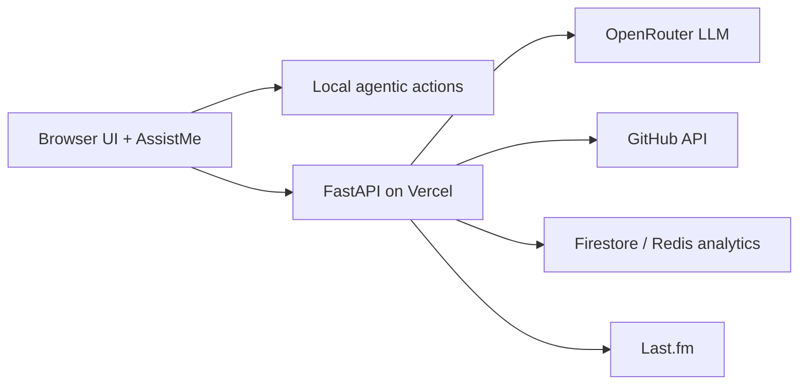

# Mangesh Raut — Portfolio

Personal portfolio and agentic web app: vanilla ES modules, FastAPI backend, AssistMe AI chat, and dual deployment on Vercel + GitHub Pages.

| Link | URL |
| --- | --- |
| Live site | [mangeshraut.pro](https://mangeshraut.pro) |
| GitHub Pages | [mangeshraut712.github.io/mangeshrautarchive](https://mangeshraut712.github.io/mangeshrautarchive/) |
| System monitor | [mangeshraut.pro/monitor](https://mangeshraut.pro/monitor) |
| Travel atlas | [mangeshraut.pro/travel](https://mangeshraut.pro/travel) |

[](https://github.com/mangeshraut712/mangeshrautarchive/actions/workflows/deploy.yml)
[](LICENSE)

---

## Highlights

- **AssistMe chat** — streaming responses, voice dictation, writing tools, and on-screen context chips
- **Agentic actions** — nine deterministic in-browser tools (navigate, search, theme toggle, resume download, and more) via WebMCP and local pattern matching
- **Solid Apple-inspired UI** — light/dark theme, modular CSS, procedural sound effects, accessibility toolbar
- **Live data** — GitHub project showcase, Last.fm now playing, portfolio reach analytics, travel atlas
- **Production tooling** — custom esbuild pipeline, Playwright matrix, Lighthouse gates, FastAPI tests

---

## Quick start

**Requirements:** Node.js 22.x, Python 3.11+ (for the API), optional `uv` for test runs.

```bash
git clone https://github.com/mangeshraut712/mangeshrautarchive.git
cd mangeshrautarchive

npm install --no-audit --no-fund
python3 -m venv venv && source venv/bin/activate
pip install -r requirements.txt

cp .env.example .env   # set OPENROUTER_API_KEY
npm run dev
```

| Service | Local URL |
| --- | --- |
| Frontend | http://127.0.0.1:4000 |
| FastAPI | http://127.0.0.1:8001 |
| API docs | http://127.0.0.1:8001/docs |

Production preview after build:

```bash
npm run build
PORT=4174 npm run serve:dist
```

---

## Commands

| Command | Purpose |
| --- | --- |
| `npm run dev` | Frontend + backend with hot reload |
| `npm run build` | Production build to `dist/` |
| `npm run check` | ESLint, Stylelint, Vitest, Python API tests |
| `npm run qa:prod-ready` | Security scan + full lint/test/Lighthouse pipeline |
| `npm run test:e2e:all` | Playwright smoke tests (multi-browser) |
| `npm run security-check` | Scan for secrets before commit |
| `npm run clean` | Remove build artifacts |

---

## Project layout

```
mangeshrautarchive/
├── api/                 # FastAPI routes (chat, GitHub, analytics, monitor, media)
├── src/
│   ├── index.html       # Main portfolio
│   ├── monitor.html     # Operations dashboard
│   ├── travel.html      # MapLibre travel atlas
│   ├── assets/css/      # Modular stylesheets
│   └── js/              # ES modules (core, modules, services, utils)
├── scripts/             # Build, dev servers, QA, deployment helpers
├── tests/api/           # pytest suite
├── tests/e2e/           # Playwright smoke, a11y, post-deploy
└── .github/workflows/   # CI/CD and monitoring
```

---

## Architecture



- **Local-first:** common chat commands run in the browser without an LLM round trip.
- **Dual hosting:** Vercel is primary; GitHub Pages serves static assets with API fallbacks.
- **No secrets in the client:** only public config is injected at build time.

---

## Environment

Copy `.env.example` to `.env`. Minimum for AI chat:

```env
OPENROUTER_API_KEY=your_key_here
PORT=8001
```

Optional: `GITHUB_TOKEN`, Upstash Redis for shared analytics, TMDB/Google Books for media endpoints. See `.env.example` for the full list.

---

## API samples

```bash
curl https://mangeshraut.pro/api/health
curl https://mangeshraut.pro/api/analytics/reach
curl https://mangeshraut.pro/api/github/repos/public
```

OpenAPI is available at `/docs` when running the backend locally.

---

## Testing & quality

- **Unit:** Vitest (JS), pytest (FastAPI)
- **E2E:** Playwright across Chrome, Safari, Firefox, Edge, and mobile profiles
- **Accessibility:** axe-core via Playwright
- **Performance:** Lighthouse gates in `npm run qa:chrome`

Run the standard gate before opening a PR:

```bash
npm run check
```

For release readiness:

```bash
npm run qa:prod-ready
```

---

## Deploy

- **Vercel:** connected to `main`; builds via `npm run build`, serves `dist/`
- **GitHub Pages:** `.github/workflows/deploy.yml` publishes the same build artifact

Both surfaces are monitored in CI after deploy.

---

## Contributing

Issues and PRs are welcome. Run `npm run check` at minimum; use `npm run qa:prod-ready` before larger changes.

---

## License

MIT — see [LICENSE](LICENSE).

---

## Contact

**Mangesh Raut**

- Site: [mangeshraut.pro](https://mangeshraut.pro)
- LinkedIn: [linkedin.com/in/mangeshraut71298](https://linkedin.com/in/mangeshraut71298)
- GitHub: [github.com/mangeshraut712](https://github.com/mangeshraut712)
- Email: mbr63@drexel.edu
