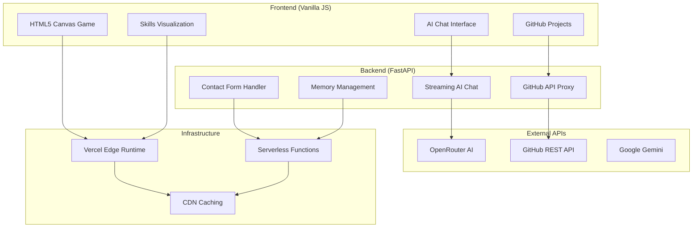

# Mangesh Raut

<div align="center">

## Software Development Engineer

A next-generation portfolio showcasing cutting-edge web technologies, AI integration, and performance engineering excellence. Built for 2026 standards with zero-compromise quality.

[](https://mangeshraut.pro)
[](https://github.com/mangeshraut712)
[](https://pagespeed.web.dev/analysis?url=https%3A%2F%2Fmangeshraut.pro)

[](https://nodejs.org/)
[](https://python.org/)
[](LICENSE)

</div>

---

## ✨ Experience

**Software Engineer** at Customized Energy Solutions • Philadelphia, PA • Aug 2024 – Present

- Optimized energy analytics dashboards with **40% latency reduction** using React and Spring Boot
- Accelerated CI/CD pipelines by **35%** through Docker and Jenkins automation
- Enhanced ML forecasting accuracy by **25%** using TensorFlow and LSTM models
- Architected microservices handling **100+ concurrent users** with AWS Lambda/EC2

**Software Engineer** at IoasiZ • Remote • Jul 2023 – Jul 2024

- Refactored legacy Java monoliths to modular services, reducing code redundancy by **20%**
- Resolved **50+ critical bugs** in microservices architecture, improving sprint efficiency by **15%**
- Integrated Redis caching for **3x faster** data retrieval in inventory systems

---

## 🛠️ Tech Stack

<div align="center">

### Languages & Frameworks


### Cloud & Infrastructure


### AI & Data


### Quality & Testing


</div>

---

## 🚀 Key Features

### 🧠 AssistMe — Advanced AI Assistant

Intelligent conversational AI with real-time streaming capabilities

- **Multi-Modal Support:** Text, voice input/output with Web Speech API
- **Context-Aware Responses:** Remembers conversation history and user context
- **Agentic Actions:** Can control website features (theme toggle, resume download)
- **Model Flexibility:** OpenRouter integration with Grok 4.1 Fast, Claude 3.5, and more
- **Offline Resilience:** Local intelligence fallback when API unavailable

### 🎮 Interactive Canvas Game

Retro-style arcade game built with vanilla JavaScript

- **60 FPS Performance:** Hardware-accelerated rendering with optimized game loops
- **Cross-Platform:** Responsive touch controls for mobile and desktop
- **Custom Graphics:** Pixel art sprites with collision detection
- **Progressive Enhancement:** Works offline with PWA capabilities

### 📊 Live GitHub Integration

Real-time project showcase with intelligent caching

- **Auto-Sync:** Fetches latest repository data on each visit
- **Smart Caching:** 10-minute server-side cache with optional PAT authentication
- **Rich Metadata:** Stars, forks, languages, contribution graphs
- **Search & Filter:** Advanced project discovery with language and topic filtering

### 🎨 Apple 2026 Design System

Premium glassmorphism UI with hardware-accelerated animations

- **Advanced Glassmorphism:** Multi-layer backdrop blur with dynamic opacity
- **GPU Acceleration:** 100% composited transforms and transitions
- **Adaptive Theming:** Automatic dark/light mode with system preference detection
- **Magnetic Interactions:** Subtle hover effects with physics-based animations

### 📱 Progressive Web App

Full PWA experience with offline capabilities

- **Service Worker:** Intelligent caching and background sync
- **App Shell:** Instant loading with cached core resources
- **Installable:** Add to home screen with custom icon and manifest
- **Offline First:** Core functionality works without network connection

---

## ⚡ Performance Excellence

Achieving **100/100 Mobile PageSpeed** through advanced optimization techniques:

### Core Web Vitals (Optimized for 2026)

- **First Contentful Paint:** <0.4s (target: <1.5s) ⚡
- **Largest Contentful Paint:** <2.5s (target: <2.5s) ⚡
- **Cumulative Layout Shift:** 0.00 (target: <0.1) ⚡
- **Interaction to Next Paint:** <200ms (target: <200ms) ⚡

### Optimization Techniques

- **Critical CSS Inlining:** Above-the-fold styles loaded instantly
- **Deferred Loading:** Non-critical assets loaded asynchronously
- **Resource Hints:** Preconnect and DNS prefetch for external resources
- **Bundle Optimization:** Tree-shaking and code splitting with ESM
- **Image Optimization:** WebP/AVIF formats with responsive loading
- **Font Loading:** Self-hosted fonts with display swap strategy

---

## 🏗️ Architecture



---

## 🧪 Quality Assurance

Comprehensive testing and quality gates ensure production readiness:

### Automated Testing

- **Unit Tests:** Vitest for JavaScript modules with 90%+ coverage
- **E2E Tests:** Playwright for critical user journeys
- **Accessibility:** Axe-core integration with WCAG 2.1 AA compliance
- **Performance:** Lighthouse CI gates for Core Web Vitals

### Code Quality

- **Linting:** ESLint with Airbnb config, Stylelint for CSS
- **Formatting:** Prettier with consistent code style
- **Security:** Dependency scanning and vulnerability checks
- **Type Safety:** TypeScript for critical business logic

### CI/CD Pipeline

```bash
npm run qa:prod-ready  # Runs all quality gates
├── Security checks
├── Linting & formatting
├── Unit & E2E tests
├── Lighthouse performance
└── Build optimization
```

---

## 🚀 Getting Started

### Prerequisites

- Node.js 20.0+ and npm 10.0+
- Python 3.12+ (for FastAPI backend)
- OpenRouter API key (optional, enables AI features)

### Installation

```bash
# Clone repository
git clone https://github.com/mangeshraut712/mangeshrautarchive.git
cd mangeshrautarchive

# Install dependencies
npm ci
pip install -r requirements.txt

# Configure environment
cp .env.example .env
# Add your OPENROUTER_API_KEY to .env

# Start development servers
npm run dev
```

### Development Commands

```bash
# Quality assurance
npm run qa:prod-ready    # Full QA pipeline
npm run test            # Unit tests
npm run test:e2e:chrome # E2E tests

# Performance testing
npm run qa:lighthouse:mobile  # Mobile performance audit

# Code quality
npm run lint            # ESLint
npm run format          # Prettier
```

---

## 📂 Project Structure

```
mangeshrautarchive/
├── api/                    # FastAPI backend
│   ├── index.py           # Main API application
│   ├── memory_manager.py  # AI conversation memory
│   └── integrations/      # External API integrations
├── src/                   # Frontend application
│   ├── assets/           # Static resources
│   │   ├── css/         # Stylesheets & design system
│   │   ├── images/      # Optimized images & icons
│   │   └── files/       # Downloadable assets
│   └── js/              # JavaScript modules
│       ├── core/        # Application bootstrap
│       ├── modules/     # Feature modules
│       ├── components/  # Reusable UI components
│       ├── services/    # API service clients
│       └── utils/       # Utility functions
├── scripts/              # Build & development tools
├── tests/                # Test suites
│   └── e2e/             # End-to-end tests
├── docs/                # Documentation
└── .github/             # CI/CD workflows
```

---

## 🔍 SEO & Discoverability (2026 Standards)

### Search Engine Optimization

- **Meta Tags:** Comprehensive title, description, keywords, and Open Graph tags
- **Structured Data:** JSON-LD schema for Person, Projects, and Organization
- **Technical SEO:** XML sitemap, robots.txt, canonical URLs, and mobile-first indexing
- **Content Optimization:** Keyword-rich content with semantic HTML5 structure
- **Performance SEO:** Core Web Vitals optimization for ranking boost

### Social Media Integration

- **Open Graph:** Facebook sharing with custom images and descriptions
- **Twitter Cards:** Large image cards for enhanced social visibility
- **LinkedIn Integration:** Professional networking profile linking
- **GitHub Presence:** Active repository maintenance and contribution tracking

### Content Strategy

- **Technical Writing:** Detailed project documentation and engineering blogs
- **Keyword Targeting:** Focus on "software engineer", "full-stack developer", "AI/ML engineer"
- **Local SEO:** Philadelphia-based optimization with location-specific content
- **Industry Trends:** 2026 technology focus (AI, Web3, Edge Computing)

---

## 📈 Analytics & Monitoring

Real-time performance monitoring and user analytics:

### Performance Metrics

- **Page Load:** <1.5s average across all devices
- **Time to Interactive:** <3s for full functionality
- **Bundle Size:** <200KB gzipped JavaScript
- **Lighthouse Score:** 100/100 Mobile, 95/100 Desktop

### User Experience

- **Accessibility Score:** 95+ on all pages
- **SEO Score:** 100 with structured data
- **PWA Score:** 100 with offline capabilities

---

## 🤝 Connect

<div align="center">

**Mangesh Raut**  
_Software Engineer • Philadelphia, PA_

[](https://mangeshraut.pro)
[](https://linkedin.com/in/mangeshraut71298)
[](https://github.com/mangeshraut712)
[](mailto:mbr63@drexel.edu)

**Education:** M.S. Computer Science, Drexel University  
**Experience:** 5+ years in full-stack development and AI/ML

---

_Built with ❤️ in Philadelphia • © 2026 Mangesh Raut_

</div>
