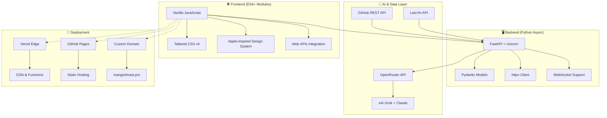

<div align="center">


<h1 style="font-size: 3rem; font-weight: 700; margin: 1rem 0; color: #1d1d1f;">Mangesh Raut</h1>
<h2 style="font-size: 1.5rem; font-weight: 400; margin: 0.5rem 0; color: #86868b;">AI-Powered Interactive Portfolio</h2>

<p style="font-size: 1.125rem; max-width: 600px; margin: 1rem auto; color: #86868b;">
  Experience the future of developer portfolios with real-time AI conversations, live GitHub data, immersive design, and cutting-edge web technologies.
</p>

<div style="display: flex; gap: 1rem; justify-content: center; flex-wrap: wrap; margin: 2rem 0;">
  <a href="https://mangeshraut.pro" style="background: linear-gradient(135deg, #0071e3, #40a9ff); color: white; padding: 0.75rem 1.5rem; border-radius: 25px; text-decoration: none; font-weight: 600; box-shadow: 0 4px 16px rgba(0,113,227,0.3); transition: all 0.2s;">
    🌐 View Live Demo
  </a>
  <a href="https://github.com/mangeshraut712/mangeshrautarchive" style="background: #f5f5f7; color: #1d1d1f; padding: 0.75rem 1.5rem; border-radius: 25px; text-decoration: none; font-weight: 600; border: 1px solid #d2d2d7; transition: all 0.2s;">
    📖 View Source
  </a>
</div>

[](https://mangeshraut.pro)
[](https://mangeshraut712.github.io/mangeshrautarchive/)
[](LICENSE)
[](https://github.com/mangeshraut712/mangeshrautarchive/actions)

</div>

---

## ✨ Features Showcase

<div align="center">

| 🎯 AI Assistant                            | 📊 Live Data                                   | 🎨 Premium Design                         | 🎮 Interactive Games                         |
| ------------------------------------------ | ---------------------------------------------- | ----------------------------------------- | -------------------------------------------- |
| Real-time streaming chatbot with voice I/O | GitHub stats, Last.fm music, system monitoring | Apple-inspired glassmorphism & animations | Canvas-based arcade game with touch controls |

</div>

### 🤖 AI-Powered Assistant

<details>
<summary style="cursor: pointer; font-size: 1.25rem; font-weight: 600; margin: 1rem 0;"><b>💬 Click to explore AssistMe features</b></summary>
<br/>
<div style="background: linear-gradient(135deg, #f5f5f7, #ffffff); padding: 1.5rem; border-radius: 16px; border: 1px solid #e5e5e7;">
  <p style="margin: 0 0 1rem 0;"><strong>AssistMe</strong> is a fully functional AI companion that can:</p>
  <ul style="margin: 0;">
    <li>🔄 Stream responses in real-time like ChatGPT</li>
    <li>💾 Maintain conversation context</li>
    <li>🎤 Accept voice input and provide voice output</li>
    <li>🎯 Control website elements (themes, navigation, downloads)</li>
    <li>📊 Display live metadata and privacy controls</li>
  </ul>
  <p style="margin: 1rem 0 0 0;"><em>Powered by xAI Grok and Anthropic Claude via OpenRouter</em></p>
</div>
</details>

### 📺 Currently Card

<details>
<summary style="cursor: pointer; font-size: 1.25rem; font-weight: 600; margin: 1rem 0;"><b>🎬 Click to see media preferences</b></summary>
<br/>
<div style="background: linear-gradient(135deg, #f5f5f7, #ffffff); padding: 1.5rem; border-radius: 16px; border: 1px solid #e5e5e7;">
  <p style="margin: 0 0 1rem 0;">Curated shelves featuring:</p>
  <div style="display: grid; grid-template-columns: repeat(auto-fit, minmax(200px, 1fr)); gap: 1rem;">
    <div style="text-align: center;">
      <span style="font-size: 2rem;">📺</span>
      <p style="margin: 0.5rem 0;"><strong>Shows & Movies</strong><br/>30+ titles with streaming links</p>
    </div>
    <div style="text-align: center;">
      <span style="font-size: 2rem;">🎵</span>
      <p style="margin: 0.5rem 0;"><strong>Music</strong><br/>Last.fm integration</p>
    </div>
    <div style="text-align: center;">
      <span style="font-size: 2rem;">📚</span>
      <p style="margin: 0.5rem 0;"><strong>Books</strong><br/>Personal favorites</p>
    </div>
  </div>
</div>
</details>

### 📊 Live GitHub Showcase

<details>
<summary style="cursor: pointer; font-size: 1.25rem; font-weight: 600; margin: 1rem 0;"><b>💻 Click to explore GitHub integration</b></summary>
<br/>
<div style="background: linear-gradient(135deg, #f5f5f7, #ffffff); padding: 1.5rem; border-radius: 16px; border: 1px solid #e5e5e7;">
  <p style="margin: 0 0 1rem 0;">Dynamic project showcase with:</p>
  <ul style="margin: 0;">
    <li>🔄 Auto-updating repository data</li>
    <li>📈 Live star, fork, and language stats</li>
    <li>🎨 Apple 2026 design cards</li>
    <li>🔍 Fuzzy search and filtering</li>
    <li>🗺️ Interactive project modals</li>
  </ul>
</div>
</details>

---

## 🏗️ Architecture



---

## 🛠️ Technology Stack

<div align="center">

### Frontend Technologies

<a href="https://html.spec.whatwg.org/" target="_blank"></a>
<a href="https://www.w3.org/TR/CSS/" target="_blank"></a>
<a href="https://tc39.es/ecma262/" target="_blank"></a>
<a href="https://tailwindcss.com/" target="_blank"></a>

### Backend & APIs

<a href="https://www.python.org/" target="_blank"></a>
<a href="https://fastapi.tiangolo.com/" target="_blank"></a>
<a href="https://www.uvicorn.org/" target="_blank"></a>

### AI & Intelligence

<a href="https://openrouter.ai/" target="_blank"></a>
<a href="https://x.ai/" target="_blank"></a>
<a href="https://anthropic.com/" target="_blank"></a>

### Quality & Testing

<a href="https://playwright.dev/" target="_blank"></a>
<a href="https://lighthouse.dev/" target="_blank"></a>
<a href="https://eslint.org/" target="_blank"></a>

### Deployment & Hosting

<a href="https://vercel.com/" target="_blank"></a>
<a href="https://pages.github.com/" target="_blank"></a>

</div>

---

## 🚀 Quick Start

### Prerequisites

- Node.js 22+
- Python 3.13+
- Git

### Installation

```bash
git clone https://github.com/mangeshraut712/mangeshrautarchive.git
cd mangeshrautarchive
npm ci
python -m venv venv
source venv/bin/activate  # Windows: venv\Scripts\activate
pip install -r requirements.txt
npm run dev
```

🎯 **Access:**

- Frontend: `http://localhost:4000`
- Backend API: `http://localhost:8001`

---

## 📂 Project Structure

```
mangeshrautarchive/
├── api/                          # FastAPI backend
│   ├── integrations/             # External API clients
│   ├── monitoring/               # Health checks
│   └── index.py                  # API routes
├── src/                          # Frontend source
│   ├── assets/
│   │   ├── css/                  # Stylesheets
│   │   ├── images/               # Optimized media
│   │   └── icons/                # SVG icons
│   ├── js/
│   │   ├── core/                 # Bootstrap
│   │   ├── modules/              # Features
│   │   └── services/             # Utilities
│   └── index.html                # Main page
├── tests/                        # Test suites
├── scripts/                      # Build tools
├── .github/workflows/            # CI/CD
└── package.json                  # Dependencies
```

---

## 📜 Available Scripts

| Command            | Description                  |
| ------------------ | ---------------------------- |
| `npm run dev`      | Start full stack development |
| `npm run build`    | Build production assets      |
| `npm run test`     | Run unit tests               |
| `npm run qa:smoke` | End-to-end smoke tests       |
| `npm run qa:a11y`  | Accessibility checks         |
| `npm run lint`     | Code quality checks          |

---

## 🤝 Contributing

Contributions welcome! See [CONTRIBUTING.md](CONTRIBUTING.md) for guidelines.

---

## 📄 License

MIT License - see [LICENSE](LICENSE) for details.

---

<div align="center">

## 🌟 Connect & Support

<div style="display: flex; gap: 1rem; justify-content: center; flex-wrap: wrap; margin: 2rem 0;">
  <a href="https://linkedin.com/in/mangeshraut71298" style="color: #0077b5;"></a>
  <a href="https://github.com/mangeshraut712" style="color: #333;"></a>
  <a href="mailto:mbr63@drexel.edu" style="color: #ea4335;"></a>
</div>

<p style="color: #86868b; font-size: 0.875rem;">© 2026 Mangesh Raut • Crafted with ❤️ in Pennsylvania</p>

</div>
