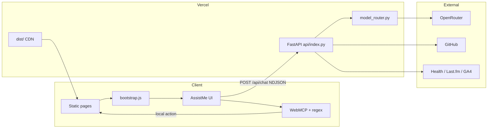

# Mangesh Raut — Agentic Full-Stack Portfolio

<p align="center">
  <a href="https://mangeshraut.pro">
    
    
  </a>
</p>

<p align="center">
  <sub>Homepage · Light (left) · Dark (right) · <strong>July 2026</strong></sub>
</p>

<p align="center">
  <a href="https://mangeshraut.pro"></a>
  <a href="https://mangeshraut712.github.io/mangeshrautarchive/"></a>
  <a href="https://github.com/mangeshraut712/mangeshrautarchive/actions/workflows/deploy.yml"></a>
  <a href="LICENSE"></a>
</p>

<p align="center">
  
  
  
  
  
  
  <a href="https://github.com/sponsors/mangeshraut712"></a>
</p>

<p align="center">
  <strong>AI-first portfolio · local agentic actions · dual hosting · production CI</strong><br>
  <sub>Vanilla ESM · FastAPI on Vercel · OpenRouter · WebMCP · solid light/dark · true lazy CSS</sub>
</p>

<p align="center">
  <a href="https://mangeshraut.pro"><b>Live</b></a>
  ·
  <a href="https://mangeshraut.pro/monitor"><b>Monitor</b></a>
  ·
  <a href="https://mangeshraut.pro/systems"><b>Systems</b></a>
  ·
  <a href="#-quick-start"><b>Quick start</b></a>
  ·
  <a href="#-architecture"><b>Architecture</b></a>
</p>

---

## Overview

This repo powers **[mangeshraut.pro](https://mangeshraut.pro)** — a **static-first** portfolio with a **Python FastAPI** backend on **Vercel serverless**. It is **not** a React, Next.js, Vue, or Svelte app.

| Principle                | Implementation                                                           |
| ------------------------ | ------------------------------------------------------------------------ |
| **Local-first agents**   | WebMCP + regex actions in the browser (~ms) before any LLM               |
| **Cloud AI when needed** | `POST /api/chat` NDJSON stream via **OpenRouter** (`model_router.py`)    |
| **Credit-safe online**   | `openrouter/free` + free-tier fallbacks when paid balance is empty       |
| **Dual surface**         | Same `dist/` → **Vercel** (API + CDN) + **GitHub Pages** (static mirror) |
| **Quality gate**         | Lint · 172 unit/API tests · browser QA · Lighthouse 100s on every `main` |

**Scale (July 2026):** 7 HTML shells · homepage sections (about → contact + debug runner) · 12 Field Notes · 5 case studies · 10 WebMCP tools · **50 Vitest + 122 pytest** · 15 Playwright projects · Apple-style System Monitor · true lazy section CSS (`ASSET_VER` in `scripts/build/asset-version.mjs`).

---

## Live surfaces

| Surface          | URL                                                                          | Role                                          |
| ---------------- | ---------------------------------------------------------------------------- | --------------------------------------------- |
| **Portfolio**    | [mangeshraut.pro](https://mangeshraut.pro)                                   | AssistMe, projects, blog, health, PWA         |
| **GitHub Pages** | […/mangeshrautarchive](https://mangeshraut712.github.io/mangeshrautarchive/) | Static mirror · API → production              |
| **Engineering**  | [/systems](https://mangeshraut.pro/systems)                                  | CI evidence, architecture log, hiring Q&A     |
| **Monitor**      | [/monitor](https://mangeshraut.pro/monitor)                                  | Apple Status cards, portfolio catalog, probes |
| **Travel**       | [/travel](https://mangeshraut.pro/travel)                                    | MapLibre atlas                                |
| **Uses**         | [/uses](https://mangeshraut.pro/uses)                                        | Hardware / software / AI stack                |
| **Blog**         | [/blog](https://mangeshraut.pro/blog)                                        | 12 build-generated articles                   |

---

## Features (July 2026)

| Area                | Highlights                                                                                          |
| ------------------- | --------------------------------------------------------------------------------------------------- |
| **AssistMe**        | 10 WebMCP tools · regex fast-path · NDJSON stream · KaTeX + DOMPurify markdown · free-tier failover |
| **System Monitor**  | Dense Apple-style cards · full portfolio health catalog · platform matrix · CSP / AI metrics        |
| **Load pipeline**   | Section CSS as `data-href` only until near viewport · idle sequential warm · delayed liquid glass   |
| **Command palette** | `⌘K` / `Ctrl+K` · sections, blog, case studies, travel                                              |
| **Projects**        | Live GitHub grid · lens filters · multi-origin proxy · authenticated PAT on server                  |
| **Currently**       | Shows / books / music · Last.fm server proxy · local posters                                        |
| **Health**          | WHOOP + Withings OAuth · Supabase snapshots · daily cron                                            |
| **Reach**           | GA4 Data API hero panel (optional service account)                                                  |
| **Design**          | Solid light/dark (white/black) · optional liquid glass tint · Dynamic Island nav · SF Pro tokens    |
| **A11y**            | axe-core CI · 44px touch · focus rings · reduced motion · high contrast                             |
| **PWA**             | Manifest · offline shell · install shortcuts                                                        |
| **Security**        | Server-only secrets · CSP report endpoint · rate limits · HMAC OAuth state                          |

---

## Tech stack

Pinned to this repo’s `package.json` / `requirements.txt` (July 2026).

### Frontend

|               |                                                                                                    |
| ------------- | -------------------------------------------------------------------------------------------------- |
| **Runtime**   | Vanilla **ES modules** (no React/Vue/Svelte production runtime)                                    |
| **CSS**       | Vanilla design system + **Tailwind CSS 4.x** utility _output only_ (never utility classes in HTML) |
| **Build**     | **esbuild 0.28** · Sharp 0.35 · custom Node pipeline                                               |
| **Markdown**  | marked 18 · isomorphic-dompurify · KaTeX 0.17 · marked-footnote                                    |
| **Glass**     | `@ogtirth/liquid-glass-oss` + custom WebGL (disabled on iOS/low-power)                             |
| **Analytics** | `@vercel/analytics` 2.x · deferred GA4                                                             |

### Backend (Vercel serverless)

|                  |                                                                                                |
| ---------------- | ---------------------------------------------------------------------------------------------- |
| **API**          | **FastAPI 0.139** · Pydantic 2.13 · Uvicorn · httpx · websockets 16                            |
| **AI**           | OpenRouter · `x-ai/grok-4.3` preferred · `openrouter/free` online path · Auto / Fusion routers |
| **Crypto / env** | cryptography 49 · python-dotenv · aiofiles · psutil                                            |
| **Integrations** | GitHub REST · Last.fm · GA4 · Supabase · WHOOP · Withings · Google Calendar                    |

### Quality

|              |                                                                             |
| ------------ | --------------------------------------------------------------------------- |
| **Unit**     | Vitest **4.1** · **50** tests                                               |
| **API**      | pytest · **122** tests                                                      |
| **E2E**      | Playwright **1.61** · **15** browser projects · `@axe-core/playwright` 4.12 |
| **Lint**     | ESLint 9 · Stylelint 17 · Prettier 3.9 · flake8 / ruff / vulture            |
| **Perf**     | Lighthouse **100/100/100/100** on `dist/` (desktop + mobile) every CI run   |
| **Runtimes** | **Node ≥22 &lt;27** (`.nvmrc` → 22) · **Python 3.12**                       |

---

## Architecture



### Chat path

1. **Browser** — `detectAndExecute()` WebMCP / regex (navigate, resume, theme, filters).
2. **Site knowledge** — deterministic portfolio facts without an LLM.
3. **OpenRouter** — routed model (Grok / free / Auto / Fusion / Gemini) with multi-model fallback chain.
4. **Graceful offline** — honest fallbacks for 402 credits, rate limits, and upstream errors.

### Dual hosting

| Host                           | Serves            | API                                                    |
| ------------------------------ | ----------------- | ------------------------------------------------------ |
| **Vercel** (`mangeshraut.pro`) | `dist/` + FastAPI | Same origin `/api/*`                                   |
| **GitHub Pages**               | `dist/` only      | `build-config` → `apiBaseUrl: https://mangeshraut.pro` |

Both stamp `build-config.json` with `gitCommit` for deploy parity (`npm run verify:deploy-sync`).

---

## AI model routing

| Tier                          | Model                     | When                                                |
| ----------------------------- | ------------------------- | --------------------------------------------------- |
| **Env default (online-safe)** | `openrouter/free`         | Set on Vercel when paid balance is empty            |
| **Portfolio primary**         | `x-ai/grok-4.3`           | Hire / skills / experience (when credits available) |
| **Fusion**                    | `openrouter/fusion`       | Compare / trade-off queries (non-stream)            |
| **Auto**                      | `openrouter/auto`         | Open-domain                                         |
| **Fast**                      | `google/gemini-2.5-flash` | Lightweight paid path                               |
| **Free spares**               | Gemma 4 `:free` etc.      | Automatic chain after 402 / upstream fail           |

Configure with `OPENROUTER_API_KEY` + optional `OPENROUTER_MODEL`. After topping up credits: set `OPENROUTER_MODEL=x-ai/grok-4.3` on Vercel and redeploy.

---

## AssistMe · WebMCP tools

| Tool                   | Action                         |
| ---------------------- | ------------------------------ |
| `navigate_to_section`  | Scroll to a section            |
| `download_resume`      | Resume PDF                     |
| `schedule_meeting`     | Calendly                       |
| `open_contact_form`    | Focus contact                  |
| `copy_contact_info`    | Copy email / socials           |
| `search_portfolio`     | Command palette query          |
| `filter_projects`      | Project lens by tech           |
| `open_social_media`    | GitHub / LinkedIn / X          |
| `toggle_theme`         | Light / dark / system          |
| `update_health_metric` | Health widget (when connected) |

---

## Quick start

**Requirements:** Node **≥22** (see `.nvmrc` / `engines`), Python **3.12+**. Node 18 will fail Stylelint 17, Vitest 4, and the production build.

```bash
git clone https://github.com/mangeshraut712/mangeshrautarchive.git
cd mangeshrautarchive

# Node 22+ (nvm use / brew node@22 / fnm)
node -v                                 # must be v22.x–v26.x
npm install --no-audit --no-fund      # matches CI / Vercel (npm ci also works)

# Python 3.12 — venv must be named `venv` for dev-backend auto-detect
python3 -m venv venv && source venv/bin/activate
pip install -r requirements.txt -r requirements-dev.txt
# optional: ln -sfn .venv venv   if you already use a .venv directory

cp .env.example .env                    # OPENROUTER_API_KEY optional
npm run doctor                          # Root layout + stack guard (vanilla ESM)
npm run doctor:stack                    # Node range + full repo doctor
npm run dev                             # http://127.0.0.1:4000  ·  API :8001
```

| URL                        | Service                 |
| -------------------------- | ----------------------- |
| http://127.0.0.1:4000      | Frontend + `/api` proxy |
| http://127.0.0.1:8001      | FastAPI direct          |
| http://127.0.0.1:8001/docs | OpenAPI                 |

```bash
npm run build && PORT=4174 npm run serve:dist   # production preview
```

### Essential commands

| Command                           | Purpose                                           |
| --------------------------------- | ------------------------------------------------- |
| `npm run check-node`              | Fail if Node is outside `engines`                 |
| `npm run doctor` / `doctor:stack` | Root layout + stack guard (no React/Next runtime) |
| `npm run dev`                     | Frontend + backend                                |
| `npm run build`                   | Production `dist/`                                |
| `npm test` / `npm run test:api`   | Vitest (50) / pytest (122)                        |
| `npm run check`                   | ESLint + Stylelint + Prettier + Vitest            |
| `npm run qa:prod-ready`           | Full pre-deploy matrix                            |
| `npm run verify:deploy-sync`      | Vercel ↔ Pages parity                             |
| `npm run clean`                   | Purge dist/artifacts/caches (keeps venvs)         |
| `npm run security-check`          | Secret scan                                       |

---

## Environment (server-side only)

| Group         | Keys                                     | Notes                                |
| ------------- | ---------------------------------------- | ------------------------------------ |
| **AI**        | `OPENROUTER_API_KEY`, `OPENROUTER_MODEL` | Chat; free model works at $0 balance |
| **GitHub**    | `GITHUB_TOKEN` / `GITHUB_PAT`            | Rate limits for project grid         |
| **Last.fm**   | `LASTFM_API_KEY`, `LASTFM_USERNAME`      | Music shelf                          |
| **Analytics** | `GA4_*`, service account JSON            | Portfolio reach panel                |
| **Health**    | WHOOP / Withings / Calendar OAuth        | Optional                             |
| **Supabase**  | URL + service role                       | Vitals persistence                   |
| **Voice**     | `AI_GATEWAY_API_KEY`                     | Optional realtime speech             |

Never commit `.env` / `.env.local`. See [`.env.example`](.env.example).

---

## Quality & CI

### `deploy.yml` (push / PR → `main`)

1. `npm audit` + `security-check`
2. ESLint · Stylelint 17 · Prettier
3. Vitest (**50**)
4. Env parity (non-blocking)
5. flake8 · dead-code · pytest (**122**)
6. Browser QA smoke
7. `npm run build` + Lighthouse desktop/mobile on `dist/` (**100 floors**)
8. GitHub Pages deploy + dual-surface verify

### Nightly `post-deploy-monitoring.yml`

Live reachability (Vercel + Pages) · Lighthouse floors · commit parity.

| Suite                   | Count / target                      |
| ----------------------- | ----------------------------------- |
| Vitest                  | 50                                  |
| pytest                  | 122                                 |
| Playwright projects     | 15                                  |
| Lighthouse CI (`dist/`) | Perf / A11y / BP / SEO **100** each |

---

## Project structure

```text
mangeshrautarchive/
├── src/                    # Frontend shells + assets → npm run build → dist/
│   ├── *.html              # index, systems, monitor, travel, uses, 404, offline
│   ├── js/core|modules|services|utils|data|vendor/
│   └── assets/css|images|files|icons|vendor/
├── api/                    # FastAPI (Vercel entry: api/index.py)
│   ├── routes/ · integrations/
│   └── config.py · model_router.py · monitoring.py · …
├── scripts/                # Tooling (not shipped to browsers)
│   ├── build/              # esbuild pipeline, ASSET_VER, clean
│   ├── deployment/         # Lighthouse, security, deploy sync
│   ├── utils/              # dev servers, check-node, lint runners
│   └── qa/ · integrations/ · offline/
├── tests/unit|api|e2e/     # Vitest · pytest · Playwright
├── config/                 # vulture.toml (non-root tool config)
├── docs/                   # STRUCTURE.md · plans/ · doc index
├── .github/workflows/      # deploy.yml · post-deploy-monitoring.yml
├── package.json · vercel.json · pyproject.toml · .nvmrc
└── AGENTS.md               # AI / contributor brief
```

**Do not** add React/Next/Vue/Svelte app scaffolds here. **Map:** [docs/STRUCTURE.md](docs/STRUCTURE.md) · [scripts/README.md](scripts/README.md) · [tests/README.md](tests/README.md)

---

## API (production)

```bash
curl -s https://mangeshraut.pro/api/health
curl -s https://mangeshraut.pro/api/chat/health
curl -s https://mangeshraut.pro/api/monitor/platform-health | head
curl -s https://mangeshraut.pro/api/monitor/portfolio-catalog | head
curl -s -X POST https://mangeshraut.pro/api/chat \
  -H 'Content-Type: application/json' \
  -d '{"message":"What are Mangesh top skills?","stream":false}'
```

| Area    | Endpoints                                                  |
| ------- | ---------------------------------------------------------- |
| Core    | `/api/health` · `/api/status` · `/api/models`              |
| Chat    | `/api/chat` · `/api/chat/health`                           |
| GitHub  | `/api/github/profile` · `/api/github/repos/*`              |
| Media   | `/api/music/recent` · `/api/music/artwork` · posters       |
| Health  | `/api/health-vitals/summary` · integrations · calendar     |
| Monitor | `/api/monitor/*` · `platform-health` · `portfolio-catalog` |
| Forms   | `POST /api/contact` · `POST /api/newsletter/subscribe`     |

Local OpenAPI: `http://127.0.0.1:8001/docs`

---

## Deployment

| Surface          | How                                                                                        |
| ---------------- | ------------------------------------------------------------------------------------------ |
| **Vercel**       | Git `main` · FastAPI + `dist/` · Node 22 · Python serverless                               |
| **GitHub Pages** | CI artifact after quality gates                                                            |
| **Cache bust**   | `ASSET_VER` in `scripts/build/asset-version.mjs` (keep in sync with `src/**/*.html` `?v=`) |

**Vercel Ignored Build Step** (optional, dashboard-only): Project → Settings → Git → Ignored Build Step →

```bash
bash scripts/deployment/vercel-ignore-build.sh
```

Skips Dependabot commits and messages containing `[skip ci]`, `[ci skip]`, or `[skip vercel]` (exit 0 = cancel build).

```bash
npm run build
npm run verify:deploy-sync
npm run qa:postdeploy
```

---

## Blog & case studies

**Field Notes (12):** Google I/O 2026 · X Algorithm · Google AI · OpenClaw · Wispr Flow · NVIDIA · Global AI race · AI code editors · Apple at 50 · Anthropic Mythos · WWDC 2026 · NotebookLM 2026.

**Case studies (5):** This portfolio · HindAI · CES Energy · AssistMe · Bug Reporting System.

---

## Changelog — July 2026

- **Solid theme polish** — white/black surfaces, solid CTAs/FABs, theme-aware dream logos, social brand tiles.
- **Lighthouse CI 100s** — desktop + mobile a11y/perf floors on `dist/`; debug-runner touch targets under perf-audit.
- **Node engines guard** — `check-node` + `.nvmrc` (22+); Stylelint 17 / Vitest 4 require modern Node.
- **OpenRouter online path** — free-tier env + multi-model fallback when paid credits are exhausted.
- **True lazy CSS** — section sheets `data-href` only until near viewport (no first-paint stampede).
- **System Monitor** — Apple Status densify · full portfolio catalog · probe matrix.
- **CI harden** — Playwright cache@v5 · dual-surface verify · honest quality job summary.
- **Tests** — **50** Vitest · **122** pytest · Playwright multi-browser green path.

---

## Documentation

| Doc                              | Purpose                      |
| -------------------------------- | ---------------------------- |
| [AGENTS.md](AGENTS.md)           | AI agent / contributor brief |
| [SECURITY.md](SECURITY.md)       | Security policy              |
| [.env.example](.env.example)     | Env template                 |
| [docs/README.md](docs/README.md) | Doc index                    |

---

## Sponsors

<p align="center">
  <a href="https://github.com/sponsors/mangeshraut712"></a>
  <a href="https://buy.stripe.com/14A3cufGUgcV5ePfuA14401"></a>
  <a href="https://www.paypal.com/ncp/payment/LXNHJ5SUGNP82"></a>
</p>

---

## Contributing

```bash
npm run check          # minimum before PR
npm run qa:prod-ready  # larger changes
```

Issues and PRs welcome under MIT.

---

## License & contact

**MIT** — [LICENSE](LICENSE)

**Mangesh Raut** · MS CS, Drexel University  
[mangeshraut.pro](https://mangeshraut.pro) · [LinkedIn](https://linkedin.com/in/mangeshraut71298) · [GitHub](https://github.com/mangeshraut712) · mbr63@drexel.edu

---

<p align="center">
  <a href="#mangesh-raut--agentic-full-stack-portfolio">↑ Back to top</a>
</p>
