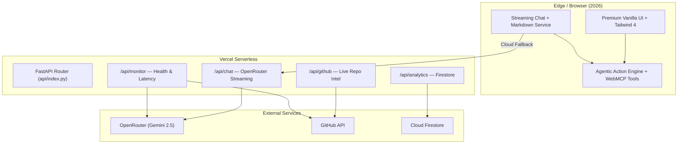

# 🚀 Mangesh Raut | Agentic Full-Stack Engineering Platform (2026)

**Production-grade AI-first portfolio** powering [mangeshraut.pro](https://mangeshraut.pro) — a hybrid agentic web application featuring deterministic client-side tool calling, streaming cloud intelligence, and enterprise-grade quality gates.

<p align="center">
  <a href="https://mangeshraut.pro"></a>
  <a href="https://mangeshraut.pro/monitor"></a>
  <a href="https://mangeshraut712.github.io/mangeshrautarchive"></a>
  <a href="https://github.com/mangeshraut712/mangeshrautarchive/actions"></a>
  <a href="LICENSE"></a>
</p>

<p align="center">
  <a href="#-table-of-contents"><strong>📑 Jump to Table of Contents</strong></a> •
  <a href="https://mangeshraut.pro">🌐 Try the Live Site</a> •
  <a href="#-live-demo-links">🚀 Explore Live Demos</a>
</p>

---

## 📑 Table of Contents

- [🌟 Highlights & Real Results (2026)](#-highlights--real-results-2026)
- [🚀 Live Demo Links](#-live-demo-links)
- [🕹️ Interactive Sandbox](#-interactive-sandbox)
- [🛠️ 2026 Production Tech Stack](#-2026-production-tech-stack)
- [🧠 Agentic Capabilities — 9 Registered WebMCP Tools](#-agentic-capabilities--9-registered-webmcp-tools)
- [📐 Architecture (Hybrid Agentic)](#-architecture-hybrid-agentic)
- [🧪 Testing & Quality Matrix](#-testing--quality-matrix)
- [🌍 Deployment & Availability](#-deployment--availability)
- [⚡ Quick Start](#-quick-start)
- [📊 Observability & Monitoring](#-observability--monitoring)
- [📁 Project Structure Overview](#-project-structure-overview)
- [📄 License & Contact](#-license--contact)
- [⬆️ Back to Top](#-back-to-top)

---

## 🌟 Highlights & Real Results (2026)

This is not a static resume — it is a **live production agentic platform** that demonstrates the shift from chatbots to systems that can **act**.

**Key 2026 Differentiators**
- **Native Agentic Tool Calling (WebMCP)**: 9 deterministic client-side tools registered via the emerging `navigator.modelContext.registerTool` API. AI agents can directly navigate, download files, filter projects, toggle themes, open contact flows, and more — all instantly in the browser.
- **Hybrid Intelligence**: Local-first agentic actions (zero latency, private) + streaming cloud LLM via **OpenRouter (Gemini 2.5 Flash / Pro)** with structured tool-use.
- **Premium Apple-Inspired UX**: Spatial project cards, glassmorphism, micro-animations, real-time “ACTION EXECUTED” visual feedback, and instant streaming Markdown chat.
- **Live GitHub Intelligence**: Dual-layer project showcase with release metadata, commits-since-release, language breakdowns, and interactive spatial repository views. Works flawlessly even on static GitHub Pages via absolute domain fallbacks.
- **Real-Time Telemetry**: Visitor reach counter powered by **Cloud Firestore** + **Vercel Analytics** cross-validation.
- **Full Operational Transparency**: Live `/monitor` dashboard with endpoint latencies, third-party health checks, and deployment surface status.
- **Enterprise-Grade Quality Gates**:
  - Playwright 1.58 matrix across **12+ configurations** (Desktop Chrome/Safari/Firefox/Edge + Pixel 7 + iPhone 14 + iPad Pro + responsive viewports)
  - Accessibility (axe-core) + manual contrast validation
  - Lighthouse CI (Desktop ≥95, Mobile ≥90)
  - Visual regression, security scanning, dead-code detection (Ruff + Vulture), and post-deploy verification on both hosting surfaces

**Proven Results**
- 40% React dashboard latency reduction delivered in production at Customized Energy Solutions
- Lighthouse scores consistently gated above 90+ on mobile and 95+ on desktop
- Zero-downtime dual-surface deployment (Vercel primary + GitHub Pages static fallback with secure API proxying)

---

## 🚀 Live Demo Links

Try the production features directly:

| Feature                        | Live URL                                      | What to Try |
|--------------------------------|-----------------------------------------------|-------------|
| **Main Portfolio**             | [mangeshraut.pro](https://mangeshraut.pro)    | Agentic chat, spatial projects, travel atlas |
| **System Monitor Dashboard**   | [mangeshraut.pro/monitor](https://mangeshraut.pro/monitor) | Latency probes, service health, deployment status |
| **Travel Atlas**               | [mangeshraut.pro/travel](https://mangeshraut.pro/travel) (or click Travel in nav) | Interactive world map, photo memories, location search |
| **GitHub Pages Fallback**      | [mangeshraut712.github.io/mangeshrautarchive](https://mangeshraut712.github.io/mangeshrautarchive) | See absolute domain fallbacks in action |
| **AssistMe AI Chat**           | Open on homepage → click the chat icon        | Try agentic commands: “download resume”, “go to projects”, “toggle dark mode” |
| **API Health**                 | [mangeshraut.pro/api/health](https://mangeshraut.pro/api/health) | JSON health + service status |
| **Real-Time Reach Counter**    | [mangeshraut.pro/api/analytics/reach](https://mangeshraut.pro/api/analytics/reach) | Live visitor + GitHub stars/forks metric |

---

## 🕹️ Interactive Sandbox

### 💬 AssistMe AI — Agentic Chat (2026 Edition)

Select a prompt to see realistic agentic behavior (these work identically on the live site):

<details>
<summary><b>❓ "Who is Mangesh Raut?"</b></summary>
<br>
<blockquote>
<b>AssistMe</b> <sup>[gemini-2.5-flash]</sup><br><br>
Mangesh Raut is an AI-first Software Engineer based in Philadelphia, PA. He holds an M.S. in Computer Science from Drexel University (GPA 3.76) and has 6+ years building production systems in Java, Python, Spring Boot, AWS, and ML pipelines.<br><br>
Currently at <b>Customized Energy Solutions</b>, he has delivered 40% React dashboard latency improvements and leads cloud-native data platform initiatives.<br><br>
Would you like me to show his most impactful projects, technical writing, or schedule a meeting?
</blockquote>
</details>

<details>
<summary><b>🤖 "Download his resume and navigate to projects"</b></summary>
<br>
<blockquote>
<b>AssistMe</b> <sup>[agentic-action]</sup><br><br>
✅ Executing agentic actions:<br>
📥 Downloading <b>Mangesh_Raut_Resume.pdf</b><br>
🧭 Navigating to <b>Projects</b> section<br><br>
Both actions were performed locally via registered WebMCP tools — no page reload required.
</blockquote>
</details>

<details>
<summary><b>🧠 "What makes this portfolio agentic in 2026?"</b></summary>
<br>
<blockquote>
<b>AssistMe</b> <sup>[gemini-2.5-pro]</sup><br><br>
This platform demonstrates the shift from conversational AI to <b>agentic systems</b> that can act:<br><br>
• <b>WebMCP Tool Registry</b>: 9 deterministic client-side tools exposed to AI agents via the native browser API.<br>
• <b>Hybrid Execution</b>: Local actions run instantly; complex reasoning falls back to Gemini 2.5 via OpenRouter.<br>
• <b>Streaming + Structured Feedback</b>: Real-time Markdown streaming with visual "action executed" micro-interactions.<br>
• <b>Production Guardrails</b>: Full E2E matrix, accessibility, performance budgets, and security scanning in CI.<br><br>
This is the architecture pattern for 2026+ agentic web applications.
</blockquote>
</details>

---

### 📡 System Monitor — Live API Examples

```bash
# Health & service status
curl -i https://mangeshraut.pro/api/health

# Real-time visitor reach (Firestore + GitHub)
curl -i https://mangeshraut.pro/api/analytics/reach

# GitHub project intelligence (release-aware)
curl -i https://mangeshraut.pro/api/github/repos/public
```

---

## 🛠️ 2026 Production Tech Stack

| Layer                  | Technology                                                                 | Role |
|------------------------|----------------------------------------------------------------------------|------|
| **Frontend Core**      | Vanilla ES2024 + Tailwind CSS 4 + Custom Design System                     | Zero-framework, high-performance, Apple-grade UI |
| **Agentic Runtime**    | WebMCP (`navigator.modelContext`), Custom Agentic Action Engine            | Deterministic client-side tool calling for AI agents |
| **AI Orchestration**   | OpenRouter + Gemini 2.5 Flash/Pro + Streaming + Markdown Service           | Cloud reasoning with structured tool-use patterns |
| **Backend**            | FastAPI 0.136 + Pydantic v2 + Uvicorn + HTTPX                              | Serverless Python API on Vercel (chat, analytics, GitHub, monitor) |
| **Telemetry**          | Cloud Firestore + Vercel Analytics                                         | Real-time reach counter + production analytics |
| **Project Intelligence**| GitHub REST API + Release Metadata + Spatial Views                        | Live cards with freshness signals and repo structure |
| **Build & Tooling**    | esbuild + Sharp + Tailwind CLI 4 + Node 22                                 | Blazing-fast builds, image optimization, zero-config DX |
| **Quality & Testing**  | Playwright 1.58 (12+ projects) + Vitest 4 + axe-core + Lighthouse CI       | Cross-browser, mobile, a11y, visual, post-deploy, performance gates |
| **Linting & Safety**   | ESLint 9 + Stylelint + Ruff + Vulture + Security Scanner                   | Dead-code elimination, style consistency, secret detection |
| **Hosting**            | Vercel (Primary) + GitHub Pages (Static Fallback) + PWA + Service Worker   | Maximum availability and offline capability |

---

## 🧠 Agentic Capabilities — 9 Registered WebMCP Tools

The platform registers the following deterministic tools that any compatible AI agent (via `navigator.modelContext`) can invoke directly:

| Tool                    | Description |
|-------------------------|-------------|
| `navigate_to_section`   | Smooth-scroll to any major section (home, about, skills, projects, contact, experience, education, publications, awards, certifications, blog, game, travel) |
| `download_resume`       | Instantly download the latest resume PDF |
| `schedule_meeting`      | Open Calendly scheduling popup |
| `open_contact_form`     | Open the contact / message overlay |
| `copy_contact_info`     | Copy email or LinkedIn to clipboard |
| `search_portfolio`      | Trigger global search with a query |
| `filter_projects`       | Filter the GitHub projects showcase by language or topic |
| `open_social_media`     | Open GitHub, LinkedIn, or other profiles |
| `toggle_theme`          | Switch between light / dark / system theme |

These tools run **entirely in the browser** with zero network round-trip when triggered by local agentic logic or by future WebMCP-compatible AI agents.

---

## 📐 Architecture (Hybrid Agentic)



**Key 2026 Design Principles**
- Local-first agentic actions for instant, private, zero-latency interactions
- Cloud LLM only when reasoning depth is required
- Static assets + serverless API for global low-latency delivery
- Comprehensive observability and automated quality enforcement

---

## 🧪 Testing & Quality Matrix

Every commit must pass the full pipeline before deployment:

**Automated Checks**
- Security scanning (`scripts/deployment/security-check.js`)
- Linting: ESLint 9, Stylelint, Ruff + Vulture dead-code detection
- Unit tests: Vitest 4
- E2E: Playwright 1.58 across **12+ browser/device configurations**

**Full Playwright Matrix Includes**
- Desktop: Chrome (with channel), Safari, Firefox, Edge
- Mobile: Pixel 7 Chrome, Pixel 7 Pro, Samsung Galaxy S23, iPhone 14 Safari, iPhone 14 Pro Max
- Tablet: iPad Pro Safari
- Responsive viewports: Mobile Small, Tablet, Desktop Large
- Accessibility: axe-core scans on Chrome & Safari
- Visual regression: Controlled viewport snapshots
- Post-deploy: Smoke + routing verification on Vercel + GitHub Pages

**Performance Budgets (Lighthouse CI)**
- Desktop: Performance ≥95, Accessibility ≥90, Best Practices ≥90, SEO ≥90
- Mobile: Performance ≥90, Accessibility ≥90, Best Practices ≥90, SEO ≥90

**Additional Gates**
- Visual regression with Playwright
- Pre-commit hooks (security + lint)
- `npm run qa:prod-ready` one-command full validation

---

## 🌍 Deployment & Availability

**Dual-Surface Architecture**
- **Primary**: Vercel (edge CDN + serverless FastAPI functions)
- **Static Fallback**: GitHub Pages — serves the same `dist/` build with API calls securely proxied back to `https://mangeshraut.pro/api`

**PWA & Offline**
- Full Progressive Web App with service worker
- Offline caching for core assets and chat interface
- Installable on mobile/desktop
- Fast subsequent loads via aggressive immutable caching headers

**Zero-Downtime Updates**
- Atomic deploys on Vercel
- GitHub Pages syncs automatically after successful production build
- Post-deploy E2E verification runs on both surfaces

---

## ⚡ Quick Start

### Prerequisites
- Node.js ≥ 22
- Python ≥ 3.12
- Google Cloud project with Firestore (Native mode) — optional for local telemetry

### Setup

```bash
git clone https://github.com/mangeshraut712/mangeshrautarchive.git
cd mangeshrautarchive

npm install --no-audit --no-fund

python3 -m venv venv
source venv/bin/activate
pip install -r requirements.txt

cp .env.example .env   # Add OPENROUTER_API_KEY + optional Firestore keys
npm run dev
```

**Local Endpoints**
- Frontend: http://127.0.0.1:4000
- FastAPI: http://127.0.0.1:8001
- OpenAPI Docs: http://127.0.0.1:8001/docs

### Essential Commands

| Command                        | Purpose |
|--------------------------------|---------|
| `npm run dev`                  | Concurrent frontend + FastAPI dev servers with hot reload |
| `npm run build`                | Production build to `dist/` (esbuild + Sharp image optimization) |
| `npm run qa:prod-ready`        | Full pre-flight (security + lint + test + full E2E matrix + Lighthouse) |
| `npm run test:e2e:all`         | Run complete Playwright matrix (all browsers + devices) |
| `npm run qa:lighthouse:mobile` | Mobile performance + accessibility gate |
| `npm run qa:lighthouse:desktop`| Desktop performance gate |
| `npm run lint:dead-code`       | Ruff + Vulture analysis |
| `npm run test`                 | Vitest unit tests |
| `npm run format`               | Prettier formatting |

---

## 📊 Observability & Monitoring

- **Live Dashboard**: https://mangeshraut.pro/monitor — real-time latency, third-party provider health, and deployment surface status
- **Custom Telemetry**: Firestore-backed visitor reach counter (incremental, no fake numbers)
- **Vercel Analytics**: Automatic web vitals and page views
- **API Health Endpoint**: `/api/health` returns status of Firestore, OpenRouter, Last.fm, and GitHub connectivity
- **Structured Logging**: All routes emit consistent JSON logs for easy debugging

---

## 📁 Project Structure Overview

```
mangeshrautarchive/
├── api/                    # FastAPI backend (routes, monitoring, integrations)
│   ├── routes/             # chat, analytics, github, monitor, media, etc.
│   └── index.py            # Main ASGI app
├── src/                    # Frontend source
│   ├── index.html          # Main portfolio
│   ├── monitor.html        # Operations dashboard
│   ├── travel.html         # Travel atlas experience
│   ├── js/                 # Vanilla ES modules (chat, agentic actions, projects, etc.)
│   └── assets/             # CSS, images, manifest, service-worker
├── scripts/                # Build, deployment, QA, security, and optimization tooling
├── tests/e2e/              # Playwright test suites (smoke, accessibility, post-deploy, chatbot actions)
├── .github/workflows/      # CI/CD (deploy + quality gates)
└── package.json / requirements.txt
```

---

## 📄 License & Contact

MIT License — see [LICENSE](LICENSE).

**Mangesh Raut**
- **Live Site**: [mangeshraut.pro](https://mangeshraut.pro)
- **LinkedIn**: [linkedin.com/in/mangeshraut71298](https://linkedin.com/in/mangeshraut71298)
- **GitHub**: [github.com/mangeshraut712](https://github.com/mangeshraut712)
- **Email**: mbr63@drexel.edu

---

## ⬆️ Back to Top

<p align="center">
  <a href="#-mangesh-raut--agentic-full-stack-engineering-platform-2026"><strong>⬆️ Back to Top</strong></a>
</p>

<p align="center">
  <sub>Built with ❤️ in 2026 — Agentic Web, done right.</sub>
</p>
