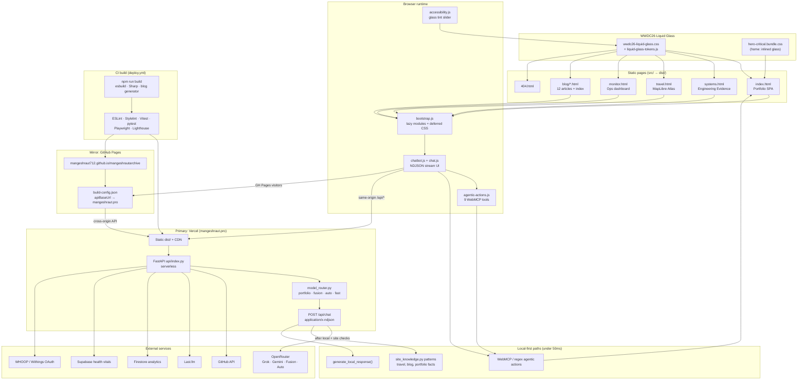
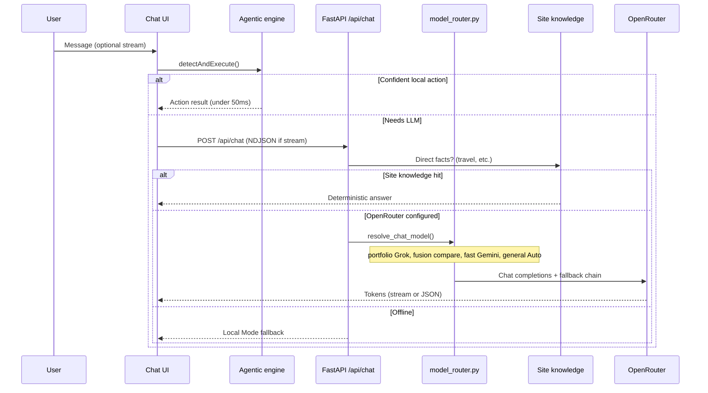

# Mangesh Raut — Agentic Full-Stack Portfolio

<p align="center">
  <a href="https://mangeshraut.pro">
    
    
  </a>
</p>
<p align="center"><sub>Homepage · Light mode (left) · Dark mode (right)</sub></p>

<p align="center">
  <a href="https://mangeshraut.pro">
    
  </a>
  <a href="https://mangeshraut712.github.io/mangeshrautarchive/">
    
  </a>
  <a href="https://github.com/mangeshraut712/mangeshrautarchive/actions/workflows/deploy.yml">
    
  </a>
  <a href="https://github.com/mangeshraut712/mangeshrautarchive/stargazers">
    
  </a>
  <a href="LICENSE">
    
  </a>
  <a href="https://nodejs.org/">
    
  </a>
  <a href="https://mangeshraut.pro/monitor">
    
  </a>
</p>

<p align="center">
  <strong>Production-grade AI-first portfolio with deterministic client-side tool calling</strong><br>
  <sub>AssistMe · WebMCP · WWDC26 Liquid Glass · Hybrid Intelligence · 12+ Device Testing Matrix</sub>
</p>

<p align="center">
  <a href="https://mangeshraut.pro"><strong>🌐 Open Live Experience</strong></a>
  &nbsp;&nbsp;•&nbsp;&nbsp;
  <a href="https://mangeshraut712.github.io/mangeshrautarchive/"><strong>📄 GitHub Pages</strong></a>
  &nbsp;&nbsp;•&nbsp;&nbsp;
  <a href="https://mangeshraut.pro/monitor"><strong>📊 Live Operations Dashboard</strong></a>
  &nbsp;&nbsp;•&nbsp;&nbsp;
  <a href="#-engineering-deep-dives"><strong>🔧 See How It Was Built</strong></a>
</p>

---

## ✨ What Makes This Different

This isn't a static portfolio — it's a **production agentic system** you can interact with.

**Core Innovation**: **AssistMe**, an AI assistant that doesn't just chat — it **acts**. Navigate sections, download resumes, schedule meetings, filter projects, toggle themes — all executed instantly in-browser via 9 deterministic WebMCP tools. No page reloads, zero network latency for local actions.

**Built as a reference implementation** — every subsystem engineered to production standards:

- **AssistMe AI Chat** — streaming Markdown, Siri-style voice dictation, writing tools, and contextual follow-up chips
- **12 Technical Writings** — deep-dive blogs covering AI Code Editors, WWDC 2026/Apple Intelligence, NotebookLM 2026, WebMCP tool design, and agentic workflows
- **Card Listen + Translate** — compact 16-language read-aloud and translation toolbars on narrative cards (About, Experience, Awards, Blog, Travel)
- **Project Showcase Lenses** — All · Active · Busy with live counts, plus a native Apple-style sort menu and neutral GitHub CTA
- **Currently Shelf** — Apple-style segmented tabs plus compact media cards for Shows, Music, and Books
- **Publication Preview** — two-column paper card with inline PDF preview panel and Apple-style Read paper CTA
- **9 WebMCP Tools** registered with `navigator.modelContext` for native AI agent compatibility
- **Hybrid Execution** — local actions (&lt;50ms) + OpenRouter streaming LLM
- **WWDC26 Liquid Glass Design System** — clear/tinted glass slider, solid theme card surfaces, specular highlights, and reduced-motion fallbacks
- **Health Vitals Widget** — live WHOOP recovery/strain and Withings body composition synced via Supabase
- **Apple Share Sheet** — QR codes, social mirrors, and profile sharing from the accessibility toolbar
- **Multi-Tier Resilience** — 4-layer fallback chain works on Vercel _and_ static GitHub Pages
- **Extreme Testing** — 12+ real browser/device configs (Chrome, Safari, Firefox, Edge, Pixel 7, iPhone 14, iPad Pro)
- **Zero-Downtime Deploys** — dual-surface (Vercel + GitHub Pages) with automated post-deploy verification
- **Modern Build Pipeline** — esbuild v0.28.0 + Sharp v0.34.5 + Tailwind CSS v4.0.9 CLI for rapid CSS compilation and image optimization

**Study it. Fork it. Build on it.**

---

## 📑 Table of Contents

- [🚀 Live Demos](#-live-demos)
- [🔧 Engineering Deep Dives](#-engineering-deep-dives)
- [🧠 Agentic AI Capabilities](#-agentic-ai-capabilities)
- [🎨 Premium User Experience](#-premium-user-experience)
- [🛠 Tech Stack](#-tech-stack)
- [🏗 Architecture](#-architecture)
- [🧪 Quality & Testing](#-quality--testing)
- [⚡ Quick Start](#-quick-start)
- [📁 Project Structure](#-project-structure)
- [🔌 Key API Endpoints](#-key-api-endpoints)
- [📅 Recent Updates](#-recent-updates)
- [💖 Support & Sponsorship](#-support--sponsorship)
- [🗺 Roadmap](#-roadmap)
- [🤝 Contributing](#-contributing)
- [📄 License](#-license)
- [📬 Contact](#-contact)

---

## 🚀 Live Demos

| Experience           | Link                                                                                                | Highlights                                                                  |
| -------------------- | --------------------------------------------------------------------------------------------------- | --------------------------------------------------------------------------- |
| Main Portfolio       | [mangeshraut.pro](https://mangeshraut.pro)                                                          | AssistMe chat, liquid glass UI, spatial projects                            |
| GitHub Pages         | [mangeshraut712.github.io/mangeshrautarchive](https://mangeshraut712.github.io/mangeshrautarchive/) | Full functionality via static hosting with API fallbacks                    |
| System Monitor       | [mangeshraut.pro/monitor](https://mangeshraut.pro/monitor)                                          | Real-time latency, service health, deploy status                            |
| Travel Atlas         | [mangeshraut.pro/travel](https://mangeshraut.pro/travel)                                            | MapLibre-powered visited places with narrative AI                           |
| Engineering Evidence | [mangeshraut.pro/systems](https://mangeshraut.pro/systems)                                          | CI-verified metrics, architecture diagrams, live `/api/monitor/engineering` |
| AI Assistant         | Open chat on any page                                                                               | Try: _"download resume"_, _"go to projects"_, _"schedule a meeting"_        |

> **Pro tip**: The agentic engine runs locally first. Many commands execute with zero network round-trip.

---

## 🔧 Engineering Deep Dives

How the key systems actually work — implementation details, not buzzwords.

### 1. AssistMe Agentic Action Engine

**What was built**: A complete deterministic agentic runtime that turns the chat from a passive Q&A box into an active system that performs real UI actions.

**How it works**:

- Two parallel detection systems run on every user message.
- **Primary path** (`chat.js`): `agenticActions.detectAndExecute()` is called **before** any LLM request. If a confident match is found, the action executes locally and the LLM is skipped entirely.
- **Secondary path**: Full WebMCP tool registration in `agentic-actions.js` using `navigator.modelContext.registerTool()` with proper JSON Schema input definitions — discoverable by future native AI agents.
- Every action has rich visual feedback (pulsing "ACTION EXECUTED" badges, glassmorphic toasts).
- History tracking, abort controllers for cleanup, and graceful degradation when WebMCP is unavailable.

**Result**: Sub-50ms execution for common commands like "download resume" or "go to projects" with full privacy.

### 2. WWDC26 Liquid Glass Design System

**What was built**: A unified translucent UI layer inspired by Apple's 2026 design language, applied sitewide with accessibility-safe fallbacks.

**How it works**:

- `wwdc26-liquid-glass.css` and `liquid-glass-tokens.js` centralize blur, tint (`--lg-tint`), specular edges, and spring motion tokens sitewide.
- Surfaces: Dynamic Island nav, project/blog/monitor cards, travel sidebar, 404 panel, contact/currently cards — all use `backdrop-filter` with `prefers-reduced-transparency` solid fallbacks.
- Home production build **inlines** glass CSS into `hero-critical.bundle.css`; satellite pages load `wwdc26-liquid-glass.css` directly.
- Theme-aware sync via `bootstrap.js` + accessibility toolbar glass tint slider (`localStorage`: `wwdc26-liquid-glass-tint`).

### 3. GitHub Projects Intelligence System

**What was built**: A live, release-aware project showcase that never breaks — even on static GitHub Pages hosting.

**How it works**:

- Four-tier fallback chain in `github-projects.js`:
  1. Local backend proxy (`/api/github/repos/public`)
  2. Production absolute domain fallbacks (`https://mangeshraut.pro/api/…`)
  3. Vercel preview domains
  4. Direct GitHub API (with client-side caching)
- Featured projects have **override logic** — they bypass normal filters and are never dropped.
- Enriched offline `fallbackRepos` contains complete metadata for all featured projects.
- Spatial "XR" modal view for repository structure exploration.

### 4. Travel Atlas — Apple Maps-Inspired Experience

**What was built**: A fully interactive visited-places atlas using MapLibre GL.

**How it works**:

- Custom `travel-engine.js` transforms raw location data into rich narrative objects (stories, categories, photo references).
- Advanced client-side search + multi-category filtering + "featured only" mode.
- Auto-tour mode that cycles through locations with smooth camera flights.
- Strict design constraint: only red pins for places actually visited (no aspirational pins).
- Theme-aware liquid glass styling and full keyboard + screen-reader accessibility.

### 5. Production-Grade Monitoring Dashboard

**What was built**: A real `/monitor` page exposing live system health — publicly.

**How it works**:

- `api/monitoring.py` and `api/routes/monitor.py` implement async health probes using `httpx` + optional `psutil`.
- Measures latency to OpenRouter, GitHub, Firestore, Last.fm, and connected integrations on every request.
- Structured event logging with severity levels and a recent event ring buffer.
- OAuth connect flows for WHOOP, Withings, and Google Calendar with signed state and admin-gated sync.
- Used both for personal observability and as a public transparency feature.

### 6. Health Vitals Sync (WHOOP + Withings)

**What was built**: A privacy-aware health widget on the homepage backed by Supabase daily snapshots.

**How it works**:

- `api/integrations/whoop.py` and `withings.py` normalize recovery, strain, weight, muscle, and body-fat metrics.
- `sync_engine.py` merges provider data with correct measure-type mapping (e.g. Withings type 6 for fat ratio).
- The homepage widget renders live cards with graceful offline fallbacks when integrations are disconnected.

### 7. Apple Sound System (Procedural Web Audio)

**What was built**: A fully synthesized, file-free Apple-inspired sound engine.

**How it works**:

- `apple-sounds.js` creates all sounds procedurally using the Web Audio API — no external `.mp3` files.
- Sounds modeled on macOS/iOS audio design: a "plink" for theme toggle, iOS tri-tone for chatbot open, C-major arpeggio for success, and a Happy Birthday melody for the birthday overlay.
- Singleton design with `localStorage` persistence for user preference and autoplay-policy-safe interaction guard.

### 8. Custom esbuild Build Pipeline

**What was built**: A purpose-built, zero-config-heavy build system.

**How it works**:

- `scripts/build/build.js` uses esbuild directly for JS transformation.
- Intelligent `dist` directory selection — falls back to `/tmp/mangeshrautarchive-dist` when running inside macOS-protected folders to avoid `EPERM` errors.
- Safe public configuration injection only (`build-config.json` + `build-config.js`) — **zero secrets** ever reach the browser.
- Integrated Sharp image optimization pass.
- Static extras (CNAME, manifest, PWA icons/splash) preserved with correct cache headers; stale service workers are purged on load for fresh deploys.

### 9. Extreme Testing Matrix + Post-Deploy Verification

**What was built**: One of the most thorough personal project test setups on GitHub.

**How it works**:

- `playwright.config.js` defines 12+ named projects including specific browser channels (Chrome, msedge) and real mobile devices.
- Separate suites for smoke, accessibility (axe-core), visual regression, and post-deploy.
- Post-deploy tests run against **both** Vercel and GitHub Pages surfaces after every production release.
- Lighthouse CI gates in `deploy.yml` plus nightly production monitoring against live Vercel and GitHub Pages URLs.
- CI uses `npm install` with lockfile cache and system Google Chrome (no bundled Playwright browser download in workflows).
- One-command `npm run qa:prod-ready` runs the full security + lint + unit + E2E + Lighthouse pipeline.

---

## 🧠 Agentic AI Capabilities

9 deterministic tools registered and executable today:

| Tool                  | What It Does                                   |
| --------------------- | ---------------------------------------------- |
| `navigate_to_section` | Instant smooth scroll to any portfolio section |
| `download_resume`     | Direct PDF download                            |
| `schedule_meeting`    | Open Calendly popup                            |
| `open_contact_form`   | Focus and open contact overlay                 |
| `copy_contact_info`   | Copy email / LinkedIn                          |
| `search_portfolio`    | Trigger global search                          |
| `filter_projects`     | Filter the live GitHub showcase                |
| `open_social_media`   | Open GitHub / LinkedIn / X                     |
| `toggle_theme`        | Switch light / dark / system                   |

All tools are functional via natural language in AssistMe **and** exposed via WebMCP for future agent ecosystems.

---

## 🎨 Premium User Experience

- **Zero heavy framework** — pure ES modules + Tailwind CSS 4 + WWDC26 liquid glass design system (no React/Vue/Svelte in production)
- **AssistMe overlay** — streaming Markdown, voice dictation, writing tools, and on-screen context chips
- **Procedural sound engine** — synthesized Web Audio API sounds (theme toggle, chat open, birthday)
- **Glassmorphism & micro-interactions** — spatial cards, buttery transitions, real-time action toasts
- **Accessibility toolbar** — font scaling, contrast modes, reduced motion, keyboard navigation, and Apple-style share sheet
- **Health vitals cards** — WHOOP recovery/strain and Withings body composition on the homepage
- **Birthday celebration system** — Canvas physics (confetti + balloons), aurora gradient overlay, and Apple Happy Birthday melody
- **Last.fm Now Playing** — real-time track updates with spinning album art and animated equalizer bars
- **Progressive Web App** — installable (manifest, splash, mask icon); network-first with stale SW/cache cleanup on load
- **Real-time visitor counter** via Firestore + Vercel Analytics (no fake numbers)
- **Consistent Apple-inspired design** — unified border styling, theme awareness, fluid typography across all sections

---

## 🛠 Tech Stack

| Layer               | Technologies                                                                                                         |
| ------------------- | -------------------------------------------------------------------------------------------------------------------- |
| **Frontend**        | Vanilla ES2024, Tailwind CSS v4.0.9, WWDC26 Liquid Glass Design System                                               |
| **Agentic Runtime** | AssistMe + WebMCP + Custom Action Handler with priority execution                                                    |
| **AI**              | OpenRouter Fusion / Auto / Grok-first routing (`model_router.py`) + NDJSON streaming + site-knowledge fallback       |
| **Backend**         | FastAPI v0.136.1 + Pydantic v2 (v2.13.4) (Vercel Serverless)                                                         |
| **Data**            | Cloud Firestore, Supabase (health vitals), GitHub REST, Last.fm, Upstash Redis (optional)                            |
| **Build**           | esbuild v0.28.0 + Sharp v0.34.5 + custom Node pipeline                                                               |
| **Analytics**       | @vercel/analytics v2.0.1                                                                                             |
| **Testing**         | Playwright v1.58.2 (12+ configs), Vitest v4.1.6, @axe-core/playwright v4.11.1, Lighthouse CI                         |
| **Quality**         | ESLint v9.21.0, Stylelint v16.26.1 (config-standard v36.0.1), Prettier v3.8.1, React Doctor v0.5.1, Security Scanner |
| **Hosting**         | Vercel (primary) + GitHub Pages (resilient static fallback)                                                          |
| **Runtime**         | Node.js v22.x, Python v3.12 (uvicorn v0.47.0, httpx v0.28.1, aiofiles v25.1.0)                                       |

---

## 🏗 Architecture

High-level view of pages, build output, dual hosting, and how AssistMe reaches OpenRouter only when local/site knowledge cannot answer.



### AssistMe chat request flow



**Guiding principles**

- **Local-first** — agentic tools and site knowledge before any LLM call
- **Liquid glass everywhere** — shared `wwdc26` tokens on home (bundled), travel, monitor, systems, blog, and 404; default **clear** tint with slider in the a11y toolbar
- **Dual surface** — Vercel serves API + static; GitHub Pages serves static with `apiBaseUrl` pointing at production
- **Resilient routing** — Grok-first with Gemini / Auto fallbacks when a model is unavailable
- **Quality gate** — every `main` push runs the full CI matrix before deploy

---

## 🧪 Quality & Testing

| Gate                   | Threshold / Coverage                                                                     |
| ---------------------- | ---------------------------------------------------------------------------------------- |
| **Playwright**         | 12+ real projects (Desktop Chrome/Safari/Firefox/Edge + Pixel 7 + iPhone 14 + iPad Pro)  |
| **Accessibility**      | @axe-core/playwright — zero critical/serious violations on homepage                      |
| **Lighthouse Desktop** | Performance ≥80, Accessibility ≥90, Best Practices ≥90, SEO ≥90 (dist gate)              |
| **Lighthouse Mobile**  | Performance ≥60, Accessibility ≥90, Best Practices ≥90, SEO ≥90 (dist gate)              |
| **Lighthouse latest**  | Local dist gate: **100/100** mobile + desktop (Performance, A11y, Best Practices, SEO)   |
| **React Doctor**       | Informational static graph audit via `npm run doctor:full` (tracked in CI, non-blocking) |
| **Post-deploy**        | Smoke + a11y on Vercel **and** GitHub Pages                                              |
| **Nightly monitoring** | Production reachability + Lighthouse on Vercel + cross-surface commit parity             |
| **Pre-commit**         | Security scan + ESLint                                                                   |

**Key commands**

| Command                                                              | Purpose                                                               |
| -------------------------------------------------------------------- | --------------------------------------------------------------------- |
| `npm run check`                                                      | ESLint + Stylelint + Vitest + Python API tests                        |
| `npm run qa:prod-ready`                                              | Full security + lint + test + E2E + Lighthouse pipeline               |
| `npm run qa:smoke`                                                   | Chrome smoke tests against dev server                                 |
| `npm run qa:a11y`                                                    | axe-core accessibility baseline                                       |
| `npm run qa:lighthouse:desktop`                                      | Desktop Lighthouse gate                                               |
| `npm run qa:lighthouse:mobile`                                       | Mobile Lighthouse gate                                                |
| `npm run test:e2e:all`                                               | Complete multi-device Playwright matrix                               |
| `npm run verify:env-parity`                                          | Compare local `.env` keys against Vercel production                   |
| `npm run verify:deploy-sync:remote`                                  | Confirm GitHub Pages and Vercel share the same build commit           |
| `npm run qa:cross-browser`                                           | Chrome + Safari + Firefox + Pixel 7 + iPhone 14 matrix (local server) |
| `npm run qa:vercel:chrome` / `qa:vercel:safari` / `qa:vercel:mobile` | Smoke against live Vercel production                                  |
| `npm run qa:github:chrome` / `qa:github:safari`                      | Smoke against live GitHub Pages mirror                                |
| `node scripts/qa/cross-viewport-chrome.mjs`                          | Desktop / tablet / mobile Chrome audit with screenshots               |

**Local Playwright note:** E2E and Lighthouse scripts prefer system Chrome when available (`CHROME_PATH` override supported). Set `PLAYWRIGHT_BASE_URL=http://127.0.0.1:4000` when reusing an already-running dev server.

---

## ⚡ Quick Start

**Requirements:** Node.js 22.x, Python 3.12+ (for the API), optional `uv` for faster pytest runs.

```bash
git clone https://github.com/mangeshraut712/mangeshrautarchive.git
cd mangeshrautarchive

npm install --no-audit --no-fund

python3 -m venv venv && source venv/bin/activate
pip install -r requirements.txt

cp .env.example .env          # Required: OPENROUTER_API_KEY
# Optional: cp .env.example .env.local  # WHOOP, Withings, Supabase, monitor tokens

npm run dev                   # Frontend :4000 + FastAPI :8001
```

| Service  | Local URL                  |
| -------- | -------------------------- |
| Frontend | http://127.0.0.1:4000      |
| FastAPI  | http://127.0.0.1:8001      |
| API docs | http://127.0.0.1:8001/docs |

Production preview after build:

```bash
npm run build
PORT=4174 npm run serve:dist
```

---

## 📁 Project Structure

```
mangeshrautarchive/
├── api/
│   ├── routes/             # chat, github, media, analytics, monitor, integrations
│   ├── model_router.py     # OpenRouter Fusion / Auto / portfolio / fast tiers
│   ├── site_knowledge.py   # Deterministic travel, blog, portfolio answers
│   ├── integrations/       # WHOOP, Withings, Supabase sync, OAuth token manager
│   └── config.py           # Runtime OpenRouter env + model constants
├── src/
│   ├── index.html          # Main portfolio experience
│   ├── systems.html        # Engineering Evidence notebook
│   ├── uses.html           # Now / tooling stack page
│   ├── monitor.html        # Public operations dashboard
│   ├── travel.html         # MapLibre travel atlas
│   ├── 404.html            # Liquid glass error page
│   ├── assets/css/         # wwdc26 liquid glass + section modules
│   ├── assets/images/      # Homepage light/dark screenshots, WebP assets, icons
│   └── js/
│       ├── core/           # Bootstrap, chat, config
│       ├── modules/        # Agentic engine, health widget, share sheet, Last.fm, …
│       ├── services/       # Analytics, Markdown, Streaming, Voice
│       └── utils/          # Theme, liquid-glass tokens, navbar, calendly
├── scripts/
│   ├── build/              # esbuild pipeline, blog page generator, image optimization
│   ├── deployment/         # Lighthouse gates, env parity, deploy sync
│   ├── integrations/       # OAuth helpers + Vercel env sync
│   ├── qa/                 # Liquid glass theme matrix + cross-viewport Chrome QA
│   └── utils/              # Dev servers, Playwright runner
├── tests/
│   ├── api/                # pytest suite (health vitals, monitor, integrations)
│   └── e2e/                # Playwright smoke, a11y, post-deploy, visual
├── config/                 # Python/Stylelint/Vulture config
├── deployment/             # Firebase rules and hosting config
└── .github/workflows/      # deploy.yml (CI + GitHub Pages) + post-deploy-monitoring.yml (nightly)
```

See also [`docs/ci-quality-gates-june-2026.md`](docs/ci-quality-gates-june-2026.md) for Lighthouse thresholds, React Doctor tracking, and workflow order.

### CI / CD (single pipeline, no duplicate workflows)

| Workflow                                                                     | Trigger                   | Purpose                                                                 |
| ---------------------------------------------------------------------------- | ------------------------- | ----------------------------------------------------------------------- |
| [`deploy.yml`](.github/workflows/deploy.yml)                                 | Push/PR to `main`, manual | Quality gates → build → GitHub Pages deploy → live surface verify       |
| [`post-deploy-monitoring.yml`](.github/workflows/post-deploy-monitoring.yml) | Daily 14:00 UTC, manual   | Production reachability, Lighthouse on Vercel, cross-surface sync audit |

**Quality gate order in `deploy.yml`:** security audit → ESLint → Stylelint → Vitest → React Doctor (informational) → Python lint/tests → Playwright smoke + axe → Lighthouse desktop/mobile → build → deploy → verify GitHub Pages commit.

**Dual hosting:** every `main` push rebuilds GitHub Pages in CI and triggers Vercel production via the repo integration. `verify-deployment-sync.js` compares `build-config.json` commit hashes across both surfaces.

---

## 🔌 Key API Endpoints

```bash
curl https://mangeshraut.pro/api/health
curl https://mangeshraut.pro/api/monitor/status
curl https://mangeshraut.pro/api/analytics/reach
curl https://mangeshraut.pro/api/github/repos/public
curl https://mangeshraut.pro/api/media/music          # Last.fm Now Playing
curl https://mangeshraut.pro/api/health-vitals/summary  # Sanitized WHOOP/Withings summary
```

Full OpenAPI spec available at `/docs` when running the backend locally.

---

## 📅 Recent Updates

### June 2026 (latest)

- **Solid white/black theme audit** — sitewide `#ffffff` / `#000000` surfaces via `theme-solid-surfaces.css`; grey translucent fills (`--fill`, frosted pills) removed from hero pronoun badge, vibe/reach pills, and skills categories; card hovers stay blue-border with neutral shadow (no glow).
- **Hero & buttons** — “Mangesh Raut” heading uses high-visibility blue gradient in light and dark mode; View Projects, Live Demo, and secondary CTAs use blue gradient shine with motion (no grey button backgrounds).
- **Skills polish** — tighter category spacing, solid category panels, progress-bar glow removed, badge hovers border-only.
- **Micro motion** — faster Framer-style scroll reveals (`microReveal` / `microScaleIn`) on headings, cards, hero chrome, about media, and engineering tiles; GPU-only transforms with reduced-motion fallbacks.
- **Engineering Evidence polish** — homepage hero restored to Software Developer / Engineer; four evidence Q&A cards outside the metrics overview; `/systems` tokenization card (AI tooling transparency); footer link strip removed; go-to-top and GitHub graph legend fixed in light mode; Liquid Glass defaults to clear.
- **CI recovery** — removed duplicate `systems.css` selectors that blocked Stylelint; GitHub Pages deploy sync restored for nightly monitoring.
- **Engineering Evidence (`/systems`)** — aligned with travel/monitor nav pattern; architecture tab pills no longer inherit global blue button styles; dual-host diagram edges fixed; hero/benchmark tiles use CI-verified Lighthouse budgets (95+ gate), WebMCP tool count, and live API status instead of fabricated scores.
- **Sitewide Liquid Glass** — `wwdc26` section 23/24: project cards, travel/monitor nav, blog articles, monitor `doc-card` tiles, 404 `lg-glass-card`, Apple spring hover/press on showcase cards.
- **AssistMe routing** — `model_router.py` with OpenRouter Fusion (compare), Auto (general), Grok-first portfolio tier, Gemini fast-path, and runtime fallback chain; NDJSON streaming on Vercel.
- **Cross-surface parity** — GitHub Pages `build-config.json` → `apiBaseUrl: mangeshraut.pro`; blog generator ships glass classes on index + article pages.
- **UX / a11y** — `Currently` in main nav; `aria-labelledby` on all sections; monitor `noscript` CSS version aligned with production bundle.
- **README** — expanded architecture diagrams (pages, build, dual host, chat sequence).

### June 2026 (mid-month)

- **Currently Shelf Redesign** — iOS segmented tabs, compact media cards, unified Apple-blue actions, full titles with line-clamp, and accessible `tablist`/`tabpanel` wiring.
- **Project Showcase Polish** — simplified lenses (All · Active · Busy), native Apple-style sort dropdown, neutral GitHub profile CTA, non-zero GitHub Operating View caption, and dynamic card reveal fix.
- **Publication Preview** — two-column layout with mini paper preview card on the right and gradient Read paper CTA.
- **Performance** — parallel hero analytics fetch, deferred card-a11y/Last.fm, hero badges stay visible outside scroll-hide targets.
- **CI / QA** — axe tablist fix for Currently section; Lighthouse CI gate at 95+ mobile + desktop; nightly monitoring uses cross-surface commit parity; React Doctor tracked in deploy workflow.

### June 2026 (earlier)

- **First-Visit & Return UX** — removed ephemeral toast experiment; blog remains cards-only grid with deep-link support via `#blog-read-<id>`.
- **Card Listen + Translate** — Site-wide narrative card toolbars with 16 languages, compact top-right placement, scrollable popover, TTS in translated locale, MyMemory + `/api/chat` AI fallback.
- **Release-Aware Project Lenses** — GitHub release/activity signals with live chip counts, later simplified to Active · Busy for clearer scanning.
- **Performance** — Card accessibility deferred until About is near viewport; GitHub contribution graph + Last.fm art lazy-loaded via `requestIdleCallback`.
- **Design & Assets** — WWDC26 liquid glass on vibe stack + portfolio reach panels; company/car logos; navbar aux links with tooltips.
- **Cross-Surface QA** — Mobile/tablet/desktop viewport audit; `qa:vercel:*` and `qa:github:*` smoke targets; deploy pipeline verifies GitHub Pages live commit after every release.
- **Analytics & Reach** — Portfolio Reach panel aligned with GA4 metrics; Vercel API env sync for analytics keys across environments.

---

## 💖 Support & Sponsorship

If you find this project useful or use it as a reference for your own agentic applications, you can support my work via:

- **Stripe**: [](https://buy.stripe.com/14A3cufGUgcV5ePfuA14401)
- **PayPal**: [](https://www.paypal.com/ncp/payment/LXNHJ5SUGNP82)

---

## 🗺 Roadmap

- Full WebNN + Gemma client-side inference
- Voice + vision agentic capabilities
- Public documentation of the WebMCP tool registry
- Extraction of reusable liquid glass components into open-source packages

---

## 🤝 Contributing

PRs and ideas are welcome. Please run `npm run check` at minimum; use `npm run qa:prod-ready` before submitting larger changes.

---

## 📄 License

MIT License — see [LICENSE](LICENSE).

---

## 📬 Contact

**Mangesh Raut**

- 🌐 [mangeshraut.pro](https://mangeshraut.pro)
- 💼 [LinkedIn](https://linkedin.com/in/mangeshraut71298)
- 🐙 [GitHub](https://github.com/mangeshraut712)
- ✉️ mbr63@drexel.edu

---

<p align="center">
  <strong>Built with ❤️ — A reference for production-grade agentic web engineering.</strong>
</p>

<p align="center">
  <a href="#mangesh-raut--agentic-full-stack-portfolio">⬆️ Back to Top</a>
</p>
