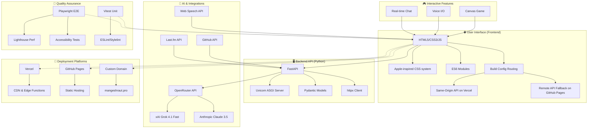

<div align="center">

# 🚀 Welcome to Mangesh Raut's AI-Powered Portfolio! 🤖

### _Experience the Future of Developer Portfolios with Intelligent AI Assistance_

[](https://mangeshraut.pro)
[](https://mangeshraut712.github.io/mangeshrautarchive/)
[](LICENSE)
[](https://github.com/mangeshraut712/mangeshrautarchive/actions)

**[🚀 Live Demo](https://mangeshraut.pro)** • **[✨ Features](#-key-features)** • **[🛠️ Tech Stack](#️-tech-stack)** • **[📚 Quick Start](#-quick-start)** • **[🏗️ Architecture](#️-architecture-overview)**

---

</div>

## 📖 Table of Contents

- [Architecture Overview](#️-architecture-overview)
- [About](#-about)
- [Key Features](#-key-features)
- [Live Demo](#-live-demo)
- [Tech Stack](#️-tech-stack)
- [Quick Start](#-quick-start)
- [Project Structure](#-project-structure)
- [Available Scripts](#-available-scripts)
- [Quality & Performance Gates](#-quality--performance-gates)
- [Contributing](#-contributing)
- [License](#-license)
- [Acknowledgments](#-acknowledgments)

---

## 🏗️ Architecture Overview



**Architecture Highlights:**

- **Frontend**: Modular ES6 architecture with deployment-aware API routing and Apple-style UI primitives
- **Backend**: Async Python API with typed responses, monitor endpoints, and resilient proxy/cache behavior
- **AI Layer**: OpenRouter-backed chat with local fallback behavior when remote AI is unavailable
- **Integrations**: GitHub, Last.fm, analytics, and deployment health surfaced through one backend
- **Deployment**: Vercel powers the live API while GitHub Pages consumes the same production backend
- **Testing**: Playwright smoke coverage plus lint/build gates for frontend, monitor, and navigation flows

---

## 🌟 About This Project

This is my **interactive portfolio application**, not a static résumé page. The site combines a Python API, a modular vanilla-JS frontend, live GitHub and Last.fm integrations, a deployment-aware System Monitor, and a polished Apple-inspired design system in one product-style experience.

At a high level, the portfolio is built to do four things well:

- **Show real work** through live GitHub data, structured project content, and compact detail views
- **Feel interactive** with AssistMe chat, voice features, the curated `Currently` shelf, and the Debug Runner mini-game
- **Stay observable** with backend metrics, provider health checks, deployment-surface probes, and post-deploy validation
- **Ship reliably** across Vercel, the custom domain, and GitHub Pages with environment-aware routing and CI gates

<div align="center">

### 💡 Project Highlights

|                  🧠 AI Assistant                   |      📺 Currently Card       |      📊 Live Data      |        🎨 Premium UI         |
| :------------------------------------------------: | :--------------------------: | :--------------------: | :--------------------------: |
| Real-time streaming chatbot with context awareness | Shows, Music, Books tracking | GitHub API integration | Apple-inspired glassmorphism |

</div>

### 🔄 Current Platform Snapshot

- **Deployment-aware monitor**: one System Monitor tracks backend health, provider APIs, deployment surfaces, and safe runtime env presence
- **Cross-host routing**: Vercel and the custom domain use same-origin `/api`, while GitHub Pages resolves the live API from `build-config.json`
- **Curated media shelf**: shows, movies, and books use local artwork; music stays live through Last.fm with artwork fallback logic
- **Resilient GitHub data**: backend proxy caching plus curated client fallback keeps projects usable during GitHub rate limits
- **Clean local workflows**: root cleanup, cache cleanup, build-time cache busting, and focused smoke coverage are in place

## ✨ Key Features

### 🧠 AssistMe — Your Intelligent AI Companion

<details>
<summary><b>🤖 Click to chat with AssistMe! (Real AI, not just a demo)</b></summary>

<br/>

Meet **AssistMe**, the star of the show! This isn't a fake chatbot—it's a **fully functional AI assistant** that can actually interact with the website:

- **🔄 Real-Time Streaming** — Watch responses appear character-by-character like ChatGPT
- **💾 Conversation Memory** — Maintains context across multiple questions and answers
- **🎤 Voice Input** — Speak your questions using the Web Speech API
- **🔊 Voice Output** — Hear responses via built-in text-to-speech
- **🎯 Agentic Actions** — The AI can actually control the website:
  - Toggle between dark and light themes
  - Download my resume PDF
  - Navigate to specific portfolio sections
  - Show/hide UI elements on command
- **📊 Live Metadata** — See AI model info, token count, and response latency
- **🛡️ Privacy Dashboard** — Complete control over your conversation data
- **📴 Offline Mode** — Smart fallback responses when the API is unavailable

**Technology:** OpenRouter-backed multi-model chat (default: Grok 4.1 Fast), with configurable model selection and local fallback responses when remote AI is unavailable.

</details>

### 📺 Currently Card — My Media Universe

<details>
<summary><b>📱 Click to see what I'm watching/listening to! 🎬🎵📚</b></summary>

<br/>

Ever wonder what shows, music, or books I'm into? Check out this **curated media shelf** with everything I love:

- **Shows & Movies Tab** — 30+ titles with direct streaming platform links
  - Indian TV: Taarak Mehta, CID, Mahabharat, Scam 1992, Mirzapur, The Family Man
  - International: Breaking Bad, Money Heist, Narcos, Squid Game, Stranger Things, Crash Landing on You
  - Movies: KGF, RRR, Dangal, Vikram, Jailer, Kantara, Baahubali, Pushpa, Avengers, and more
- **Music Tab** — Last.fm integration showing Now Playing and recent tracks
  - Real-time Spotify sync via Last.fm API
  - Album art display with direct Spotify links
- **Books Tab** — 9 curated titles with author names
  - Steve Jobs, Atomic Habits, The Ramayana, Bhagavad Gita, Holy Bible
  - Dune, The Lord of the Rings
  - Marathi literature: Mrityunjay, Shyamchi Aai
- **Streaming Links** — Direct links to Netflix, Prime Video, Disney+, SonyLIV, and more
- **🖼️ Curated Local Poster Assets** — Fixed show/movie/book artwork ships with the site, avoiding runtime poster mismatches
- **📈 Engagement Analytics** — Real-time user interaction tracking (`media_click`) synced seamlessly with Vercel Web Analytics

</details>

### 🎮 Debug Runner — Retro Arcade Fun!

<details>
<summary><b>🕹️ Click to play the hidden game! (Yes, it's actually playable)</b></summary>

<br/>

Psst... want to see something cool? I built a **full-fledged HTML5 Canvas game** from scratch! It's like those old arcade games, but modern:

- ⚡ **60 FPS Performance** — Smooth animations with optimized rendering
- 📱 **Mobile Touch Controls** — Play on any device with responsive touch input
- 🎯 **Score Tracking** — Local storage persists your high scores
- 🎨 **Pixel Art Graphics** — Retro aesthetic with custom sprite sheets
- 🏆 **Progressive Difficulty** — Game gets harder as you advance

**Location:** Navigate to the "Debug Runner" section in the portfolio to discover this hidden easter egg!

</details>

### 📊 Live GitHub Showcase — My Code Journey

<details>
<summary><b>💻 Click to see my real GitHub projects! (Always up-to-date)</b></summary>

<br/>

Curious about my coding projects? This section pulls **live data from GitHub** and showcases my work dynamically:

- 🔄 **Auto-Updating** — Fetches latest repositories from GitHub API on every visit
- 🔍 **Showcase Ranking** — Excludes forks/profile repos and ranks by quality + activity signals
- 📈 **Live Statistics** — Real-time star counts, fork counts, and primary languages
- 🎨 **Beautiful Cards** — Compact Apple 2026 design with smooth hover animations
- 🔖 **Dynamic Tags** — Topic badges automatically pulled from repository metadata
- ⚡ **Intelligent Caching** — 10-minute client + server cache window to reduce API pressure
- 🛡️ **Backend Proxy First** — Uses `/api/github/repos/public` + `/api/github/proxy` before direct GitHub fallback
- 📱 **Mobile-Safe Layout** — Projects toolbar and cards are constrained to viewport widths on phones
- 🔎 **Fuzzy Search** — Project search supports close matches (for typo-tolerant lookup)
- 🕒 **Compact Update Chip** — Updated labels use `relative + absolute` format (example: `3w ago · Feb 4, 2026`)
- 🗺️ **Spatial Modal** — Interactive project detail modal with repo stats and activity timeline

**Implementation:** Custom JavaScript module with GitHub REST API integration

</details>

### 📈 System Monitor — Behind the Scenes

<details>
<summary><b>🩺 Click to see the server health! (Real metrics)</b></summary>

<br/>

Ever wanted to peek behind the curtain? This **live monitoring dashboard** shows the real status of the backend:

- **Live Health Checks** — Backend resource, memory-manager, OpenRouter, and GitHub API health
- **Endpoint Metrics** — Success rate, response times, and recent API status
- **Provider APIs** — OpenRouter, GitHub, Vercel platform status, Last.fm, and analytics cards
- **Deployment Surfaces** — Real-time status for `mangeshraut.pro`, Vercel deployment, and GitHub Pages
- **Runtime Snapshot** — Safe env presence flags and public origin mapping for production debugging
- **Event Log** — Resolved and unresolved operational events
- **Shared Apple Shell** — Same navbar, theme toggle, glass surfaces, and spacing language as the homepage
- **Docs Panel** — OpenAPI, ReDoc, monitor JSON, and deployment JSON surfaced from the monitor itself

</details>

### 🎨 Premium Design System — Apple-Inspired Magic

<details>
<summary><b>🖌️ Click to see the design magic! ✨</b></summary>

<br/>

The design is inspired by **Apple's 2026 aesthetic**—think sleek, modern, and oh-so-polished:

- 🎯 **CSS Layers Architecture** — Modern cascade management for 2026
- 🔮 **Glassmorphism 2026** — Advanced frosted glass effects with backdrop blur
- 📱 **Container Queries** — Component-level responsive design
- 🌈 **Neural gradient animations** — Smooth, GPU-accelerated effects
- 🌓 **Automatic dark/light theme** — Based on system preferences
- 📐 **Mobile-first design** — Breakpoints at 640px, 768px, 1024px, 1280px
- ♿ **WCAG 2.2 AA** — Full keyboard navigation accessibility
- ⚡ **Performance optimized** — GPU acceleration, content visibility

**Typography:**

- **Display Font:** SF Pro Display — Apple's premium typeface
- **Text Font:** SF Pro Text — Optimized for readability
- **Monospace:** SF Mono / JetBrains Mono for code

**Color System:**

- Light mode: Clean whites with Apple blue accents
- Dark mode: Deep blacks with vibrant highlights
- Consistent spacing grid (4px base unit)

**Components:**

- Apple Cards with hover lift effects
- Primary, secondary, ghost buttons
- Glass cards with backdrop blur
- Tags and form inputs
- Smooth scroll animations

</details>

---

## 🌐 Live Demo

🚀 **[mangeshraut.pro](https://mangeshraut.pro)** — Main portfolio with custom domain

Alternative deployments:

- **GitHub Pages**: [mangeshraut712.github.io/mangeshrautarchive](https://mangeshraut712.github.io/mangeshrautarchive/)
- **Vercel deployment**: [mangeshrautarchive.vercel.app](https://mangeshrautarchive.vercel.app)

---

## 🛠️ Tech Stack

<div align="center">

### 🎨 Frontend Technologies


### 🖥️ Backend & APIs


### 🤖 AI & Intelligence


### 🧪 Testing & Quality


### 🚀 DevOps & Deployment


### 📱 Web APIs & Browser Features

- **Web Speech API** — Voice input/output
- **Canvas API** — Game rendering
- **Local Storage** — Persistent game scores
- **Fetch API** — Async data loading
- **Web Animations API** — Smooth transitions
- **Build Config Injection** — Deployment-aware API routing for Vercel, custom-domain, and GitHub Pages

### 🔧 Development Tools


### 📊 Analytics & Monitoring


</div>

---

## 🚀 Quick Start — Let's Get You Running! 💻

### 📋 Prerequisites

Before we dive in, make sure your machine is ready with these awesome tools:

- **Node.js** 22+ and **npm** 9+
- **Python** 3.12+
- **Git** for version control
- 🔑 **OpenRouter API Key** (optional, for AI chatbot features)
- 🐙 **GitHub Token** (optional, recommended to avoid GitHub API rate limits)
- 🖼️ **TMDB / Google Books Keys** (optional, only needed if you want to use backend poster lookup endpoints)

### 🛠️ Installation Steps

Ready to run this locally? Let's do it step by step! 🎉

```bash
# 1️⃣ Clone this awesome repo
git clone https://github.com/mangeshraut712/mangeshrautarchive.git
cd mangeshrautarchive

# 2️⃣ Install all the Node.js goodies
npm ci

# 3️⃣ Set up your Python playground
python3 -m venv venv
source venv/bin/activate  # On Windows: venv\Scripts\activate

# 4️⃣ Install Python dependencies
pip install -r requirements.txt

# 5️⃣ Configure your secrets (optional but recommended)
cp .env.example .env
# Open .env and add your API keys:
# - OPENROUTER_API_KEY (for chatting with AI)
# - GITHUB_TOKEN (for unlimited GitHub API calls)
# - TMDB_API_KEY / GOOGLE_BOOKS_API_KEY (optional backend media lookup endpoints only)

# 6️⃣ Launch the development servers! 🚀
npm run dev
```

🎯 **What you'll get:**

- **Frontend**: `http://localhost:4000` — Your beautiful portfolio
- **Backend API**: `http://localhost:8001` — The brain behind the magic

### Alternative: Run Servers Separately

```bash
# Frontend only (port 4000)
npm run dev:frontend

# Backend only (port 8001)
npm run dev:backend
```

### Deployment Routing Notes

- **Localhost** uses the frontend proxy and same-origin `/api`
- **Vercel + custom domain** use same-origin `/api`
- **GitHub Pages** loads `build-config.json` and points interactive features, chat, music, and System Monitor at the live Vercel/custom-domain API origin

### Production Build

```bash
# Build optimized production assets
npm run build

# Serve the built dist/ directory locally
npm run serve:dist

# Rebuild Tailwind CSS only
npm run build:css
```

---

## 📂 Project Structure

```text
mangeshrautarchive/
├── api/                        # FastAPI backend + serverless handlers
│   ├── integrations/           # External connector helpers
│   └── legacy/                 # Legacy JS handlers kept for compatibility
├── src/                        # Frontend source
│   ├── assets/                 # CSS, images, icons, downloadable files
│   │   └── images/currently/   # Curated local artwork for the Currently card
│   └── js/
│       ├── core/               # App bootstrap + orchestration
│       ├── modules/            # Feature modules
│       ├── services/           # Shared runtime services
│       ├── components/         # Reusable UI components
│       └── utils/              # Small focused helpers
├── scripts/                    # Build/dev/QA/security scripts
│   └── shell/                  # Shell wrappers for local workflows
├── tests/e2e/                  # Playwright smoke + a11y + post-deploy checks
├── .github/workflows/          # CI/CD and monitoring workflows
├── package.json                # Node scripts/dependencies
├── package-lock.json           # Reproducible npm installs (required by npm ci)
├── .dockerignore               # Pruned Docker build context
└── requirements.txt            # Python dependencies
```

### Structure Rules

- Keep startup wiring in `src/js/core/bootstrap.js`.
- Add product behavior under `src/js/modules/*`.
- Keep shared primitives in `src/js/services/*` and UI pieces in `src/js/components/*`.
- Keep generated output (`dist/`, `artifacts/`, `test-results/`) out of commits.

---

## 📜 Available Scripts

| Command                         | Description                              |
| ------------------------------- | ---------------------------------------- |
| `npm run dev`                   | 🚀 Start full stack (frontend + backend) |
| `npm run dev:frontend`          | 🎨 Start frontend only (port 4000)       |
| `npm run dev:backend`           | 🔧 Start backend only (port 8001)        |
| `npm run build`                 | 📦 Build production assets               |
| `npm run serve:dist`            | 🌐 Serve built assets locally            |
| `npm run lint`                  | 🔍 Run ESLint checks                     |
| `npm run lint:fix`              | ✨ Auto-fix linting issues               |
| `npm run lint:css`              | 🎨 Run Stylelint for CSS                 |
| `npm run test`                  | 🧪 Run Vitest tests                      |
| `npm run qa:smoke`              | 🌐 Playwright smoke tests                |
| `npm run qa:smoke:mobile`       | 📱 Playwright mobile smoke tests         |
| `npm run qa:a11y`               | ♿ Accessibility checks                  |
| `npm run qa:lighthouse:desktop` | ⚡ Lighthouse desktop perf               |
| `npm run qa:lighthouse:mobile`  | 📱 Lighthouse mobile perf                |
| `npm run qa:postdeploy`         | 🚀 Post-deploy production checks         |
| `npm run qa:prod-ready`         | 🛡️ Full pre-release checks               |
| `npm run clean`                 | 🧽 Remove build artifacts                |
| `npm run format:check`          | 🧾 Check Prettier formatting             |

---

## 🧪 Quality & Performance Gates

The repo ships with a small set of checks that map directly to the live portfolio experience:

- **Code quality**
  - `npm run lint`
  - `npm run lint:css`
  - Python backend linting in GitHub Actions with `flake8`
- **App behavior**
  - `npm run test`
  - `npm run qa:smoke`
  - `npm run qa:smoke:mobile`
  - `npm run qa:a11y`
- **Performance**
  - `npm run qa:lighthouse:desktop`
  - `npm run qa:lighthouse:mobile`
- **Release confidence**
  - `npm run qa:prod-ready`
  - `npm run qa:postdeploy`

In CI, these gates run before GitHub Pages deploys. The same workflow also performs a post-deploy Chrome validation against the published site.

---

## 🤝 Contributing — Join the Fun! 🌟

Love this project? Want to make it even better? **Contributions are super welcome!** 🎉 Whether it's bug fixes, new features, or just improving the docs—I'm all ears!

Check out the [issues page](https://github.com/mangeshraut712/mangeshrautarchive/issues) for ideas, or create your own!

### 🚀 How to Contribute

1. **🍴 Fork** this repository
2. **🌿 Create** your feature branch: `git checkout -b feature/amazing-feature`
3. **💻 Make** your awesome changes
4. **✅ Commit** with a clear message: `git commit -m 'Add some amazing feature'`
5. **📤 Push** to your branch: `git push origin feature/amazing-feature`
6. **🔄 Open** a Pull Request and let's chat!

### Code Style Guidelines

- Follow existing code formatting
- Run `npm run lint:fix` before committing
- Write clear, descriptive commit messages
- Add comments for complex logic
- Update documentation for new features

---

## 📄 License — Let's Share the Love! ❤️

This project is proudly licensed under the **MIT License** - check out the [LICENSE](LICENSE) file for all the legal details.

**🎁 You're free to:**

- Use this code for your own portfolio projects
- Fork, modify, and distribute
- Build awesome things on top of it

**🤝 Just remember to:**

- Give credit where credit's due (a shoutout is always nice!)
- Don't present it as entirely your own work
- Add your personal touch to make it unique

**Happy coding!** 🚀

---

## 🙏 Acknowledgments — A Huge Thank You! 🙌

This project wouldn't be possible without these amazing open-source projects and services:

- **🚀 FastAPI** & **🐍 Python** — For the blazing-fast backend
- **🎨 Tailwind CSS** — Making the UI look gorgeous
- **🤖 OpenRouter, xAI, & Anthropic** — Powering the AI magic
- **📊 Last.fm & GitHub APIs** — Feeding real data
- **🧪 Playwright, Lighthouse, & friends** — Keeping quality high
- **🌐 Vercel & GitHub Pages** — Hosting this beauty
- **☕ And countless others...** You know who you are! ❤️

**Extra special thanks to the open-source community for making development so much fun!** 🎉

---

<div align="center">

### ⭐ Loved it? Show some love! ⭐

If this portfolio inspired you or made you smile, please give it a **star** on GitHub! 🌟 It means the world to me!

**Let's Connect! 🤝**

- [🌐 Portfolio](https://mangeshraut.pro) — See it live!
- [💼 LinkedIn](https://linkedin.com/in/mangeshraut71298) — Professional me
- [🐙 GitHub](https://github.com/mangeshraut712) — More code adventures
- [📸 Snapchat](https://snapchat.com/t/nk1K673G) — Casual chats
- [📧 Email](mailto:mbr63@drexel.edu) — Drop a line

---

**© 2026 Mangesh Raut • Crafted with ❤️ and ☕ in Pennsylvania • Powered by Open Source Magic ✨**

[↑ Back to Top](#-welcome-to-mangesh-rauts-ai-powered-portfolio-)

</div>
