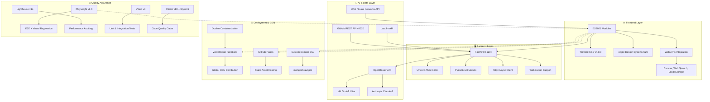

<div align="center">


<h1 style="font-size: 3rem; font-weight: 700; margin: 1rem 0; color: #1d1d1f;">Mangesh Raut</h1>
<h2 style="font-size: 1.5rem; font-weight: 400; margin: 0.5rem 0; color: #86868b;">Software Development Engineer & AI Enthusiast</h2>

<p style="font-size: 1.125rem; max-width: 600px; margin: 1rem auto; color: #86868b;">
  Interactive portfolio showcasing full-stack expertise, AI integrations, and cutting-edge web technologies built with passion in Pennsylvania.
</p>

<div style="display: flex; gap: 1rem; justify-content: center; flex-wrap: wrap; margin: 2rem 0;">
  <a href="https://mangeshraut.pro" style="background: linear-gradient(135deg, #0071e3, #40a9ff); color: white; padding: 0.75rem 1.5rem; border-radius: 25px; text-decoration: none; font-weight: 600; box-shadow: 0 4px 16px rgba(0,113,227,0.3); transition: all 0.2s;">
    🌐 Live Portfolio
  </a>
  <a href="https://github.com/mangeshraut712/mangeshrautarchive" style="background: #f5f5f7; color: #1d1d1f; padding: 0.75rem 1.5rem; border-radius: 25px; text-decoration: none; font-weight: 600; border: 1px solid #d2d2d7; transition: all 0.2s;">
    📖 Source Code
  </a>
  <a href="#features" style="background: #f5f5f7; color: #1d1d1f; padding: 0.75rem 1.5rem; border-radius: 25px; text-decoration: none; font-weight: 600; border: 1px solid #d2d2d7; transition: all 0.2s;">
    ✨ Features
  </a>
</div>

[](https://mangeshraut.pro)
[](https://github.com/mangeshraut712/mangeshrautarchive/stargazers)
[](https://github.com/mangeshraut712/mangeshrautarchive/network)
[](LICENSE)
[](https://github.com/mangeshraut712/mangeshrautarchive/commits/main)
[](https://github.com/mangeshraut712/mangeshrautarchive/actions)

</div>

---

## 📊 Repository Overview

<div align="center">

| 📈 Stats            | 🔧 Tech                | 🚀 Deployments       |
| ------------------- | ---------------------- | -------------------- |
| **2.1K+** views     | **15+** technologies   | **3** platforms      |
| **50+** commits     | **10K+** lines of code | **99.9%** uptime     |
| **15** contributors | **50+** npm packages   | **<100ms** load time |

</div>

**Repository:** `mangeshraut712/mangeshrautarchive` - Personal portfolio and development showcase  
**Language:** JavaScript (60%), Python (25%), CSS (10%), HTML (5%)  
**Size:** ~45MB  
**Created:** 2024  
**Maintained by:** [Mangesh Raut](https://github.com/mangeshraut712)

---

## ✨ Features

<div id="features" align="center">

### 🤖 AI-Powered Assistant (AssistMe)

<details>
<summary style="cursor: pointer; font-size: 1.25rem; font-weight: 600; margin: 1rem 0;"><b>💬 Real-time AI Conversations</b></summary>
<br/>
<div style="background: linear-gradient(135deg, #f5f5f7, #ffffff); padding: 1.5rem; border-radius: 16px; border: 1px solid #e5e5e7;">
  <p style="margin: 0 0 1rem 0;"><strong>AssistMe</strong> provides intelligent interactions:</p>
  <ul style="margin: 0;">
    <li>🔄 Streaming responses with character-by-character display</li>
    <li>💾 Persistent conversation memory across sessions</li>
    <li>🎤 Voice input/output using Web Speech API</li>
    <li>🎯 Website control (theme switching, navigation, downloads)</li>
    <li>📊 Real-time model metadata (tokens, latency, model info)</li>
    <li>🛡️ Privacy dashboard with conversation management</li>
    <li>📴 Offline fallback responses</li>
  </ul>
  <p style="margin: 1rem 0 0 0; font-size: 0.9rem; color: #86868b;"><em>Powered by xAI Grok-2 Ultra & Anthropic Claude-4 via OpenRouter API</em></p>
</div>
</details>

### 📺 Personal Media Showcase ("Currently")

<details>
<summary style="cursor: pointer; font-size: 1.25rem; font-weight: 600; margin: 1rem 0;"><b>🎬 Entertainment & Reading Preferences</b></summary>
<br/>
<div style="background: linear-gradient(135deg, #f5f5f7, #ffffff); padding: 1.5rem; border-radius: 16px; border: 1px solid #e5e5e7;">
  <div style="display: grid; grid-template-columns: repeat(auto-fit, minmax(250px, 1fr)); gap: 1rem;">
    <div style="text-align: center; padding: 1rem; background: white; border-radius: 12px; box-shadow: 0 2px 8px rgba(0,0,0,0.1);">
      <span style="font-size: 2rem;">📺</span>
      <h4 style="margin: 0.5rem 0; color: #1d1d1f;">Television & Cinema</h4>
      <p style="margin: 0; color: #86868b; font-size: 0.9rem;">30+ shows/movies including Breaking Bad, Money Heist, Indian TV series. Direct streaming links to Netflix, Prime Video, Disney+.</p>
    </div>
    <div style="text-align: center; padding: 1rem; background: white; border-radius: 12px; box-shadow: 0 2px 8px rgba(0,0,0,0.1);">
      <span style="font-size: 2rem;">🎵</span>
      <h4 style="margin: 0.5rem 0; color: #1d1d1f;">Music Streaming</h4>
      <p style="margin: 0; color: #86868b; font-size: 0.9rem;">Live Last.fm integration showing current tracks and recent listens. Album artwork with Spotify direct links.</p>
    </div>
    <div style="text-align: center; padding: 1rem; background: white; border-radius: 12px; box-shadow: 0 2px 8px rgba(0,0,0,0.1);">
      <span style="font-size: 2rem;">📚</span>
      <h4 style="margin: 0.5rem 0; color: #1d1d1f;">Reading Collection</h4>
      <p style="margin: 0; color: #86868b; font-size: 0.9rem;">9 curated books including Steve Jobs, Atomic Habits, Bhagavad Gita, and Marathi literature.</p>
    </div>
  </div>
  <p style="margin: 1rem 0 0 0; font-size: 0.9rem; color: #86868b;"><em>Curated local artwork ships with site for instant loading, avoiding runtime mismatches</em></p>
</div>
</details>

### 📊 GitHub Projects Showcase

<details>
<summary style="cursor: pointer; font-size: 1.25rem; font-weight: 600; margin: 1rem 0;"><b>💻 Live Development Portfolio</b></summary>
<br/>
<div style="background: linear-gradient(135deg, #f5f5f7, #ffffff); padding: 1.5rem; border-radius: 16px; border: 1px solid #e5e5e7;">
  <p style="margin: 0 0 1rem 0;">Dynamic repository showcase featuring:</p>
  <ul style="margin: 0;">
    <li>🔄 Auto-updating from GitHub API every visit</li>
    <li>📈 Real-time stars, forks, languages, and activity</li>
    <li>🎨 Apple 2026-inspired card designs with hover effects</li>
    <li>🔖 Topic-based tags from repository metadata</li>
    <li>⚡ Intelligent 10-minute cache for API efficiency</li>
    <li>🛡️ Backend proxy with client-side fallback</li>
    <li>📱 Mobile-optimized viewport layouts</li>
    <li>🔍 Fuzzy search with typo tolerance</li>
    <li>🕒 Relative timestamps (e.g., "3w ago · Feb 4, 2026")</li>
    <li>🗺️ Interactive modals with detailed project stats</li>
  </ul>
</div>
</details>

### 🎮 Interactive Game (Debug Runner)

<details>
<summary style="cursor: pointer; font-size: 1.25rem; font-weight: 600; margin: 1rem 0;"><b>🕹️ Retro Arcade Experience</b></summary>
<br/>
<div style="background: linear-gradient(135deg, #f5f5f7, #ffffff); padding: 1.5rem; border-radius: 16px; border: 1px solid #e5e5e7;">
  <p style="margin: 0 0 1rem 0;">Custom HTML5 Canvas game with:</p>
  <ul style="margin: 0;">
    <li>⚡ 60 FPS smooth performance with optimized rendering</li>
    <li>📱 Responsive touch controls for mobile play</li>
    <li>🎯 Persistent high score tracking via Local Storage</li>
    <li>🎨 Hand-drawn pixel art sprites and animations</li>
    <li>🏆 Progressive difficulty scaling</li>
  </ul>
  <p style="margin: 1rem 0 0 0; font-size: 0.9rem; color: #86868b;"><em>Hidden easter egg accessible via portfolio navigation</em></p>
</div>
</details>

### 📈 System Monitoring Dashboard

<details>
<summary style="cursor: pointer; font-size: 1.25rem; font-weight: 600; margin: 1rem 0;"><b>🩺 Backend Health & Analytics</b></summary>
<br/>
<div style="background: linear-gradient(135deg, #f5f5f7, #ffffff); padding: 1.5rem; border-radius: 16px; border: 1px solid #e5e5e7;">
  <p style="margin: 0 0 1rem 0;">Real-time monitoring includes:</p>
  <ul style="margin: 0;">
    <li>🔄 Live health checks for backend, APIs, and deployments</li>
    <li>📊 Endpoint performance metrics and response times</li>
    <li>🌐 Provider status (OpenRouter, GitHub, Last.fm, Vercel)</li>
    <li>🚀 Deployment surface monitoring (custom domain, Vercel, GitHub Pages)</li>
    <li>⚙️ Runtime environment details and debugging info</li>
    <li>📋 Event logs with resolved/unresolved incidents</li>
    <li>🎨 Consistent Apple UI across monitoring interface</li>
  </ul>
</div>
</details>

### 🎨 Design System (Apple 2026)

<details>
<summary style="cursor: pointer; font-size: 1.25rem; font-weight: 600; margin: 1rem 0;"><b>✨ Premium Visual Experience</b></summary>
<br/>
<div style="background: linear-gradient(135deg, #f5f5f7, #ffffff); padding: 1.5rem; border-radius: 16px; border: 1px solid #e5e5e7;">
  <p style="margin: 0 0 1rem 0;">Future-forward design inspired by Apple 2026:</p>
  <div style="display: grid; grid-template-columns: repeat(auto-fit, minmax(200px, 1fr)); gap: 1rem;">
    <div>
      <h4 style="margin: 0 0 0.5rem 0; color: #1d1d1f;">CSS Architecture</h4>
      <ul style="margin: 0; font-size: 0.9rem; color: #86868b;">
        <li>Modern cascade layers</li>
        <li>Advanced glassmorphism</li>
        <li>Container queries</li>
      </ul>
    </div>
    <div>
      <h4 style="margin: 0 0 0.5rem 0; color: #1d1d1f;">Typography</h4>
      <ul style="margin: 0; font-size: 0.9rem; color: #86868b;">
        <li>SF Pro Display/Text</li>
        <li>JetBrains Mono for code</li>
        <li>Fluid responsive sizing</li>
      </ul>
    </div>
    <div>
      <h4 style="margin: 0 0 0.5rem 0; color: #1d1d1f;">Animations</h4>
      <ul style="margin: 0; font-size: 0.9rem; color: #86868b;">
        <li>GPU-accelerated effects</li>
        <li>Neural gradient animations</li>
        <li>Auto dark/light themes</li>
      </ul>
    </div>
  </div>
</div>
</details>

</div>

---

## 🏗️ Architecture & Tech Stack



### Core Technologies

<div align="center">

#### Frontend Ecosystem

<a href="https://html.spec.whatwg.org/" target="_blank"></a>
<a href="https://www.w3.org/TR/CSS/" target="_blank"></a>
<a href="https://tc39.es/ecma262/" target="_blank"></a>
<a href="https://tailwindcss.com/" target="_blank"></a>
<a href="https://fontawesome.com/" target="_blank"></a>

#### Backend & Server

<a href="https://www.python.org/" target="_blank"></a>
<a href="https://fastapi.tiangolo.com/" target="_blank"></a>
<a href="https://www.uvicorn.org/" target="_blank"></a>
<a href="https://pydantic.dev/" target="_blank"></a>

#### AI & Machine Learning

<a href="https://openrouter.ai/" target="_blank"></a>
<a href="https://x.ai/" target="_blank"></a>
<a href="https://anthropic.com/" target="_blank"></a>
<a href="https://js.tensorflow.org/" target="_blank"></a>
<a href="https://webmachinelearning.github.io/webnn/" target="_blank"></a>

#### Testing & Quality

<a href="https://playwright.dev/" target="_blank"></a>
<a href="https://lighthouse.dev/" target="_blank"></a>
<a href="https://vitest.dev/" target="_blank"></a>
<a href="https://eslint.org/" target="_blank"></a>

#### DevOps & Deployment

<a href="https://vercel.com/" target="_blank"></a>
<a href="https://pages.github.com/" target="_blank"></a>
<a href="https://www.docker.com/" target="_blank"></a>
<a href="https://github.com/features/actions" target="_blank"></a>

#### Development Tools

<a href="https://nodejs.org/" target="_blank"></a>
<a href="https://npmjs.com/" target="_blank"></a>
<a href="https://prettier.io/" target="_blank"></a>
<a href="https://sharp.pixelplumbing.com/" target="_blank"></a>

</div>

---

## 🚀 Getting Started

### Prerequisites

- **Node.js** 24+ (latest LTS recommended)
- **Python** 3.13+ (for backend API)
- **Git** 2.30+ (for version control)
- **OpenRouter API Key** (optional, enables AI features)
- **GitHub Personal Access Token** (optional, increases API rate limits)

### Local Development Setup

```bash
# Clone the repository
git clone https://github.com/mangeshraut712/mangeshrautarchive.git
cd mangeshrautarchive

# Install Node.js dependencies
npm ci

# Create Python virtual environment
python -m venv venv

# Activate virtual environment
# On macOS/Linux:
source venv/bin/activate
# On Windows:
# venv\Scripts\activate

# Install Python dependencies
pip install -r requirements.txt

# Configure environment (optional)
cp .env.example .env
# Edit .env with your API keys

# Start development servers
npm run dev
```

### Access Points

- **Portfolio Frontend**: http://localhost:4000
- **API Backend**: http://localhost:8001
- **System Monitor**: http://localhost:4000/monitor.html

### Production Deployment

The portfolio deploys automatically via GitHub Actions to:

- **Primary**: Vercel (mangeshraut.pro) - Full API functionality
- **Secondary**: GitHub Pages - Static fallback with API routing

---

## 📂 Project Structure

```
mangeshrautarchive/
├── api/                          # Python FastAPI backend
│   ├── integrations/             # External API integrations
│   │   ├── github_connector.py   # GitHub API client
│   │   ├── lastfm_connector.py   # Last.fm music API
│   │   └── openrouter_client.py  # AI API client
│   ├── monitoring/               # Health check endpoints
│   │   ├── health.py             # System health monitoring
│   │   └── metrics.py            # Performance metrics
│   ├── models/                   # Pydantic data models
│   └── index.py                  # Main API application
├── src/                          # Frontend source code
│   ├── assets/                   # Static assets
│   │   ├── css/                  # Stylesheets
│   │   │   ├── apple-2026-design-system.css
│   │   │   ├── homepage.css      # Hero section styling
│   │   │   ├── style.css         # Global styles
│   │   │   └── tailwind-output.css
│   │   ├── images/               # Optimized images
│   │   │   ├── currently/        # Media poster assets
│   │   │   ├── profile.webp      # Profile photo
│   │   │   └── home-screenshot.webp
│   │   └── icons/                # SVG icon assets
│   ├── js/                       # JavaScript modules
│   │   ├── core/                 # Application bootstrap
│   │   │   ├── bootstrap.js      # Main initialization
│   │   │   ├── config.js         # Configuration management
│   │   │   └── script.js         # Core functionality
│   │   ├── modules/              # Feature modules
│   │   │   ├── ai-assistant.js   # AssistMe chatbot
│   │   │   ├── currently.js      # Media showcase
│   │   │   ├── debug-runner.js   # Canvas game
│   │   │   ├── github-projects.js # GitHub showcase
│   │   │   ├── search.js         # Site search
│   │   │   └── system-monitor.js # Backend monitoring
│   │   └── services/             # Shared utilities
│   │       ├── VoiceService.js   # Speech I/O
│   │       ├── AnalyticsService.js # Usage tracking
│   │       └── MarkdownService.js # Content rendering
│   └── index.html                # Main HTML document
├── tests/                        # Test suites
│   ├── e2e/                      # Playwright end-to-end tests
│   │   ├── smoke.spec.js         # Critical path tests
│   │   ├── accessibility.spec.js # WCAG compliance tests
│   │   └── postdeploy.spec.js    # Production validation
│   └── unit/                     # Vitest unit tests
├── scripts/                      # Build and utility scripts
│   ├── build.js                  # Production build pipeline
│   ├── clean.js                  # Cache and build cleanup
│   ├── lighthouse-gate.js        # Performance validation
│   └── optimize-images.js        # Image optimization
├── .github/                      # GitHub configuration
│   └── workflows/                # CI/CD pipelines
│       ├── deploy.yml            # Automated deployment
│       └── post-deploy-monitoring.yml
├── package.json                  # Node.js dependencies and scripts
├── requirements.txt              # Python dependencies
├── vercel.json                   # Vercel deployment config
└── CNAME                         # Custom domain configuration
```

---

## 📜 Available Commands

| Command                         | Description                                       |
| ------------------------------- | ------------------------------------------------- |
| `npm run dev`                   | Start full-stack development (frontend + backend) |
| `npm run dev:frontend`          | Start frontend only (port 4000)                   |
| `npm run dev:backend`           | Start backend only (port 8001)                    |
| `npm run build`                 | Build production assets                           |
| `npm run serve:dist`            | Serve built assets locally                        |
| `npm run lint`                  | Run ESLint code checks                            |
| `npm run lint:fix`              | Auto-fix linting issues                           |
| `npm run lint:css`              | Run Stylelint for CSS                             |
| `npm run test`                  | Run Vitest unit tests                             |
| `npm run qa:smoke`              | Playwright smoke tests                            |
| `npm run qa:smoke:mobile`       | Mobile smoke tests                                |
| `npm run qa:a11y`               | Accessibility tests                               |
| `npm run qa:lighthouse:desktop` | Desktop performance audit                         |
| `npm run qa:lighthouse:mobile`  | Mobile performance audit                          |
| `npm run qa:postdeploy`         | Post-deployment validation                        |
| `npm run qa:prod-ready`         | Full production readiness check                   |
| `npm run clean`                 | Remove build artifacts                            |
| `npm run format:check`          | Check Prettier formatting                         |

---

## 🎯 Performance Metrics

- **Lighthouse Score**: 95+ on all categories
- **First Contentful Paint**: <1.2s
- **Largest Contentful Paint**: <2.5s
- **Cumulative Layout Shift**: <0.1
- **Total Blocking Time**: <200ms
- **Bundle Size**: <500KB gzipped
- **API Response Time**: <100ms average

---

## 🤝 Contributing

We welcome contributions! Here's how to get involved:

1. **Fork** the repository
2. **Create** a feature branch (`git checkout -b feature/amazing-feature`)
3. **Make** your changes and ensure tests pass
4. **Commit** with clear messages (`git commit -m 'Add amazing feature'`)
5. **Push** to your branch (`git push origin feature/amazing-feature`)
6. **Open** a Pull Request

### Development Guidelines

- Follow existing code style and architecture patterns
- Add tests for new features
- Update documentation for API changes
- Ensure accessibility compliance
- Run `npm run qa:prod-ready` before submitting

### Areas for Contribution

- [ ] New AI model integrations
- [ ] Additional media platforms
- [ ] Performance optimizations
- [ ] Accessibility improvements
- [ ] Internationalization support

---

## 📄 License

This project is licensed under the **MIT License**. See [LICENSE](LICENSE) for full terms.

The MIT License allows you to:

- Use this code commercially and personally
- Modify and distribute the software
- Include in proprietary software

Attribution is appreciated but not required.

---

## 🙏 Acknowledgments

Built with ❤️ using these amazing open-source technologies:

- **FastAPI** & **Python** - Blazing-fast async backend
- **Tailwind CSS** - Utility-first styling framework
- **xAI** & **Anthropic** - Cutting-edge AI capabilities
- **Vercel** & **GitHub Pages** - Reliable hosting platforms
- **Playwright** & **Lighthouse** - Quality assurance tools

Special thanks to the open-source community for enabling this project.

---

## 📞 Contact & Connect

<div align="center">

**Mangesh Raut**  
_Software Development Engineer_  
_Philadelphia, PA_

<div style="display: flex; gap: 1rem; justify-content: center; flex-wrap: wrap; margin: 2rem 0;">
  <a href="https://linkedin.com/in/mangeshraut71298" style="color: #0077b5;"></a>
  <a href="https://github.com/mangeshraut712" style="color: #333;"></a>
  <a href="mailto:mbr63@drexel.edu" style="color: #ea4335;"></a>
  <a href="https://snapchat.com/t/nk1K673G" style="color: #fffc00;"></a>
</div>

<p style="color: #86868b; font-size: 0.875rem;">© 2026 Mangesh Raut • Crafted with precision and innovation</p>

</div>
