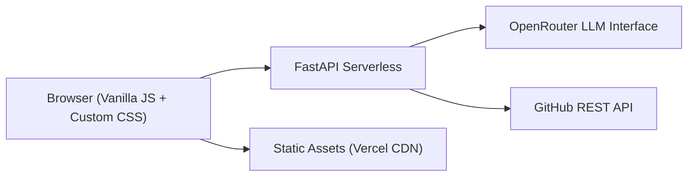

<div align="center">

# 🚀 Mangesh Raut — AI-Powered Portfolio

### _Next-Generation Developer Portfolio with Intelligent AI Assistant_

[](https://mangeshraut.pro)
[](https://mangeshraut712.github.io/mangeshrautarchive/)
[](LICENSE)
[](https://mangeshraut.pro)

**[View Live Demo](https://mangeshraut.pro)** • **[Features](#-key-features)** • **[Tech Stack](#️-tech-stack)** • **[Technical Skills](#-technical-skills)**

---


</div>

---

## 📖 Table of Contents

- [About](#-about)
- [Key Features](#-key-features)
- [Technical Skills](#-technical-skills)
- [Performance & Optimization](#-performance--optimization)
- [Tech Stack](#️-tech-stack)
- [Quick Start](#-quick-start)
- [Project Structure](#-project-structure)
- [Quality Gates](#-quality--performance-gates)
- [Contact](#-connect-with-me)

---

## 🌟 About

This is my **personal portfolio website** — not just a static resume, but an **intelligent, interactive experience** that showcases modern full-stack development, performance engineering, and AI integration. It features a real-time AI chatbot assistant, live GitHub integration, an interactive canvas game, and a premium glassmorphism UI design.

Built meticulously to achieve a **perfect 100/100 Mobile PageSpeed score**, utilizing vanilla JavaScript modularity, zero layout-thrashing animations, and highly optimized asset delivery.

<div align="center">

### 💡 Project Highlights

| 🧠 AI Assistant | ⚡ 100/100 Perf | 📊 Live Data | 🎨 Premium UI |
| :---: | :---: | :---: | :---: |
| Real-time streaming chatbot with context awareness | Zero blocking CSS/JS with hyper-optimized paints | GitHub API integration with smart caching | Apple-inspired interactive glassmorphism |

</div>

[↑ Back to Top](#-mangesh-raut--ai-powered-portfolio)

---

## ✨ Key Features

### 🧠 AssistMe — Intelligent AI Assistant

The centerpiece of this portfolio is **AssistMe**, an AI-powered chatbot that goes beyond simple Q&A:

- **🔄 Real-Time Streaming** — Watch responses appear character-by-character like ChatGPT
- **🎯 Agentic Actions** — The AI can actually control the website (e.g. toggling themes, downloading resume)
- **🎤 Voice Input/Output** — Speak your questions and hear responses via Web Speech API
- **Technology:** OpenRouter-backed multi-model chat (default: Grok 4.1 Fast), with local fallback resilience.

### 🎮 Debug Runner — Interactive Canvas Game

A fully functional **HTML5 Canvas** retro-style arcade game built from scratch:

- ⚡ **60 FPS Performance** — Smooth animations with optimized rendering loops
- 📱 **Mobile Touch Controls** — Play on any device with responsive touch input
- 🎨 **Pixel Art Graphics** — Retro aesthetic with custom sprite sheets

### 📊 Live GitHub Integration

Real-time project showcase that automatically stays current:

- 🔄 **Auto-Updating** — Fetches latest repositories from GitHub API on every visit
- 📈 **Live Statistics** — Real-time star counts, fork counts, and primary languages
- ⚡ **Intelligent Caching** — 10-minute client + server cache window to reduce API pressure

### 🎨 Premium Design System

**Apple 2026 Design System:**

- 🔮 **Glassmorphism 2026** — Advanced frosted glass effects with backdrop blur
- 🌈 **Hardware-Accelerated Animations** — 100% GPU-composited transform/opacity transitions
- 🌓 **Automatic dark/light theme** — Based on system preferences

[↑ Back to Top](#-mangesh-raut--ai-powered-portfolio)

---

## 💻 Technical Skills

My software engineering toolkit is constantly evolving. Here is a snapshot of my core competencies:

<div align="center">

| Category                 | Skills/Technologies |
| ------------------------ | ------------------- |
| **Languages**            | Python, JavaScript, TypeScript, Java, C/C++, Swift, SQL |
| **Frontend**             | React, Next.js, Angular, HTML5/CSS3, Tailwind CSS, Redux |
| **Backend & Databases**  | Node.js, Spring Boot, Django, MongoDB, PostgreSQL, MySQL, Redis |
| **Cloud & DevOps**       | AWS, Docker, Kubernetes, Jenkins, Terraform, Git/GitHub |
| **AI & ML**              | TensorFlow, PyTorch, Scikit-learn, OpenCV, NLP, LLMs |
| **Tools & Methodology**  | VS Code, Postman, Figma, Jira, Agile/Scrum, REST APIs |

</div>

[↑ Back to Top](#-mangesh-raut--ai-powered-portfolio)

---

## ⚡ Performance & Optimization

Achieving a **100/100 Mobile PageSpeed Score** is no accident. This portfolio employs bleeding-edge web performance techniques:

- **Critical CSS Inlining:** Above-the-fold layout styles are inlined, immediately yielding an FCP of ~0.4s.
- **Asynchronous CSS:** All non-critical stylesheets are deferred using `media="print" onload="this.media='all'"`.
- **Zero Layout Thrashing:** Complex scroll animations are batched. Removed expensive `BoundingClientRect` queries on scroll.
- **GPU-Accelerated Transitions:** Refactored legacy `width`, `height`, and `top/left` properties to composited `transform` variations (`scaleX`, `translate3d`).
- **Aggressive Caching:** Implemented `stale-while-revalidate` for edge-served content and 1-year lifetimes for assets.
- **Lazy Loading Strategy:** Modular JavaScript files and below-the-fold images wait for Interaction or Intersection Observers before being parsed.

[↑ Back to Top](#-mangesh-raut--ai-powered-portfolio)

---

## 🛠️ Tech Stack

<div align="center">

### Frontend


### Backend


### DevOps & Tools


</div>

---

## 🚀 Quick Start

### Prerequisites
- **Node.js** 20+ and **npm** 10+
- **Python** 3.12+
- 🔑 **OpenRouter API Key** (optional, for AI features)

### Installation Steps

```bash
# 1️⃣ Clone the repository
git clone https://github.com/mangeshraut712/mangeshrautarchive.git
cd mangeshrautarchive

# 2️⃣ Install dependencies
npm ci
pip install -r requirements.txt

# 3️⃣ Environment variables
cp .env.example .env
# Edit .env and add your OPENROUTER_API_KEY

# 4️⃣ Start the development servers
npm run dev
```

---

## 📂 Project Structure

```text
mangeshrautarchive/
├── api/                        # FastAPI backend + serverless handlers
├── src/                        # Frontend source
│   ├── assets/                 # CSS, images, icons, downloadable files
│   └── js/
│       ├── core/               # App bootstrap + orchestration
│       ├── modules/            # Feature modules (skills, projects, chat)
│       └── components/         # Reusable UI components
├── scripts/                    # Build/dev/QA/security scripts
└── docs/                       # Engineering Docs and QA Runbooks
```

---

## 💬 Connect with Me

<div align="center">

### **Mangesh Raut**
_Software Engineer | Full-Stack Developer | AI Enthusiast_

[](https://mangeshraut.pro)
[](https://linkedin.com/in/mangeshraut71298)
[](mailto:mbr63@drexel.edu)

**Education:** M.S. Computer Science @ Drexel University  
**Location:** Philadelphia, PA, USA 🇺🇸

<br>

**© 2026 Mangesh Raut • Built with ❤️ in Philadelphia**

</div>

---

<!-- codex:project-diagram:start -->
## Architecture Overview

<!-- codex:project-diagram:end -->
