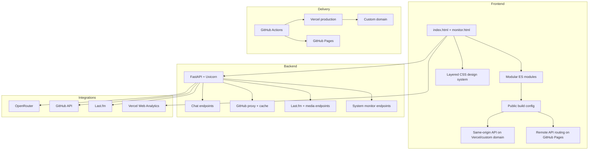

<div align="center">


# Mangesh Raut

### Apple-inspired interactive portfolio for 2026

<p style="max-width: 760px; margin: 1rem auto; color: #6e6e73; font-size: 1.05rem; line-height: 1.7;">
  A product-style portfolio that combines a static frontend, a Python API, live GitHub and Last.fm integrations,
  an AI assistant, and a first-class system monitor. The design language is intentionally influenced by Apple:
  clean typography, solid light and dark surfaces, restrained glass, and minimal chrome.
</p>

<div style="display: flex; gap: 0.9rem; justify-content: center; flex-wrap: wrap; margin: 1.6rem 0 1.2rem;">
  <a href="https://mangeshraut.pro" style="background: linear-gradient(135deg, #0071e3, #2997ff); color: white; padding: 0.8rem 1.35rem; border-radius: 999px; text-decoration: none; font-weight: 600; box-shadow: 0 10px 24px rgba(0,113,227,0.22);">
    Live Portfolio
  </a>
  <a href="https://github.com/mangeshraut712/mangeshrautarchive" style="background: #f5f5f7; color: #1d1d1f; padding: 0.8rem 1.35rem; border-radius: 999px; text-decoration: none; font-weight: 600; border: 1px solid #d2d2d7;">
    Source Code
  </a>
  <a href="#showcase-examples" style="background: #f5f5f7; color: #1d1d1f; padding: 0.8rem 1.35rem; border-radius: 999px; text-decoration: none; font-weight: 600; border: 1px solid #d2d2d7;">
    Showcase
  </a>
</div>

[](https://mangeshraut.pro)
[](https://mangeshraut712.github.io/mangeshrautarchive/)
[](https://mangeshrautarchive.vercel.app)
[](https://github.com/mangeshraut712/mangeshrautarchive/actions)
[](LICENSE)

</div>

---

## Table of Contents

- [Overview](#overview)
- [Live Links](#live-links)
- [Repository Overview](#repository-overview)
- [Architecture Overview](#architecture-overview)
- [Showcase Examples](#showcase-examples)
- [Key Features](#key-features)
- [Implementation Snapshots](#implementation-snapshots)
- [API Surface](#api-surface)
- [Tech Stack](#tech-stack)
- [Monthly Release Notes](#monthly-release-notes)
- [Quick Start](#quick-start)
- [Environment Variables](#environment-variables)
- [Project Structure](#project-structure)
- [Available Scripts](#available-scripts)
- [Quality Gates](#quality-gates)
- [Deployment Notes](#deployment-notes)
- [Connect](#connect)
- [License](#license)

---

## Overview

This repository powers Mangesh Raut’s personal website and public portfolio application.

It is not a single static page. The project combines:

- a static frontend served on Vercel, the custom domain, and GitHub Pages
- a FastAPI backend for chat, GitHub proxying, music data, analytics, and system monitoring
- a deployment-aware configuration layer so GitHub Pages behaves like the main site without exposing private secrets
- an Apple-inspired UI system tuned for white and black theme fidelity across Safari, Chrome, Edge, Android, iPhone, tablet, and desktop layouts

The portfolio is designed to feel like a small product rather than a résumé:

- **AssistMe** for AI chat
- **Projects** for live GitHub showcase
- **Currently** for shows, music, and books
- **System Monitor** for operational visibility
- **Debug Runner** for a built-in game surface

---

## Live Links

- **Primary site**: [https://mangeshraut.pro](https://mangeshraut.pro)
- **Vercel production alias**: [https://mangeshrautarchive.vercel.app](https://mangeshrautarchive.vercel.app)
- **GitHub Pages**: [https://mangeshraut712.github.io/mangeshrautarchive/](https://mangeshraut712.github.io/mangeshrautarchive/)
- **System Monitor**: [https://mangeshraut.pro/monitor.html](https://mangeshraut.pro/monitor.html)
- **Repository**: [https://github.com/mangeshraut712/mangeshrautarchive](https://github.com/mangeshraut712/mangeshrautarchive)

---

## Repository Overview

| Area                | Summary                                                                                          |
| ------------------- | ------------------------------------------------------------------------------------------------ |
| Repository          | `mangeshraut712/mangeshrautarchive`                                                              |
| Purpose             | personal portfolio, AI assistant, GitHub showcase, media shelf, system monitor, and game surface |
| Frontend style      | static HTML + modular ES modules + Apple-inspired CSS                                            |
| Backend style       | FastAPI endpoints for chat, monitoring, GitHub proxying, and media data                          |
| Primary deployments | `mangeshraut.pro`, `mangeshrautarchive.vercel.app`, GitHub Pages                                 |
| CI/CD               | GitHub Actions for QA, GitHub Pages deploy, and post-deploy browser validation                   |
| Build config        | public `build-config.json` / `build-config.js` for static-host routing                           |

### Website highlights at a glance

- **Home**: profile-led hero with theme-aware white and black presentation
- **Projects**: live GitHub data with search, activity, and project detail views
- **Currently**: curated posters for shows and books plus live Last.fm music
- **Monitor**: health, provider APIs, deployment surfaces, runtime snapshot, and docs
- **Debug Runner**: built-in mini-game embedded in the portfolio flow

---

## Architecture Overview



### Architecture highlights

- **Frontend**: plain HTML and ES modules, intentionally lightweight and framework-free
- **Backend**: FastAPI handles chat, GitHub proxying, music data, analytics, and deployment monitoring
- **Deployment-aware routing**: Vercel and the custom domain use same-origin `/api`; GitHub Pages consumes the live API via generated public config
- **Observability**: the monitor page reports backend health, provider APIs, runtime state, and public deployment surfaces
- **Cross-browser theme stability**: the hero and body backgrounds are forced to solid white or solid black, avoiding the blue-glow drift that showed up on Safari and mobile browsers

---

## Showcase Examples

| Surface        | Purpose                                                        | Live path                                                                 |
| -------------- | -------------------------------------------------------------- | ------------------------------------------------------------------------- |
| Home hero      | introduction, live music pill, CTAs, theme-aware presentation  | [`/`](https://mangeshraut.pro/)                                           |
| Projects       | GitHub-backed showcase with activity, search, and modal detail | [`/#projects`](https://mangeshraut.pro/#projects)                         |
| Currently      | curated shows, books, and live music shelf                     | [`/#contact`](https://mangeshraut.pro/#contact)                           |
| System Monitor | backend, provider, and deployment health                       | [`/monitor.html`](https://mangeshraut.pro/monitor.html)                   |
| Debug Runner   | built-in game/easter egg section                               | [`/#debug-runner-section`](https://mangeshraut.pro/#debug-runner-section) |

### What the website demonstrates

- Apple-inspired light and dark theme behavior
- dynamic GitHub repository and activity data
- live Last.fm music data
- deployment-aware frontend behavior on GitHub Pages
- CI-driven deployment and post-deploy validation
- profile avatar toggle, verified badge, and polished footer signature details

---

## Key Features

### AssistMe AI assistant

- OpenRouter-backed chat
- streaming responses
- contextual portfolio answers
- local fallback behavior when remote AI is unavailable
- theme-aware UI with privacy-conscious client behavior

### GitHub showcase

- backend proxy for GitHub API requests
- cache-backed stats and repository metadata
- activity summaries and ranking logic
- resilient fallback behavior when GitHub is rate-limited

### Currently shelf

- curated local poster and cover artwork for shows, movies, and books
- live Last.fm-based music shelf
- Spotify search links from current and recent listening
- parity across Vercel, the custom domain, and GitHub Pages

### System Monitor

- backend health checks
- endpoint metrics
- provider API status
- deployment-surface checks
- runtime configuration visibility
- monitor docs and JSON links

### Design system

- solid white light theme
- solid black dark theme
- compact floating controls
- restrained glass surfaces instead of overdone glow
- responsive layouts for mobile, tablet, and desktop

---

## Implementation Snapshots

These examples show how the site is actually wired today.

### Public build config for static hosting

```javascript
// Generated at build time for GitHub Pages and other static surfaces.
(function () {
  const buildConfig = {
    apiBaseUrl: 'https://mangeshraut.pro',
    siteUrl: 'https://mangeshraut712.github.io/mangeshrautarchive',
  };

  globalThis.buildConfig = buildConfig;
  globalThis.APP_CONFIG = Object.assign({}, globalThis.APP_CONFIG || {}, buildConfig);
})();
```

### Monitor routing on the backend

```python
@app.get("/api/monitor/status")
async def get_monitor_status():
    metrics = system_monitor.get_metrics()
    return {
        "status": "ok",
        "version": app.version,
        "uptime_human": metrics["uptime_human"],
        "summary": metrics["summary"],
        "runtime": system_monitor.get_runtime_environment(),
    }
```

### GitHub proxy shape

```python
@app.get("/api/github/proxy")
async def github_api_proxy(path: str):
    # Uses server-side auth + cache before exposing normalized JSON to the frontend.
    ...
```

### Music shelf behavior

```javascript
// GitHub Pages and Vercel both use the same live API path after build-config is loaded.
const apiBaseUrl =
  (typeof globalThis.buildConfig !== 'undefined' && globalThis.buildConfig.apiBaseUrl) || '';
const musicApiUrl = apiBaseUrl ? `${apiBaseUrl}/api/music/recent` : '/api/music/recent';
```

---

## API Surface

The backend exposes a small set of public routes that drive the portfolio.

### Core endpoints

| Endpoint      | Purpose                            |
| ------------- | ---------------------------------- |
| `/api/chat`   | AssistMe AI conversations          |
| `/api/models` | available AI model metadata        |
| `/api/health` | lightweight backend health         |
| `/api/test`   | backend configuration sanity check |

### GitHub and portfolio data

| Endpoint                         | Purpose                                              |
| -------------------------------- | ---------------------------------------------------- |
| `/api/github/repos/public`       | normalized public repo list for the Projects section |
| `/api/github/proxy`              | server-side GitHub passthrough with cache and auth   |
| `/api/github/profile/{username}` | profile and activity summary                         |
| `/api/analytics/views`           | shared portfolio reach metrics                       |
| `/api/analytics/track`           | records homepage/site landings for the reach badge   |

### Media and monitor endpoints

| Endpoint                         | Purpose                          |
| -------------------------------- | -------------------------------- |
| `/api/music/recent`              | Last.fm recent listening data    |
| `/api/monitor/status`            | quick monitor status             |
| `/api/monitor/health`            | detailed health checks           |
| `/api/monitor/metrics`           | endpoint metrics                 |
| `/api/monitor/external-services` | provider status                  |
| `/api/monitor/hosting-surfaces`  | public deployment-surface status |
| `/api/monitor/docs`              | monitor reference metadata       |

### Docs

- Swagger UI: [`/api/docs`](https://mangeshraut.pro/api/docs)
- ReDoc: [`/api/redoc`](https://mangeshraut.pro/api/redoc)

---

## Tech Stack

### Frontend

- HTML5
- CSS
- vanilla JavaScript ES modules
- Tailwind CSS output for selected utilities

### Backend

- Python 3.12+
- FastAPI
- Uvicorn
- Pydantic
- httpx

### Integrations

- OpenRouter
- GitHub API
- Last.fm
- Vercel Web Analytics

### Tooling

- Node.js
- npm
- ESLint
- Stylelint
- Prettier
- Ruff
- Vulture
- Flake8
- Playwright
- Lighthouse

---

## Monthly Release Notes

### April 2026

- homepage and hero theme stabilization for Safari, Chrome, iOS, Android, tablet, and desktop
- GitHub Pages routing updated to use the same live API path as the main site
- portfolio reach moved from client-only placeholder tracking toward shared backend metrics, with Redis-first support and file fallback
- hero avatar toggle, verified name badge, and footer G63 signature added in the Apple-inspired visual language
- System Monitor upgraded with provider APIs, deployment surfaces, runtime snapshot, and docs panel
- CI pipeline hardened:
  - Python dependencies installed before smoke tests
  - smoke assertions aligned with the current music shelf
  - flake8 issues resolved
  - GitHub Pages deploy and post-deploy validation restored
- dead-code tooling added:
  - `ruff`
  - `vulture`
  - repo-level `vulture.toml`
- README reworked to remove duplication and reflect the actual architecture and deployment model

### Earlier foundation work

- GitHub showcase, AI assistant, monitoring, and themed UI system established in earlier iterations of the portfolio
- Vercel, custom domain, and GitHub Pages delivery model set up for public access

---

## Quick Start

### Prerequisites

- Node.js 18+
- npm 9+
- Python 3.12+

### Local setup

```bash
git clone https://github.com/mangeshraut712/mangeshrautarchive.git
cd mangeshrautarchive

npm install

python3 -m venv venv
source venv/bin/activate
pip install -r requirements.txt

cp .env.example .env
npm run dev
```

### Runtime variables

These belong on the backend runtime, especially on Vercel:

- `OPENROUTER_API_KEY`
- `GITHUB_TOKEN` or `GITHUB_PAT`
- `LASTFM_API_KEY`

GitHub Pages does **not** receive those private secrets. It only gets public build-time config that points it at the live production API.

---

## Environment Variables

### Backend secrets and runtime config

| Variable                      | Purpose                                 |
| ----------------------------- | --------------------------------------- |
| `OPENROUTER_API_KEY`          | enables live AI responses               |
| `OPENROUTER_MODEL`            | default model selection                 |
| `GITHUB_TOKEN` / `GITHUB_PAT` | authenticated GitHub proxy access       |
| `LASTFM_API_KEY`              | live music shelf data                   |
| `TMDB_API_KEY`                | optional poster lookup endpoints        |
| `GOOGLE_BOOKS_API_KEY`        | optional book-cover lookup endpoints    |
| `UPSTASH_REDIS_REST_URL`      | shared analytics storage                |
| `UPSTASH_REDIS_REST_TOKEN`    | Redis auth for portfolio reach tracking |

### Public build-time config

These are safe to ship in the static frontend:

| Variable               | Purpose                                             |
| ---------------------- | --------------------------------------------------- |
| `NEXT_PUBLIC_API_BASE` | public API base for static builds like GitHub Pages |
| `OPENROUTER_SITE_URL`  | public site URL metadata                            |
| `OPENROUTER_APP_TITLE` | public app title metadata                           |

### Recommended deployment model

- **Vercel/custom domain**: keep all secrets here
- **GitHub Pages**: ship only public config, never private keys

---

## Project Structure

```text
mangeshrautarchive/
├── api/
│   ├── integrations/           # External API helpers
│   ├── legacy/                 # Compatibility handlers
│   ├── index.py                # Main FastAPI app
│   ├── memory_manager.py       # Personalization helpers
│   └── monitoring.py           # System monitor logic
├── scripts/                    # Build, cleanup, QA, and deployment helpers
├── src/
│   ├── assets/
│   │   ├── css/                # Sitewide and section CSS
│   │   ├── files/              # Resume and downloads
│   │   └── images/             # Profile, current media, companies, cars, etc.
│   ├── js/
│   │   ├── components/
│   │   ├── core/
│   │   ├── data/
│   │   ├── modules/
│   │   ├── services/
│   │   ├── shared/
│   │   └── utils/
│   ├── index.html
│   └── monitor.html
├── tests/
│   └── e2e/                    # Playwright suites
├── .github/workflows/          # CI/CD
├── package.json
├── requirements.txt
├── vercel.json
└── vulture.toml
```

---

## Available Scripts

| Command                         | Purpose                            |
| ------------------------------- | ---------------------------------- |
| `npm run dev`                   | start frontend and backend locally |
| `npm run dev:frontend`          | start frontend only                |
| `npm run dev:backend`           | start backend only                 |
| `npm run build`                 | build production assets            |
| `npm run serve:dist`            | serve built output locally         |
| `npm run lint`                  | run ESLint                         |
| `npm run lint:css`              | run Stylelint                      |
| `npm run lint:dead-code`        | run Ruff and Vulture               |
| `npm run test`                  | run Vitest                         |
| `npm run qa:smoke`              | desktop Playwright smoke           |
| `npm run qa:smoke:mobile`       | mobile Playwright smoke            |
| `npm run qa:a11y`               | accessibility checks               |
| `npm run qa:lighthouse:desktop` | desktop Lighthouse gate            |
| `npm run qa:lighthouse:mobile`  | mobile Lighthouse gate             |
| `npm run qa:postdeploy`         | post-deploy validation             |
| `npm run clean`                 | remove generated clutter           |

---

## Quality Gates

- **Static quality**: ESLint, Stylelint, Prettier
- **Python quality**: Ruff, Flake8, Vulture
- **Runtime quality**: Playwright smoke and accessibility suites
- **Performance**: Lighthouse desktop and mobile gates
- **Release confidence**: GitHub Actions deploys GitHub Pages and then runs post-deploy validation

### Practical verification targets

- homepage theme should remain solid white or solid black
- Projects should render live GitHub data or fall back cleanly
- music should load from the live Last.fm path on both Vercel and GitHub Pages
- System Monitor should expose backend, provider, and deployment-surface health
- portfolio reach should display a real shared count instead of a hardcoded placeholder when backend tracking is configured

---

## Deployment Notes

### Vercel and custom domain

- use same-origin `/api`
- keep private secrets on Vercel
- Vercel Web Analytics runs here

### GitHub Pages

- static frontend only
- uses generated public config
- now points to `https://mangeshraut.pro` for live backend behavior
- should match the main site for chat, music, projects, and monitor data without exposing secrets

### Important production behavior

- Vercel Web Analytics only counts Vercel/custom-domain traffic
- GitHub Pages uses the live backend but does not host the backend itself
- shared homepage reach tracking can use Redis in production and file fallback locally
- HTML caching is set to revalidate so updated builds replace stale browser shells faster

---

## Connect

- **Portfolio**: [mangeshraut.pro](https://mangeshraut.pro)
- **GitHub**: [github.com/mangeshraut712](https://github.com/mangeshraut712)
- **LinkedIn**: [linkedin.com/in/mangeshraut71298](https://linkedin.com/in/mangeshraut71298)
- **Email**: [mbr63@drexel.edu](mailto:mbr63@drexel.edu)
- **Snapchat**: [snapchat.com/t/nk1K673G](https://snapchat.com/t/nk1K673G)

---

## License

MIT. See [LICENSE](LICENSE).
