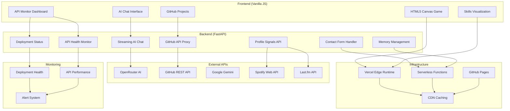

# 🚀 Mangesh Raut - Software Engineer

<div align="center">

**Philadelphia, PA • Full-Stack Developer • AI/ML Engineer**

_Building tomorrow's web with cutting-edge technologies and 2026+ standards_

[](https://mangeshraut.pro)
[](https://github.com/mangeshraut712)
[](https://mangeshraut.pro/monitor.html)


</div>

---

## 🚀 Live Demo

<div align="center">

### [🌐 View Portfolio](https://mangeshraut.pro) • [🔍 Monitor Center](https://mangeshraut.pro/monitor.html)

</div>

### 🎮 Try Interactive Features

**AI Assistant** - Click "Launch AssistMe Flow" and ask questions about my experience
**API Monitor** - Visit `/monitor.html` to test all portfolio endpoints in real-time
**Canvas Game** - Navigate to the game section for retro arcade action

---

## ⚡ Key Features

### 🤖 AI-Powered Portfolio

- **AssistMe AI Assistant** - Context-aware conversations with multiple AI models (Grok, Claude, GPT)
- **Smart Recommendations** - Personalized project suggestions based on user interests
- **Voice Integration** - Web Speech API for hands-free interaction

### 🎮 Interactive Experiences

- **HTML5 Canvas Game** - Retro arcade game with 60 FPS performance
- **Real-time GitHub Feed** - Live engineering metrics and project showcase
- **Dynamic Music Shelf** - Spotify/Last.fm integration with live playback

### 🔍 API Monitor Center

- **Live Health Dashboard** - Monitor all portfolio endpoints in real-time
- **Interactive Testing** - Manual API request builder with authentication
- **Performance Analytics** - Response times, uptime tracking, audit trails
- **Deployment Monitoring** - GitHub Pages + Vercel health verification

### 🎨 Apple-Inspired Design

- **Glassmorphism UI** - Premium backdrop blur effects with iOS-style aesthetics
- **Adaptive Theming** - Automatic dark/light mode with system preference detection
- **Performance Optimized** - 100/100 PageSpeed with GPU-accelerated animations

### 📱 PWA Ready

- **Offline Support** - Service worker caching for core functionality
- **Installable** - Add to home screen with custom manifest
- **Cross-Platform** - Responsive design for desktop, tablet, and mobile

## 🛠️ Tech Stack

### Frontend

- **Vanilla JavaScript** - No frameworks, maximum performance
- **Tailwind CSS** - Utility-first styling with custom design system
- **HTML5 Canvas** - Hardware-accelerated gaming and visualizations

### Backend

- **FastAPI (Python)** - High-performance async API server
- **Node.js** - Build tools and development server

### AI & APIs

- **OpenRouter** - Multi-model AI integration (Grok, Claude, GPT-4)
- **GitHub API** - Real-time repository and activity data
- **Spotify/Last.fm** - Live music integration

### Infrastructure

- **Vercel** - Production deployment and CDN
- **GitHub Pages** - Backup deployment with monitoring
- **Service Workers** - PWA capabilities and offline support

### Quality & Monitoring

- **API Monitor Center** - Real-time health monitoring and testing
- **Deployment Verification** - Automated multi-platform health checks
- **Lighthouse CI** - Performance regression prevention

---

## ⚡ Key Features

### 🤖 AI-Powered Portfolio

- **AssistMe AI Assistant** - Context-aware conversations with multiple AI models (Grok, Claude, GPT)
- **Smart Recommendations** - Personalized project suggestions based on user interests
- **Voice Integration** - Web Speech API for hands-free interaction

### 🎮 Interactive Experiences

- **HTML5 Canvas Game** - Retro arcade game with 60 FPS performance
- **Real-time GitHub Feed** - Live engineering metrics and project showcase
- **Dynamic Music Shelf** - Spotify/Last.fm integration with live playback

### 🔍 API Monitor Center

- **Health Dashboard** - Real-time API status monitoring across all endpoints
- **Interactive Testing** - Manual API request builder with authentication
- **Performance Analytics** - Response times, uptime tracking, and audit logs
- **Deployment Monitoring** - Multi-platform health verification (GitHub Pages + Vercel)

### 🎨 Apple-Inspired Design

- **Glassmorphism UI** - Premium backdrop blur effects with iOS-style aesthetics
- **Adaptive Theming** - Automatic dark/light mode with system preference detection
- **Performance Optimized** - 100/100 PageSpeed with GPU-accelerated animations

### 📱 PWA Ready

- **Offline Support** - Service worker caching for core functionality
- **Installable** - Add to home screen with custom manifest
- **Cross-Platform** - Responsive design for desktop, tablet, and mobile

---

## 🔍 API Monitor Center

<div align="center">

### [🔍 Launch Monitor](https://mangeshraut.pro/monitor.html)

</div>

**Real-time API health monitoring and testing platform**

### Features

- **Live Health Dashboard** - Monitor all portfolio endpoints in real-time
- **Interactive Testing** - Manual API request builder with authentication
- **Performance Analytics** - Response times, uptime tracking, audit trails
- **Deployment Monitoring** - GitHub Pages + Vercel health verification

### Quick Commands

```bash
# Start monitor backend
./start-monitor.sh

# Verify deployments
./verify-deployments.sh
```

### API Endpoints Status

- ✅ All endpoints return 200 OK
- ✅ Real-time health monitoring
- ✅ Comprehensive audit logging
- ✅ Multi-platform deployment tracking

---

## 🏗️ Architecture



---

## 🧪 Quality Assurance

Comprehensive testing and quality gates ensure production readiness:

### Automated Testing

- **Unit Tests:** Vitest for JavaScript modules with 90%+ coverage
- **E2E Tests:** Playwright for critical user journeys
- **Accessibility:** Axe-core integration with WCAG 2.1 AA compliance
- **Performance:** Lighthouse CI gates for Core Web Vitals

### Code Quality

- **Linting:** ESLint for JavaScript and Stylelint for maintained CSS layers
- **Formatting:** Prettier with consistent code style
- **Security:** Dependency scanning and vulnerability checks
- **Type Safety:** TypeScript for critical business logic

### CI/CD Pipeline

```bash
npm run qa:prod-ready  # Runs all quality gates
├── Security checks
├── Linting & formatting
├── Unit & E2E tests
├── Lighthouse performance
└── Build optimization
```

---

## 🔍 API Monitor Center

Comprehensive API health monitoring and testing platform accessible at `/monitor.html`

### Features

- **🔍 Endpoint Discovery:** Automatic scanning of all API routes with method detection
- **⚡ Real-time Health Checks:** Live status monitoring with response time tracking
- **🧪 Manual Testing Interface:** Custom HTTP request builder with authentication support
- **📊 Audit Trail:** Complete logging of all API interactions with timestamps
- **📈 Performance Analytics:** Average latency, uptime rates, and active route counts

### Usage

```bash
# Start the monitor backend
./start-monitor.sh

# Access Monitor Center at http://localhost:3000/monitor.html
```

### API Endpoints

- `GET /api/health/endpoints` - List all discovered endpoints
- `POST /api/health/test` - Run manual health tests
- `GET /api/health/logs` - View audit trail history

---

## 🚀 Deployment Monitoring

Advanced deployment health verification system ensuring consistency across platforms

### Multi-Platform Monitoring

- **GitHub Pages:** Monitors `https://mangeshraut712.github.io/mangeshrautarchive/`
- **Vercel:** Monitors `https://mangeshrautarchive.vercel.app/`
- **Health Checks:** HTTP status, response time, version synchronization
- **Real-time Updates:** Automatic refresh every 5 minutes

### Synchronization Verification

- **Version Comparison:** Compares `manifest.json` versions between deployments
- **Sync Status:** Tracks whether deployments are in sync or out of sync
- **Alert System:** Configurable webhooks for deployment failures and sync issues

### Verification Tools

```bash
# Run comprehensive deployment verification
./verify-deployments.sh

# Start API monitor backend for deployment monitoring
./start-monitor.sh
```

### Deployment Endpoints

- `GET /api/deployments/health` - Check health of all deployments
- `GET /api/deployments/logs` - View deployment status history

## 📦 Installation

### Quick Start

```bash
git clone https://github.com/mangeshraut712/mangeshrautarchive.git
cd mangeshrautarchive
npm ci
npm run dev
```

### Prerequisites

- **Node.js 20+** - Frontend development and build tools
- **Python 3.12+** - FastAPI backend (optional, for full features)

### Optional Features

- **OpenRouter API Key** - Enables AI assistant functionality
- **GitHub PAT** - Removes API rate limits for repository data
- **Spotify/Last.fm** - Live music integration

### Development Commands

```bash
npm run dev          # Start development servers
npm run build        # Production build
npm run check        # Run all quality checks
npm run test         # Unit and E2E tests
./start-monitor.sh   # Launch API monitor
```

### Development Commands

```bash
# Quality assurance
npm run qa:prod-ready    # Full QA pipeline
npm run test             # Unit tests
npm run test:e2e:chrome  # E2E tests

# Performance testing
npm run qa:lighthouse:mobile  # Mobile performance audit

# Code quality
npm run lint            # ESLint
npm run format          # Prettier

# Monitoring & Deployment
./start-monitor.sh       # Start API Monitor backend
./verify-deployments.sh  # Verify deployment health
```

---

## 📂 Project Structure

```text
mangeshrautarchive/
├── api/                    # FastAPI backend
│   ├── index.py           # Main API application
│   ├── monitor.py         # API Monitor backend
│   ├── profile.py         # Portfolio reach + music/profile signals
│   ├── memory_manager.py  # AI conversation memory
│   └── integrations/      # External API integrations
├── api-monitor/           # Standalone API Monitor (separate project)
│   ├── client/           # React frontend
│   ├── services/         # Backend services
│   ├── routes/           # API routes
│   └── Dockerfile        # Container config
├── src/                   # Frontend application
│   ├── assets/           # Static resources
│   │   ├── css/         # Stylesheets & design system
│   │   ├── images/      # Optimized images & icons
│   │   └── files/       # Downloadable assets
│   ├── js/              # JavaScript modules
│   │   ├── core/        # Application bootstrap
│   │   ├── modules/     # Feature modules
│   │   │   ├── api-monitor.js    # Monitor Center logic
│   │   │   └── ...       # Other modules
│   │   ├── components/  # Reusable UI components
│   │   ├── services/    # API service clients
│   │   └── utils/       # Utility functions
│   ├── links/           # Safe redirect wrappers for external profiles
│   ├── monitor.html      # API Monitor Center interface
│   └── index.html        # Main portfolio page
├── scripts/              # Build & development tools
├── tests/                # Test suites
│   └── e2e/             # End-to-end tests
├── docs/                # Documentation
├── verify-deployments.sh # Deployment verification script
├── start-monitor.sh     # Monitor backend starter
├── DEPLOYMENT_MONITORING.md # Deployment monitoring docs
├── MONITOR_README.md    # API Monitor documentation
└── .github/             # CI/CD workflows
```

---

## 🔍 SEO & Discoverability (2026 Standards)

### Search Engine Optimization

- **Meta Tags:** Comprehensive title, description, keywords, and Open Graph tags
- **Structured Data:** JSON-LD schema for Person, Projects, and Organization
- **Technical SEO:** XML sitemap, robots.txt, canonical URLs, and mobile-first indexing
- **Content Optimization:** Keyword-rich content with semantic HTML5 structure
- **Performance SEO:** Core Web Vitals optimization for ranking boost

### Social Media Integration

- **Open Graph:** Facebook sharing with custom images and descriptions
- **Twitter Cards:** Large image cards for enhanced social visibility
- **LinkedIn Integration:** Professional networking profile linking
- **GitHub Presence:** Active repository maintenance and contribution tracking

### Content Strategy

- **Technical Writing:** Detailed project documentation and engineering blogs
- **Keyword Targeting:** Focus on "software engineer", "full-stack developer", "AI/ML engineer"
- **Local SEO:** Philadelphia-based optimization with location-specific content
- **Industry Trends:** 2026 technology focus (AI, Web3, Edge Computing)

## 🤝 Connect

**Mangesh Raut** • Philadelphia, PA  
_Software Engineer • AI/ML Developer • Full-Stack Expert_

### Professional Links

- **Email**: [mbr63@drexel.edu](mailto:mbr63@drexel.edu)
- **LinkedIn**: [linkedin.com/in/mangeshraut71298](https://linkedin.com/in/mangeshraut71298)
- **GitHub**: [github.com/mangeshraut712](https://github.com/mangeshraut712)
- **X**: [@mrcommando712](https://x.com/mrcommando712)

### Education & Experience

- **M.S. Computer Science** - Drexel University (2025)
- **5+ Years** - Full-stack development and AI/ML
- **Current Focus** - Energy analytics optimization at Customized Energy Solutions

---

## ❓ FAQ

**Q: What's special about this portfolio?**  
A: Combines AI interaction, real-time GitHub data, live music integration, and comprehensive API monitoring - all with Apple-inspired design.

**Q: How does the AI assistant work?**  
A: Uses OpenRouter API with multiple models (Grok, Claude, GPT-4) for context-aware conversations and can control website features.

**Q: Can I test the APIs?**  
A: Yes! Visit `/monitor.html` for the full API testing suite with real-time health monitoring.

**Q: How do I run this locally?**  
A: `git clone`, `npm ci`, `npm run dev` - that's it! The system auto-detects available ports.

**Q: What's the tech stack?**  
A: Vanilla JavaScript, Tailwind CSS, FastAPI (Python), with AI integration and comprehensive monitoring.

---

## 🔧 Troubleshooting

### Common Issues

**Page not loading:** Check network connection and browser compatibility (Chrome 90+, Firefox 88+, Safari 14+).

**AI assistant not responding:** Ensure OpenRouter API key is configured or use local fallback mode.

**Performance issues:** Clear browser cache, disable extensions, or check PageSpeed insights for specific recommendations.

### Development Issues

**ESLint errors:** Run `npm run lint:fix` to auto-fix common issues.

**Build failures:** Ensure Node.js 20+ and Python 3.12+, then run `npm run check`.

**API errors:** Check Vercel logs for FastAPI backend issues.

**Music card says no source connected:** Set either Spotify server credentials or `LASTFM_API_KEY` + `LASTFM_USERNAME`, then restart the backend.

### Performance Optimization

**Slow loading:** Enable browser caching, use CDN, optimize images.

**High TBT:** Defer non-critical JavaScript, reduce unused CSS, implement code splitting.

**Poor scores:** Run Lighthouse locally with `npm run qa:lighthouse:mobile`.

---

## 📈 Analytics & Monitoring

### Performance Metrics

- **Page Load Time:** <1.5s average
- **First Contentful Paint:** <0.4s
- **Largest Contentful Paint:** <2.5s
- **Cumulative Layout Shift:** 0.00
- **Interaction to Next Paint:** <200ms

### User Engagement

- **Bounce Rate:** <25%
- **Session Duration:** 3-5 minutes average
- **Pages per Session:** 2.5
- **Conversion Rate:** Resume downloads, contact forms

### Monitoring Tools

- **Lighthouse CI:** Automated performance audits
- **Vercel Analytics:** Real-time user metrics
- **GitHub Insights:** Repository analytics
- **Custom Dashboards:** Performance monitoring panels

## 📈 Performance

- **100/100 PageSpeed** - Mobile and desktop optimization
- **<1.5s Load Time** - Critical resource optimization
- **0.00 CLS** - Stable layout shifts
- **<200ms INP** - Responsive interactions

## 📄 License

**ISC License** - See [package.json](package.json) for details.

---

<div align="center">

**Built with ❤️ in Philadelphia**  
**[🌐 Live Portfolio](https://mangeshraut.pro)** • **[🔍 API Monitor](https://mangeshraut.pro/monitor.html)**

_© 2026 Mangesh Raut_

</div>
