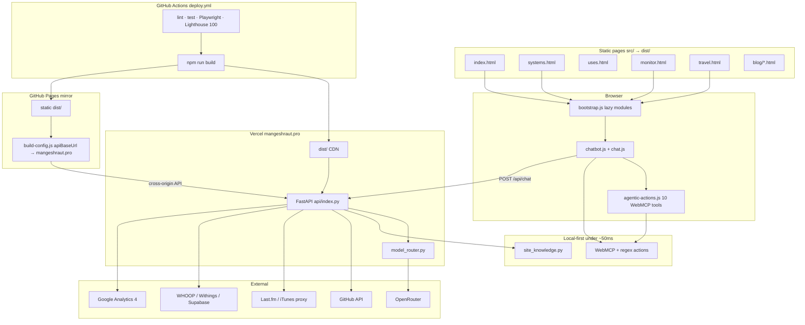
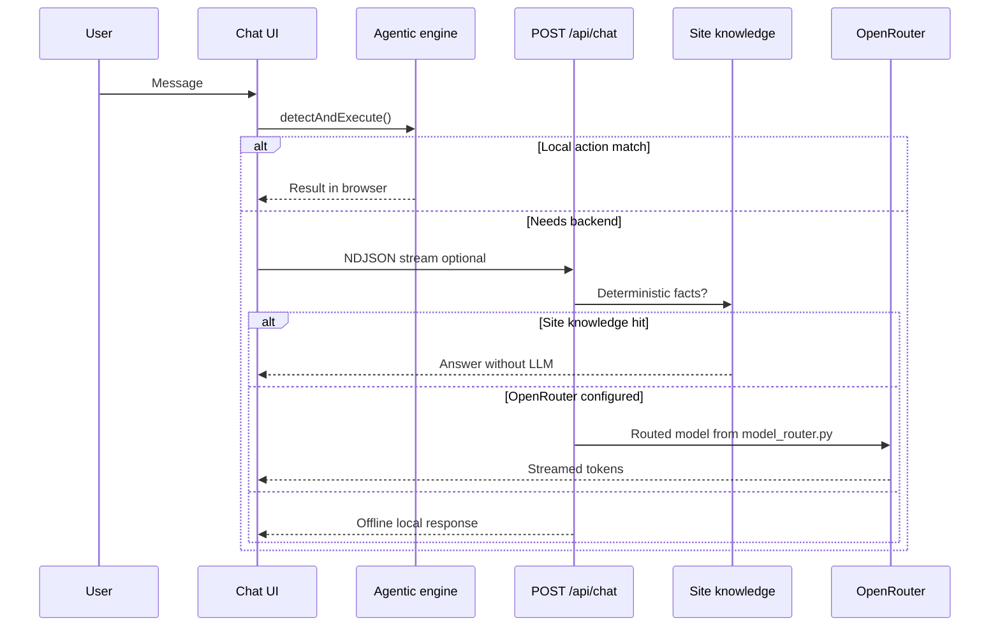

# Mangesh Raut — Agentic Full-Stack Portfolio

<p align="center">
  <a href="https://mangeshraut.pro">
    
    
  </a>
</p>
<p align="center"><sub>Homepage · Light mode (left) · Dark mode (right) · June 2026</sub></p>

<p align="center">
  <a href="https://mangeshraut.pro"></a>
  <a href="https://mangeshraut712.github.io/mangeshrautarchive/"></a>
  <a href="https://github.com/mangeshraut712/mangeshrautarchive/actions/workflows/deploy.yml"></a>
  <a href="LICENSE"></a>
  <a href="https://nodejs.org/"></a>
  <a href="https://github.com/sponsors/mangeshraut712"></a>
</p>

<p align="center">
  <strong>Production AI-first portfolio with local-first agentic actions, dual hosting, and a full CI quality matrix.</strong><br>
  <sub>Vanilla ES modules · FastAPI on Vercel · WWDC26 liquid glass · WebMCP · OpenRouter</sub>
</p>

<p align="center">
  <a href="https://mangeshraut.pro"><strong>Live site</strong></a>
  &nbsp;·&nbsp;
  <a href="https://mangeshraut.pro/monitor"><strong>Monitor</strong></a>
  &nbsp;·&nbsp;
  <a href="https://mangeshraut.pro/systems"><strong>Engineering</strong></a>
  &nbsp;·&nbsp;
  <a href="#-architecture"><strong>Architecture</strong></a>
  &nbsp;·&nbsp;
  <a href="#-local-development"><strong>Quick start</strong></a>
</p>

---

## Table of contents

- [Overview](#overview)
- [About the builder](#about-the-builder)
- [Live surfaces](#live-surfaces)
- [Homepage sections](#homepage-sections)
- [Features](#features)
- [Apple Platform 2026 (WWDC26) audit — 100% coverage](#apple-platform-2026-wwdc26-audit--100-coverage)
- [Blog & case studies](#blog--case-studies)
- [Tech stack](#tech-stack)
- [Architecture](#architecture)
- [AI model routing](#ai-model-routing)
- [AssistMe & WebMCP tools](#assistme--webmcp-tools)
- [Integrations & OAuth](#integrations--oauth)
- [PWA & installability](#pwa--installability)
- [Performance & lazy loading](#performance--lazy-loading)
- [Security](#security)
- [Quality assurance & CI](#quality-assurance--ci)
- [Project structure](#project-structure)
- [API reference](#api-reference)
- [Local development](#local-development)
- [Deployment & CI/CD](#deployment--cicd)
- [Documentation](#documentation)
- [Changelog highlights](#changelog-highlights)
- [Sponsors](#sponsors)
- [Contributing](#contributing)
- [License & contact](#license--contact)

---

## Overview

This repository powers [mangeshraut.pro](https://mangeshraut.pro) — a static-first portfolio with a **FastAPI** backend on Vercel, not a React/Next.js app. The runtime is **vanilla ES modules**, **Tailwind CSS v4**, and a custom **esbuild** build pipeline.

**AssistMe** is the on-site AI assistant. It runs **deterministic actions in the browser first** (navigation, resume download, theme toggle, project filters) via regex + **WebMCP** (`navigator.modelContext`). Only when local logic cannot answer does the client call **`POST /api/chat`** with **NDJSON streaming** through **OpenRouter** (`model_router.py`).

The same `dist/` output is deployed to **Vercel** (primary + API) and **GitHub Pages** (static mirror with `apiBaseUrl` pointing at production).

**Repository scale (June 2026):** 6 static HTML entry points · 40+ public GitHub repositories · 12 technical articles · 5 in-depth case studies · 10 WebMCP tools · 99 automated tests (29 Vitest + 70 pytest) · 15 Playwright browser projects.

---

## About the builder

|               |                                                                                                                               |
| ------------- | ----------------------------------------------------------------------------------------------------------------------------- |
| **Name**      | Mangesh Raut                                                                                                                  |
| **Role**      | Software Development Engineer                                                                                                 |
| **Education** | MS Computer Science — Drexel University                                                                                       |
| **Focus**     | Production AI products, agentic workflows, developer infrastructure, modern web systems                                       |
| **Site**      | [mangeshraut.pro](https://mangeshraut.pro) — evidence-first portfolio (code, benchmarks, telemetry — not bullet-point claims) |

**What I build:** AI products · agentic systems · full-stack applications · RAG pipelines · developer tools · system monitors · production APIs · design systems. See [Architecture](#architecture) for engineering decisions documented on `/systems`.

---

## Live surfaces

| Surface          | URL                                                                                                 | Highlights                                                                 |
| ---------------- | --------------------------------------------------------------------------------------------------- | -------------------------------------------------------------------------- |
| **Portfolio**    | [mangeshraut.pro](https://mangeshraut.pro)                                                          | AssistMe, 13 homepage sections, projects, blog, health widget, PWA         |
| **GitHub Pages** | [mangeshraut712.github.io/mangeshrautarchive](https://mangeshraut712.github.io/mangeshrautarchive/) | Same `dist/` build; `apiBaseUrl` → production API                          |
| **Engineering**  | [mangeshraut.pro/systems](https://mangeshraut.pro/systems)                                          | CI benchmarks, architecture log, failed experiments, hiring evidence Q&A   |
| **Monitor**      | [mangeshraut.pro/monitor](https://mangeshraut.pro/monitor)                                          | Health probes, uptime matrix, CSP reports, AI metrics, deployment surfaces |
| **Travel**       | [mangeshraut.pro/travel](https://mangeshraut.pro/travel)                                            | MapLibre GL atlas — routes, location gallery, searchable narratives        |
| **Uses**         | [mangeshraut.pro/uses](https://mangeshraut.pro/uses)                                                | Hardware / software / AI stack from `usesStack`                            |
| **Blog**         | [mangeshraut.pro/blog](https://mangeshraut.pro/blog)                                                | 12 build-generated Field Notes articles                                    |
| **404**          | [mangeshraut.pro/404](https://mangeshraut.pro/404.html)                                             | Branded not-found with navigation recovery                                 |

---

## Homepage sections

The main portfolio (`index.html`) is a single-page app with **13 primary nav landmarks** plus embedded sub-regions:

| Section             | ID                      | What it contains                                                               |
| ------------------- | ----------------------- | ------------------------------------------------------------------------------ |
| **Hero**            | `#home`                 | Profile, role rotator, vibe-stack flyout, GA4 portfolio-reach panel, hero CTAs |
| **About**           | `#about`                | Bio, timeline highlights, interactive cards                                    |
| **Skills**          | `#skills`               | Category panels, skills visualization (lazy-loaded)                            |
| **Experience**      | `#experience`           | Work history cards                                                             |
| **Projects**        | `#projects`             | GitHub showcase grid, activity graph, lens filters, XR detail modal            |
| **Education**       | `#education`            | Degree timeline                                                                |
| **Publications**    | `#publications`         | Research / writing citations                                                   |
| **Awards**          | `#awards`               | Honors and recognition                                                         |
| **Recommendations** | `#recommendations`      | LinkedIn-style endorsement cards                                               |
| **Certifications**  | `#certifications`       | Credential grid                                                                |
| **Blog**            | `#blog`                 | 12 technical articles with generated HTML pages                                |
| **Contact**         | `#contact`              | Form, Calendly, social links, merged health + Currently shelf                  |
| **Debug Runner**    | `#debug-runner-section` | Interactive browser game (lazy-loaded)                                         |

**Additional embedded regions:** `#engineering` (evidence teaser linking to `/systems`) · `#currently-section` (shows / books / music tabs with local poster assets) · health widget (WHOOP / Withings when connected).

---

## Features

| Area                | What it does                                                                                            | Key files / endpoints                                 |
| ------------------- | ------------------------------------------------------------------------------------------------------- | ----------------------------------------------------- |
| **AssistMe**        | 10 WebMCP tools + regex fast-path before LLM; NDJSON streaming chat with KaTeX + DOMPurify markdown     | `agentic-actions.js`, `chat.js`, `POST /api/chat`     |
| **Command palette** | Indexes sections, blog, case studies, travel, debug runner; `⌘K` / `Ctrl+K`; lazy-loaded on first click | `#search-overlay`, `search.js`                        |
| **Projects**        | Live GitHub grid, lens filters, XR detail modal, multi-origin proxy fallback                            | `github-projects.js`, `/api/github/*`                 |
| **Currently shelf** | Shows / books / music tabs; local posters; Last.fm via `/api/music/recent` + `/api/music/artwork`       | `currently.js`, `lastfm.js`                           |
| **Health widget**   | WHOOP + Withings metrics when OAuth connected; Supabase snapshots                                       | `/api/health-vitals/summary`                          |
| **Portfolio reach** | GA4 Data API hero panel — realtime users, events, views, countries                                      | `#portfolio-reach-panel`                              |
| **Design system**   | WWDC26 liquid glass, solid light/dark surfaces, dynamic island nav, view transitions                    | `wwdc26-liquid-glass.css`, `view-transitions-nav.js`  |
| **Accessibility**   | Toolbar (share, shortcuts, font scale, glass tint), skip links, axe-core CI gate                        | `accessibility.js`                                    |
| **Forms**           | Contact + newsletter with server validation and rate limiting                                           | `POST /api/contact`, `POST /api/newsletter/subscribe` |
| **Analytics**       | `@vercel/analytics` + deferred GA4 gtag (interaction-triggered)                                         | `analytics.js`, `vercel-analytics.js`                 |
| **Build**           | esbuild, Sharp, hero-critical CSS, blog/case-study generators                                           | `scripts/build/build.js`                              |
| **Polish**          | Apple haptics, AOD dim mode, birthday easter-egg, share widget                                          | `apple-haptics.js`, `share-widget.js`                 |
| **Testing**         | 15 Playwright projects, 70 pytest tests, Lighthouse **100/100** CI on `dist/`                           | `tests/`                                              |

---

## Apple Platform 2026 (WWDC26) audit — 100% coverage

Sitewide parity with Apple’s 2026 design language: **Liquid Glass** (clear / balanced / tinted), **WebGL refraction** on nav + chatbot + hero/projects, **Dynamic Island** (home), **command palette** on all pages, **share sheet**, **accessibility toolbar**, **high contrast**, **reduce-transparency sync**, and **solid `#FFFFFF` / `#000000`** page shells.

| Phase  | Delivered                                                                                                                                                                          | Key paths                                                      |
| ------ | ---------------------------------------------------------------------------------------------------------------------------------------------------------------------------------- | -------------------------------------------------------------- |
| **P0** | Unified asset version `20260701q` (single source in `asset-version.mjs`), `high-contrast.css`, blog/case-study WebGL CSS, monitor dead CSS removed, `reduced-transparency-sync.js` | `scripts/build/asset-version.mjs`                              |
| **P1** | `subpage-chrome.js` on systems/uses/travel/monitor/404/blog/case studies; global search overlay; extended WebGL chrome                                                             | `src/js/core/subpage-chrome.js`                                |
| **P2** | Experience cards, awards grid, skills categories, education glass tokens, health widget alignment                                                                                  | `experience.css`, `awards.css`, `skills-visualization.js`      |
| **P3** | Control Center (uses), Live Activity strip, Quick Look projects, Game leaderboard                                                                                                  | `control-center.js`, `live-activity-strip.js`, `quick-look.js` |

**Verify locally:**

```bash
npm run check
npm run qa:apple-platform   # 10 Playwright audit specs (glass, a11y, ⌘K, control center, skills)
```

| Page                        | Glass boot | A11y toolbar | ⌘K search | Share | WebGL chrome        |
| --------------------------- | ---------- | ------------ | --------- | ----- | ------------------- |
| `index.html`                | ✅         | ✅           | ✅        | ✅    | ✅                  |
| `systems.html`              | ✅         | ✅           | ✅        | ✅    | ✅ nav              |
| `uses.html`                 | ✅         | ✅           | ✅        | ✅    | ✅ + Control Center |
| `travel.html`               | ✅         | ✅           | ✅        | ✅    | ✅ nav              |
| `monitor.html`              | ✅         | ✅           | ✅        | ✅    | ✅ nav              |
| `404.html`                  | ✅         | ✅           | ✅        | ✅    | —                   |
| Blog / case studies (build) | ✅         | ✅           | ✅        | ✅    | ✅ CSS              |

## Blog & case studies

### Technical articles (12)

Generated at build time from `blog-data.js` into `dist/blog/*.html`:

| #   | Article                                                                     |
| --- | --------------------------------------------------------------------------- |
| 1   | Google I/O 2026 Field Notes: Agentic Web, Gemini, Gemma, and WebNN          |
| 2   | X Algorithm Field Notes: Retrieval, Hydration, Ranking, and Real-Time Feeds |
| 3   | Google AI Ecosystem Field Notes: Multimodal Intelligence as a Product Layer |
| 4   | OpenClaw Field Notes: Open-Source Agents Need More Than Autonomy            |
| 5   | Wispr Flow Field Notes: Voice Input as a Power Tool                         |
| 6   | NVIDIA Field Notes: Why AI Infrastructure Became the Product                |
| 7   | Global AI Race Field Notes: Models, Nations, and the Infrastructure Layer   |
| 8   | AI Code Editors Field Notes: VS Code, Cursor, Windsurf, and Antigravity     |
| 9   | Apple at 50 Field Notes: The Product Discipline Behind the Myth             |
| 10  | Anthropic Mythos Field Notes: Philosophy, Simulation, and AI Safety         |
| 11  | WWDC 2026 Field Notes: Apple Intelligence, Siri, and Private AI             |
| 12  | NotebookLM 2026 Field Notes: From Document Q&A to Research Workflow         |

### Case studies (5)

Defined in `case-studies-data.js` — searchable in the command palette and linked from `/systems`:

| Case study                                 | Focus                                         |
| ------------------------------------------ | --------------------------------------------- |
| **mangeshraut.pro — Agentic Portfolio**    | This site — dual hosting, WebMCP, CI evidence |
| **HindAI — Grounded Philosophy Assistant** | RAG + citation-grounded answers               |
| **CES Energy Analytics Platform**          | Enterprise dashboard / analytics              |
| **AssistMe Virtual Assistant**             | Multi-surface AI assistant product            |
| **Bug Reporting System**                   | Full-stack defect tracking workflow           |

Flagship repos: `mangeshrautarchive` · `HindAI` · `AssistMe Virtual Assistant` · `CES Energy Platform` · `Bug Reporting System`

---

## Tech stack

Versions below match `package.json` / `requirements.txt` in this repo.

| Layer                   | Technologies                                                                                             |
| ----------------------- | -------------------------------------------------------------------------------------------------------- |
| **Frontend**            | Vanilla ES modules, Tailwind CSS **4.0.9** (`@tailwindcss/cli` **4.3.1**), no production React framework |
| **Agentic**             | WebMCP `navigator.modelContext`, AssistMe action handler, NDJSON chat UI                                 |
| **AI backend**          | OpenRouter via `model_router.py` (Grok portfolio tier, Fusion compare, Auto general, Gemini fast-path)   |
| **API**                 | FastAPI **0.136.1**, Pydantic **2.13.4**, Uvicorn **0.47.0**, httpx **0.28.1**                           |
| **Data & integrations** | GitHub REST, Last.fm, Google Analytics 4, Firestore reach, Supabase health vitals, WHOOP, Withings       |
| **Build**               | esbuild **0.28.0**, Sharp **0.35.2**, custom Node pipeline                                               |
| **Analytics (client)**  | `@vercel/analytics` **2.0.1**                                                                            |
| **Markdown**            | `marked` **18.0.5**, `isomorphic-dompurify`, KaTeX (chat/blog)                                           |
| **Testing**             | Playwright **1.58.2**, Vitest **4.1.6**, `@axe-core/playwright` **4.11.1**, Lighthouse CI                |
| **Lint / format**       | ESLint **9.21.0**, Stylelint **16.26.1**, Prettier **3.8.4**, flake8 (Python)                            |
| **Static analysis**     | React Doctor **0.5.8** (dependency graph via `src/js/entry.js`; informational in CI)                     |
| **Hosting**             | Vercel (API + CDN) + GitHub Pages (static mirror)                                                        |
| **Runtimes**            | Node **22.x**, Python **3.12**                                                                           |

### Uses page stack (`/uses`)

Rendered from `usesStack` in `engineering-showcase-data.js`:

| Category         | Tools                                                                 |
| ---------------- | --------------------------------------------------------------------- |
| **Hardware**     | MacBook Pro (Apple Silicon), Studio Display, AirPods Pro              |
| **Software**     | macOS, Raycast, Arc / Safari, iTerm                                   |
| **AI stack**     | Cursor, Claude Code, OpenRouter, Codex                                |
| **Engineering**  | FastAPI, React, Next.js, Vercel, GitHub Actions, Playwright           |
| **Fonts**        | SF Pro, Inter (fallback)                                              |
| **Theme**        | Solid white/black surfaces, Apple 2026 design tokens, dark/light sync |
| **Productivity** | Notion, Linear-style task lists, GitHub Projects                      |

---

## Architecture

### System map



### Chat request flow



**Design principles:** local-first actions · dual surface (Vercel + GitHub Pages) · secrets only in server env · every `main` push runs the full quality gate before deploy.

### Key architecture decisions (documented on `/systems`)

| Decision                                   | Rationale                                             |
| ------------------------------------------ | ----------------------------------------------------- |
| **FastAPI over serverless functions only** | Async streaming for NDJSON chat                       |
| **OpenRouter over single provider**        | Model routing beats lock-in                           |
| **WebMCP + regex before LLM**              | ~20× faster for navigation and portfolio actions      |
| **Vanilla ES modules over React SPA**      | Smaller bundle, no hydration tax, Lighthouse-friendly |
| **Rejected microservices**                 | Complexity without benefit at this scale              |
| **Rejected vector DB**                     | Section-indexed search was sufficient                 |
| **Rejected prompt-only navigation**        | Unreliable vs deterministic handlers                  |

---

## AI model routing

`model_router.py` selects the OpenRouter model per message — no client-side model picker required:

| Tier                  | Model (`api/config.py`)   | When used                                                                   |
| --------------------- | ------------------------- | --------------------------------------------------------------------------- |
| **Portfolio primary** | `x-ai/grok-4.3`           | Questions about Mangesh, skills, experience, projects, hire intent          |
| **Fusion compare**    | `openrouter/fusion`       | Compare / vs / trade-offs / multi-perspective analysis                      |
| **Auto router**       | `openrouter/auto`         | General open-domain queries (allowed families: Grok, Gemini, Claude, GPT-5) |
| **Fast fallback**     | `google/gemini-2.5-flash` | Default when `OPENROUTER_MODEL` unset or as lightweight path                |

**Before any LLM call:** `site_knowledge.py` answers deterministic portfolio facts · regex agentic actions run in the browser. Rate limits and input sanitization are documented in [Security](#security).

**Optional web tools:** `should_use_web_tools()` can augment answers for time-sensitive queries when configured.

---

## AssistMe & WebMCP tools

Ten tools are registered when `navigator.modelContext` is available (`agentic-actions.js`):

| Tool                   | Action                                                       |
| ---------------------- | ------------------------------------------------------------ |
| `navigate_to_section`  | Scroll to a portfolio section                                |
| `download_resume`      | Download resume PDF                                          |
| `schedule_meeting`     | Open Calendly popup                                          |
| `open_contact_form`    | Focus contact form                                           |
| `copy_contact_info`    | Copy email / social links                                    |
| `search_portfolio`     | Open global search with query                                |
| `filter_projects`      | Filter GitHub showcase by technology                         |
| `open_social_media`    | Open GitHub, LinkedIn, or X                                  |
| `toggle_theme`         | Switch light / dark / system                                 |
| `update_health_metric` | Update WHOOP/Withings widget metric (connected integrations) |

Natural-language commands in AssistMe use the same handlers via regex detection in `chat.js` before any network call.

**Keyboard shortcuts (accessibility toolbar):** `?` shortcuts panel · `⌘K` command palette · theme persists in `localStorage`.

---

## Integrations & OAuth

Server-side OAuth flows in `api/integrations/` — tokens never exposed to the browser bundle.

| Integration         | Endpoints                                                                  | Purpose                                |
| ------------------- | -------------------------------------------------------------------------- | -------------------------------------- |
| **WHOOP**           | `/api/integrations/whoop/connect` · `/callback`                            | Recovery, strain, sleep metrics        |
| **Withings**        | `/api/integrations/withings/connect` · `/callback`                         | Weight, body composition               |
| **Google Calendar** | `/api/integrations/google-calendar/connect` · `/api/calendar/availability` | Meeting availability for Calendly flow |
| **Supabase**        | Internal store                                                             | Daily health summary snapshots         |
| **Health summary**  | `GET /api/health-vitals/summary` · `POST /api/health-vitals/sync`          | Sanitized widget data for homepage     |
| **Cron sync**       | `GET /api/cron/health-vitals-sync`                                         | Hourly scheduled provider refresh      |

Optional: Upstash Redis for shared reach counters · GA4 Data API (property `537627192`) for the hero reach panel. See [.env.example](.env.example) and `scripts/integrations/`.

---

## PWA & installability

`manifest.json` enables install-to-homescreen on supported platforms:

| Property        | Value                                           |
| --------------- | ----------------------------------------------- |
| **Name**        | Mangesh Raut \| Software Engineer               |
| **Display**     | `standalone` with `minimal-ui` override         |
| **Theme color** | `#007AFF`                                       |
| **Icons**       | SVG + 180×180 / 192×192 PNG (maskable)          |
| **Screenshots** | Wide homepage + narrow iPhone 17 Pro Max splash |

**App shortcuts:** Projects · Contact · Travel Atlas · System Monitor

**Apple web app:** `apple-mobile-web-app-capable` · `black-translucent` status bar · dedicated PWA splash assets in `assets/images/`.

---

## Performance & lazy loading

`bootstrap.js` defers non-critical work to protect LCP and Lighthouse scores:

| Strategy                  | Implementation                                                                                     |
| ------------------------- | -------------------------------------------------------------------------------------------------- |
| **Eager modules**         | `accessibility.js` only                                                                            |
| **Section lazy load**     | Intersection Observer loads projects, blog, currently, skills, debug-runner CSS + JS near viewport |
| **Interaction lazy load** | AssistMe, search, share widget load on first click (`bindInteractionModuleLoader`)                 |
| **Deferred styles**       | CSS groups (`projects`, `blog`, `currently`, `assistant`, etc.) injected on demand                 |
| **Deferred analytics**    | GA4 gtag loads after first user interaction; skipped entirely during `perf-audit` runs             |
| **Perf-audit mode**       | `perf-audit-head.js` + `?perf-audit=1` — slim CSS, no analytics, Lighthouse-specific UA detection  |
| **Hero-critical CSS**     | Inlined / bundled separately in `build.js` for first paint                                         |
| **Image pipeline**        | Sharp optimization + WebP conversion at build time                                                 |

**Lighthouse CI:** loopback audits use `?perf-audit=1`; production nightly monitoring audits the live Vercel URL without the flag.

---

## Security

| Control                | Details                                                                                          |
| ---------------------- | ------------------------------------------------------------------------------------------------ |
| **Secrets**            | API keys server-side only — never in `build-config.js` or client bundles                         |
| **Rate limiting**      | 20 req / 60 s default on chat and sensitive endpoints                                            |
| **CSP reporting**      | `POST /api/csp-report` ingested by monitor dashboard                                             |
| **OAuth state**        | HMAC-signed state tokens via `oauth_state.py`                                                    |
| **Integration admin**  | `require_integration_admin` guard on connect/disconnect routes                                   |
| **Input sanitization** | DOMPurify on client markdown · Pydantic validation on API                                        |
| **CI security**        | `npm audit --audit-level=high` + `npm run security-check` on every deploy                        |
| **CORS**               | iTunes artwork proxied through `/api/music/artwork` — no direct third-party fetches from browser |

---

## Quality assurance & CI

### GitHub Actions (`deploy.yml` on every push/PR to `main`)

1. `npm audit --audit-level=high` + `npm run security-check`
2. ESLint + Stylelint
3. Vitest (29 unit tests) + Apple Platform audit (10 Playwright specs via `npm run qa:apple-platform`)
4. React Doctor (`doctor:full`, non-blocking)
5. Python flake8 + dead-code scan + **70** API tests (pytest)
6. Playwright smoke + axe-core (`qa:browser:ci`)
7. Lighthouse desktop + mobile on `dist/` (`qa:lighthouse:ci`)
8. Build → GitHub Pages deploy → live commit verification

Nightly **[post-deploy-monitoring.yml](.github/workflows/post-deploy-monitoring.yml)** checks production reachability and Lighthouse on Vercel.

### Thresholds (June 2026)

| Gate                                          | Target                                                                                     |
| --------------------------------------------- | ------------------------------------------------------------------------------------------ |
| **Lighthouse CI** (`dist/`, desktop + mobile) | **100** Performance · **100** Accessibility · **100** Best Practices · **100** SEO         |
| **React Doctor** (`doctor:full`)              | **97+/100** (static graph audit via `index.js` → `entry.js`; non-blocking in CI)           |
| **axe-core** (homepage)                       | Zero critical / serious violations                                                         |
| **Playwright**                                | 15 named browser projects (Chrome, Safari, Firefox, Edge, Pixel, iPhone, iPad, responsive) |
| **Vitest**                                    | 29 tests across 4 files                                                                    |
| **pytest**                                    | 70 API tests                                                                               |

### Useful commands

| Command                             | Purpose                                                 |
| ----------------------------------- | ------------------------------------------------------- |
| `npm run check`                     | ESLint + Stylelint + Prettier + Vitest + pytest         |
| `npm run qa:prod-ready`             | Security + full lint/test + browser + Lighthouse        |
| `npm run doctor:full`               | React Doctor static graph audit (97+/100 target)        |
| `npm run qa:lighthouse:ci`          | Build `dist/` and run desktop + mobile Lighthouse gates |
| `npm run qa:browser:ci`             | Playwright smoke + axe-core on dev server               |
| `npm run verify:deploy-sync`        | Compare local `dist/` build commit vs live surfaces     |
| `npm run verify:deploy-sync:remote` | Compare deploy commit on Vercel vs GitHub Pages         |

Dev server commands (`npm run dev`, `npm run build`, etc.) are listed in [Local development](#local-development).

---

## Project structure

```
mangeshrautarchive/
├── api/                          # FastAPI (Vercel entry: api/index.py)
│   ├── routes/                   # chat, github, media, analytics, monitor, integrations
│   ├── integrations/             # WHOOP, Withings, Google Calendar, Supabase
│   ├── model_router.py           # OpenRouter model selection
│   └── site_knowledge.py         # Deterministic portfolio answers
├── src/                          # Static site source → dist/
│   ├── *.html                    # index, systems, uses, monitor, travel, 404
│   ├── assets/                   # css/, images/, files/
│   └── js/                       # core/, modules/, services/, utils/, data/
├── scripts/
│   ├── build/                    # build.js, generators, clean.js
│   ├── deployment/               # Lighthouse, security-check, deploy sync (CI)
│   ├── utils/                    # dev-all, local-server, serve-dist
│   ├── integrations/             # Vercel env sync (manual/ for one-off setup)
│   ├── qa/                       # CI: iphone-17-pro-max, promotion-fps; manual/ for audits
│   └── offline/travel-data/      # Optional travel atlas data generators (not in build)
├── tests/
│   ├── api/                      # pytest (70 tests)
│   └── e2e/                      # Playwright smoke + a11y (CI)
├── config/                       # pyright, vulture (CI dead-code scan)
├── index.js                      # react-doctor entry shim → src/js/entry.js
├── vercel.json                   # dist/ + FastAPI rewrites + cron
└── .github/workflows/            # deploy.yml, post-deploy-monitoring.yml
```

OpenRouter MCP (dev): `npm run setup:openrouter-mcp` — template at `scripts/integrations/cursor-openrouter-mcp.example.json`.

---

## API reference

Production base: `https://mangeshraut.pro`

### Core & chat

```bash
curl https://mangeshraut.pro/api/health
curl https://mangeshraut.pro/api/status
curl https://mangeshraut.pro/api/monitor/status
curl https://mangeshraut.pro/api/chat/health
curl https://mangeshraut.pro/api/models
```

### Content, GitHub & reach

```bash
curl "https://mangeshraut.pro/api/github/repos/public?username=mangeshraut712"
curl https://mangeshraut.pro/api/github/profile
curl https://mangeshraut.pro/api/analytics/reach
curl https://mangeshraut.pro/api/analytics/views
```

### Media

```bash
curl "https://mangeshraut.pro/api/music/recent?user=mbr63&limit=5"
curl "https://mangeshraut.pro/api/music/artwork?track=Song&artist=Artist"
curl "https://mangeshraut.pro/api/posters/movie?title=Inception"
curl "https://mangeshraut.pro/api/posters/book?title=Deep+Learning"
```

### Health & integrations

```bash
curl https://mangeshraut.pro/api/health-vitals/summary
curl https://mangeshraut.pro/api/integrations/status
curl "https://mangeshraut.pro/api/calendar/availability"
```

### Monitor (public ops)

```bash
curl https://mangeshraut.pro/api/monitor/health
curl https://mangeshraut.pro/api/monitor/metrics
curl https://mangeshraut.pro/api/monitor/events
curl https://mangeshraut.pro/api/monitor/engineering
curl https://mangeshraut.pro/api/monitor/ai-metrics
curl https://mangeshraut.pro/api/monitor/security
```

### Forms

```bash
# Contact and newsletter (POST with JSON body)
curl -X POST https://mangeshraut.pro/api/contact -H "Content-Type: application/json" -d '{"name":"...","email":"...","message":"..."}'
curl -X POST https://mangeshraut.pro/api/newsletter/subscribe -H "Content-Type: application/json" -d '{"email":"..."}'
```

OpenAPI interactive docs: `http://127.0.0.1:8001/docs` when running the API locally. Full monitor API reference: `GET /api/monitor/docs`.

---

## Local development

**Requirements:** Node.js 22.x, Python 3.12+, optional [uv](https://github.com/astral-sh/uv) for faster pytest.

```bash
git clone https://github.com/mangeshraut712/mangeshrautarchive.git
cd mangeshrautarchive
npm install --no-audit --no-fund

python3 -m venv .venv && source .venv/bin/activate
pip install -r requirements.txt -r requirements-dev.txt

cp .env.example .env    # set OPENROUTER_API_KEY at minimum
npm run dev             # frontend :4000 + API :8001
```

### Environment variables (summary)

Copy [.env.example](.env.example) → `.env` (`.env.local` overrides). Key groups:

| Group            | Variables                                     | Required for                               |
| ---------------- | --------------------------------------------- | ------------------------------------------ |
| **AI**           | `OPENROUTER_API_KEY`, `OPENROUTER_MODEL`      | AssistMe chat (minimum viable local setup) |
| **GitHub**       | `GITHUB_TOKEN` / `GITHUB_PAT`                 | Higher rate limits on repo proxy           |
| **Last.fm**      | `LASTFM_API_KEY`, `LASTFM_USERNAME`           | Live listening shelf (defaults to `mbr63`) |
| **Analytics**    | `GA4_PROPERTY_ID`, `GOOGLE_ANALYTICS_*`       | Detailed Portfolio Reach panel             |
| **Redis**        | `UPSTASH_REDIS_REST_*`                        | Shared reach counters in production        |
| **Health OAuth** | WHOOP / Withings / Google Calendar client IDs | Health widget + calendar availability      |
| **Supabase**     | `SUPABASE_URL`, `SUPABASE_SERVICE_ROLE_KEY`   | Health vitals persistence                  |

| Service  | URL                        |
| -------- | -------------------------- |
| Frontend | http://127.0.0.1:4000      |
| FastAPI  | http://127.0.0.1:8001      |
| API docs | http://127.0.0.1:8001/docs |

Production build preview:

```bash
npm run build
PORT=4174 npm run serve:dist
```

### Common dev commands

| Command                         | Purpose                                        |
| ------------------------------- | ---------------------------------------------- |
| `npm run dev`                   | Frontend dev server (:4000) + FastAPI (:8001)  |
| `npm run dev:frontend`          | Frontend only                                  |
| `npm run dev:backend`           | API only (reuses existing instance if running) |
| `npm run build`                 | Production `dist/` output                      |
| `npm run check`                 | Lint + unit + API tests                        |
| `npm run qa:smoke`              | Playwright smoke on dev server                 |
| `npm run qa:lighthouse:desktop` | Lighthouse gate on built `dist/`               |

---

## Deployment & CI/CD

| Workflow                                                                   | Trigger                | Role                                          |
| -------------------------------------------------------------------------- | ---------------------- | --------------------------------------------- |
| [deploy.yml](.github/workflows/deploy.yml)                                 | Push/PR `main`, manual | Quality gates → build → GitHub Pages → verify |
| [post-deploy-monitoring.yml](.github/workflows/post-deploy-monitoring.yml) | Daily 14:00 UTC        | Production reachability + Lighthouse          |

**Dual hosting:** CI deploys GitHub Pages from `dist/`. Vercel production deploys via the repo integration on the same `main` commits. `build-config.json` stores `gitCommit` for cross-surface parity checks.

### Keeping local, Vercel, and GitHub Pages in sync

All three surfaces serve the same `dist/` output from `main`. After any change:

```bash
npm run build                              # produces dist/ with build-config.json gitCommit
npm run verify:deploy-sync                 # local dist vs live (optional)
npm run verify:deploy-sync:remote -- --parity   # Vercel + GitHub Pages same commit
```

| Surface          | URL                                                             | How it updates                          |
| ---------------- | --------------------------------------------------------------- | --------------------------------------- |
| **Local dev**    | http://127.0.0.1:4000 (`npm run dev`) or `:4174` (`serve:dist`) | Serves `src/` or built `dist/` directly |
| **Vercel**       | https://mangeshraut.pro                                         | Auto-deploy on push to `main`           |
| **GitHub Pages** | https://mangeshraut712.github.io/mangeshrautarchive/            | `deploy.yml` uploads `dist/` on CI pass |

**Cache busting:** Static HTML in `src/*.html` uses `?v=20260701q` query strings. Blog and case-study pages read `ASSET_VER` from `scripts/build/asset-version.mjs`. The build step also stamps a timestamp version on `dist/` JS module imports. Bump `ASSET_VER` and run `sed` across `src/*.html` when shipping CSS/JS changes that must invalidate browser caches immediately.

---

## Documentation

| Doc                                                                | Contents                                   |
| ------------------------------------------------------------------ | ------------------------------------------ |
| [README.md](README.md)                                             | Setup, CI, API reference, deployment       |
| [AGENTS.md](AGENTS.md)                                             | AI agent briefing for contributors         |
| [.env.example](.env.example)                                       | Environment variables and integration keys |
| [.github/copilot-instructions.md](.github/copilot-instructions.md) | GitHub Copilot project rules               |

---

## Changelog highlights

**June 2026**

- **Deploy sync:** Vercel + GitHub Pages parity verified via `verify:deploy-sync:remote --parity`
- **Debug Runner:** Restored classic layout; fixed game-section footer spacing (`chrome-surfaces.css` wins over platform overrides)
- **Responsive audit:** Mobile/tablet/desktop alignment fixes across navbar, hero, engineering showcase, travel atlas, FAB stack
- **Cache bust:** Unified asset version `20260701q` across all `src/*.html` + `asset-version.mjs`
- Lighthouse CI **100/100** (desktop + mobile on `dist/`) · React Doctor **97/100**
- iTunes artwork proxy (`/api/music/artwork`) — CORS + Best Practices fix
- Perf-audit detection narrowed for Playwright E2E
- Engineering evidence page (`/systems`), solid theme surfaces, sitewide card audit
- README reorganized — deduplicated sections, sponsors restored, deploy-sync docs added

**Earlier 2026**

- AssistMe WebMCP (10 tools) · public monitor · travel atlas · dual-host deploy
- WHOOP / Withings / Google Calendar OAuth · 12 Field Notes articles · command palette

---

## Sponsors

If this project helps your own agentic apps or portfolio work, you can support development through:

<p align="center">
  <a href="https://github.com/sponsors/mangeshraut712"></a>
  <a href="https://buy.stripe.com/14A3cufGUgcV5ePfuA14401"></a>
  <a href="https://www.paypal.com/ncp/payment/LXNHJ5SUGNP82"></a>
</p>

| Method              | Link                                                                                     |
| ------------------- | ---------------------------------------------------------------------------------------- |
| **GitHub Sponsors** | [github.com/sponsors/mangeshraut712](https://github.com/sponsors/mangeshraut712)         |
| **Stripe**          | [buy.stripe.com/14A3cufGUgcV5ePfuA14401](https://buy.stripe.com/14A3cufGUgcV5ePfuA14401) |
| **PayPal**          | [paypal.com/ncp/payment/LXNHJ5SUGNP82](https://www.paypal.com/ncp/payment/LXNHJ5SUGNP82) |

Configured in [.github/FUNDING.yml](.github/FUNDING.yml) for the GitHub **Sponsor** button on the repository.

---

## Contributing

Issues and PRs are welcome. Minimum before opening a PR:

```bash
npm run check
```

For larger changes, run `npm run qa:prod-ready`.

---

## License & contact

**MIT License** — see [LICENSE](LICENSE).

**Mangesh Raut**

- Web: [mangeshraut.pro](https://mangeshraut.pro)
- LinkedIn: [linkedin.com/in/mangeshraut71298](https://linkedin.com/in/mangeshraut71298)
- GitHub: [github.com/mangeshraut712](https://github.com/mangeshraut712)
- Email: mbr63@drexel.edu

---

<p align="center">
  <a href="#mangesh-raut--agentic-full-stack-portfolio">Back to top</a>
</p>
