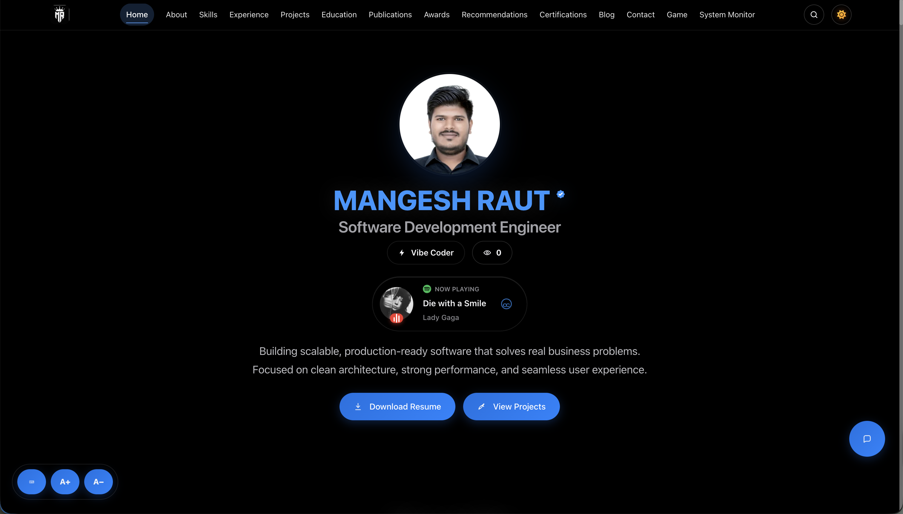
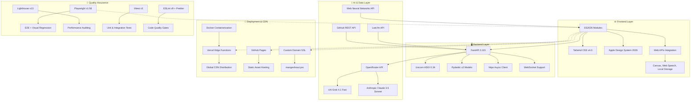

<div align="center">



<h1 style="font-size: 3rem; font-weight: 700; margin: 1rem 0; color: #1d1d1f;">Mangesh Raut</h1>
<h3 style="font-size: 1.5rem; font-weight: 400; margin: 0.5rem 0; color: #86868b;">AI-Powered Interactive Portfolio · Apple 2026 Design</h3>

<p style="font-size: 1.125rem; max-width: 640px; margin: 1rem auto; color: #86868b;">
  A full-stack portfolio featuring live AI chat, real-time GitHub integration, system monitoring dashboard,<br/>
  unified engagement metrics, and an immersive Apple-inspired design system — built with FastAPI &amp; ES2026.
</p>

<div style="display: flex; gap: 1rem; justify-content: center; flex-wrap: wrap; margin: 2rem 0;">
  <a href="https://mangeshraut.pro" style="background: linear-gradient(135deg, #0071e3, #40a9ff); color: white; padding: 0.75rem 1.5rem; border-radius: 25px; text-decoration: none; font-weight: 600; box-shadow: 0 4px 16px rgba(0,113,227,0.3); transition: all 0.2s;">
    🌐 Live Portfolio
  </a>
  <a href="https://github.com/mangeshraut712/mangeshrautarchive" style="background: #f5f5f7; color: #1d1d1f; padding: 0.75rem 1.5rem; border-radius: 25px; text-decoration: none; font-weight: 600; border: 1px solid #d2d2d7; transition: all 0.2s;">
    📖 Source Code
  </a>
  <a href="https://mangeshraut712.github.io/mangeshrautarchive" style="background: #f5f5f7; color: #1d1d1f; padding: 0.75rem 1.5rem; border-radius: 25px; text-decoration: none; font-weight: 600; border: 1px solid #d2d2d7; transition: all 0.2s;">
    📄 GitHub Pages
  </a>
  <a href="#features" style="background: #f5f5f7; color: #1d1d1f; padding: 0.75rem 1.5rem; border-radius: 25px; text-decoration: none; font-weight: 600; border: 1px solid #d2d2d7; transition: all 0.2s;">
    ✨ Features
  </a>
</div>

[](https://mangeshraut.pro)
[](https://github.com/mangeshraut712/mangeshrautarchive/stargazers)
[](https://github.com/mangeshraut712/mangeshrautarchive/network)
[](LICENSE)
[](https://github.com/mangeshraut712/mangeshrautarchive/commits/main)
[](https://github.com/mangeshraut712/mangeshrautarchive/actions)

</div>

---

## 📑 Table of Contents

- [Design Philosophy](#-design-philosophy--inspired-by-apple)
- [Repository Overview](#-repository-overview)
- [Features](#-features)
  - [AI Assistant](#-ai-powered-assistant-assistme) · [Launch Experience](#-premium-launch-experience) · [Media Showcase](#-personal-media-showcase-currently) · [Travel Atlas](#-travel-atlas) · [GitHub Projects](#-github-projects-showcase) · [Debug Runner Game](#-interactive-game-debug-runner) · [System Monitor](#-system-monitoring-dashboard) · [Portfolio Reach](#-portfolio-reach-unified-metric) · [Design System](#-design-system-apple-2026)
- [Architecture & Tech Stack](#%EF%B8%8F-architecture--tech-stack)
- [Getting Started](#-getting-started)
- [Project Structure](#-project-structure)
- [Available Commands](#-available-commands)
- [Performance Metrics](#-performance-metrics)
- [Live Deployments](#-live-deployments)
- [Environment Variables](#-environment-variables)
- [Contributing](#-contributing)
- [License](#-license)
- [Connect & Support](#-connect--support)

---

## 🎨 Design Philosophy — Inspired by Apple

> _"Design is not just what it looks like and feels like. Design is how it works."_ — Steve Jobs

This portfolio is a love letter to Apple's design language — reimagined for the web. Every pixel, animation, and interaction follows the principles that make Apple products feel magical:

<table>
<tr>
<td width="33%" align="center">

**🪩 Clarity**

SF Pro typography, generous whitespace, and a strict visual hierarchy — content speaks first, chrome disappears.

</td>
<td width="33%" align="center">

**✨ Deference**

Glassmorphism panels, neural gradients, and fluid blur effects create depth without competing with content.

</td>
<td width="33%" align="center">

**⚙️ Depth**

Layered translucency, parallax scrolling, and micro-animations provide a sense of dimension and responsiveness.

</td>
</tr>
</table>

| Apple DNA         | Implementation                                                                        |
| ----------------- | ------------------------------------------------------------------------------------- |
| **Dark Mode**     | System-aware auto-switching with `prefers-color-scheme`, smooth 300ms transitions     |
| **Typography**    | SF Pro Display for headlines, SF Pro Text for body, JetBrains Mono for code           |
| **Glassmorphism** | `backdrop-filter: blur(20px)` with layered opacity on cards, nav, and modals          |
| **Motion**        | GPU-accelerated `transform`/`opacity` animations, respects `prefers-reduced-motion`   |
| **Spacing**       | 8px grid system with Apple's signature generous padding                               |
| **Colors**        | Apple system palette — `#0071e3` primary, `#f5f5f7` surface, `#86868b` secondary text |
| **Radius**        | Consistent 12px/16px/25px roundedness matching iOS/macOS components                   |
| **Haptics**       | Subtle hover lifts, press states, and spring-based easing curves                      |

---

## 📊 Repository Overview

<div align="center">


</div>

|               |                                                                                                         |
| ------------- | ------------------------------------------------------------------------------------------------------- |
| **Author**    | [Mangesh Raut](https://github.com/mangeshraut712) — Software Engineer @ CES · MS CS @ Drexel University |
| **Languages** | JavaScript 55% · CSS 27% · Python 6% · HTML/Config 12%                                                  |
| **Codebase**  | 55K+ lines · 200+ files · 840+ commits                                                                  |
| **Created**   | April 2025 · Actively maintained                                                                        |
| **License**   | MIT                                                                                                     |

---

## ✨ Features

<div id="features" align="center">

### 🤖 AI-Powered Assistant (AssistMe)

<details>
<summary style="cursor: pointer; font-size: 1.25rem; font-weight: 600; margin: 1rem 0;"><b>💬 Real-time AI Conversations</b></summary>
<br/>
<div style="background: linear-gradient(135deg, #f5f5f7, #ffffff); padding: 1.5rem; border-radius: 16px; border: 1px solid #e5e5e7;">
  <p style="margin: 0 0 1rem 0;"><strong>AssistMe</strong> provides intelligent interactions:</p>
  <ul style="margin: 0;">
    <li>🔄 Streaming responses with character-by-character display</li>
    <li>💾 Persistent conversation memory across sessions</li>
    <li>🎤 Voice input/output using Web Speech API</li>
    <li>🎯 Website control (theme switching, navigation, downloads)</li>
    <li>📊 Real-time model metadata (tokens, latency, model info)</li>
    <li>🛡️ Privacy dashboard with conversation management</li>
    <li>📴 Offline fallback responses</li>
  </ul>
  <p style="margin: 1rem 0 0 0; font-size: 0.9rem; color: #86868b;"><em>Powered by xAI Grok 4.1 Fast & Anthropic Claude 3.5 Sonnet via OpenRouter API</em></p>
</div>
</details>

### 🎬 Premium Launch Experience

<details>
<summary style="cursor: pointer; font-size: 1.25rem; font-weight: 600; margin: 1rem 0;"><b>✨ Immersive Brand Intro</b></summary>
<br/>
<div style="background: linear-gradient(135deg, #f5f5f7, #ffffff); padding: 1.5rem; border-radius: 16px; border: 1px solid #e5e5e7;">
  <p style="margin: 0 0 1rem 0;">Signature splash experience featuring:</p>
  <ul style="margin: 0;">
    <li>🖋️ Handwritten "नमस्ते" (Namaste) SVG animation</li>
    <li>🎥 Smooth 5.6s cinemagraphic transition sequence</li>
    <li>📱 Responsive scaling with intelligent path length calculations</li>
    <li>♿ Motion-optimized (honors <code>prefers-reduced-motion</code>)</li>
    <li>🎨 Apple 2026-inspired minimal branding</li>
  </ul>
</div>
</details>

### 📺 Personal Media Showcase ("Currently")

<details>
<summary style="cursor: pointer; font-size: 1.25rem; font-weight: 600; margin: 1rem 0;"><b>🎬 Entertainment & Reading Preferences</b></summary>
<br/>
<div style="background: linear-gradient(135deg, #f5f5f7, #ffffff); padding: 1.5rem; border-radius: 16px; border: 1px solid #e5e5e7;">
  <div style="display: grid; grid-template-columns: repeat(auto-fit, minmax(250px, 1fr)); gap: 1rem;">
    <div style="text-align: center; padding: 1rem; background: white; border-radius: 12px; box-shadow: 0 2px 8px rgba(0,0,0,0.1);">
      <span style="font-size: 2rem;">📺</span>
      <h4 style="margin: 0.5rem 0; color: #1d1d1f;">Television & Cinema</h4>
      <p style="margin: 0; color: #86868b; font-size: 0.9rem;">30+ shows/movies including Breaking Bad, Money Heist, Indian TV series. Direct streaming links to Netflix, Prime Video, Disney+.</p>
    </div>
    <div style="text-align: center; padding: 1rem; background: white; border-radius: 12px; box-shadow: 0 2px 8px rgba(0,0,0,0.1);">
      <span style="font-size: 2rem;">🎵</span>
      <h4 style="margin: 0.5rem 0; color: #1d1d1f;">Music Streaming</h4>
      <p style="margin: 0; color: #86868b; font-size: 0.9rem;">Live Last.fm integration showing current tracks and recent listens. Album artwork with Spotify direct links.</p>
    </div>
    <div style="text-align: center; padding: 1rem; background: white; border-radius: 12px; box-shadow: 0 2px 8px rgba(0,0,0,0.1);">
      <span style="font-size: 2rem;">📚</span>
      <h4 style="margin: 0.5rem 0; color: #1d1d1f;">Reading Collection</h4>
      <p style="margin: 0; color: #86868b; font-size: 0.9rem;">9 curated books including Steve Jobs, Atomic Habits, Bhagavad Gita, and Marathi literature.</p>
    </div>
  </div>
  <p style="margin: 1rem 0 0 0; font-size: 0.9rem; color: #86868b;"><em>Curated local artwork ships with site for instant loading, avoiding runtime mismatches</em></p>
</div>
</details>

### 🗺️ Travel Atlas

<details>
<summary style="cursor: pointer; font-size: 1.25rem; font-weight: 600; margin: 1rem 0;"><b>🌍 Map-led destination journal</b></summary>
<br/>
<div style="background: linear-gradient(135deg, #f5f5f7, #ffffff); padding: 1.5rem; border-radius: 16px; border: 1px solid #e5e5e7;">
  <p style="margin: 0 0 1rem 0;"><strong>Travel Atlas</strong> at <code>/travel.html</code> turns visited places into a clean country/city browsing experience:</p>
  <ul style="margin: 0;">
    <li>🗺️ MapLibre basemap with red visited-place pins and active-place fly-to behavior</li>
    <li>🏙️ Country-wise timeline with city, region, and specific landmark context</li>
    <li>🏠 Pune home-base guide with image-backed highlights and concise things-to-do cards</li>
    <li>🔎 Search, featured mode, spotlight tour, category filters, and keyboard-accessible cards</li>
    <li>🌗 Theme-aware glass UI with responsive desktop sidebar and mobile bottom sheet</li>
    <li>🧭 Canonical city normalization for landmarks/suburbs, plus nearest-city fallback in the travel engine</li>
  </ul>
  <p style="margin: 1rem 0 0 0; font-size: 0.9rem; color: #86868b;"><em>Runtime data lives in <code>src/js/data/travel-locations.js</code> and <code>src/js/data/travel-engine.js</code>; raw EXIF exports stay local and are ignored.</em></p>
</div>
</details>

### 📊 GitHub Projects Showcase

<details>
<summary style="cursor: pointer; font-size: 1.25rem; font-weight: 600; margin: 1rem 0;"><b>💻 Live Development Portfolio</b></summary>
<br/>
<div style="background: linear-gradient(135deg, #f5f5f7, #ffffff); padding: 1.5rem; border-radius: 16px; border: 1px solid #e5e5e7;">
  <p style="margin: 0 0 1rem 0;">Dynamic repository showcase featuring:</p>
  <ul style="margin: 0;">
    <li>🔄 Auto-updating from GitHub API every visit</li>
    <li>📈 Real-time stars, forks, languages, and activity</li>
    <li>🎨 Apple 2026-inspired card designs with hover effects</li>
    <li>🔖 Topic-based tags from repository metadata</li>
    <li>⚡ Intelligent 10-minute cache for API efficiency</li>
    <li>🛡️ Backend proxy with client-side fallback</li>
    <li>📱 Mobile-optimized viewport layouts</li>
    <li>🔍 Fuzzy search with typo tolerance</li>
    <li>🕒 Relative timestamps (e.g., "3w ago · Feb 4, 2026")</li>
    <li>🗺️ Interactive modals with detailed project stats</li>
  </ul>
</div>
</details>

### 🎮 Interactive Game (Debug Runner)

<details>
<summary style="cursor: pointer; font-size: 1.25rem; font-weight: 600; margin: 1rem 0;"><b>🕹️ Retro Arcade Experience</b></summary>
<br/>
<div style="background: linear-gradient(135deg, #f5f5f7, #ffffff); padding: 1.5rem; border-radius: 16px; border: 1px solid #e5e5e7;">
  <p style="margin: 0 0 1rem 0;">Custom HTML5 Canvas game with:</p>
  <ul style="margin: 0;">
    <li>⚡ 60 FPS smooth performance with optimized rendering</li>
    <li>📱 Responsive touch controls for mobile play</li>
    <li>🎯 Persistent high score tracking via Local Storage</li>
    <li>🎨 Hand-drawn pixel art sprites and animations</li>
    <li>🏆 Progressive difficulty scaling</li>
  </ul>
  <p style="margin: 1rem 0 0 0; font-size: 0.9rem; color: #86868b;"><em>Hidden easter egg accessible via portfolio navigation</em></p>
</div>
</details>

### 📈 System Monitoring Dashboard

<details>
<summary style="cursor: pointer; font-size: 1.25rem; font-weight: 600; margin: 1rem 0;"><b>🩺 Backend Health & Analytics</b></summary>
<br/>
<div style="background: linear-gradient(135deg, #f5f5f7, #ffffff); padding: 1.5rem; border-radius: 16px; border: 1px solid #e5e5e7;">
  <p style="margin: 0 0 1rem 0;">Full-stack operations dashboard at <code>/monitor.html</code>:</p>
  <ul style="margin: 0;">
    <li>🔄 Live health checks for backend, APIs, and deployments</li>
    <li>📊 Endpoint performance metrics and response times</li>
    <li>🌐 Provider status (OpenRouter, GitHub, Last.fm, Vercel)</li>
    <li>🚀 Deployment surface monitoring (custom domain, Vercel, GitHub Pages)</li>
    <li>📡 <strong>Client-side latency probes</strong> — runs from browser, no backend needed</li>
    <li>🛡️ <strong>Security audit</strong> — env var checks, CORS, headers</li>
    <li>🤖 <strong>AI provider metrics</strong> — model usage and performance stats</li>
    <li>📋 Event logs with resolved/unresolved incidents</li>
    <li>⚙️ Auto-refresh every 30s with graceful fallbacks</li>
  </ul>
</div>
</details>

### 📊 Portfolio Reach (Unified Metric)

<details>
<summary style="cursor: pointer; font-size: 1.25rem; font-weight: 600; margin: 1rem 0;"><b>🎯 Centralized Engagement Tracking</b></summary>
<br/>
<div style="background: linear-gradient(135deg, #f5f5f7, #ffffff); padding: 1.5rem; border-radius: 16px; border: 1px solid #e5e5e7;">
  <p style="margin: 0 0 1rem 0;">Single authoritative engagement metric displayed on homepage:</p>
  <ul style="margin: 0;">
    <li>📈 <strong>Formula:</strong> <code>total_reach = page_views + stars + forks + watchers</code></li>
    <li>🔄 Server-side 5-minute cache ensures identical number across all surfaces</li>
    <li>🌐 Works on GitHub Pages, Vercel, and localhost</li>
    <li>📊 Full breakdown tooltip (page views, unique visitors, GitHub stats)</li>
    <li>💾 Dual storage: Redis (Vercel) or file-based (local)</li>
    <li>🛡️ Graceful fallback to legacy <code>/api/analytics/views</code></li>
  </ul>
  <p style="margin: 1rem 0 0 0; font-size: 0.9rem; color: #86868b;"><em>API: GET /api/analytics/reach</em></p>
</div>
</details>

### 🎨 Design System (Apple 2026)

<details open>
<summary style="cursor: pointer; font-size: 1.25rem; font-weight: 600; margin: 1rem 0;"><b>✨ Premium Visual Experience</b></summary>
<br/>
<div style="background: linear-gradient(135deg, #f5f5f7, #ffffff); padding: 1.5rem; border-radius: 16px; border: 1px solid #e5e5e7;">
  <p style="margin: 0 0 1rem 0;">A comprehensive design system inspired by Apple's 2026 vision — every component follows these principles:</p>
  <div style="display: grid; grid-template-columns: repeat(auto-fit, minmax(200px, 1fr)); gap: 1rem;">
    <div>
      <h4 style="margin: 0 0 0.5rem 0; color: #1d1d1f;">CSS Architecture</h4>
      <ul style="margin: 0; font-size: 0.9rem; color: #86868b;">
        <li>Modern <code>@layer</code> cascade layers</li>
        <li>Advanced glassmorphism with <code>backdrop-filter</code></li>
        <li>Container queries for component-level responsiveness</li>
        <li>CSS custom properties for theming (100+ tokens)</li>
      </ul>
    </div>
    <div>
      <h4 style="margin: 0 0 0.5rem 0; color: #1d1d1f;">Typography</h4>
      <ul style="margin: 0; font-size: 0.9rem; color: #86868b;">
        <li>SF Pro Display &amp; Text (system font stack fallback)</li>
        <li>JetBrains Mono for code blocks</li>
        <li>Fluid <code>clamp()</code> responsive sizing</li>
        <li>Apple-standard font weights: 400, 500, 600, 700</li>
      </ul>
    </div>
    <div>
      <h4 style="margin: 0 0 0.5rem 0; color: #1d1d1f;">Animations &amp; Motion</h4>
      <ul style="margin: 0; font-size: 0.9rem; color: #86868b;">
        <li>GPU-accelerated <code>transform</code> + <code>opacity</code></li>
        <li>Neural gradient background animations</li>
        <li>Spring-based easing: <code>cubic-bezier(0.25, 0.46, 0.45, 0.94)</code></li>
        <li>Auto dark/light mode with smooth 300ms transition</li>
      </ul>
    </div>
  </div>
</div>
</details>

</div>

---

## 🏗️ Architecture & Tech Stack



### Core Technologies

<div align="center">

#### Frontend Ecosystem

<a href="https://html.spec.whatwg.org/"></a>
<a href="https://www.w3.org/TR/CSS/"></a>
<a href="https://tc39.es/ecma262/"></a>
<a href="https://tailwindcss.com/"></a>

#### Backend & Server

<a href="https://www.python.org/"></a>
<a href="https://fastapi.tiangolo.com/"></a>
<a href="https://www.uvicorn.org/"></a>
<a href="https://pydantic.dev/"></a>
<a href="https://www.python-httpx.org/"></a>

#### AI & Integrations

<a href="https://openrouter.ai/"></a>
<a href="https://x.ai/"></a>
<a href="https://anthropic.com/"></a>
<a href="https://www.last.fm/api"></a>
<a href="https://docs.github.com/en/rest"></a>

#### Testing & Quality

<a href="https://playwright.dev/"></a>
<a href="https://developer.chrome.com/docs/lighthouse"></a>
<a href="https://vitest.dev/"></a>
<a href="https://eslint.org/"></a>
<a href="https://stylelint.io/"></a>
<a href="https://github.com/dequelabs/axe-core"></a>

#### DevOps & Deployment

<a href="https://vercel.com/"></a>
<a href="https://pages.github.com/"></a>
<a href="https://www.docker.com/"></a>
<a href="https://github.com/features/actions"></a>

#### Development Tools

<a href="https://nodejs.org/"></a>
<a href="https://npmjs.com/"></a>
<a href="https://prettier.io/"></a>
<a href="https://sharp.pixelplumbing.com/"></a>
<a href="https://vercel.com/analytics"></a>

</div>

### Web Platform APIs (2026)

This project leverages modern browser APIs available in 2026:

| API                          | Usage                                             | Browser Support         |
| ---------------------------- | ------------------------------------------------- | ----------------------- |
| **Web Speech API**           | Voice input/output for AI assistant               | Chrome, Edge, Safari    |
| **Canvas 2D**                | Debug Runner game rendering at 60fps              | All modern browsers     |
| **Intersection Observer**    | Scroll-triggered animations & lazy loading        | All modern browsers     |
| **Local Storage**            | Persistent chat history, game scores, preferences | All modern browsers     |
| **Fetch + Streaming**        | SSE streaming for AI responses                    | All modern browsers     |
| **CSS Container Queries**    | Component-level responsive design                 | Chrome 105+, Safari 16+ |
| **CSS `@layer`**             | Cascade layer management for design system        | All modern browsers     |
| **`prefers-color-scheme`**   | Automatic dark/light mode switching               | All modern browsers     |
| **`prefers-reduced-motion`** | Accessibility-first animation control             | All modern browsers     |

---

## 🚀 Getting Started

### Prerequisites

- Node.js ≥ 18 (tested on v25.9)
- Python ≥ 3.10 (tested on 3.13.2)
- Git
- GitHub CLI (`gh`) — optional, for deployment workflows

### Installation

```bash
git clone https://github.com/mangeshraut712/mangeshrautarchive.git
cd mangeshrautarchive
npm ci
python -m venv venv
source venv/bin/activate  # Windows: venv\Scripts\activate
pip install -r requirements.txt
npm run dev
```

🎯 **Access:**

- Frontend: `http://localhost:4000`
- Backend API: `http://localhost:8001`
- System Monitor: `http://localhost:4000/monitor.html`

### Environment Variables

Copy `.env.example` to `.env` and configure:

| Variable              | Required | Description                                                   |
| --------------------- | -------- | ------------------------------------------------------------- |
| `OPENROUTER_API_KEY`  | Yes      | AI chat via [OpenRouter](https://openrouter.ai/)              |
| `GITHUB_PAT`          | Optional | Authenticated GitHub API (higher rate limits)                 |
| `LASTFM_API_KEY`      | Optional | Live music scrobbling from [Last.fm](https://www.last.fm/api) |
| `TMDB_API_KEY`        | Optional | Movie/TV poster fetching                                      |
| `VERCEL_ANALYTICS_ID` | Auto     | Set by Vercel on deployment                                   |

---

## 📂 Project Structure

```
mangeshrautarchive/
├── api/                          # FastAPI backend
│   ├── integrations/             # External API clients
│   │   ├── github_connector.py   # GitHub API client
│   │   ├── lastfm_connector.py   # Last.fm music API
│   │   └── openrouter_client.py  # AI API client
│   ├── monitoring/               # Health check endpoints
│   │   ├── health.py             # System health monitoring
│   │   └── metrics.py            # Performance metrics
│   ├── models/                   # Pydantic data models
│   └── index.py                  # Main API application
├── src/                          # Frontend source code
│   ├── assets/
│   │   ├── css/                  # Stylesheets
│   │   │   ├── apple-2026-design-system.css
│   │   │   ├── homepage.css      # Hero section styling
│   │   │   ├── style.css         # Global styles
│   │   │   ├── travel-atlas.css  # Map-led travel page styles
│   │   │   └── tailwind-output.css
│   │   ├── images/               # Optimized images
│   │   │   ├── currently/        # Media poster assets
│   │   │   ├── profile.webp      # Profile photo
│   │   │   └── home.png          # Homepage screenshot
│   │   └── icons/                # SVG icon assets
│   ├── js/                       # JavaScript modules
│   │   ├── core/                 # Application bootstrap
│   │   │   ├── bootstrap.js      # Main initialization
│   │   │   ├── config.js         # Configuration management
│   │   │   └── script.js         # Core functionality
│   │   ├── modules/              # Feature modules
│   │   │   ├── ai-assistant.js   # AssistMe chatbot
│   │   │   ├── currently.js      # Media showcase
│   │   │   ├── debug-runner.js   # Canvas game
│   │   │   ├── github-projects.js # GitHub showcase
│   │   │   ├── search.js         # Site search
│   │   │   ├── travel-atlas.js   # Travel Atlas UI and MapLibre orchestration
│   │   │   └── system-monitor.js # Backend monitoring
│   │   ├── data/                 # Frontend data modules
│   │   │   ├── travel-engine.js  # City normalization and travel narrative builder
│   │   │   └── travel-locations.js # Generated visited-place dataset
│   │   └── services/             # Shared utilities
│   │       ├── VoiceService.js   # Speech I/O
│   │       ├── AnalyticsService.js # Usage tracking
│   │       └── MarkdownService.js # Content rendering
│   ├── index.html                # Main HTML document
│   ├── travel.html               # Travel Atlas page
│   └── monitor.html              # System monitor dashboard
├── tests/                        # Test suites
│   ├── e2e/                      # Playwright end-to-end tests
│   │   ├── smoke.spec.js         # Critical path tests
│   │   ├── accessibility.spec.js # WCAG compliance tests
│   │   └── postdeploy.spec.js    # Production validation
│   └── unit/                     # Vitest unit tests
├── scripts/                      # Build and utility scripts
│   ├── build.js                  # Production build pipeline
│   ├── build-travel-data.cjs     # Optional local EXIF-to-travel-data generator
│   ├── city-db.json              # Curated city metadata used by travel data generation
│   ├── clean.js                  # Cache and build cleanup
│   ├── fetch-wiki.cjs            # Optional city metadata enrichment helper
│   ├── lighthouse-gate.js        # Performance validation
│   └── optimize-images.js        # Image optimization
├── .github/                      # GitHub configuration
│   └── workflows/                # CI/CD pipelines
│       ├── deploy.yml            # Automated deployment
│       └── post-deploy-monitoring.yml
├── package.json                  # Node.js dependencies and scripts
├── requirements.txt              # Python dependencies
├── vercel.json                   # Vercel deployment config
└── CNAME                         # Custom domain configuration
```

---

## 📜 Available Commands

| Command                         | Description                                       |
| ------------------------------- | ------------------------------------------------- |
| `npm run dev`                   | Start full-stack development (frontend + backend) |
| `npm run build`                 | Build production assets                           |
| `npm run lint`                  | Run JavaScript linting                            |
| `npm run lint:css`              | Run CSS linting                                   |
| `npm run test`                  | Run unit tests                                    |
| `npm run check-secrets`         | Scan for exposed API keys and secrets             |
| `npm run qa:smoke`              | End-to-end smoke tests                            |
| `npm run qa:a11y`               | Accessibility tests                               |
| `npm run qa:lighthouse:desktop` | Desktop performance audit                         |
| `npm run qa:lighthouse:mobile`  | Mobile performance audit                          |
| `npm run qa:postdeploy`         | Post-deployment validation                        |
| `npm run qa:prod-ready`         | Full production readiness check                   |
| `npm run clean`                 | Remove build, test, browser, log, and cache artifacts |
| `npm run format:check`          | Check Prettier formatting                         |

---

## 🎯 Performance Metrics

<div align="center">

| Metric                   | Target             | Status |
| ------------------------ | ------------------ | ------ |
| Lighthouse Score         | 95+ all categories | ✅     |
| First Contentful Paint   | < 1.2s             | ✅     |
| Largest Contentful Paint | < 2.5s             | ✅     |
| Cumulative Layout Shift  | < 0.1              | ✅     |
| Total Blocking Time      | < 200ms            | ✅     |
| Bundle Size (gzipped)    | < 500KB            | ✅     |
| API Response Time        | < 100ms avg        | ✅     |

</div>

---

## 🌐 Live Deployments

| Surface            | URL                                                                             | Purpose                                    |
| ------------------ | ------------------------------------------------------------------------------- | ------------------------------------------ |
| **Production**     | [mangeshraut.pro](https://mangeshraut.pro)                                      | Primary — Vercel + FastAPI backend         |
| **GitHub Pages**   | [mangeshraut712.github.io](https://mangeshraut712.github.io/mangeshrautarchive) | Static fallback — client-side only         |
| **System Monitor** | [mangeshraut.pro/monitor.html](https://mangeshraut.pro/monitor.html)            | Ops dashboard — health, probes, AI metrics |
| **API Docs**       | [mangeshraut.pro/api/docs](https://mangeshraut.pro/api/docs)                    | OpenAPI explorer                           |

---

## 🤝 Contributing

Contributions welcome! Fork the repo, create a feature branch, and open a PR.

1. Fork the repository
2. Create your feature branch: `git checkout -b feature/your-feature`
3. Commit your changes: `git commit -m 'feat: add your feature'`
4. Push to the branch: `git push origin feature/your-feature`
5. Open a Pull Request

---

## 📄 License

MIT License — see [LICENSE](LICENSE) for details.

---

<div align="center">

## 🌟 Connect & Support

<div style="display: flex; gap: 1rem; justify-content: center; flex-wrap: wrap; margin: 2rem 0;">
  <a href="https://linkedin.com/in/mangeshraut71298"></a>
  <a href="https://github.com/mangeshraut712"></a>
  <a href="mailto:mbr63drexel@gmail.com"></a>
  <a href="https://snapchat.com/t/nk1K673G"></a>
</div>

### 💖 Support This Project

<div style="display: flex; gap: 1rem; justify-content: center; flex-wrap: wrap; margin: 1rem 0;">
  <a href="https://github.com/sponsors/mangeshraut712"></a>
  <a href="https://buymeacoffee.com/mangeshraut"></a>
  <a href="https://paypal.me/mbr63drexel"></a>
</div>

<p style="color: #86868b; font-size: 0.875rem;">© 2025–2026 Mangesh Raut · Built with ❤️ in Philadelphia, PA</p>
<p style="color: #86868b; font-size: 0.75rem;">MS Computer Science @ Drexel University · Software Engineer @ Customized Energy Solutions</p>

</div>

---

[🔝 Back to Top](#mangesh-raut)
