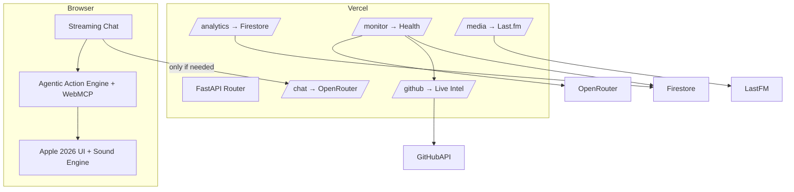

# Mangesh Raut — Agentic Full-Stack Portfolio

<p align="center">
  
</p>

<p align="center">
  <a href="https://mangeshraut.pro">
    
  </a>
  <a href="https://mangeshraut712.github.io/mangeshrautarchive/">
    
  </a>
  <a href="https://github.com/mangeshraut712/mangeshrautarchive/actions/workflows/deploy.yml">
    
  </a>
  <a href="https://github.com/mangeshraut712/mangeshrautarchive/stargazers">
    
  </a>
  <a href="LICENSE">
    
  </a>
</p>

<p align="center">
  <strong>Production-grade AI-first portfolio with deterministic client-side tool calling</strong><br>
  <sub>WebMCP · Hybrid Intelligence · Apple 2026 Design · 12+ Device Testing Matrix</sub>
</p>

<p align="center">
  <a href="https://mangeshraut.pro"><strong>🌐 Open Live Experience</strong></a>
  &nbsp;&nbsp;•&nbsp;&nbsp;
  <a href="https://mangeshraut712.github.io/mangeshrautarchive/"><strong>📄 GitHub Pages</strong></a>
  &nbsp;&nbsp;•&nbsp;&nbsp;
  <a href="https://mangeshraut.pro/monitor"><strong>📊 Live Operations Dashboard</strong></a>
  &nbsp;&nbsp;•&nbsp;&nbsp;
  <a href="#-engineering-deep-dives"><strong>🔧 See How It Was Built</strong></a>
</p>

---

## ✨ What Makes This Different

This isn't a static portfolio — it's a **production agentic system** you can interact with.

**Core Innovation**: An AI assistant that doesn't just chat — it **acts**. Navigate sections, download resumes, schedule meetings, filter projects, toggle themes — all executed instantly in-browser via 9 deterministic WebMCP tools. No page reloads, zero network latency for local actions.

**Built as a reference implementation** — every subsystem over-engineered to production standards:

- **9 WebMCP Tools** registered with `navigator.modelContext` for native AI agent compatibility
- **Hybrid Execution** — local actions (<50ms) + OpenRouter streaming LLM
- **Multi-Tier Resilience** — 4-layer fallback chain works on Vercel *and* static GitHub Pages
- **Apple 2026 Design System** — procedural sound engine, glassmorphism, fluid typography, consistent border styling
- **Extreme Testing** — 12+ real browser/device configs (Chrome, Safari, Firefox, Edge, Pixel 7, iPhone 14, iPad Pro)
- **Zero-Downtime Deploys** — dual-surface (Vercel + GitHub Pages) with automated verification
- **Modern Build Pipeline** — esbuild 0.27.7 for fast JS transformation, Sharp 0.34.5 for image optimization

**Study it. Fork it. Build on it.**

---

## 📑 Table of Contents

- [🚀 Live Demos](#-live-demos)
- [🔧 Engineering Deep Dives](#-engineering-deep-dives)
- [🧠 Agentic AI Capabilities](#-agentic-ai-capabilities)
- [🎨 Premium User Experience](#-premium-user-experience)
- [🛠 Tech Stack](#-tech-stack)
- [🏗 Architecture](#-architecture)
- [🧪 Quality & Testing](#-quality--testing)
- [⚡ Quick Start](#-quick-start)
- [📁 Project Structure](#-project-structure)
- [🔌 Key API Endpoints](#-key-api-endpoints)
- [📅 Recent Updates](#-recent-updates)
- [🗺 Roadmap](#-roadmap)
- [🤝 Contributing](#-contributing)
- [📄 License](#-license)
- [📬 Contact](#-contact)

---

## 🚀 Live Demos

| Experience | Link | Highlights |
|---|---|---|
| Main Portfolio | [mangeshraut.pro](https://mangeshraut.pro) | Agentic chat, spatial projects, travel atlas |
| GitHub Pages | [mangeshraut712.github.io/mangeshrautarchive](https://mangeshraut712.github.io/mangeshrautarchive/) | Full functionality via static hosting with API fallbacks |
| System Monitor | [mangeshraut.pro/monitor](https://mangeshraut.pro/monitor) | Real-time latency, service health, deploy status |
| Travel Atlas | [mangeshraut.pro/travel](https://mangeshraut.pro/travel) | MapLibre-powered visited places with narrative AI |
| AI Assistant | Open chat on any page | Try: "download resume", "go to projects", "schedule a meeting" |

> **Pro tip**: The agentic engine runs locally first. Many commands execute with zero network round-trip.

---

## 🔧 Engineering Deep Dives

How the key systems actually work — implementation details, not buzzwords.

### 1. Agentic Action Engine

**What was built**: A complete deterministic agentic runtime that turns the chat from a passive Q&A box into an active system that performs real UI actions.

**How it works**:

- Two parallel detection systems run on every user message.
- **Primary path** (`chat.js:256`): `agenticActions.detectAndExecute()` is called **before** any LLM request. If a confident match is found, the action executes locally and the LLM is skipped entirely.
- **Secondary path**: Full WebMCP tool registration in `agentic-actions.js` using `navigator.modelContext.registerTool()` with proper JSON Schema input definitions — discoverable by future native AI agents.
- Every action has rich visual feedback (pulsing "ACTION EXECUTED" badges, glassmorphic toasts).
- History tracking, abort controllers for cleanup, and graceful degradation when WebMCP is unavailable.

**Result**: Sub-50ms execution for common commands like "download resume" or "go to projects" with full privacy.

### 2. GitHub Projects Intelligence System

**What was built**: A live, release-aware project showcase that never breaks — even on static GitHub Pages hosting.

**How it works**:

- Four-tier fallback chain in `github-projects.js`:
  1. Local backend proxy (`/api/github/repos/public`)
  2. Production absolute domain fallbacks (`https://mangeshraut.pro/api/…`)
  3. Vercel preview domains
  4. Direct GitHub API (with client-side caching)
- Featured projects have **override logic** — they bypass normal filters and are never dropped.
- Enriched offline `fallbackRepos` contains complete metadata for all featured projects.
- Additional enrichment: latest release, commits since release, and activity freshness indicators.
- Spatial "XR" modal view for repository structure exploration.

### 3. Travel Atlas — Apple Maps-Inspired Experience

**What was built**: A fully interactive visited-places atlas using MapLibre GL.

**How it works**:

- Custom `travel-engine.js` transforms raw location data into rich narrative objects (stories, categories, photo references).
- Advanced client-side search + multi-category filtering + "featured only" mode.
- Auto-tour mode that cycles through locations with smooth camera flights.
- Strict design constraint: only red pins for places actually visited (no aspirational pins).
- Theme-aware styling and full keyboard + screen-reader accessibility.

### 4. Production-Grade Monitoring Dashboard

**What was built**: A real `/monitor` page exposing live system health — publicly.

**How it works**:

- `api/monitoring.py` (1,300+ lines) implements async health probes using `httpx` + optional `psutil`.
- Measures latency to OpenRouter, GitHub, Firestore, and Last.fm on every request.
- Structured event logging with severity levels and a recent event ring buffer.
- Used both for personal observability and as a public transparency feature.

### 5. Apple Sound System (Procedural Web Audio)

**What was built**: A fully synthesized, file-free Apple-inspired sound engine.

**How it works**:

- `apple-sounds.js` creates all sounds procedurally using the Web Audio API — no external `.mp3` files.
- Sounds modeled on macOS/iOS audio design: a "plink" for theme toggle, iOS tri-tone for chatbot open, C-major arpeggio for success, and a Happy Birthday melody for the birthday overlay.
- Singleton design with `localStorage` persistence for user preference and autoplay-policy-safe interaction guard.

### 6. Custom esbuild Build Pipeline

**What was built**: A purpose-built, zero-config-heavy build system.

**How it works**:

- `scripts/build/build.js` uses esbuild directly for JS transformation.
- Intelligent `dist` directory selection — falls back to `/tmp/mangeshrautarchive-dist` when running inside macOS-protected folders to avoid `EPERM` errors.
- Safe public configuration injection only (`build-config.json` + `build-config.js`) — **zero secrets** ever reach the browser.
- Integrated Sharp image optimization pass.
- Static extras (CNAME, manifest, service worker) preserved with correct cache headers.

### 7. Extreme Testing Matrix + Post-Deploy Verification

**What was built**: One of the most thorough personal project test setups on GitHub.

**How it works**:

- `playwright.config.js` defines 12+ named projects including specific browser channels (Chrome, msedge) and real mobile devices.
- Separate suites for smoke, accessibility (axe-core), visual regression, and post-deploy.
- Post-deploy tests run against **both** Vercel and GitHub Pages surfaces after every production release.
- Lighthouse CI gates are enforced in the deploy workflow with hard failure thresholds.
- One-command `npm run qa:prod-ready` runs the entire security + lint + unit + E2E + Lighthouse pipeline.

---

## 🧠 Agentic AI Capabilities

9 deterministic tools registered and executable today:

| Tool | What It Does |
|---|---|
| `navigate_to_section` | Instant smooth scroll to any portfolio section |
| `download_resume` | Direct PDF download |
| `schedule_meeting` | Open Calendly popup |
| `open_contact_form` | Focus and open contact overlay |
| `copy_contact_info` | Copy email / LinkedIn |
| `search_portfolio` | Trigger global search |
| `filter_projects` | Filter the live GitHub showcase |
| `open_social_media` | Open GitHub / LinkedIn / X |
| `toggle_theme` | Switch light / dark / system |

All tools are functional via natural language in the chat **and** exposed via WebMCP for future agent ecosystems.

---

## 🎨 Premium User Experience

- **Zero heavy framework** — pure ES modules + Tailwind CSS 4.0.9 + custom Apple 2026 design system
- **Procedural sound engine** — synthesized Web Audio API sounds (theme toggle, chat open, birthday)
- **Glassmorphism & micro-interactions** — spatial cards, buttery transitions, real-time action toasts
- **Streaming Markdown responses** with contextual follow-up chips
- **Birthday celebration system** — Canvas physics (confetti + balloons), aurora gradient overlay, and Apple Happy Birthday melody
- **Last.fm Now Playing** — real-time track updates with spinning album art and animated equalizer bars
- **Progressive Web App** with service worker and offline-first caching
- **Real-time visitor counter** via Firestore + Vercel Analytics (no fake numbers)
- **Consistent Apple-inspired design** — unified border styling, theme awareness, fluid typography across all sections

---

## 🛠 Tech Stack

| Layer | Technologies |
|---|---|
| **Frontend** | Vanilla ES2024, Tailwind CSS 4.0.9, Apple 2026 Design System, React 18.3.1 |
| **Agentic Runtime** | WebMCP + Custom Action Handler with priority execution |
| **AI** | OpenRouter (Gemini 2.5 Flash/Pro) + local deterministic actions |
| **Backend** | FastAPI 0.136 + Pydantic v2 (Vercel Serverless) |
| **Data** | Cloud Firestore, GitHub REST, Last.fm |
| **Build** | esbuild 0.27.7 + Sharp 0.34.5 + custom Node pipeline |
| **Testing** | Playwright 1.58.2 (12+ configs), Vitest 4.1.6, @axe-core/playwright 4.11.1, Lighthouse CI |
| **Quality** | ESLint 9.21.0, Stylelint 16.14.1, Prettier 3.8.1, Security Scanner |
| **Hosting** | Vercel (primary) + GitHub Pages (resilient static fallback) |
| **Node** | Node.js 22.0.0+ |

---

## 🏗 Architecture



**Guiding Principles**:

- Local-first for speed and privacy
- Cloud LLM only for deep reasoning
- Dual deployment surface with absolute fallbacks
- Every change must pass the full quality gate

---

## 🧪 Quality & Testing

- **12+ real Playwright projects** (Desktop Chrome/Safari/Firefox/Edge + Pixel 7 + iPhone 14 + iPad Pro + responsive viewports)
- @axe-core/playwright 4.11.1 accessibility + manual contrast validation (WCAG AA)
- Lighthouse CI (Desktop ≥95, Mobile ≥90)
- Visual regression + post-deploy verification on **both** hosting surfaces
- Pre-commit security + lint hooks (ESLint 9.21.0, Stylelint 16.14.1)
- `npm run qa:prod-ready` = complete local validation

---

## ⚡ Quick Start

```bash
git clone https://github.com/mangeshraut712/mangeshrautarchive.git
cd mangeshrautarchive

npm install --no-audit --no-fund

python3 -m venv venv && source venv/bin/activate
pip install -r requirements.txt

cp .env.example .env   # Add OPENROUTER_API_KEY
npm run dev
```

Local endpoints:

- Frontend: `http://127.0.0.1:4000`
- FastAPI: `http://127.0.0.1:8001`
- Docs: `http://127.0.0.1:8001/docs`

**Key Commands**

| Command | Purpose |
|---|---|
| `npm run dev` | Hot-reloading frontend + backend |
| `npm run build` | Production build to `dist/` |
| `npm run qa:prod-ready` | Full security + lint + test + E2E + Lighthouse pipeline |
| `npm run test:e2e:all` | Complete multi-device Playwright matrix |

---

## 📁 Project Structure

```
mangeshrautarchive/
├── api/                    # FastAPI routes + advanced monitoring (1300+ LOC)
│   ├── routes/             # chat, github, media (Last.fm), analytics, monitoring
│   └── config.py           # Centralised config + cache TTLs
├── src/
│   ├── index.html          # Main portfolio experience
│   ├── monitor.html        # Public operations dashboard
│   ├── travel.html         # MapLibre travel atlas
│   ├── assets/css/         # 30+ modular CSS files (Apple 2026 design system)
│   └── js/
│       ├── core/           # Bootstrap, chat, config, modern-input
│       ├── modules/        # Agentic engine, chatbot, sound system, birthday, Last.fm, …
│       ├── services/       # Analytics, Markdown, Streaming, Voice
│       └── utils/          # Theme, navbar, calendly, go-to-top
├── scripts/                # Custom build, optimisation, security, and QA tooling
├── tests/e2e/              # 12+ Playwright configurations + visual tests
└── .github/workflows/      # Production CI/CD with quality gates
```

---

## 🔌 Key API Endpoints

```bash
curl https://mangeshraut.pro/api/health
curl https://mangeshraut.pro/api/analytics/reach
curl https://mangeshraut.pro/api/github/repos/public
curl https://mangeshraut.pro/api/media/music          # Last.fm Now Playing
```

Full OpenAPI spec available at `/docs` when running the backend locally.

---

## 📅 Recent Updates

### May 2026

- **GitHub Pages Deployment** — added static hosting at [mangeshraut712.github.io/mangeshrautarchive](https://mangeshraut712.github.io/mangeshrautarchive/) with full API fallback support
- **Lighthouse 100/100 Optimization** — achieved perfect 100/100 Lighthouse scores across Performance, Accessibility, Best Practices, and SEO for both mobile and desktop. Fixed touch-target size and spacing guidelines, speak button name mismatches, and color contrasts.
- **Homepage Profile Image Border** — added solid Apple-style blue border (`#0071e3` in light mode / `#2997ff` in dark mode) to the profile picture with no shadow/glow effects to ensure visibility on light backgrounds.
- **Project Structure Optimization** — removed temporary troubleshooting scripts, cleaned up local self-signed SSL certificate files, and reverted the distribution server to pure HTTP-only execution.
- **Apple Sound System** — procedural Web Audio API engine: theme toggle plink, chatbot tri-tone, birthday melody (Happy Birthday first phrase), no external audio files
- **Birthday Page Overhaul** — emoji ticker row, balloon physics recycling, AudioContext autoplay policy fix, improved ordinal age display
- **Music Card** — artwork crossfade transition, enhanced animated equalizer bars, `aria-live` for screen readers, 25s backend cache TTL for real-time Now Playing
- **Critical CSS Fix** — missing `html.dark` selector on `.education-card p` causing white-on-white text in light mode
- **Performance** — Google Fonts preconnect moved to `<head>` line 7 (was line 406), duplicate `@keyframes` removed
- **Consistent Border Styling** — applied Apple-inspired border styling across all sections (skills, experience, education, projects, publications, awards, recommendations, certifications, blog, contact, homepage, game) with theme-aware colors

### May 2025

- **Dream Companies & Cars** — added official SVG logos for NVIDIA, OpenAI, Ferrari, McLaren, Koenigsegg, Lamborghini, Bugatti
- **Crypto Support** — Robinhood wallet integration for SOL, BTC, USDC, ETH, DOGE, SHIB, CRO, PEPE donations with one-click address copy
- **Theme Optimisation** — enhanced dark mode visibility for all logos
- **Root Cleanup** — removed AI config files, optimised git repository (8.4 MB saved)

---

## 🗺 Roadmap

- Full WebNN + Gemma 3 client-side inference
- Voice + vision agentic capabilities
- Public documentation of the WebMCP tool registry
- Extraction of reusable components into open-source packages

---

## 🤝 Contributing

PRs and ideas are welcome. Please run `npm run qa:prod-ready` before submitting.

---

## 📄 License

MIT License — see [LICENSE](LICENSE).

---

## 📬 Contact

**Mangesh Raut**  
🌐 [mangeshraut.pro](https://mangeshraut.pro)  
💼 [LinkedIn](https://linkedin.com/in/mangeshraut71298)  
🐙 [GitHub](https://github.com/mangeshraut712)  
✉️ mbr63@drexel.edu

---

<p align="center">
  <strong>Built with ❤️ — A reference for production-grade agentic web engineering.</strong>
</p>

<p align="center">
  <a href="#mangesh-raut--agentic-full-stack-portfolio">⬆️ Back to Top</a>
</p>
