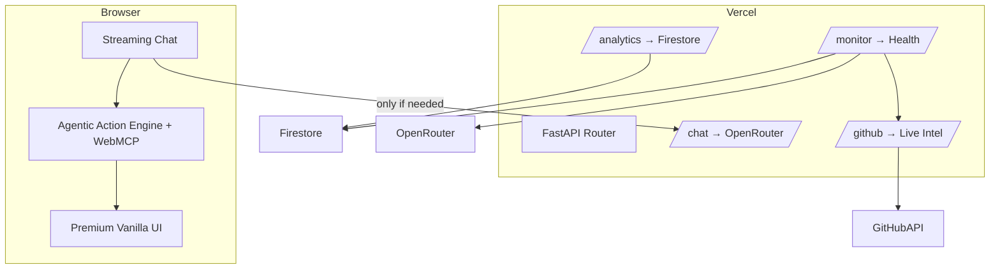

# 🚀 Mangesh Raut — Agentic Full-Stack Portfolio

<p align="center">
  <a href="https://mangeshraut.pro">
    
  </a>
  <a href="https://github.com/mangeshraut712/mangeshrautarchive/actions/workflows/deploy.yml">
    
  </a>
  <a href="https://github.com/mangeshraut712/mangeshrautarchive/stargazers">
    
  </a>
  <a href="LICENSE">
    
  </a>
</p>

<p align="center">
  <strong>Production-grade AI-first portfolio with deterministic client-side tool calling</strong><br>
  <sub>WebMCP • Hybrid Intelligence • 12+ Device Testing Matrix • Apple-Inspired Design</sub>
</p>

<p align="center">
  <a href="https://mangeshraut.pro"><strong>🌐 Open Live Experience</strong></a>
  &nbsp;&nbsp;•&nbsp;&nbsp;
  <a href="https://mangeshraut.pro/monitor"><strong>📊 Live Operations Dashboard</strong></a>
  &nbsp;&nbsp;•&nbsp;&nbsp;
  <a href="#-unique-engineering-features--how-they-work"><strong>🔧 See How It Was Built</strong></a>
</p>

---

## ✨ What Makes This Different

This isn't a static portfolio — it's a **production agentic system** you can interact with.

**Core Innovation**: An AI assistant that doesn't just chat — it **acts**. Navigate sections, download resumes, schedule meetings, filter projects, toggle themes — all executed instantly in-browser via 9 deterministic WebMCP tools. No page reloads, zero network latency for local actions.

**Built as a reference implementation** — every subsystem over-engineered to production standards:

- **9 WebMCP Tools**: Registered with `navigator.modelContext` for native AI agent compatibility
- **Hybrid Execution**: Local actions (<50ms) + OpenRouter Gemini 2.5 (streaming)
- **Multi-Tier Resilience**: 4-layer fallback chain works on Vercel _and_ static GitHub Pages
- **Extreme Testing**: 12+ real browser/device configs (Chrome, Safari, Firefox, Edge, Pixel 7, iPhone 14, iPad Pro)
- **Zero-Downtime Deploys**: Dual-surface (Vercel + GitHub Pages) with automated verification

**Study it. Fork it. Build on it.**

---

## 📑 Table of Contents

- [🚀 Live Demos](#-live-demos)
- [🔧 Unique Engineering Features & How They Work](#-unique-engineering-features--how-they-work)
- [🧠 Agentic AI Capabilities](#-agentic-ai-capabilities)
- [🎨 Premium User Experience](#-premium-user-experience)
- [🛠 Tech Stack](#-tech-stack)
- [🏗 Architecture](#-architecture)
- [🧪 Quality & Testing](#-quality--testing)
- [⚡ Quick Start](#-quick-start)
- [📁 Project Structure](#-project-structure)
- [🔌 Key API Endpoints](#-key-api-endpoints)
- [🗺 Roadmap](#-roadmap)
- [🤝 Contributing](#-contributing)
- [📄 License](#-license)
- [📬 Contact](#-contact)

---

## 🚀 Live Demos

| Experience             | Link                                                                                | Highlights                                                     |
| ---------------------- | ----------------------------------------------------------------------------------- | -------------------------------------------------------------- |
| Main Portfolio         | [mangeshraut.pro](https://mangeshraut.pro)                                          | Agentic chat, spatial projects, travel atlas                   |
| System Monitor         | [mangeshraut.pro/monitor](https://mangeshraut.pro/monitor)                          | Real-time latency, service health, deployment surface status   |
| Travel Atlas           | [mangeshraut.pro/travel](https://mangeshraut.pro/travel)                            | MapLibre-powered visited places with narrative intelligence    |
| GitHub Pages Fallback  | [mangeshraut712.github.io/...](https://mangeshraut712.github.io/mangeshrautarchive) | Full functionality via absolute domain proxy fallbacks         |
| AI Assistant (Agentic) | Open chat on any page                                                               | Try: “download resume”, “go to projects”, “schedule a meeting” |

> **Pro tip**: The agentic engine runs locally first. Try natural language commands — many execute with zero network round-trip.

---

## 🔧 Engineering Deep Dives

How the key systems actually work — implementation details, not buzzwords.

### 1. Agentic Action Engine

**What was built**: A complete deterministic agentic runtime that turns the chat from a passive Q&A box into an active system that performs real UI actions.

**How it works**:

- Two parallel detection systems run on every user message.
- **Primary path** (`chat.js:256`): `agenticActions.detectAndExecute()` is called **before** any LLM request. If a confident match is found, the action executes locally and the LLM is skipped entirely.
- **Secondary path**: Full WebMCP tool registration in `agentic-actions.js` using `navigator.modelContext.registerTool()` with proper JSON Schema input definitions. This makes the tools discoverable by future native AI agents.
- Every action has rich visual feedback (pulsing “ACTION EXECUTED” badges, glassmorphic toasts).
- History tracking, abort controllers for cleanup, and graceful degradation when WebMCP is unavailable.

**Result**: Sub-50ms execution for common commands like “download resume” or “go to projects” with full privacy.

### 2. GitHub Projects Intelligence System (Multi-Tier Resilience)

**What was built**: A live, release-aware project showcase that never breaks — even on static GitHub Pages hosting.

**How it works**:

- Four-tier fallback chain in `github-projects.js`:
  1. Local backend proxy (`/api/github/repos/public`)
  2. Production absolute domain fallbacks (`https://mangeshraut.pro/api/...`)
  3. Vercel preview domains
  4. Direct GitHub API (with client-side caching)
- Featured projects have **override logic** — they bypass normal “has description + homepage” filters so they are never dropped.
- Enriched offline `fallbackRepos` array contains complete, accurate metadata for all 8 featured projects.
- Additional enrichment: latest release, commits since release, and activity freshness indicators.
- Spatial “XR” modal view for repository structure exploration.

### 3. Travel Atlas — Apple Maps-Inspired Experience

**What was built**: A fully interactive visited-places atlas using MapLibre GL (not the more common Leaflet).

**How it works**:

- Custom `travel-engine.js` transforms raw location data into rich narrative objects (stories, categories, photo references).
- Advanced client-side search + multi-category filtering + “featured only” mode.
- Auto-tour mode that cycles through locations with smooth camera flights.
- Strict design constraint: only red pins for places actually visited (no aspirational pins).
- Theme-aware styling and full keyboard + screen-reader accessibility.

### 4. Production-Grade Monitoring Dashboard

**What was built**: A real `/monitor` page that exposes live system health.

**How it works**:

- `api/monitoring.py` (1,300+ lines) implements async health probes using `httpx` + optional `psutil`.
- Measures latency to OpenRouter, GitHub, Firestore, and Last.fm on every request.
- Structured event logging with severity levels and recent event ring buffer.
- Beautiful frontend that surfaces both aggregate status and per-service details.
- Used both for personal observability and as a public transparency feature.

### 5. Custom esbuild Build Pipeline (No Vite, No Webpack)

**What was built**: A purpose-built, zero-config-heavy build system.

**How it works**:

- `scripts/build/build.js` uses esbuild directly for JS transformation.
- Intelligent `dist` directory selection: falls back to `/tmp/mangeshrautarchive-dist` when running inside macOS-protected folders (Downloads/Desktop) to avoid `EPERM` errors.
- Safe public configuration injection only (`build-config.json` + `build-config.js`) — **zero secrets** ever reach the browser.
- Integrated Sharp image optimization pass.
- Static extras (CNAME, manifest, service worker) are preserved with correct cache headers.

### 6. Extreme Testing Matrix + Post-Deploy Verification

**What was built**: One of the most thorough personal project test setups visible on GitHub.

**How it works**:

- `playwright.config.js` defines 12+ named projects including specific browser channels (Chrome, msedge) and real mobile devices.
- Separate suites for smoke, accessibility (axe-core), visual regression, and post-deploy.
- Post-deploy tests explicitly run against **both** Vercel and GitHub Pages surfaces after every production release.
- Lighthouse CI gates are enforced in the deploy workflow with hard failure thresholds.
- One-command `npm run qa:prod-ready` runs the entire security + lint + unit + E2E + Lighthouse pipeline.

### 7. Hybrid AI Execution with Strict Priority

Unlike most “AI portfolio” sites that always hit the LLM:

- Agentic action detection happens first and short-circuits the request when possible.
- Only genuinely reasoning-heavy questions reach OpenRouter.
- Rich response metadata (model, runtime, source, confidence, category) is returned and displayed for transparency.

---

## 🧠 Agentic AI Capabilities

9 deterministic tools are registered and executable today:

| Tool                  | What It Does                                   |
| --------------------- | ---------------------------------------------- |
| `navigate_to_section` | Instant smooth scroll to any portfolio section |
| `download_resume`     | Direct PDF download                            |
| `schedule_meeting`    | Open Calendly popup                            |
| `open_contact_form`   | Focus and open contact overlay                 |
| `copy_contact_info`   | Copy email/LinkedIn                            |
| `search_portfolio`    | Trigger global search                          |
| `filter_projects`     | Filter the live GitHub showcase                |
| `open_social_media`   | Open GitHub / LinkedIn / X                     |
| `toggle_theme`        | Switch light/dark/system                       |

All tools are fully functional via natural language in the chat **and** exposed via WebMCP for future agent ecosystems.

---

## 🎨 Premium User Experience

- Zero heavy frontend framework — pure ES modules + Tailwind 4 + custom Apple-inspired design system
- Glassmorphism, spatial cards, buttery micro-interactions, and real-time action confirmation toasts
- Streaming Markdown responses with contextual follow-up chips
- Progressive Web App with service worker and offline-first caching
- Real-time Firestore + Vercel Analytics visitor reach counter (no fake numbers)

---

## 🛠 Tech Stack

| Layer               | Technologies                                                     |
| ------------------- | ---------------------------------------------------------------- |
| **Frontend**        | Vanilla ES2024, Tailwind CSS 4, Custom Design System             |
| **Agentic Runtime** | WebMCP + Custom Action Handler with priority execution           |
| **AI**              | OpenRouter (Gemini 2.5 Flash/Pro) + local deterministic actions  |
| **Backend**         | FastAPI 0.136 + Pydantic v2 (Vercel Serverless)                  |
| **Data**            | Cloud Firestore, GitHub REST, Last.fm                            |
| **Build**           | esbuild + Sharp + custom Node pipeline                           |
| **Testing**         | Playwright 1.58 (12+ configs), Vitest 4, axe-core, Lighthouse CI |
| **Quality**         | ESLint 9, Stylelint, Ruff, Vulture, Security Scanner             |
| **Hosting**         | Vercel (primary) + GitHub Pages (resilient static fallback)      |

---

## 🏗 Architecture



**Guiding Principles**:

- Local-first for speed and privacy
- Cloud LLM only for deep reasoning
- Dual deployment surface with absolute fallbacks
- Every change must pass the full quality gate

---

## 🧪 Quality & Testing

- **12+ real Playwright projects** (Desktop Chrome/Safari/Firefox/Edge + Pixel 7 family + iPhone 14 family + iPad Pro + responsive viewports)
- axe-core accessibility + manual contrast validation
- Lighthouse CI (Desktop ≥95, Mobile ≥90)
- Visual regression + post-deploy verification on **both** hosting surfaces
- Pre-commit security + lint hooks
- `npm run qa:prod-ready` = complete local validation

---

## ⚡ Quick Start

```bash
git clone https://github.com/mangeshraut712/mangeshrautarchive.git
cd mangeshrautarchive

npm install --no-audit --no-fund

python3 -m venv venv && source venv/bin/activate
pip install -r requirements.txt

cp .env.example .env   # Add OPENROUTER_API_KEY
npm run dev
```

Local endpoints:

- Frontend: `http://127.0.0.1:4000`
- FastAPI: `http://127.0.0.1:8001`
- Docs: `http://127.0.0.1:8001/docs`

**Key Commands**

| Command                 | Purpose                                                 |
| ----------------------- | ------------------------------------------------------- |
| `npm run dev`           | Hot-reloading frontend + backend                        |
| `npm run build`         | Production build to `dist/`                             |
| `npm run qa:prod-ready` | Full security + lint + test + E2E + Lighthouse pipeline |
| `npm run test:e2e:all`  | Complete multi-device Playwright matrix                 |

---

## 📁 Project Structure

```
mangeshrautarchive/
├── api/                    # FastAPI routes + advanced monitoring (1300+ LOC)
├── src/
│   ├── index.html          # Main experience
│   ├── monitor.html        # Public operations dashboard
│   ├── travel.html         # MapLibre travel atlas
│   └── js/                 # All vanilla modules (agentic, chat, projects, travel…)
├── scripts/                # Custom build, optimization, security, and QA tooling
├── tests/e2e/              # 12+ Playwright configurations + visual tests
└── .github/workflows/      # Production CI/CD with quality gates
```

---

## 🔌 Key API Endpoints

```bash
curl https://mangeshraut.pro/api/health
curl https://mangeshraut.pro/api/analytics/reach
curl https://mangeshraut.pro/api/github/repos/public
```

Full OpenAPI spec available at `/docs` when running the backend.

---

## 🗺 Roadmap

- Full WebNN + Gemma 3 client-side inference
- Voice + vision agentic capabilities
- Public documentation of the WebMCP tool registry
- Extraction of reusable components into open source packages

---

## 🤝 Contributing

PRs and ideas are welcome. Please run `npm run qa:prod-ready` before submitting.

---

## 📄 License

MIT License — see [LICENSE](LICENSE).

---

## 📬 Contact

**Mangesh Raut**  
🌐 [mangeshraut.pro](https://mangeshraut.pro)  
💼 [LinkedIn](https://linkedin.com/in/mangeshraut71298)  
🐙 [GitHub](https://github.com/mangeshraut712)  
✉️ mbr63@drexel.edu

---

<p align="center">
  <strong>Built with ❤️ — A reference for production-grade agentic web engineering.</strong>
</p>

<p align="center">
  <a href="#-mangesh-raut--agentic-full-stack-portfolio">⬆️ Back to Top</a>
</p>
