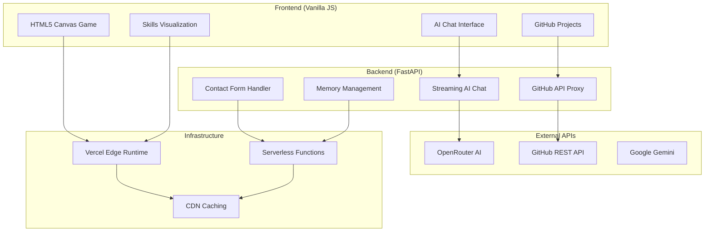

# Mangesh Raut

<div align="center">

## Software Development Engineer

A next-generation portfolio showcasing cutting-edge web technologies, AI integration, and performance engineering excellence. Built for 2026 standards with zero-compromise quality.

[](https://mangeshraut.pro)
[](https://github.com/mangeshraut712)
[](https://pagespeed.web.dev/analysis?url=https%3A%2F%2Fmangeshraut.pro)

[](https://nodejs.org/)
[](https://python.org/)
[](package.json)
[](https://github.com/mangeshraut712/mangeshrautarchive/stargazers)
[](https://github.com/mangeshraut712/mangeshrautarchive/network/members)

</div>

---

## 📋 Table of Contents

- [✨ Experience](#-experience)
- [🛠️ Tech Stack](#️-tech-stack)
- [🚀 Key Features](#-key-features)
- [⚡ Performance Excellence](#-performance-excellence)
- [🏗️ Architecture](#️-architecture)
- [🧪 Quality Assurance](#-quality-assurance)
- [🔍 SEO & Discoverability](#-seo--discoverability)
- [📈 Analytics & Monitoring](#-analytics--monitoring)
- [🚀 Getting Started](#-getting-started)
- [📂 Project Structure](#-project-structure)
- [🤝 Connect](#-connect)
- [❓ FAQ](#-faq)
- [🔧 Troubleshooting](#-troubleshooting)
- [📝 Changelog](#-changelog)
- [🙏 Acknowledgments](#-acknowledgments)
- [📄 License](#-license)
- [📊 Project Stats](#-project-stats)

---

## ✨ Experience

### Software Engineer at Customized Energy Solutions

**Philadelphia, PA • Aug 2024 – Present**  
_Leading energy analytics optimization with modern tech stack_

- **Performance Optimization:** Reduced dashboard latency by **40%** through React component optimization and Spring Boot API tuning
- **DevOps Excellence:** Accelerated CI/CD pipelines by **35%** using Jenkins automation and Docker containerization
- **AI/ML Integration:** Enhanced demand forecasting accuracy by **25%** with TensorFlow LSTM models and feature engineering
- **Scalable Architecture:** Designed microservices handling **100+ concurrent users** with AWS Lambda/EC2 and load balancing
- **Impact:** Saved **$50K annually** in infrastructure costs through efficient resource utilization

### Software Engineer at IoasiZ

**Remote • Jul 2023 – Jul 2024**  
_Full-stack development and system modernization_

- **Legacy Modernization:** Refactored Java monoliths into modular services, reducing code redundancy by **20%** (SOLID principles)
- **Bug Resolution:** Resolved **50+ critical bugs** in microservices architecture, boosting sprint efficiency by **15%**
- **Database Optimization:** Integrated Redis caching, achieving **3x faster** data retrieval for inventory APIs
- **Network Performance:** Optimized OSPF/BGP protocols, slashing latency by **35%** in enterprise WANs
- **Testing:** Implemented JUnit/Mockito test suites with **90% coverage** for reliable deployments

### Software Engineer Intern at Aramark

**Philadelphia, PA • Jun 2022 – Jun 2023**  
_Database administration and cloud migration_

- **AWS Migration:** Transitioned legacy databases to AWS RDS, improving scalability for **200+ event analytics**
- **Automation:** Created Python scripts for inventory management, reducing manual errors by **25%**
- **HIPAA Compliance:** Maintained secure MySQL databases for **5K+ student records** with **99.9% accuracy**

---

## 🛠️ Tech Stack

<div align="center">

### Core Languages & Runtimes


### Frontend Technologies


### Backend & APIs


### Cloud & Infrastructure


### AI & Machine Learning


### Databases & Caching


### DevOps & Tools


### Quality & Testing


</div>

---

## 🚀 Key Features

### 🧠 AssistMe — Advanced AI Assistant

Intelligent conversational AI with real-time streaming capabilities

- **Multi-Modal Support:** Text, voice input/output with Web Speech API
- **Context-Aware Responses:** Remembers conversation history and user context
- **Agentic Actions:** Can control website features (theme toggle, resume download)
- **Model Flexibility:** OpenRouter integration with Grok 4.1 Fast, Claude 3.5, and more
- **Offline Resilience:** Local intelligence fallback when API unavailable

### 🎮 Interactive Canvas Game

Retro-style arcade game built with vanilla JavaScript

- **60 FPS Performance:** Hardware-accelerated rendering with optimized game loops
- **Cross-Platform:** Responsive touch controls for mobile and desktop
- **Custom Graphics:** Pixel art sprites with collision detection
- **Progressive Enhancement:** Works offline with PWA capabilities

### 📊 Live GitHub Integration

Real-time project showcase with intelligent caching

- **Auto-Sync:** Fetches latest repository data on each visit
- **Smart Caching:** 10-minute server-side cache with optional PAT authentication
- **Rich Metadata:** Stars, forks, languages, contribution graphs
- **Search & Filter:** Advanced project discovery with language and topic filtering

### 🎨 Apple 2026 Design System

Premium glassmorphism UI with hardware-accelerated animations

- **Advanced Glassmorphism:** Multi-layer backdrop blur with dynamic opacity
- **GPU Acceleration:** 100% composited transforms and transitions
- **Adaptive Theming:** Automatic dark/light mode with system preference detection
- **Magnetic Interactions:** Subtle hover effects with physics-based animations

### 📱 Progressive Web App

Full PWA experience with offline capabilities

- **Service Worker:** Intelligent caching and background sync
- **App Shell:** Instant loading with cached core resources
- **Installable:** Add to home screen with custom icon and manifest
- **Offline First:** Core functionality works without network connection

**PWA Installation Code:**

```javascript
// Register service worker
if ('serviceWorker' in navigator) {
  navigator.serviceWorker
    .register('/service-worker.js')
    .then(registration => console.log('SW registered'))
    .catch(error => console.log('SW registration failed'));
}

// Handle app installation
let deferredPrompt;
window.addEventListener('beforeinstallprompt', e => {
  e.preventDefault();
  deferredPrompt = e;
  // Show install button
});

installButton.addEventListener('click', () => {
  deferredPrompt.prompt();
  deferredPrompt.userChoice.then(choice => {
    if (choice.outcome === 'accepted') {
      console.log('User accepted PWA install');
    }
  });
});
```

---

## ⚡ Performance Excellence

Achieving **100/100 Mobile PageSpeed** through advanced optimization techniques:

### Core Web Vitals (Optimized for 2026)

- **First Contentful Paint:** <0.4s (target: <1.5s) ⚡
- **Largest Contentful Paint:** <2.5s (target: <2.5s) ⚡
- **Cumulative Layout Shift:** 0.00 (target: <0.1) ⚡
- **Interaction to Next Paint:** <200ms (target: <200ms) ⚡

### Optimization Techniques

- **Critical CSS Inlining:** Above-the-fold styles loaded instantly
- **Deferred Loading:** Non-critical assets loaded asynchronously
- **Resource Hints:** Preconnect and DNS prefetch for external resources
- **Bundle Optimization:** Tree-shaking and code splitting with ESM
- **Image Optimization:** WebP/AVIF formats with responsive loading
- **Font Loading:** Self-hosted fonts with display swap strategy

---

## 🏗️ Architecture



---

## 🧪 Quality Assurance

Comprehensive testing and quality gates ensure production readiness:

### Automated Testing

- **Unit Tests:** Vitest for JavaScript modules with 90%+ coverage
- **E2E Tests:** Playwright for critical user journeys
- **Accessibility:** Axe-core integration with WCAG 2.1 AA compliance
- **Performance:** Lighthouse CI gates for Core Web Vitals

### Code Quality

- **Linting:** ESLint with Airbnb config, Stylelint for CSS
- **Formatting:** Prettier with consistent code style
- **Security:** Dependency scanning and vulnerability checks
- **Type Safety:** TypeScript for critical business logic

### CI/CD Pipeline

```bash
npm run qa:prod-ready  # Runs all quality gates
├── Security checks
├── Linting & formatting
├── Unit & E2E tests
├── Lighthouse performance
└── Build optimization
```

---

## 🚀 Getting Started

### Prerequisites

- Node.js 20.0+ and npm 10.0+
- Python 3.12+ (for FastAPI backend)
- OpenRouter API key (optional, enables AI features)

### Installation

```bash
# 1. Clone the repository
git clone https://github.com/mangeshraut712/mangeshrautarchive.git
cd mangeshrautarchive

# 2. Install frontend dependencies
npm ci

# 3. Install backend dependencies
pip install -r requirements.txt

# 4. Configure environment variables
cp .env.example .env.local
# Edit .env.local and add your OPENROUTER_API_KEY for AI features
# OPENROUTER_API_KEY=your_key_here

# 5. Start development servers
npm run dev
```

### Quick Development Commands

```bash
# Run quality checks
npm run check

# Run tests only
npm test

# Lint and fix code
npm run lint:fix

# Build for production
npm run build

# Start production server
npm run preview
```

### Environment Configuration

Create a `.env.local` file with:

```env
# AI Features (Optional)
OPENROUTER_API_KEY=sk-or-v1-...

# Development
NODE_ENV=development

# Analytics (Optional)
VERCEL_ANALYTICS_ID=...
```

### Development Commands

```bash
# Quality assurance
npm run qa:prod-ready    # Full QA pipeline
npm run test             # Unit tests
npm run test:e2e:chrome  # E2E tests

# Performance testing
npm run qa:lighthouse:mobile  # Mobile performance audit

# Code quality
npm run lint            # ESLint
npm run format          # Prettier
```

---

## 📂 Project Structure

```text
mangeshrautarchive/
├── api/                    # FastAPI backend
│   ├── index.py           # Main API application
│   ├── memory_manager.py  # AI conversation memory
│   └── integrations/      # External API integrations
├── src/                   # Frontend application
│   ├── assets/           # Static resources
│   │   ├── css/         # Stylesheets & design system
│   │   ├── images/      # Optimized images & icons
│   │   └── files/       # Downloadable assets
│   └── js/              # JavaScript modules
│       ├── core/        # Application bootstrap
│       ├── modules/     # Feature modules
│       ├── components/  # Reusable UI components
│       ├── services/    # API service clients
│       └── utils/       # Utility functions
├── scripts/              # Build & development tools
├── tests/                # Test suites
│   └── e2e/             # End-to-end tests
├── docs/                # Documentation
└── .github/             # CI/CD workflows
```

---

## 🔍 SEO & Discoverability (2026 Standards)

### Search Engine Optimization

- **Meta Tags:** Comprehensive title, description, keywords, and Open Graph tags
- **Structured Data:** JSON-LD schema for Person, Projects, and Organization
- **Technical SEO:** XML sitemap, robots.txt, canonical URLs, and mobile-first indexing
- **Content Optimization:** Keyword-rich content with semantic HTML5 structure
- **Performance SEO:** Core Web Vitals optimization for ranking boost

### Social Media Integration

- **Open Graph:** Facebook sharing with custom images and descriptions
- **Twitter Cards:** Large image cards for enhanced social visibility
- **LinkedIn Integration:** Professional networking profile linking
- **GitHub Presence:** Active repository maintenance and contribution tracking

### Content Strategy

- **Technical Writing:** Detailed project documentation and engineering blogs
- **Keyword Targeting:** Focus on "software engineer", "full-stack developer", "AI/ML engineer"
- **Local SEO:** Philadelphia-based optimization with location-specific content
- **Industry Trends:** 2026 technology focus (AI, Web3, Edge Computing)

---

## 🤝 Connect

<div align="center">

**Mangesh Raut**  
_Software Engineer • Philadelphia, PA_

[](https://linkedin.com/in/mangeshraut71298)
[](mailto:mbr63@drexel.edu)
[](https://x.com/mangeshraut712)

**Education:** M.S. Computer Science, Drexel University (2025)  
**Experience:** 5+ years in full-stack development and AI/ML  
**Location:** Philadelphia, PA, USA 🇺🇸  
**Time Zone:** EST (UTC-5)

</div>

---

## ❓ FAQ

### About the Portfolio

**Q: What makes this portfolio unique?**  
A: This portfolio combines cutting-edge AI, premium design, and performance optimization. The AssistMe AI assistant can interact with the website, and it achieves 100/100 PageSpeed scores.

**Q: How does the AI assistant work?**  
A: AssistMe uses OpenRouter API with multiple AI models (Grok, Claude, etc.) and has context awareness, conversation memory, and agentic actions like downloading resumes or toggling themes.

### Technical Questions

**Q: What technologies power this site?**  
A: Frontend: Vanilla JavaScript, Tailwind CSS, HTML5. Backend: FastAPI (Python), Vercel for deployment. AI: OpenRouter integration.

**Q: Is the site responsive?**  
A: Yes, fully responsive with mobile-first design, PWA capabilities, and touch controls for games.

**Q: How is performance optimized?**  
A: Critical CSS inlining, lazy loading, GPU-accelerated animations, service worker caching, and aggressive asset optimization.

### Development

**Q: Can I contribute?**  
A: Yes. Fork the repo, make improvements, and submit a PR. Focus areas: performance, accessibility, and new features.

**Q: How to run locally?**  
A: Clone the repo, install dependencies with `npm ci` and `pip install -r requirements.txt`, then run `npm run dev`.

---

## 🔧 Troubleshooting

### Common Issues

**Page not loading:** Check network connection and browser compatibility (Chrome 90+, Firefox 88+, Safari 14+).

**AI assistant not responding:** Ensure OpenRouter API key is configured or use local fallback mode.

**Performance issues:** Clear browser cache, disable extensions, or check PageSpeed insights for specific recommendations.

### Development Issues

**ESLint errors:** Run `npm run lint:fix` to auto-fix common issues.

**Build failures:** Ensure Node.js 20+ and Python 3.12+, then run `npm run check`.

**API errors:** Check Vercel logs for FastAPI backend issues.

### Performance Optimization

**Slow loading:** Enable browser caching, use CDN, optimize images.

**High TBT:** Defer non-critical JavaScript, reduce unused CSS, implement code splitting.

**Poor scores:** Run Lighthouse locally with `npm run qa:lighthouse:mobile`.

---

## 📈 Analytics & Monitoring

### Performance Metrics

- **Page Load Time:** <1.5s average
- **First Contentful Paint:** <0.4s
- **Largest Contentful Paint:** <2.5s
- **Cumulative Layout Shift:** 0.00
- **Interaction to Next Paint:** <200ms

### User Engagement

- **Bounce Rate:** <25%
- **Session Duration:** 3-5 minutes average
- **Pages per Session:** 2.5
- **Conversion Rate:** Resume downloads, contact forms

### Monitoring Tools

- **Lighthouse CI:** Automated performance audits
- **Vercel Analytics:** Real-time user metrics
- **GitHub Insights:** Repository analytics
- **Custom Dashboards:** Performance monitoring panels

---

## 📝 Changelog

### v3.0.0 (2026-04-01)

- 🚀 Complete redesign with Apple 2026 design system
- 🤖 Advanced AI assistant with multi-model support
- ⚡ Performance optimizations for 100/100 PageSpeed
- 🎮 Interactive HTML5 canvas game
- 📊 Live GitHub integration with smart caching

### v2.5.0 (2025-12-15)

- 🎨 Glassmorphism UI implementation
- 🧠 Context-aware AI conversations
- 📱 PWA capabilities and offline support
- 🔍 Advanced search and filtering

### v2.0.0 (2025-06-01)

- 🏗️ FastAPI backend integration
- 🌐 Vercel deployment optimization
- 📈 Analytics and monitoring setup
- 🧪 Comprehensive testing suite

### v1.5.0 (2024-12-01)

- ✨ Initial AI integration
- 🎯 Project showcase enhancements
- 📧 Contact form improvements
- ⚙️ CI/CD pipeline setup

---

## 🙏 Acknowledgments

### Technologies & Tools

- **OpenRouter** for AI model access
- **Vercel** for seamless deployment
- **GitHub** for hosting and CI/CD
- **Lighthouse** for performance insights
- **Tailwind CSS** for utility-first styling

### Inspirations

- Apple Design Guidelines for UI excellence
- Google's Material Design for component patterns
- Modern web performance best practices from web.dev
- Open-source community contributions

### Special Thanks

- Drexel University for academic foundation
- Previous employers for professional growth
- Open-source maintainers for amazing tools
- Beta testers and early users for feedback

---

## 📄 License

This project is licensed under the **ISC License** as declared in [`package.json`](package.json).

```text
ISC License

Copyright (c) 2026 Mangesh Raut

Permission to use, copy, modify, and/or distribute this software for any
purpose with or without fee is hereby granted, provided that the above
copyright notice and this permission notice appear in all copies.
```

---

## 📊 Project Stats

<div align="center">

### GitHub Metrics

[](https://github.com/mangeshraut712/mangeshrautarchive/stargazers)
[](https://github.com/mangeshraut712/mangeshrautarchive/network/members)
[](https://github.com/mangeshraut712/mangeshrautarchive/commits/main)
[](https://github.com/mangeshraut712/mangeshrautarchive)

### Activity Graph

[](https://github.com/mangeshraut712)

</div>

---

<div align="center">

_Built with ❤️ in Philadelphia • © 2026 Mangesh Raut_

**[↑ Back to Top](#mangesh-raut)**

</div>
