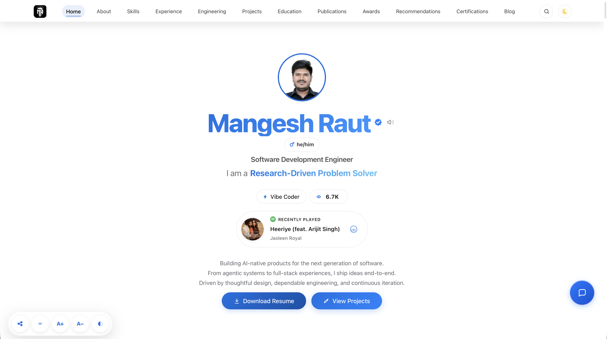
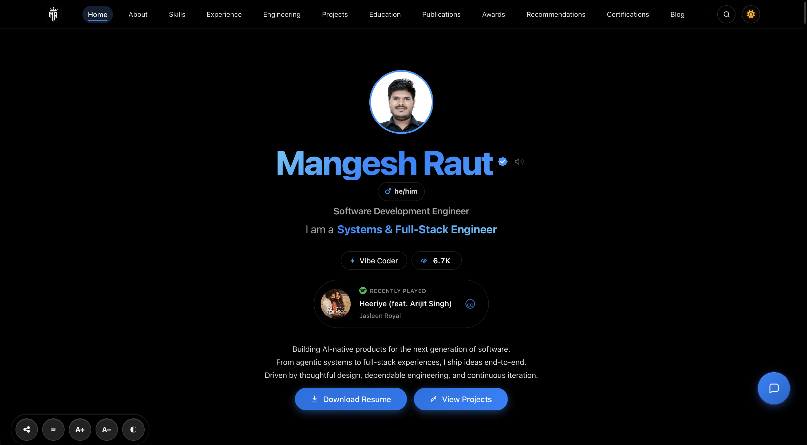
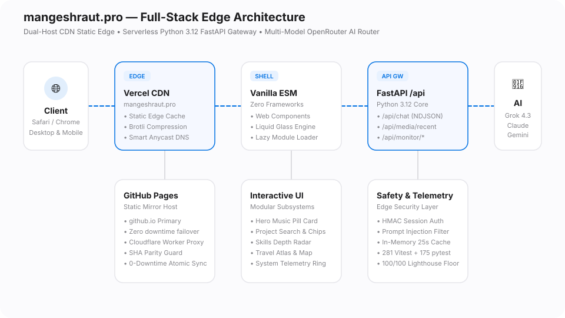
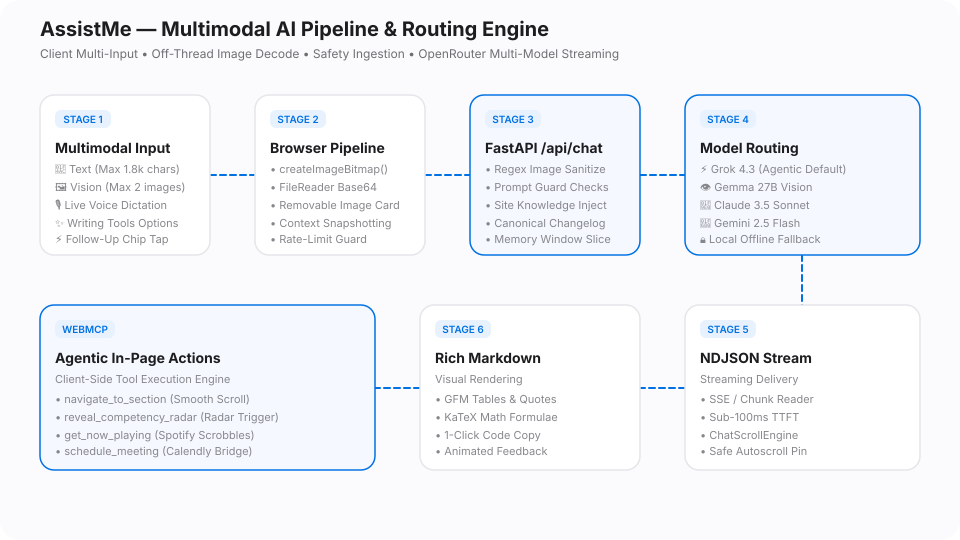
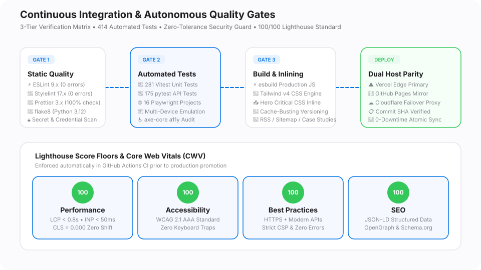
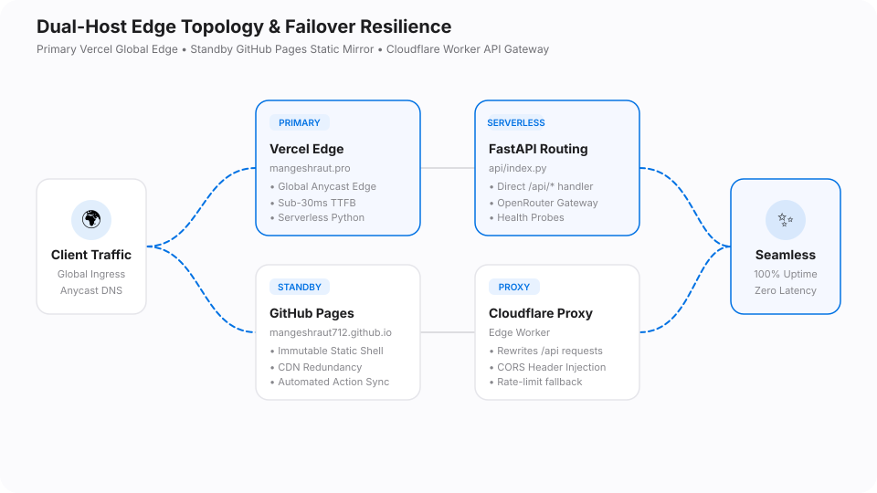
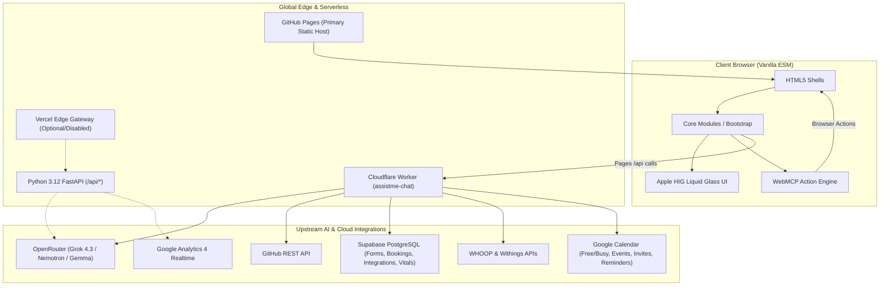

# Mangesh Raut — Agentic Full-Stack Portfolio & Open Architecture

<p align="center">
  <a href="https://mangeshraut.pro">
    
    
  </a>
</p>

<p align="center">
  <sub><strong>mangeshraut.pro</strong> · Light Mode (left) · Dark Mode (right) · <strong>Production Release · August 2026</strong> · Verified on <code>main</code></sub>
</p>

<p align="center">
  <a href="https://mangeshraut712.github.io/mangeshrautarchive/"></a>
  <a href="https://mangeshraut.pro"></a>
  <a href="https://github.com/mangeshraut712/mangeshrautarchive/actions/workflows/deploy.yml"></a>
  <a href="https://github.com/mangeshraut712/mangeshrautarchive/actions/workflows/post-deploy-monitoring.yml"></a>
  <a href="LICENSE"></a>
  <a href="CODE_OF_CONDUCT.md"></a>
</p>

<p align="center">
  
  
  
  
  
  
  
  
  
  <a href="https://foglamp.dev/scan/mangeshrautarchive-jtspx4"></a>
</p>

<p align="center">
  <strong>Zero Framework Runtime · Native Vanilla ESM · FastAPI Serverless · Agentic WebMCP · Apple HIG Liquid Glass</strong><br>
  <sub>High-contrast solid canvas (`#ffffff` / `#000000`) · Multi-Model AI Routing · 1,820+ Git Commits Open Chronicle</sub>
</p>

<p align="center">
  <a href="https://mangeshraut.pro"><b>Live Website</b></a>
  ·
  <a href="https://mangeshraut.pro/systems"><b>Systems Notebook</b></a>
  ·
  <a href="https://mangeshraut.pro/monitor"><b>System Monitor</b></a>
  ·
  <a href="https://mangeshraut.pro/travel"><b>Travel Atlas</b></a>
  ·
  <a href="https://mangeshraut712.github.io/mangeshrautarchive/uses"><b>Uses & Stack</b></a>
  ·
  <a href="https://mangeshraut712.github.io/mangeshrautarchive/changelog"><b>Changelog</b></a>
  ·
  <a href="https://mangeshraut712.github.io/mangeshrautarchive/blog/"><b>Field Notes</b></a>
  ·
  <a href="#7-quick-start--development"><b>Quick Start</b></a>
</p>

---

## 📑 Table of Contents

1. [Executive Summary](#1-executive-summary)
2. [Visual Architecture & System Diagrams](#2-visual-architecture--system-diagrams)
3. [Core Technical Stack](#3-core-technical-stack)
4. [Authentic AI & Development Tooling](#4-authentic-ai--development-tooling)
5. [Product Surfaces & Capabilities](#5-product-surfaces--capabilities)
6. [Testing & Quality Matrix](#6-testing--quality-matrix)
7. [Quick Start & Development](#7-quick-start--development)
8. [Open Source Governance & Guidelines](#8-open-source-governance--guidelines)
9. [Verified Biographical & Project Facts](#9-verified-biographical--project-facts)
10. [License, Citation & Contact](#10-license-citation--contact)

---

## 1. Executive Summary

**mangeshrautarchive** is the open-source production codebase for Mangesh Raut's [agentic full-stack portfolio on GitHub Pages](https://mangeshraut712.github.io/mangeshrautarchive/). It is engineered with a **static-first, zero-framework runtime philosophy** (no React, Next.js, Vue, Angular, or Svelte runtime dependencies), a Cloudflare Worker API for the active Pages surface, and a Python 3.12+ FastAPI compatibility backend for the optional Vercel surface.

```
┌────────────────────────────────────────────────────────────────────────────────────────┐
│                                 CORE ARCHITECTURAL PILLARS                              │
├────────────────────────────────────────────────────────────────────────────────────────┤
│  ⚡ Zero-Framework ESM: Native JavaScript modules, esbuild bundling, custom properties │
│  🤖 Agentic AI: AssistMe chatbot, OpenRouter (grok-4.3), 13 WebMCP browser actions    │
│  🎨 Apple HIG Design: Solid white/black canvases, authentic Liquid Glass shaders       │
│  📊 Real-Time Telemetry: WHOOP vitals, GA4 realtime reach, platform health probes      │
│  🛡️ Quality Gates: 209 Vitest tests, 175 pytest tests, 100/100/100/100 Lighthouse CI  │
│  📜 Open Chronicle: Complete Git history from day 1 (April 8, 2025) to August 2026     │
└────────────────────────────────────────────────────────────────────────────────────────┘
```

---

## 2. Visual Architecture & System Diagrams

### 🏛️ System Architecture Topology

High-resolution vector architecture committed in [`src/assets/images/diagrams/system-architecture.svg`](src/assets/images/diagrams/system-architecture.svg):

<p align="center">
  
</p>

### 👁️ AssistMe Agentic AI & WebMCP Workflow

Client-side tool execution, memory management, and OpenRouter NDJSON streaming:

<p align="center">
  
</p>

### 🛡️ CI/CD Quality Pipeline & 3-Tier Quality Gates

Automated repository health verification enforcing 100/100/100/100 Lighthouse scores:

<p align="center">
  
</p>

### 🌐 Dual-Host Edge Topology & Failover

GitHub Pages primary publishing + Cloudflare Worker API, with Vercel/FastAPI retained as an optional compatibility surface:

<p align="center">
  
</p>


```mermaid
flowchart TD
  subgraph Client ["Client Browser (Vanilla ESM)"]
    DOM[HTML5 Shells]
    JS[Core Modules / Bootstrap]
    MCP[WebMCP Action Engine]
    UI[Apple HIG Liquid Glass UI]
  end

  subgraph Edge ["Global Edge & Serverless"]
    Pages["GitHub Pages (Primary Static Host)"]
    Vercel["Vercel Edge Gateway (Optional/Disabled)"]
    Worker["Cloudflare Worker (assistme-chat)"]
    FastAPI["Python 3.12 FastAPI (/api/*)"]
  end

  subgraph Upstream ["Upstream AI & Cloud Integrations"]
    OR["OpenRouter (Grok 4.3 / Nemotron / Gemma)"]
    GH["GitHub REST API"]
    Supa["Supabase PostgreSQL (Forms, Bookings, Integrations, Vitals)"]
    GCal["Google Calendar (Free/Busy, Events, Invites, Reminders)"]
    WHOOP["WHOOP & Withings APIs"]
    GA4["Google Analytics 4 Realtime"]
  end

  DOM --> JS --> UI
  JS --> MCP
  MCP -->|Browser Actions| DOM
  JS -->|Pages /api calls| Worker
  Worker --> OR
  Worker --> GH
  Worker --> Supa
  Worker --> WHOOP
  Worker --> GCal
  Vercel -.-> FastAPI
  FastAPI -.-> OR
  FastAPI -.-> GA4
  Pages --> DOM
```

---

## 3. Core Technical Stack

### 3.1 Runtime & Platforms

| Layer                   | Technology        | Version                         | Purpose                                                  |
| ----------------------- | ----------------- | ------------------------------- | -------------------------------------------------------- |
| **JavaScript Engine**   | Node.js           | **≥22 <27** (`.nvmrc` → **22**) | Build toolchain, Vitest 4, ESLint 10, Stylelint 17       |
| **Module Architecture** | Native ES Modules | `"type": "module"`              | Native browser execution (`.js` explicit imports)        |
| **Python Runtime**      | CPython           | **3.12+**                       | FastAPI serverless functions & API test suite            |
| **Backend Framework**   | FastAPI           | **0.141.1**                     | Async HTTP API, OpenAPI specs, Pydantic v2 schemas       |
| **ASGI Server**         | Uvicorn           | **0.52.3**                      | High-performance async server for local & serverless API |
| **Bundling Tool**       | esbuild           | **0.28.2**                      | Lightning-fast asset compilation and minification        |

### 3.2 Frontend Architecture (Zero Runtime Dependencies)

- **Pure HTML5 / CSS3 / ES Modules**: Zero React, Vue, Angular, or Svelte runtime overhead.
- **Design Tokens**: Standardized CSS custom properties (`--apple-blue: #0071e3`, `--apple-bg`, `--apple-surface`).
- **Surface Contrast**: Solid `#ffffff` in light mode and solid `#000000` in dark mode.
- **Liquid Glass Materials**: Real-time glassmorphic shaders (`clear`, `balanced` 42% tint, `tinted`).
- **Rich Rendering**: KaTeX math rendering, marked Markdown parser, DOMPurify HTML sanitization.

---

## 4. Authentic AI & Development Tooling

This repository was built and refined using verified daily-driver AI tools and development environments:

| Tool                   | Role & Workflow Context                                                | Telemetry & Usage                    |
| ---------------------- | ---------------------------------------------------------------------- | ------------------------------------ |
| **Google Antigravity** | Multi-agent pair programming, test running, and full-repo architecture | Gemini 3.7 Flash & 2.5 Pro reasoning |
| **Cursor**             | Primary AI-native IDE with full-codebase context orchestration         | Daily-driver IDE                     |
| **Anthropic Claude**   | Deep conceptual reasoning, architectural blueprints, and refactoring   | Claude 3.7 Sonnet & Opus             |
| **OpenAI Codex**       | Unit test scaffolding, schema validation, and pair programming         | GPT-4o / Codex engine                |
| **OpenRouter**         | Multi-model proxy routing with live streaming                          | Grok 4.3, Nemotron 120B, Gemma 27B   |
| **Cline**              | Autonomous agentic coding for browser testing and refactors            | Browser automation & QA              |
| **Windsurf**           | Cascade agentic flow development and interactive iteration             | Cascade flow IDE                     |
| **KiloChat**           | Interactive chat evaluation, knowledge auditing, and verification      | Model assessment                     |
| **VS Code**            | Primary workspace, extensions, terminal environments                   | Daily developer terminal             |
| **Figma**              | UI/UX design, wireframing, and Apple HIG component layout              | Design system specification          |

---

## 5. Product Surfaces & Capabilities

| Surface / Route                                                                                         | Primary Purpose & Key Features                                                                       |
| ------------------------------------------------------------------------------------------------------- | ---------------------------------------------------------------------------------------------------- |
| [**`/` (Homepage)**](https://mangeshraut712.github.io/mangeshrautarchive/)                              | Dynamic Island hero, persistent contact, live Google booking, and Apple/Outlook event fallbacks.     |
| [**`/systems`**](https://mangeshraut712.github.io/mangeshrautarchive/systems)                           | Systems engineering notebook, multi-model token telemetry, daily-driver stack, architecture FAQ.     |
| [**`/monitor`**](https://mangeshraut712.github.io/mangeshrautarchive/monitor)                           | Real-time platform health, hosting status, WHOOP vitals summary, GA4 realtime reach.                 |
| [**`/travel`**](https://mangeshraut712.github.io/mangeshrautarchive/travel)                             | MapLibre 3D WebGL interactive atlas covering 18 US States and 4 Countries.                           |
| [**`/uses`**](https://mangeshraut712.github.io/mangeshrautarchive/uses)                                 | Hardware, developer tooling, software, and everyday carry with category filtering.                   |
| [**`/changelog`**](https://mangeshraut712.github.io/mangeshrautarchive/changelog)                       | Complete chronological release history spanning from repo creation (April 8, 2025) to August 2026.   |
| [**`/blog/`**](https://mangeshraut712.github.io/mangeshrautarchive/blog/)                               | 16 long-form technical field notes and deep dives with source embeds and KaTeX math.                 |
| [**`/case-studies/`**](https://mangeshraut712.github.io/mangeshrautarchive/case-studies/portfolio.html) | 5 architectural case studies (Portfolio Architecture, HindAI, CES Energy, AssistMe VA, Bug Tracker). |

---

## 6. Testing & Quality Matrix

All quality gates are enforced locally and verified automatically in GitHub Actions CI:

| Test Suite            | Runner            |        Test Count         | Scope & Coverage                                                            |
| --------------------- | ----------------- | :-----------------------: | --------------------------------------------------------------------------- |
| **Unit Tests**        | Vitest 4.1        | **197 passed** (42 files) | JS modules, services, markdown parser, WebMCP actions, data contracts       |
| **API Tests**         | pytest            | **169 passed** (26 files) | FastAPI endpoints, streaming chat, health probes, OAuth token stores        |
| **E2E Browser Tests** | Playwright        |      **16 projects**      | Multi-browser suite (Desktop Chrome, Safari, Firefox, iPhone 17, Pixel 7)   |
| **Accessibility**     | axe-core          |    **16/16 baseline**     | Zero critical/serious WCAG violations across light, dark, and high contrast |
| **Lighthouse CI**     | Google Lighthouse |    **100/100/100/100**    | Performance, Accessibility, Best Practices, SEO deploy gates                |
| **Repo Doctor**       | `repo-doctor.mjs` |     **60/60 checks**      | Stack guard, pin verification, root layout hygiene, zero React runtime      |

---

## 7. Quick Start & Development

### 7.1 Prerequisites

- **Node.js**: ≥22.0.0 and <27.0.0 (`.nvmrc` → `22`)
- **Python**: 3.12+
- **Git**: 2.30+

### 7.2 Installation & Local Dev

```bash
# 1. Clone the repository
git clone https://github.com/mangeshraut712/mangeshrautarchive.git
cd mangeshrautarchive

# 2. Install Node.js dependencies
npm install --no-audit --no-fund

# 3. Create and activate Python virtual environment
python3 -m venv venv
source venv/bin/activate
pip install -r requirements.txt -r requirements-dev.txt

# 4. Copy environment template (API keys optional for offline fallback)
cp .env.example .env

# 5. Run layout & stack guard
npm run doctor:strict

# 6. Start development servers
npm run dev
# Frontend: http://127.0.0.1:4000
# FastAPI:  http://127.0.0.1:8001 (Docs: /docs)
```

### 7.3 Essential Quality Commands

```bash
npm run check             # Run ESLint + Stylelint + Prettier + 209 Vitest tests
npm run test:api          # Run 175 pytest API tests
npm run doctor:strict     # Run 60-point strict repository layout check
npm run security-check    # Scan for exposed API keys and credentials
npm run build             # Production bundle compilation to dist/
npm run qa:prod-ready     # Full pre-deployment verification matrix
```

---

## 8. Open Source Governance & Guidelines

We adhere to industry-standard open-source community health and governance standards:

| Document                                               | Purpose                                                                                               |
| ------------------------------------------------------ | ----------------------------------------------------------------------------------------------------- |
| **[`CONTRIBUTING.md`](CONTRIBUTING.md)**               | Step-by-step contribution workflow, coding conventions, testing guidelines, and PR template.          |
| **[`CODE_OF_CONDUCT.md`](CODE_OF_CONDUCT.md)**         | **Contributor Covenant v2.1** community standards and enforcement guidelines.                         |
| **[`SECURITY.md`](SECURITY.md)**                       | Vulnerability reporting procedure, coordinated disclosure policy, and `security.txt` RFC 9116 parity. |
| **[`AGENTS.md`](AGENTS.md)**                           | **Linux Foundation AGENTS.md v1.0** standard for AI agent coordination and observability.             |
| **[`CITATION.cff`](CITATION.cff)**                     | **Citation File Format v1.2.0** metadata for academic and software citations.                         |

---

## 9. Verified Biographical & Project Facts

All facts across the portfolio website are verified against primary records:

- **Education**:
  - **Master of Science in Computer Science** — Drexel University, Philadelphia, PA (June 2023, GPA: 3.91/4.0)
  - **Bachelor of Engineering in Computer Engineering** — SPPU, Pune, India (June 2020, First Class with Distinction)
  - **Diploma in Computer Technology** — MSBTE, Mumbai, India (June 2017, Student of the Year)
- **Professional Experience**:
  - **Software Development Engineer** — IoasiZ Inc., Piscataway, NJ (Jul 2023 – Jul 2026)
  - **Graduate Technical Specialist** — Aramark / Drexel University, Philadelphia, PA (Sep 2021 – Jun 2023)
  - **Software Engineer** — Harshwardhan Enterprises, Pune, India (Jun 2020 – Jul 2021)
- **Research & Publications**:
  - _RTFERS: Real-Time Facial Expression Recognition System with Emotion Analytics_ — IJFGCN, SERSC Australia (Vol. 13, No. 4, 2020)
- **Geographic Footprint**:
  - 18 US States: CT, DE, DC, FL, IL, ME, MD, MA, NH, NJ, NY, NC, PA, RI, SC, TX, VT, VA
  - 4 Countries: United States, India, United Arab Emirates, Mexico

---

## 10. License, Citation & Contact

- **License**: **MIT License** — [LICENSE](LICENSE) · Copyright © 2025–2026 Mangesh Raut
- **Citation**: See [CITATION.cff](CITATION.cff) or cite as:
  ```bibtex
  @software{raut2026mangeshrautarchive,
    author = {Raut, Mangesh},
    title = {mangeshrautarchive: Agentic Full-Stack Portfolio and Open Engineering Architecture},
    year = {2026},
    url = {https://mangeshraut.pro},
    version = {2.5.0}
  }
  ```
- **Security**: [SECURITY.md](SECURITY.md) · [security.txt](https://mangeshraut712.github.io/mangeshrautarchive/.well-known/security.txt)
- **Author**: **Mangesh Raut** · MS CS, Drexel University  
  [Website](https://mangeshraut.pro) · [GitHub](https://github.com/mangeshraut712) · [LinkedIn](https://www.linkedin.com/in/mangeshraut71298) · [Email](mailto:mbr63@drexel.edu)

---

<p align="center">
  <a href="#mangesh-raut--agentic-full-stack-portfolio--open-architecture">↑ Back to top</a>
</p>
