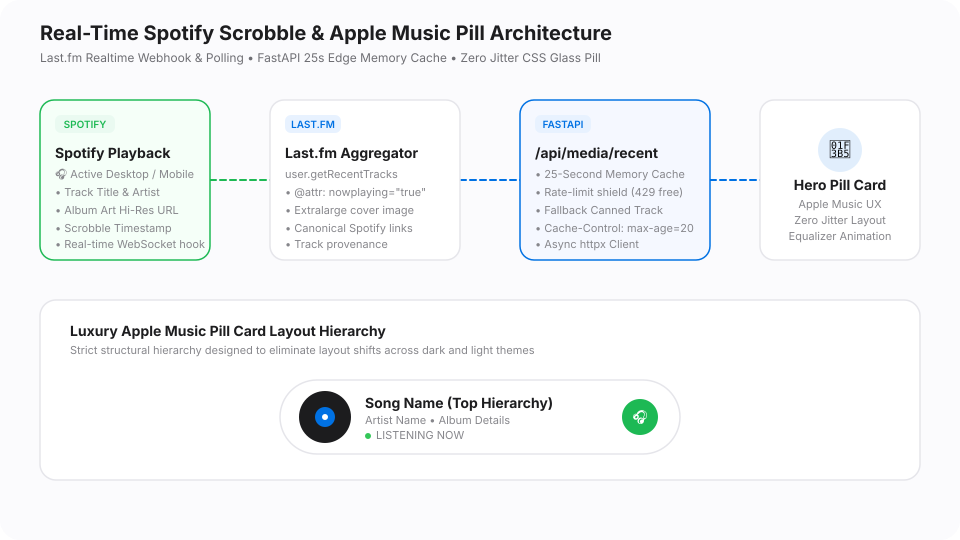
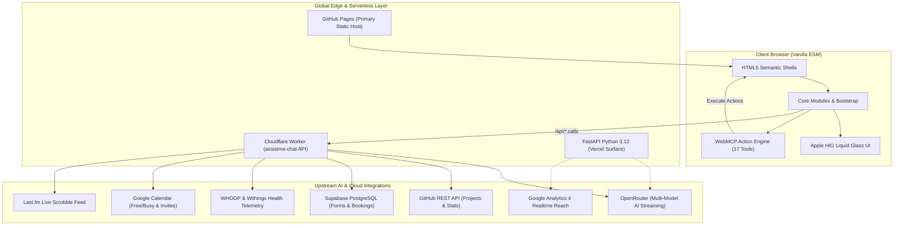
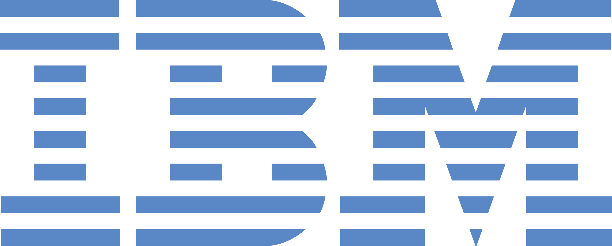

# Mangesh Raut — Agentic Full-Stack Portfolio & Open Architecture

<div align="center">

  <table>
    <tr>
      <td align="center" width="50%">
        <a href="https://mangeshraut712.github.io/mangeshrautarchive/">
          
        </a>
        <br>
        <sub><b>☀️ Light Canvas (<code>#ffffff</code>)</b></sub>
      </td>
      <td align="center" width="50%">
        <a href="https://mangeshraut712.github.io/mangeshrautarchive/">
          
        </a>
        <br>
        <sub><b>🌙 Dark Canvas (<code>#000000</code>)</b></sub>
      </td>
    </tr>
  </table>

<sub><strong>mangeshraut.pro</strong> · <strong>Production Release · September 2026</strong> · Verified 100% Green on <code>main</code></sub>

</div>

<p align="center">
  <a href="https://mangeshraut712.github.io/mangeshrautarchive/"></a>
  <a href="https://mangeshraut.pro"></a>
  <a href="https://github.com/mangeshraut712/mangeshrautarchive/actions/workflows/deploy.yml"></a>
  <a href="https://github.com/mangeshraut712/mangeshrautarchive/actions/workflows/post-deploy-monitoring.yml"></a>
  <a href="LICENSE"></a>
  <a href="CODE_OF_CONDUCT.md"></a>
</p>

<p align="center">
  
  
  
  
  
  
  
  
  
  <a href="https://foglamp.dev/scan/mangeshrautarchive-jtspx4"></a>
</p>

<p align="center">
  <strong>Zero Framework Runtime · Native Vanilla ESM · FastAPI Serverless · Agentic WebMCP · Apple HIG Liquid Glass</strong><br>
  <sub>High-contrast solid canvas (<code>#ffffff</code> / <code>#000000</code>) · Dual-Host Edge Topology · 428 Automated Tests · 100/100 Lighthouse CI</sub>
</p>

<p align="center">
  <a href="https://mangeshraut712.github.io/mangeshrautarchive/"><b>Live Website</b></a>
  ·
  <a href="https://mangeshraut712.github.io/mangeshrautarchive/systems"><b>Systems Notebook</b></a>
  ·
  <a href="https://mangeshraut712.github.io/mangeshrautarchive/monitor"><b>System Monitor</b></a>
  ·
  <a href="https://mangeshraut712.github.io/mangeshrautarchive/travel"><b>Travel Atlas</b></a>
  ·
  <a href="https://mangeshraut712.github.io/mangeshrautarchive/uses"><b>Uses & Stack</b></a>
  ·
  <a href="https://mangeshraut712.github.io/mangeshrautarchive/changelog"><b>Changelog</b></a>
  ·
  <a href="https://mangeshraut712.github.io/mangeshrautarchive/blog/"><b>Field Notes</b></a>
  ·
  <a href="#7-quick-start--development"><b>Quick Start</b></a>
</p>

---

## 📑 Table of Contents

1. [Executive Summary](#1-executive-summary)
2. [Visual Architecture & System Diagrams](#2-visual-architecture--system-diagrams)
3. [Core Technical Stack](#3-core-technical-stack)
4. [Repository Structure & Subsystems](#4-repository-structure--subsystems)
5. [Product Surfaces & Capabilities](#5-product-surfaces--capabilities)
6. [Testing & Quality Assurance Matrix](#6-testing--quality-assurance-matrix)
7. [Quick Start & Development](#7-quick-start--development)
8. [Open Source Governance & Guidelines](#8-open-source-governance--guidelines)
   - [8.1 Software Engineering Best Practices for Long-Term Success](#81-software-engineering-best-practices-for-long-term-success)
9. [Verified Biographical & Project Facts](#9-verified-biographical--project-facts)
10. [License, Citation & Contact](#10-license-citation--contact)

---

## 1. Executive Summary

**mangeshrautarchive** is the open-source production codebase for Mangesh Raut's [agentic full-stack portfolio on GitHub Pages](https://mangeshraut712.github.io/mangeshrautarchive/). It is engineered with a **static-first, zero-framework runtime philosophy** (no React, Next.js, Vue, Angular, or Svelte runtime dependencies), a Cloudflare Worker API for the active Pages surface, and a Python 3.12+ FastAPI compatibility backend for the optional Vercel surface.

```
┌────────────────────────────────────────────────────────────────────────────────────────┐
│                                 CORE ARCHITECTURAL PILLARS                              │
├────────────────────────────────────────────────────────────────────────────────────────┤
│  ⚡ Zero-Framework ESM: Native JavaScript modules, esbuild bundling, custom properties │
│  🤖 Agentic AI: AssistMe chatbot, OpenRouter streaming, 17 WebMCP browser actions      │
│  🎨 Apple HIG Design: Solid white/black canvases, 3D kinetic interaction model         │
│  📊 Real-Time Telemetry: WHOOP vitals, GA4 realtime reach, platform health probes       │
│  🛡️ Quality Gates: 253 Vitest tests, 175 pytest tests, 100/100/100/100 Lighthouse CI   │
│  📜 Open Chronicle: Complete Git history from day 1 (April 8, 2025) to September 2026   │
└────────────────────────────────────────────────────────────────────────────────────────┘
```

---

## 2. Visual Architecture & System Diagrams

### 🏛️ 2.1 System Architecture Topology

High-resolution vector architecture committed in [`src/assets/images/diagrams/system-architecture.svg`](src/assets/images/diagrams/system-architecture.svg):

<div align="center">
  
  <br>
  <sub><b>Figure 1: Full-stack system topology spanning client browser, edge routing, AI models, and upstream APIs.</b></sub>
</div>

<br>

### 👁️ 2.2 AssistMe Agentic AI & WebMCP Workflow

Client-side tool execution, memory management, and OpenRouter NDJSON streaming committed in [`src/assets/images/diagrams/assistme-multimodal-workflow.svg`](src/assets/images/diagrams/assistme-multimodal-workflow.svg):

<div align="center">
  
  <br>
  <sub><b>Figure 2: Multimodal AssistMe chatbot pipeline with WebMCP action execution and streaming intelligence.</b></sub>
</div>

<br>

### 🛡️ 2.3 CI/CD Quality Pipeline & 3-Tier Quality Gates

Automated repository health verification enforcing 100/100/100/100 Lighthouse scores committed in [`src/assets/images/diagrams/ci-cd-quality-pipeline.svg`](src/assets/images/diagrams/ci-cd-quality-pipeline.svg):

<div align="center">
  
  <br>
  <sub><b>Figure 3: 3-tier automated CI/CD pipeline enforcing static security, linting, unit tests, and Lighthouse floors.</b></sub>
</div>

<br>

### 🌐 2.4 Dual-Host Edge Topology & Failover

GitHub Pages primary publishing + Cloudflare Worker API, with Vercel/FastAPI retained as an optional compatibility surface committed in [`src/assets/images/diagrams/dual-host-edge-topology.svg`](src/assets/images/diagrams/dual-host-edge-topology.svg):

<div align="center">
  
  <br>
  <sub><b>Figure 4: Global edge delivery network with zero-cold-start static distribution and live serverless API proxying.</b></sub>
</div>

<br>

### 🎵 2.5 Real-Time Spotify Scrobble & Media Pipeline

Live music listening telemetry, Last.fm scrobble synchronization, and cached artwork loading committed in [`src/assets/images/diagrams/spotify-live-scrobble-flow.svg`](src/assets/images/diagrams/spotify-live-scrobble-flow.svg):

<div align="center">
  
  <br>
  <sub><b>Figure 5: Real-time Spotify listening feed with Last.fm API caching, cover artwork rendering, and fallbacks.</b></sub>
</div>

<br>

### ⚡ 2.6 Interactive Mermaid Topology


```mermaid
flowchart TD
  subgraph Client ["Client Browser (Vanilla ESM)"]
    DOM["HTML5 Semantic Shells"]
    JS["Core Modules & Bootstrap"]
    MCP["WebMCP Action Engine (17 Tools)"]
    UI["Apple HIG Liquid Glass UI"]
  end

  subgraph Edge ["Global Edge & Serverless Layer"]
    Pages["GitHub Pages (Primary Static Host)"]
    Worker["Cloudflare Worker (assistme-chat API)"]
    FastAPI["FastAPI Python 3.12 (Vercel Surface)"]
  end

  subgraph Upstream ["Upstream AI & Cloud Integrations"]
    OR["OpenRouter (Multi-Model AI Streaming)"]
    GH["GitHub REST API (Projects & Stats)"]
    Supa["Supabase PostgreSQL (Forms & Bookings)"]
    GCal["Google Calendar (Free/Busy & Invites)"]
    WHOOP["WHOOP & Withings Health Telemetry"]
    GA4["Google Analytics 4 Realtime Reach"]
    LFM["Last.fm Live Scrobble Feed"]
  end

  DOM --> JS --> UI
  JS --> MCP
  MCP -->|Execute Actions| DOM
  JS -->|/api/* calls| Worker
  Worker --> OR
  Worker --> GH
  Worker --> Supa
  Worker --> WHOOP
  Worker --> GCal
  Worker --> LFM
  FastAPI -.-> OR
  FastAPI -.-> GA4
  Pages --> DOM
```

---

## 3. Core Technical Stack

### 3.1 Runtime, Platforms & Build Engines

| Layer                   | Technology         | Version                         | Purpose                                                  |
| :---------------------- | :----------------- | :------------------------------ | :------------------------------------------------------- |
| **JavaScript Engine**   | Node.js            | **≥22 <27** (`.nvmrc` → **22**) | Build toolchain, Vitest 4, ESLint 10, Stylelint 17       |
| **Module Architecture** | Native ES Modules  | `"type": "module"`              | Native browser execution (`.js` explicit imports)        |
| **Python Runtime**      | CPython            | **3.12+**                       | FastAPI serverless functions & pytest API suite          |
| **Backend Framework**   | FastAPI            | **0.141.1**                     | Async HTTP API, OpenAPI specs, Pydantic v2 schemas       |
| **Edge Compute**        | Cloudflare Workers | **ESM standard**                | Low-latency Edge AI routing & OAuth proxying             |
| **ASGI Server**         | Uvicorn            | **0.52.3**                      | High-performance async server for local & serverless API |
| **Bundling Tool**       | esbuild            | **0.28.2**                      | Lightning-fast asset compilation and minification        |

### 3.2 Frontend Architecture (Zero Runtime Dependencies)

- **Pure HTML5 / CSS3 / ES Modules**: Zero React, Vue, Angular, or Svelte runtime overhead.
- **Design Tokens**: Standardized CSS custom properties (`--apple-blue: #0071e3`, `--apple-bg`, `--apple-surface`).
- **Surface Contrast**: Solid `#ffffff` in light mode and solid `#000000` in dark mode.
- **3D Interactive Kinetics**: Specular metallic sheen animations, perspective hover lift, and tactile spring click micro-physics across all button tiers.
- **Liquid Glass Materials**: Real-time glassmorphic shaders (`clear`, `balanced` 42% tint, `tinted`).
- **Rich Rendering**: KaTeX math rendering, marked Markdown parser, DOMPurify HTML sanitization.

---

## 4. Repository Structure & Subsystems

The codebase is organized into modular subsystems so every file is purpose-built and easy to find:

```text
mangeshrautarchive/
├── src/                      # ★ Production Frontend Source (Vanilla HTML, CSS, ESM)
│   ├── *.html                # Page shells (index, systems, monitor, travel, uses, changelog, 404)
│   ├── js/core|modules|services|utils|data|vendor/ # Modular client engine & WebMCP tools
│   └── assets/css|images|files|icons|vendor/       # Design system & media assets
├── api/                      # ★ FastAPI Backend (Python 3.12+ Serverless & Local Intelligence)
│   ├── routes/               # Modular HTTP route handlers (chat, monitor, media, integrations)
│   ├── integrations/         # Third-party OAuth connectors & health probes
│   └── config.py · model_router.py · monitoring.py
├── workers/                  # ★ Cloudflare Workers (Edge AI Proxy & Cron Telemetry)
│   └── assistme-chat/        # Standalone Edge Worker for AssistMe AI & WebMCP proxy
├── scripts/                  # ★ Developer Tooling & Build Pipeline (esbuild, QA, security, sync)
├── tests/                    # ★ Automated Test Suite (253 Vitest, 175 pytest, 16 Playwright targets)
├── docs/                     # Documentation (DESIGN.md source of truth, STRUCTURE.md, plans)
└── .github/workflows/        # Automated CI/CD (GitHub Pages deploy, monitoring, edge sync)
```

> 📖 **Full Layout Map**: See [**`docs/STRUCTURE.md`**](docs/STRUCTURE.md) for the complete directory specification and where to add new files.

---

## 5. Product Surfaces & Capabilities

| Surface / Route                                                                                         | Primary Purpose & Key Features                                                                                                                                                      |
| :------------------------------------------------------------------------------------------------------ | :---------------------------------------------------------------------------------------------------------------------------------------------------------------------------------- |
| [**`/` (Homepage)**](https://mangeshraut712.github.io/mangeshrautarchive/)                              | Permanent compact Apple Music player with 30s audio scrubber & live equalizer, persistent contact, live Google booking, and Apple/Outlook event fallbacks.                          |
| [**`/systems`**](https://mangeshraut712.github.io/mangeshrautarchive/systems)                           | Systems engineering notebook, token telemetry, daily-driver stack, architecture FAQ.                                                                                                |
| [**`/monitor`**](https://mangeshraut712.github.io/mangeshrautarchive/monitor)                           | Real-time platform health, hosting status, WHOOP vitals summary, GA4 realtime reach.                                                                                                |
| [**`/travel`**](https://mangeshraut712.github.io/mangeshrautarchive/travel)                             | MapLibre 3D WebGL interactive atlas covering 90 stops across 4 countries with Google Search City Knowledge Panels, Google Maps/Guide actions, coordinates, and instant prefetching. |
| [**`/uses`**](https://mangeshraut712.github.io/mangeshrautarchive/uses)                                 | Apple Special Event Keynote presentation with 6 interactive acts, frosted glass pill dock, and category-filtered engineering inventory.                                             |
| [**`/changelog`**](https://mangeshraut712.github.io/mangeshrautarchive/changelog)                       | Clean GitHub/Apple un-boxed release history spanning from repo creation (April 8, 2025) to September 2026.                                                                          |
| [**`/blog/`**](https://mangeshraut712.github.io/mangeshrautarchive/blog/)                               | 16 long-form technical field notes and deep dives with source embeds and KaTeX math.                                                                                                |
| [**`/case-studies/`**](https://mangeshraut712.github.io/mangeshrautarchive/case-studies/portfolio.html) | 5 architectural case studies (Portfolio Architecture, HindAI, CES Energy, AssistMe VA, Bug Tracker).                                                                                |

### 5.1 AI Models & Engineering Purpose Matrix

| Model Tier & Name      | Engineering Purpose & Scope                                                                                                                                                                                       | Reasoning Mode           | Status |
| :--------------------- | :---------------------------------------------------------------------------------------------------------------------------------------------------------------------------------------------------------------- | :----------------------- | :----- |
| **`gemini-3.8-flash`** | Smart AI Calendar & Reminders (NLP parser, schedule conflict & density detector, AI daily briefing HUD, WebMCP actions `add_calendar_reminder`, `get_calendar_events`, `filter_calendar_view`) & 253 Vitest tests | High / Extended Thinking | Active |
| **`gemini-3.8-flash`** | Live Luma events schedule sync for `mbr63@drexel.edu`, 4-state attendance tracking (Going, Waitlisted, Submitted, Attended), dedicated Luma filter tab & 243 Vitest tests                                         | High / Extended Thinking | Active |
| **`gemini-3.8-flash`** | GitHub Operating View live sync (51 repos), 2D/3D contributions graph calibration (2,654 contributions), calendar reminders & cross-surface telemetry                                                             | High / Extended Thinking | Active |
| **`gemini-3.8-flash`** | Sitewide 100/100/100/100 Lighthouse PageSpeed optimization, WCAG 2 AA color contrast & heading sequence remediation, CSS deferral, and zero-defect QA                                                             | High / Extended Thinking | Active |
| **`gemini-3.8-flash`** | Travel Atlas Apple Maps sidebar redesign, segmented metric strip architecture, global CSS capsule purge, and subpage layout synchronization                                                                       | High / Extended Thinking | Active |
| **`gemini-3.8-flash`** | Codification of 14 Software Engineering Best Practices (`docs/BEST_PRACTICES.md`), subnavbar geometric synchronization                                                                                            | High / Extended Thinking | Active |
| **`gemini-3.8-flash`** | Keynote Special Event presentation redesign for `/uses`, WebMCP agentic tooling                                                                                                                                   | High / Extended Thinking | Active |
| **`grok-4.3`**         | Production conversational agent (`/api/chat`), real-time streaming, WebMCP portfolio actions                                                                                                                      | Standard / Low Latency   | Active |

---

## 6. Testing & Quality Assurance Matrix

All quality gates are enforced locally and verified automatically in GitHub Actions CI:

| Test Suite            | Runner            |        Test Count         | Scope & Coverage                                                            |
| :-------------------- | :---------------- | :-----------------------: | :-------------------------------------------------------------------------- |
| **Unit Tests**        | Vitest 4.1        | **253 passed** (48 files) | JS modules, services, markdown parser, WebMCP actions, data contracts       |
| **API Tests**         | pytest            | **175 passed** (27 files) | FastAPI endpoints, streaming chat, health probes, OAuth token stores        |
| **E2E Browser Tests** | Playwright        |      **16 projects**      | Multi-browser suite (Desktop Chrome, Safari, Firefox, iPhone 17, Pixel 7)   |
| **Accessibility**     | axe-core          |    **16/16 baseline**     | Zero critical/serious WCAG violations across light, dark, and high contrast |
| **Lighthouse CI**     | Google Lighthouse |    **100/100/100/100**    | Performance, Accessibility, Best Practices, SEO deploy gates                |
| **Repo Doctor**       | `repo-doctor.mjs` |     **60/60 checks**      | Stack guard, pin verification, root layout hygiene, zero React runtime      |

---

## 7. Quick Start & Development

### 7.1 Prerequisites

- **Node.js**: ≥22.0.0 and <27.0.0 (`.nvmrc` → `22`)
- **Python**: 3.12+
- **Git**: 2.30+

### 7.2 Installation & Local Dev

```bash
# 1. Clone the repository
git clone https://github.com/mangeshraut712/mangeshrautarchive.git
cd mangeshrautarchive

# 2. Install Node.js dependencies
npm install --no-audit --no-fund

# 3. Create and activate Python virtual environment
python3 -m venv venv
source venv/bin/activate
pip install -r requirements.txt -r requirements-dev.txt

# 4. Copy environment template (API keys optional for offline fallback)
cp .env.example .env

# 5. Run layout & stack guard
npm run doctor:strict

# 6. Start development servers
npm run dev
# Frontend: http://127.0.0.1:4000
# FastAPI:  http://127.0.0.1:8001 (Docs: /docs)
```

### 7.3 Essential Quality Commands

```bash
npm run check             # Run ESLint + Stylelint + Prettier + 253 Vitest tests
npm run test:api          # Run 175 pytest API tests
npm run doctor:strict     # Run 60-point strict repository layout check
npm run security-check    # Scan for exposed API keys and credentials
npm run build             # Production bundle compilation to dist/
npm run qa:prod-ready     # Full pre-deployment verification matrix
```

---

## 8. Open Source Governance & Guidelines

We adhere to industry-standard open-source community health, architecture, and governance standards:

| Document                                               | Purpose                                                                                                                      |
| :----------------------------------------------------- | :--------------------------------------------------------------------------------------------------------------------------- |
| **[`docs/BEST_PRACTICES.md`](docs/BEST_PRACTICES.md)** | **Software Engineering Best Practices**: 14 architectural principles for long-term maintainability, modularity, and quality. |
| **[`CONTRIBUTING.md`](CONTRIBUTING.md)**               | Step-by-step contribution workflow, coding conventions, testing guidelines, and PR template.                                 |
| **[`CODE_OF_CONDUCT.md`](CODE_OF_CONDUCT.md)**         | **Contributor Covenant v2.1** community standards and enforcement guidelines.                                                |
| **[`SECURITY.md`](SECURITY.md)**                       | Vulnerability reporting procedure, coordinated disclosure policy, and `security.txt` RFC 9116 parity.                        |
| **[`AGENTS.md`](AGENTS.md)**                           | **Linux Foundation AGENTS.md v1.0** standard for AI agent coordination and observability.                                    |
| **[`CITATION.cff`](CITATION.cff)**                     | **Citation File Format v1.2.0** metadata for academic and software citations.                                                |

### 8.1 Software Engineering Best Practices for Long-Term Success

The repository enforces 14 architectural and operational tenets across every pull request and automated build:

1. **Explicit Architecture:** Choose an explicit architecture (layered, MVC, modular services) matching the product's scale, and keep it documented so new work has a place to live.
2. **Loosely Coupled Modules:** Split the system into loosely coupled modules with one clear responsibility each, so change in one area does not ripple through the rest.
3. **Design for Scalability:** Design for growth from the start: isolate stateful parts, keep interfaces stable, and plan how the system will scale horizontally and vertically.
4. **Self-Documenting Naming:** Name variables, functions, types, and modules so the intent is obvious without extra commentary.
5. **Simple Control Flow:** Prefer simple, readable control flow over clever or dense logic; complexity should be justified by a real constraint.
6. **Single-Purpose Functions:** Keep functions and methods small and single-purpose so they can be reasoned about, tested, and reused.
7. **Enforce Uniform Standards:** Enforce one formatting and style standard across the repository so reviews focus on behavior, not noise.
8. **Document Invariants & APIs:** Document architecture, public APIs, and non-obvious invariants so the system remains understandable years later.
9. **First-Class Automated Testing:** Write code that is testable at unit, integration, and end-to-end levels, and treat tests as part of the product, not an afterthought.
10. **Continuous Refactoring:** Refactor regularly to improve structure and clarity without changing external behavior.
11. **Intentional Debt Paydown:** Track and pay down technical debt on purpose; do not let shortcuts become the architecture.
12. **Reviewable Git History:** Use Git with a clear branch and merge policy so history stays reviewable and recoverable.
13. **Rigorous Code Reviews:** Require code reviews to protect quality, share design knowledge, and catch defects before they ship.
14. **Fully Automated CI/CD:** Run CI/CD so every change is built, tested, and released through the same automated path.

For detailed implementations and code patterns, see the full guide in **[`docs/BEST_PRACTICES.md`](docs/BEST_PRACTICES.md)**.

---

## 9. Verified Biographical & Project Facts

All facts across the portfolio website are verified against primary records:

- **Education**:
  - **Master of Science in Computer Science** — Drexel University, Philadelphia, PA (June 2023, GPA: 3.91/4.0)
  - **Bachelor of Engineering in Computer Engineering** — SPPU, Pune, India (June 2020, First Class with Distinction)
  - **Diploma in Computer Technology** — MSBTE, Mumbai, India (June 2017, Student of the Year)
- **Professional Experience**:
  - **Software Development Engineer** — IoasiZ Inc., Piscataway, NJ (Jul 2023 – Jul 2026)
  - **Graduate Technical Specialist** — Aramark / Drexel University, Philadelphia, PA (Sep 2021 – Jun 2023)
  - **Software Engineer** — Harshwardhan Enterprises, Pune, India (Jun 2020 – Jul 2021)
- **Research & Publications**:
  - _RTFERS: Real-Time Facial Expression Recognition System with Emotion Analytics_ — IJFGCN, SERSC Australia (Vol. 13, No. 4, 2020)
- **Industry Certifications**:
  -  **Apple Certified iOS Developer**
  -  **Google Cloud Associate Cloud Engineer**
  -  **Microsoft Certified: Azure Fundamentals (AZ-900)**
  -  **IBM AI Foundations for Business**
  -  **Cisco CCNA: Introduction to Networks**
  -  **HackerRank Problem Solving (Advanced) & Python (Gold)**
- **Geographic Footprint**:
  - **18 US States**: CT, DE, DC, FL, IL, ME, MD, MA, NH, NJ, NY, NC, PA, RI, SC, TX, VT, VA
  - **4 Countries**: United States, India, United Arab Emirates, Mexico

---

## 10. License, Citation & Contact

- **License**: **MIT License** — [LICENSE](LICENSE) · Copyright © 2025–2026 Mangesh Raut
- **Citation**: See [CITATION.cff](CITATION.cff) or cite as:
  ```bibtex
  @software{raut2026mangeshrautarchive,
    author = {Raut, Mangesh},
    title = {mangeshrautarchive: Agentic Full-Stack Portfolio and Open Engineering Architecture},
    year = {2026},
    url = {https://mangeshraut712.github.io/mangeshrautarchive/},
    version = {2.5.0}
  }
  ```
- **Security**: [SECURITY.md](SECURITY.md) · [security.txt](https://mangeshraut712.github.io/mangeshrautarchive/.well-known/security.txt)
- **Author**: **Mangesh Raut** · MS CS, Drexel University  
  [Website](https://mangeshraut712.github.io/mangeshrautarchive/) · [GitHub](https://github.com/mangeshraut712) · [LinkedIn](https://www.linkedin.com/in/mangeshraut71298) · [Email](mailto:mbr63@drexel.edu)

---

<p align="center">
  <a href="#mangesh-raut--agentic-full-stack-portfolio--open-architecture">↑ Back to top</a>
</p>
