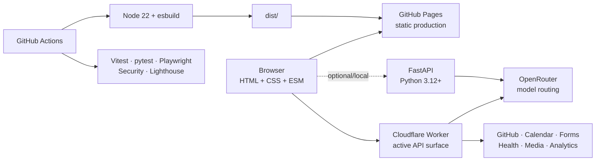

# Mangesh Raut — Agentic Full-Stack Portfolio

<div align="center">

An open-source portfolio built with vanilla web standards, an agentic AssistMe interface,
Cloudflare edge services, and a FastAPI compatibility backend.

[Live site](https://mangeshraut712.github.io/mangeshrautarchive/) ·
[Systems](https://mangeshraut712.github.io/mangeshrautarchive/systems) ·
[Monitor](https://mangeshraut712.github.io/mangeshrautarchive/monitor) ·
[Changelog](https://mangeshraut712.github.io/mangeshrautarchive/changelog) ·
[Documentation](docs/README.md)

[](https://github.com/mangeshraut712/mangeshrautarchive/actions/workflows/deploy.yml)
[](https://github.com/mangeshraut712/mangeshrautarchive/actions/workflows/post-deploy-monitoring.yml)
[](.nvmrc)
[](.python-version)
[](LICENSE)

</div>

<table>
  <tr>
    <td width="50%"><a href="https://mangeshraut712.github.io/mangeshrautarchive/"></a></td>
    <td width="50%"><a href="https://mangeshraut712.github.io/mangeshrautarchive/"></a></td>
  </tr>
</table>

## What this repository contains

`mangeshrautarchive` is the production source for Mangesh Raut's portfolio and public engineering
notebook. The browser application deliberately avoids a client-framework runtime: pages are
semantic HTML, modular CSS, and native JavaScript ES modules bundled with esbuild.

The project combines:

- an Apple-inspired, accessible interface with light, dark, high-contrast, reduced-motion, and
  mobile states;
- AssistMe, a streaming portfolio assistant with Markdown, code, math, attachments, voice, memory,
  and WebMCP actions;
- project, systems, travel, equipment, changelog, field-note, and live-monitor surfaces;
- GitHub Pages delivery backed by a Cloudflare Worker for active API traffic;
- a Python FastAPI backend retained for local development and the optional Vercel surface;
- automated security, lint, unit, API, browser, accessibility, build, and Lighthouse checks.

The primary public surface is
[GitHub Pages](https://mangeshraut712.github.io/mangeshrautarchive/). The custom Vercel deployment
is optional and may be disabled; do not use `mangeshraut.pro` as the availability source of truth.

## Product surfaces

| Route                                                                         | Purpose                                                                      |
| ----------------------------------------------------------------------------- | ---------------------------------------------------------------------------- |
| [`/`](https://mangeshraut712.github.io/mangeshrautarchive/)                   | Portfolio, experience, projects, live music, contact, calendar, and AssistMe |
| [`/about`](https://mangeshraut712.github.io/mangeshrautarchive/about)         | Narrative profile and compact career summary                                 |
| [`/systems`](https://mangeshraut712.github.io/mangeshrautarchive/systems)     | Architecture notebook, engineering stack, and system explanations            |
| [`/monitor`](https://mangeshraut712.github.io/mangeshrautarchive/monitor)     | Deployment, service, security, and telemetry status                          |
| [`/travel`](https://mangeshraut712.github.io/mangeshrautarchive/travel)       | Interactive travel atlas and place details                                   |
| [`/uses`](https://mangeshraut712.github.io/mangeshrautarchive/uses)           | Tools, hardware, software, and workflow presentation                         |
| [`/changelog`](https://mangeshraut712.github.io/mangeshrautarchive/changelog) | Compact release timeline with expandable implementation details              |
| [`/blog/`](https://mangeshraut712.github.io/mangeshrautarchive/blog/)         | Technical field notes rendered from repository content                       |

## Architecture


```mermaid
flowchart LR
  Browser[Browser<br>HTML + CSS + ESM] --> Pages[GitHub Pages<br>static production]
  Browser --> Worker[Cloudflare Worker<br>active API surface]
  Browser -. optional/local .-> FastAPI[FastAPI<br>Python 3.12+]
  Worker --> OpenRouter[OpenRouter<br>model routing]
  Worker --> Services[GitHub · Calendar · Forms<br>Health · Media · Analytics]
  FastAPI --> OpenRouter
  Build[Node 22 + esbuild] --> Dist[dist/]
  Dist --> Pages
  CI[GitHub Actions] --> Build
  CI --> Tests[Vitest · pytest · Playwright<br>Security · Lighthouse]
```


More diagrams:

- [AssistMe and WebMCP workflow](src/assets/images/diagrams/assistme-multimodal-workflow.svg)
- [CI/CD quality pipeline](src/assets/images/diagrams/ci-cd-quality-pipeline.svg)
- [Pages, Worker, and optional Vercel topology](src/assets/images/diagrams/dual-host-edge-topology.svg)
- [Live music and Last.fm flow](src/assets/images/diagrams/spotify-live-scrobble-flow.svg)

## Technology

| Layer             | Implementation                                                      |
| ----------------- | ------------------------------------------------------------------- |
| Frontend          | Semantic HTML5, vanilla CSS, JavaScript ES modules                  |
| Build             | Node.js 22, esbuild, Tailwind CSS v4 generation, Sharp              |
| Active edge API   | Cloudflare Worker, ESM, scheduled health synchronization            |
| Compatibility API | Python 3.12+, FastAPI, Pydantic v2, Uvicorn                         |
| AI runtime        | OpenRouter routing with paid, automatic, and free fallback paths    |
| Rich content      | Marked, DOMPurify, KaTeX, syntax highlighting                       |
| Testing           | Vitest, pytest, Playwright, axe-core, Lighthouse                    |
| Delivery          | GitHub Pages, GitHub Actions, optional Vercel compatibility surface |

Tailwind is a build-time utility generator only. Application markup and components remain vanilla;
the repository does not ship React, Next.js, Vue, Angular, or Svelte.

## AssistMe model routing

The site's runtime assistant and the coding models used to maintain this repository are separate.
AssistMe routes requests through OpenRouter:

- portfolio questions prefer `x-ai/grok-4.3` when paid routing is available;
- broad comparison and synthesis requests use OpenRouter Auto or Fusion routing;
- simple queries can use Gemini Flash;
- free Nemotron and Gemma routes keep a zero-credit fallback available;
- image-bearing requests use a free multimodal path when configured;
- local development works without an OpenRouter key through the offline fallback.

See [`api/model_router.py`](api/model_router.py), [`api/config.py`](api/config.py), and
[`docs/API.md`](docs/API.md) for the exact routing and endpoint contracts.

## Repository map

```text
mangeshrautarchive/
├── src/                       # Browser source and static public files
│   ├── *.html                 # Page shells
│   ├── assets/css/            # Tokens, components, page styles, theme layers
│   ├── assets/images/         # Portfolio media and architecture diagrams
│   └── js/                    # Core, modules, services, data, utilities, vendor code
├── workers/assistme-chat/     # Active Cloudflare Worker
├── api/                       # FastAPI compatibility backend and integrations
├── scripts/                   # Build, QA, deployment, synchronization, utilities
├── tests/                     # Vitest, pytest, Playwright, accessibility tests
├── docs/                      # Design, architecture, API, plans, contributor docs
├── .github/workflows/         # CI, deploy, monitoring, release, sync automation
└── dist/                      # Generated production output
```

The complete ownership map lives in [`docs/STRUCTURE.md`](docs/STRUCTURE.md).

## Quick start

### Requirements

- Node.js `>=22 <27` (`.nvmrc` and `.node-version` use 22)
- Python 3.12+
- Git

### Install and run

```bash
git clone https://github.com/mangeshraut712/mangeshrautarchive.git
cd mangeshrautarchive

npm install --no-audit --no-fund

python3 -m venv venv
source venv/bin/activate
pip install -r requirements.txt -r requirements-dev.txt

npm run doctor:strict
npm run dev
```

Local endpoints:

- frontend: `http://127.0.0.1:4000`
- FastAPI: `http://127.0.0.1:8001`
- OpenAPI: `http://127.0.0.1:8001/docs`

Secrets are optional for the offline AssistMe fallback. Copy `.env.example` only when you need a
real integration, keep credentials in an ignored local environment file, and never commit them.

## Commands

Commands below come from [`package.json`](package.json).

| Task                                  | Command                      |
| ------------------------------------- | ---------------------------- |
| Verify Node version                   | `npm run check-node`         |
| Validate layout and stack             | `npm run doctor:strict`      |
| Start frontend and API                | `npm run dev`                |
| Start frontend only                   | `npm run dev:frontend`       |
| Start FastAPI only                    | `npm run dev:backend`        |
| Build production output               | `npm run build`              |
| JS/CSS/format/unit gate               | `npm run check`              |
| API tests                             | `npm run test:api`           |
| Desktop Chrome E2E                    | `npm run test:e2e:chrome`    |
| All configured E2E projects           | `npm run test:e2e:all`       |
| Python lint                           | `npm run lint:python`        |
| Dependency and secret scan            | `npm run security-check`     |
| Full production-readiness gate        | `npm run qa:prod-ready`      |
| Verify remote deployment parity       | `npm run verify:deploy-sync` |
| Generate private local Codex insights | `npm run insights`           |

Playwright helpers are available through `npm run playwright:mcp`, `npm run playwright:cli`, and
`npm run playwright:codegen`.

## Verification model

The repository uses several levels of evidence rather than one permanent “all green” claim:

1. `npm run doctor:strict` verifies repository layout and stack constraints.
2. `npm run check`, `npm run test:api`, and focused Playwright tests verify local behavior.
3. `npm run build` verifies the generated `dist/` artifact.
4. GitHub Actions repeats security, lint, unit, API, browser, accessibility, build, and Lighthouse
   gates before publishing Pages.
5. Post-deploy jobs probe the public Pages and Worker surfaces and report optional Vercel status.

Test counts evolve with the repository. Use the test runner output and the current workflow run as
the source of truth instead of a fixed badge count in this document.

### Current status snapshot

Verified on **September 22, 2026**:

- GitHub Pages responded with HTTP `200`.
- `mangeshraut.pro` responded with HTTP `402 DEPLOYMENT_DISABLED`; it is not the active production
  availability target.
- GitHub code scanning reported `0` open alerts, `26` fixed alerts, and `80` dismissed alerts.
- The latest `main` "CI → Deploy to GitHub Pages" and scheduled monitoring runs completed
  successfully. Individual runs can still fail transiently, so check the live badges and
  [Actions](https://github.com/mangeshraut712/mangeshrautarchive/actions) before treating a release
  as green.
- Portfolio Reach is mirrored from Google Analytics into the Cloudflare Worker snapshot by the
  scheduled `Portfolio reach sync` workflow, so the public counter reflects real GA4 data.

Zero open scanner alerts is a dashboard state, not proof that the application is vulnerability-free.
Dismissed alerts are not equivalent to fixed vulnerabilities.

## Design and accessibility

[`docs/DESIGN.md`](docs/DESIGN.md) is the visual source of truth. Core requirements include:

- Apple system typography with clear information hierarchy;
- solid white and black canvases with restrained glass surfaces;
- Apple Blue actions and consistent circular red close controls;
- readable theme-aware colors in light, dark, and high-contrast modes;
- 44 × 44 px touch targets, keyboard navigation, and visible focus states;
- reduced-motion support and zero horizontal viewport overflow;
- browser inspection at representative desktop and mobile widths during visual changes.

## Security and privacy

- API keys remain server-side and ignored environment files are excluded from Git.
- External URLs, rich HTML, calendar content, and form inputs pass through validation or
  sanitization boundaries.
- CI runs dependency auditing and a repository secret scan.
- Security reports follow the private process in [`SECURITY.md`](SECURITY.md).
- Public disclosure metadata is available at
  [`.well-known/security.txt`](https://mangeshraut712.github.io/mangeshrautarchive/.well-known/security.txt).

Operational telemetry and portfolio facts should be described with their collection time and
source. Generated or heuristic data must not be represented as human review.

## Multi-agent development record

This repository is maintained across Codex/ChatGPT, Claude Code, Cursor, GitHub Copilot, and Google
Antigravity. [`AGENTS.md`](AGENTS.md) is the canonical shared project briefing; platform-specific
files contain only the differences for that environment.

The runtime model behind AssistMe is independent of the coding agent that changed the repository.
The release record in [`src/js/data/changelog-entries.js`](src/js/data/changelog-entries.js) tracks
shipped changes, their purpose, and the exposed coding model when the environment provides it.

Current documentation pass:

| Coding agent                          | Purpose                                                                                                                                                                                     | Exact variant / reasoning / token usage                    |
| ------------------------------------- | ------------------------------------------------------------------------------------------------------------------------------------------------------------------------------------------- | ---------------------------------------------------------- |
| GPT-5 / Codex                         | README accuracy audit, architecture consolidation, contributor onboarding                                                                                                                   | Unavailable from the active runtime                        |
| Grok 4.7 / Cursor                     | Live-site audit: Pages `/contact` redirect, feed and profile-image hosts, agent-map rewrite                                                                                                 | `grok-4.7`; reasoning unavailable; token usage unavailable |
| Claude / Cursor                       | README status-snapshot refresh (Sep 22 CI + host facts) and GA4 reach-sync note                                                                                                             | Unavailable from the active runtime                        |
| Gemini 3.8 Flash / Google Antigravity | Systems Tokenization & AI Burn dashboard overhaul: Apple HIG Bento cards, 3-tab segmented telemetry, multi-IDE profiles                                                                     | Unavailable from the active runtime                        |
| Gemini 3.8 Flash / Google Antigravity | Anti-Slop (dmmulroy/anti-slop) Oxlint integration, vendoring, code cleanups, and repo doctor rules                                                                                          | Unavailable from the active runtime                        |
| Gemini 3.8 Flash / Google Antigravity | Portfolio-wide elevation: 15.75B telemetry sync across all surfaces, system monitor probe repair (handling paused Vercel), navbar fluid geometry, and dark mode globe atmospheric backlight | Unavailable from the active runtime                        |
| Gemini 3.8 Flash / Google Antigravity | Test hardening & UI resilience: E2E race condition fixes, eager monitor health/overview rendering, chatbot mid-stream aria-busy reset, and Vitest jsdom worker timeout tuning               | Unavailable from the active runtime                        |

No exact variant, reasoning mode, or token count is inferred when the runtime does not expose it.

Local visual audit (September 22, 2026): GPT-6 / Codex reviewed all 18 blog illustrations against
their articles, added access to full-size figures, preserved intrinsic image proportions, and
corrected escaped ampersands in the Razorpay caption. Several illustrations still require editorial
replacement or source verification; this audit does not certify their embedded claims. Exact model
variant, reasoning mode, and token usage: unavailable. These changes are not yet published.

## Documentation

| Document                                           | Purpose                                               |
| -------------------------------------------------- | ----------------------------------------------------- |
| [`docs/README.md`](docs/README.md)                 | Documentation index                                   |
| [`docs/DESIGN.md`](docs/DESIGN.md)                 | Visual language, tokens, components, responsive rules |
| [`docs/STRUCTURE.md`](docs/STRUCTURE.md)           | Repository layout and ownership                       |
| [`docs/API.md`](docs/API.md)                       | API routes, runtime differences, local behavior       |
| [`docs/BEST_PRACTICES.md`](docs/BEST_PRACTICES.md) | Architecture and engineering principles               |
| [`docs/INSIGHTS.md`](docs/INSIGHTS.md)             | Local-only Codex work-report guidance                 |
| [`CONTRIBUTING.md`](CONTRIBUTING.md)               | Contribution workflow and validation                  |
| [`SECURITY.md`](SECURITY.md)                       | Coordinated vulnerability reporting                   |
| [`AGENTS.md`](AGENTS.md)                           | Shared AI-agent instructions                          |

## Contributing

Read [`CONTRIBUTING.md`](CONTRIBUTING.md), keep changes focused, and preserve the vanilla ESM and
FastAPI architecture. Before opening a pull request:

```bash
npm run doctor:strict
npm run check
npm run test:api
npm run security-check
npm run build
```

Add focused browser coverage when behavior or layout changes. CI remains the authority for the full
deployment matrix.

## License, citation, and contact

Released under the [MIT License](LICENSE). Citation metadata is available in
[`CITATION.cff`](CITATION.cff) as version `2.5.0`.

- Website: [mangeshraut712.github.io/mangeshrautarchive](https://mangeshraut712.github.io/mangeshrautarchive/)
- GitHub: [@mangeshraut712](https://github.com/mangeshraut712)
- LinkedIn: [mangeshraut71298](https://www.linkedin.com/in/mangeshraut71298)
- Email: [mbr63@drexel.edu](mailto:mbr63@drexel.edu)

<div align="center">

[Back to top](#mangesh-raut--agentic-full-stack-portfolio)

</div>
