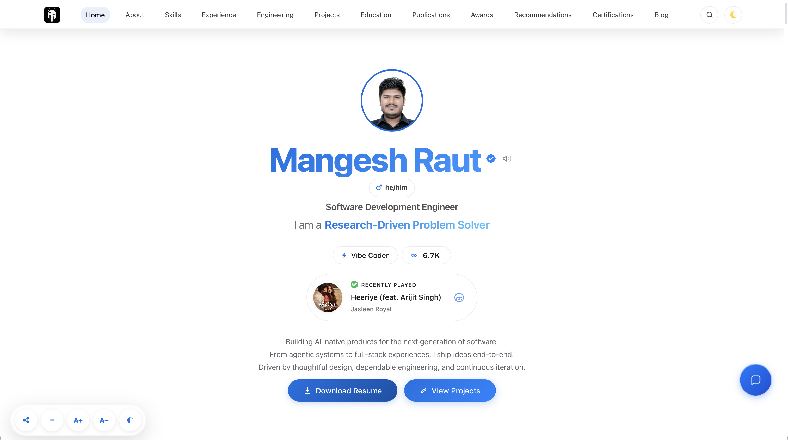
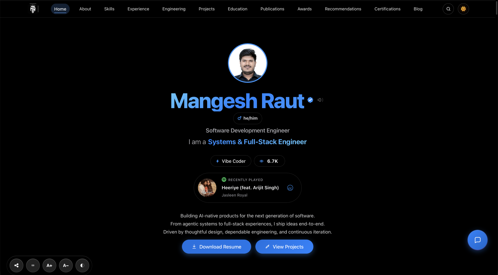
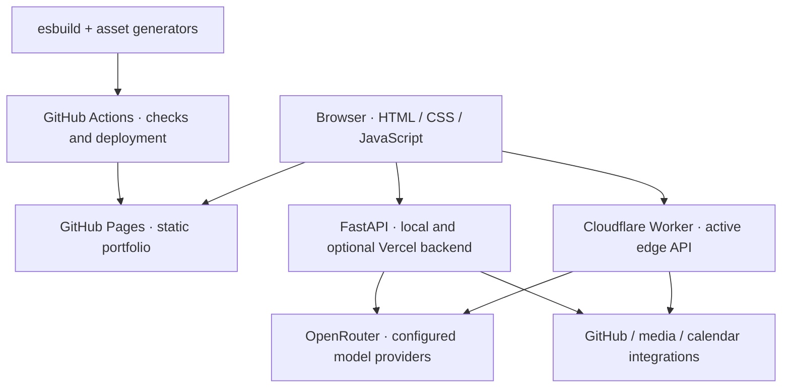

<div align="center">

# Mangesh Raut · Portfolio

**Software engineering, thoughtful design, and AI that can act.**

An open-source portfolio built with native web standards, an Apple-inspired interface,
and an agentic assistant. Explore the work, inspect the systems, or run the entire project locally.

<p>
  <a href="https://mangeshraut712.github.io/mangeshrautarchive/">Explore the portfolio</a> ·
  <a href="https://mangeshraut712.github.io/mangeshrautarchive/#projects">Projects</a> ·
  <a href="https://mangeshraut712.github.io/mangeshrautarchive/blog/">Writing</a> ·
  <a href="docs/README.md">Documentation</a>
</p>
<p>
  <a href="https://github.com/mangeshraut712/mangeshrautarchive/actions/workflows/deploy.yml"></a>
  <a href="package.json"></a>
  <a href=".python-version"></a>
  <a href="LICENSE"></a>
</p>

</div>

<table>
  <tr>
    <td width="50%"><a href="https://mangeshraut712.github.io/mangeshrautarchive/"></a></td>
    <td width="50%"><a href="https://mangeshraut712.github.io/mangeshrautarchive/"></a></td>
  </tr>
  <tr><td align="center"><strong>Light. Clear and spacious.</strong></td><td align="center"><strong>Dark. Focused and precise.</strong></td></tr>
</table>

Existing screenshots of the actual website. Live counters, music, and navigation can change.

---

[Experience](#1-the-experience) · [Architecture](#2-how-it-works) ·
[Run locally](#3-run-locally) · [Quality](#4-engineering-and-verification) ·
[Contributing](#5-maintenance-and-contribution) · [Documentation](#6-documentation) ·
[Contact](#7-license-and-contact)

## 1. The experience

This repository is the source for Mangesh Raut’s public portfolio: professional background,
projects, engineering case studies, publications, and writing, alongside the services that power
AssistMe and the site’s integrations.

| Surface                                                                         | What you can explore                                                                                                            |
| ------------------------------------------------------------------------------- | ------------------------------------------------------------------------------------------------------------------------------- |
| [Portfolio](https://mangeshraut712.github.io/mangeshrautarchive/)               | Background, skills, experience, education, projects, publications, awards, recommendations, certifications, résumé, and contact |
| [Projects](https://mangeshraut712.github.io/mangeshrautarchive/#projects)       | GitHub repository cards, real README screenshots, repository facts, filters, and detailed previews                              |
| [Systems](https://mangeshraut712.github.io/mangeshrautarchive/systems.html)     | Architecture, engineering workflows, case studies, and technical decisions                                                      |
| [Monitor](https://mangeshraut712.github.io/mangeshrautarchive/monitor.html)     | Service health, operational telemetry, and runtime diagnostics                                                                  |
| [Writing](https://mangeshraut712.github.io/mangeshrautarchive/blog/)            | 18 articles across January–September 2026, with two articles per month, source references, and credited media                   |
| [Travel](https://mangeshraut712.github.io/mangeshrautarchive/travel.html)       | Interactive travel atlas, route views, location stories, and a globe loaded on request                                          |
| [Uses](https://mangeshraut712.github.io/mangeshrautarchive/uses.html)           | Development tools, hardware, AI workflow, and the stack behind the site                                                         |
| [Changelog](https://mangeshraut712.github.io/mangeshrautarchive/changelog.html) | Releases, fixes, model attribution, and verified commit links                                                                   |

### AssistMe: an assistant inside the portfolio

AssistMe connects conversation to the website. It supports streaming responses, Markdown,
syntax-highlighted code, mathematical notation, attachments, voice interfaces, conversation memory,
and browser-side WebMCP actions for navigating and retrieving portfolio information.

- **Grounded answers:** portfolio context is assembled from repository data and site knowledge.
- **Tools:** browser actions are implemented in [agentic-actions.js](src/js/modules/agentic-actions.js).
- **Model routing:** provider selection is configured in the backend and Worker; the FastAPI router
  uses the configured OpenRouter primary model, currently `grok-4.3`.
- **Offline development:** the local FastAPI backend provides canned portfolio answers when
  `OPENROUTER_API_KEY` is absent. Real model responses require provider credentials.

Model availability and integration behavior depend on runtime configuration. See the
[API guide](docs/API.md) for routes, environments, and differences between deployments.

### Project and editorial integrity

Repository cards use GitHub metadata and available README screenshots. Repositories without a
suitable screenshot can show a clearly labeled conceptual illustration. Coverage counts are dated
snapshots, documented in the [repository screenshot audit](docs/REPO_SCREENSHOT_COVERAGE.md) and
[asset manifest](src/assets/images/repo-screenshots/manifest.json).

Blog media is traced to original publishers where available, with visible credits and a documented
conceptual fallback. The [media audit](docs/BLOG_MEDIA_AUDIT.md) and
[source manifest](src/assets/data/blog-media-sources.json) record provenance and verification.

### Contact, world clocks, and calendar

Direct Outreach includes live analog clocks for New York, London, Mumbai, Tokyo, Sydney, and Paris,
using IANA timezones with daylight-saving handling. Three clocks are shown initially, with the other three available through View more. Calendar events show five compact cards by default and expand into a bounded scrolling panel;
personal reminders can be reviewed, saved in the browser, and exported as one-time calendar copies.

Today’s Panchang is sourced from [Kalnirnay](https://www.kalnirnay.com/). A scheduled workflow checks
the official publication hourly, using a dated cache key to avoid yesterday’s cached response.
The frontend checks the snapshot every 15 minutes while visible and displays only values dated today
in India. If fresh values are unavailable, it hides stale data and links to the official calendar.

**Source limitation:** the October 2 local fetch returned verified current values, but Kalnirnay
returned HTTP 403 to GitHub’s hosted runner. The scheduled workflow reports that refusal as a warning;
a successful workflow does not guarantee fresh data. Automatic daily ingestion remains dependent on
the publisher permitting the runner’s requests. See the
[contact calendar implementation notes](docs/CONTACT_CALENDAR.md).

### Design and accessibility

The interface follows an Apple-inspired visual language: system typography, restrained spacing,
blue primary actions, solid white neutral surfaces in light mode, and solid black neutral surfaces
in dark mode. Borders define cards and grouped controls; category and brand icons retain their colors. Shared design
rules include visible keyboard focus, circular red close controls, reduced-motion support,
accessible contrast, and layouts without horizontal overflow.

The [design system](docs/DESIGN.md) defines the tokens and component behavior. This is an independent
portfolio; it is not an Apple product or an Apple-affiliated project.

## 2. How it works


```mermaid
flowchart TD
    Visitor[Browser · HTML / CSS / JavaScript]
    Pages[GitHub Pages · static portfolio]
    Worker[Cloudflare Worker · active edge API]
    Local[FastAPI · local and optional Vercel backend]
    Models[OpenRouter · configured model providers]
    Services[GitHub / media / calendar integrations]
    Build[esbuild + asset generators]
    CI[GitHub Actions · checks and deployment]
    Visitor --> Pages
    Visitor --> Worker
    Visitor --> Local
    Worker --> Models
    Local --> Models
    Worker --> Services
    Local --> Services
    Build --> CI
    CI --> Pages
```

GitHub Pages serves the production frontend. The active Cloudflare Worker provides edge API
services. FastAPI powers local development and the optional Vercel deployment path. Static hosting
does not execute Python; API requests use the configured service endpoint.

| Layer           | Implementation                                                       | Source                                           |
| --------------- | -------------------------------------------------------------------- | ------------------------------------------------ |
| Interface       | Semantic HTML, vanilla CSS, native JavaScript ES modules             | [src/](src/)                                     |
| Styling         | CSS custom properties, system font stacks, Tailwind v4 build output  | [src/assets/css/](src/assets/css/)               |
| Build           | esbuild, generated blog pages, metadata, icons, and optimized assets | [scripts/build/](scripts/build/)                 |
| Edge services   | Cloudflare Worker                                                    | [workers/assistme-chat/](workers/assistme-chat/) |
| Python services | FastAPI, route modules, model routing, and integrations              | [api/](api/)                                     |
| Rich responses  | Marked, DOMPurify, syntax highlighting, and KaTeX                    | [package.json](package.json)                     |
| Verification    | pytest, Playwright, accessibility checks, and Lighthouse             | [tests/](tests/)                                 |
| Delivery        | GitHub Actions, Pages, and separate Worker deployment                | [.github/workflows/](.github/workflows/)         |

The frontend has no React, Angular, Vue, or Svelte runtime. Tailwind is used during the build;
component styling lives in vanilla CSS rather than utility classes in HTML.

<details>
<summary><strong>Repository map</strong></summary>

```text
src/                     Frontend pages, ES modules, styles, media, and public data
api/                     FastAPI application, routes, model router, and integrations
workers/assistme-chat/   Cloudflare edge API
scripts/                 Build, development, QA, security, and deployment tooling
tests/api/               Python API tests
tests/e2e/               Browser user journeys and broader regression coverage
docs/                    Design, architecture, API guides, and audit evidence
.github/workflows/       CI, publication, monitoring, and data synchronization
dist/                    Generated production output; ignored by Git
```

See [STRUCTURE.md](docs/STRUCTURE.md) for the complete directory guide.

</details>

## 3. Run locally

**Prerequisites:** Git, Node.js `>=22 <27` (Node 22 recommended), Python 3.12+, and
[uv](https://docs.astral.sh/uv/). The repository’s `.nvmrc` selects Node 22.

```bash
git clone https://github.com/mangeshraut712/mangeshrautarchive.git
cd mangeshrautarchive

npm ci
uv venv --python 3.12 venv
uv pip install --python venv/bin/python -r requirements.txt -r requirements-dev.txt
npx playwright install chromium

npm run doctor:strict
npm run dev
```

| Local service                 | Address                            |
| ----------------------------- | ---------------------------------- |
| Portfolio                     | `http://127.0.0.1:4000`            |
| API health                    | `http://127.0.0.1:8001/api/health` |
| Interactive API documentation | `http://127.0.0.1:8001/api/docs`   |

Use `venv` as the environment directory: the development backend detects its Python interpreter.
Stop the development server with **Ctrl+C**. To run the configured Desktop Chrome tests, install
Google Chrome; the Playwright configuration explicitly selects its `chrome` channel.

### Configuration and integrations

A local demo does not require API credentials. For real services, copy `.env.example` to an ignored
local environment file and fill only the integrations you intend to use.

- `OPENROUTER_API_KEY` enables real model responses in FastAPI.
- `OPENROUTER_MODEL` optionally selects the backend model.
- GitHub, music, health, and calendar services have their own configuration requirements.
- Google Calendar booking and the local Apple/Outlook `.ics` fallback have different behavior;
  consult the [API guide](docs/API.md) before configuring them.

Never commit environment files, credentials, or private calendar data. Browser fallback reminders
and exported calendar files do not grant access to an Apple account.

## 4. Engineering and verification

| Command                  | Purpose                                                     |
| ------------------------ | ----------------------------------------------------------- |
| `npm run dev`            | Start frontend and FastAPI development services             |
| `npm run dev:frontend`   | Run the frontend with the local API proxy                   |
| `npm run dev:backend`    | Run FastAPI independently                                   |
| `npm run doctor:strict`  | Validate repository layout and stack constraints            |
| `npm run check`          | ESLint, Stylelint, anti-slop checks, and formatting         |
| `npm test`               | Run API tests and critical browser journeys                 |
| `npm run test:e2e:all`   | Run the broader suite across 16 configured browser projects |
| `npm run security-check` | Scan source files for exposed secrets and credentials       |
| `npm run build`          | Generate production output in `dist/`                       |
| `npm run qa:surfaces`    | Smoke-check configured deployment surfaces                  |
| `npm run qa:postdeploy`  | Check configured host availability and commit parity        |

### Evidence, not permanent guarantees

The October 2, 2026 theme and Panchang release passed **184 API tests and 12 critical Chrome
journeys**, plus **26 focused Chrome/Safari checks** for the share card and engineering page.
ESLint, Stylelint, formatting, the secret scan, and the production build passed locally.
The [matching deployment workflow](https://github.com/mangeshraut712/mangeshrautarchive/actions/runs/36975613685)
passed its quality, Lighthouse, Pages publication, and post-deployment verification gates.
These are dated results for that release, not guarantees about every browser or future deployment.

Responsive review covered Home, Systems, Travel, Monitor, Uses, and Changelog at desktop and phone
widths in both themes, with no horizontal overflow in the reviewed states. The deployed contact card
was checked for current Panchang values and category icon colors. Share-card alignment and AssistMe’s
composer and viewport bounds were also reviewed. This does not claim the broader 16-project browser
suite passed. The [October 1 site audit](docs/SITE_AUDIT_2026-10-01.md) preserves earlier review scope.

### Release path

1. Run the required local gates: `npm run check`, `npm test`, `npm run security-check`, and `npm run build`.
2. Commit reviewed changes with a conventional commit message and update release attribution.
3. Push `main`; verify the matching GitHub Actions runs and Pages publication finish successfully.
4. Check the deployed routes and asset version. A passing local build alone does not prove deployment.

GitHub Pages is the primary public host. Vercel is an optional deployment path; its live availability
must be checked separately. Worker changes follow their dedicated deployment workflow.

## 5. Maintenance and contribution

Read [CONTRIBUTING.md](CONTRIBUTING.md), [AGENTS.md](AGENTS.md), and the relevant design or architecture
guide before making changes. Keep fixes focused, preserve the native web stack, and add realistic
browser coverage when user behavior changes. Use the four local release gates above before submitting.

### 5.1 Coding agents and provenance

Mangesh Raut maintains this portfolio with contributions from Codex, Claude Code, Google Antigravity,
Cursor, and GitHub Copilot. Shipped changes record the exposed agent/model family, engineering
purpose, and verified commit in the [changelog](src/js/data/changelog-entries.js).

| Current documentation contribution               | Attribution                                                                                                                  |
| ------------------------------------------------ | ---------------------------------------------------------------------------------------------------------------------------- |
| Coding agent                                     | Gemini 3.8 Flash, in Google Antigravity IDE                                                                                  |
| Purpose                                          | AssistMe chatbot toggle visibility, dynamic window positioning above FAB stack, and robust navbar clearance on all viewports |
| Exact model variant, reasoning mode, token usage | Unavailable from the active runtime                                                                                          |
| Portfolio chatbot model                          | Configured separately in [api/model_router.py](api/model_router.py) and the Worker                                           |

Coding attribution in historical entries is contributor-reported in commit messages. A verified
commit link confirms the repository reference; it does not authenticate the actual model runtime.
Missing model, tool, reasoning, or token records are not inferred. See the
[changelog attribution audit](docs/CHANGELOG_ATTRIBUTION_AUDIT.md).

Previous contributor records are preserved in
[Development history](docs/DEVELOPMENT_HISTORY.md), with dated context for superseded implementations.

### Security, privacy, and responsible reuse

Provider credentials belong in backend or deployment secret stores. Public calendar endpoints expose
sanitized availability, while integration setup and private account data require protected server
configuration. Optional integrations and analytics should be reviewed before deploying your own copy.

Report vulnerabilities through [SECURITY.md](SECURITY.md). See [.env.example](.env.example) for the
configuration template. Replace personal profile data, contact destinations, OAuth settings, and
analytics identifiers when adapting this repository.

## 6. Documentation

| Guide                                                   | Purpose                                                            |
| ------------------------------------------------------- | ------------------------------------------------------------------ |
| [Documentation index](docs/README.md)                   | Start here for deeper implementation notes                         |
| [Design system](docs/DESIGN.md)                         | Visual tokens, components, accessibility, and responsive behavior  |
| [Architecture practices](docs/BEST_PRACTICES.md)        | Module boundaries, engineering conventions, and release discipline |
| [Repository structure](docs/STRUCTURE.md)               | Directory map and ownership                                        |
| [API guide](docs/API.md)                                | Routes, integrations, environments, and runtime differences        |
| [Site audit](docs/SITE_AUDIT_2026-10-01.md)             | October 2026 visual and functional verification                    |
| [Screenshot coverage](docs/REPO_SCREENSHOT_COVERAGE.md) | Dated repository image coverage and fallback rules                 |
| [Blog media audit](docs/BLOG_MEDIA_AUDIT.md)            | Original-source media and provenance                               |
| [Development history](docs/DEVELOPMENT_HISTORY.md)      | Preserved contributor attribution and historical decisions         |
| [Design audit skills](.agents/skills/)                  | Apple HIG critique, responsive audit, and animation motion skills  |

## 7. License and contact

The repository’s original code is released under the [MIT License](LICENSE). Third-party images,
logos, music artwork, and publisher media retain their respective rights; consult the source credits
before reuse. Citation metadata is provided in [CITATION.cff](CITATION.cff).

**Mangesh Raut** · [Website](https://mangeshraut712.github.io/mangeshrautarchive/) ·
[GitHub](https://github.com/mangeshraut712) ·
[LinkedIn](https://www.linkedin.com/in/mangeshraut71298) ·
[Email](mailto:mbr63@drexel.edu)

<div align="center">

[Back to top](#mangesh-raut--portfolio)

</div>
