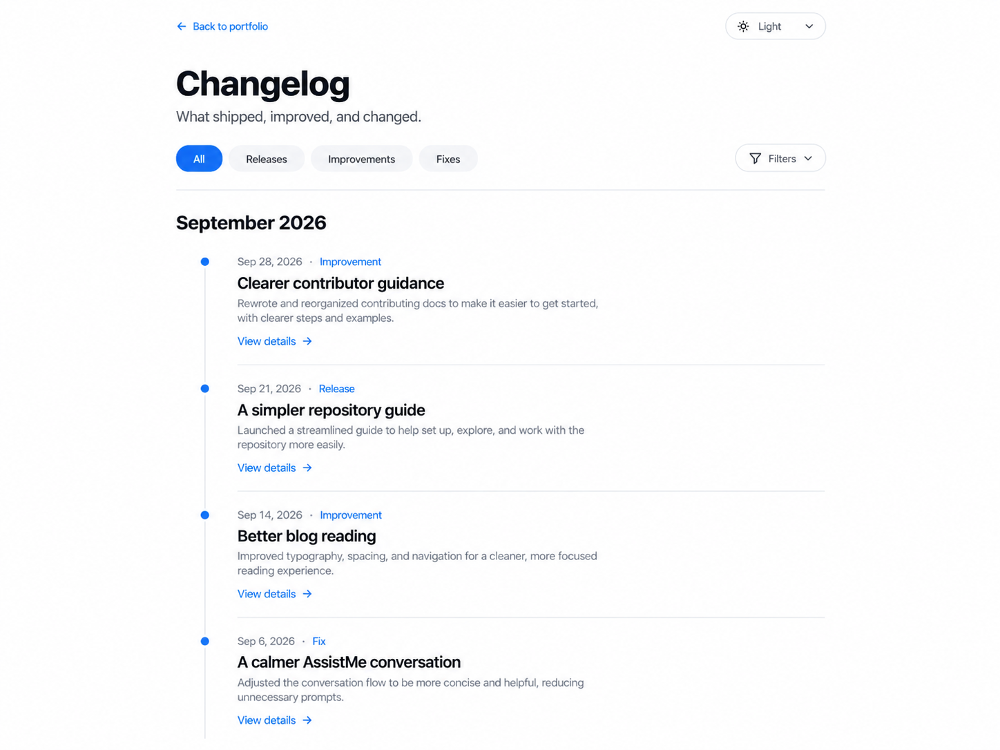

# Visual reference to verified interface

Use this workflow for substantial visual changes across coding models and IDEs.
An image establishes a direction; the browser establishes whether the result works.

1. Inspect the relevant page, source, and DESIGN.md. Identify what the visitor must see and do.
   Keep real content, accessibility, theme behavior, and existing working interactions.
2. Generate or obtain a readable reference for the affected surface. Use image generation when
   exploring a visual direction or creating raster assets; use existing design tokens directly
   for small corrections. Do not generate unnecessary variants or assume a specific image model.
3. Inspect typography, spacing, alignment, colors, control hierarchy, and responsive implications.
   Write down the selected direction before coding. Treat generated text, dates, and statistics
   as placeholders, never as product facts.
4. Implement semantic HTML, vanilla CSS, and existing JavaScript behavior. A screenshot is not
   a functional page. Preserve real text, links, focus order, disclosures, filters, and forms.
5. Inspect actual browser output during meaningful changes. Cover a desktop and a narrow mobile
   viewport in both light and dark themes; exercise changed controls with mouse and keyboard.
   Check high contrast, reduced motion, and horizontal overflow where applicable.
6. Compare with the reference and the user's request. Fix observed defects and repeat affected
   checks. Report surfaces that could not be verified and why.

## Evidence and process ownership

- Save selected references under docs/design-plans/references/ when documenting a design.
  Keep verification screenshots in ignored artifacts/. Do not ship a mockup as page content.
- Use an available browser tool, Playwright MCP, or CLI based on the task and environment.
  No tool automatically guarantees quality, accessibility, or lower token use.
- Inspect ports and working directories before reusing a server. Keep the PID or tool session
  for processes started by this task and terminate only those processes after verification.
- Use static previews for CSS-only work; avoid starting credentialed services unnecessarily.

## Changelog reference application — September 21, 2026

The selected reference uses a narrow reading column, restrained type, a thin timeline spine,
blue markers, and generous alignment. The implementation keeps the existing navigation,
type/area filters, verified release dates and commit links, and native closed details.
Long implementation summaries remain available on expansion. The reference's invented dates
and sample titles are not imported into release history.

Acceptance: no document overflow at 390px and 1440px; readable light/dark text; 44px filter
targets; usable filter, month-collapse, disclosure, and keyboard-focus behavior; reduced motion.

